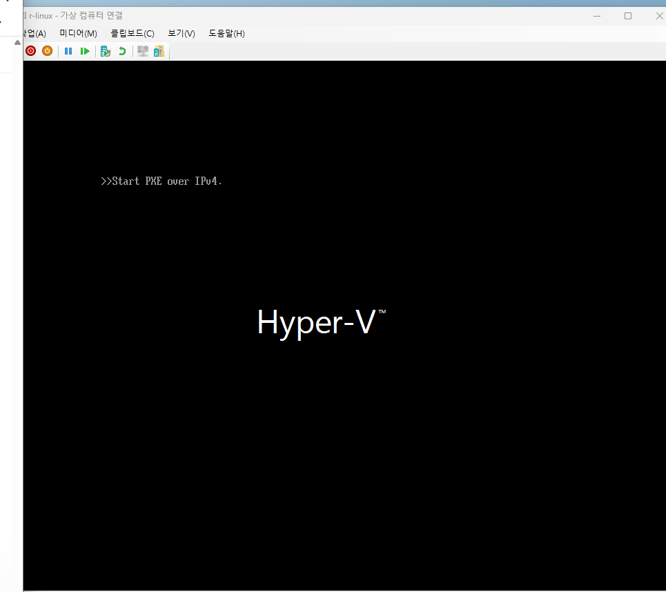
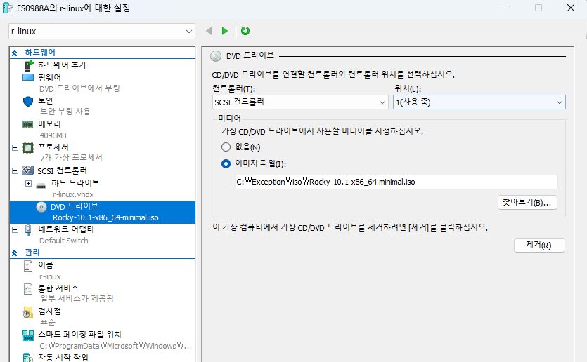
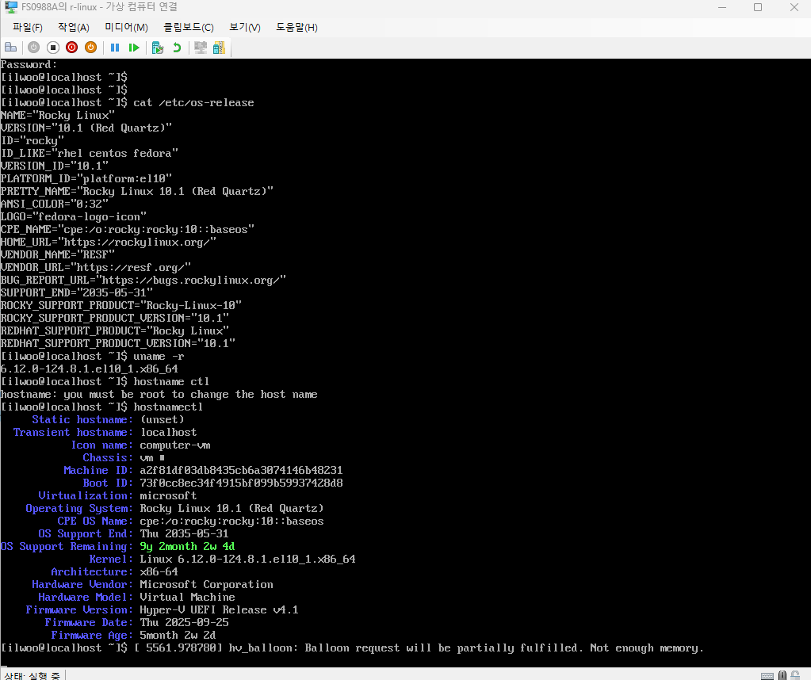

# Week 1. Rocky Linux 소개 및 기초

> 원본 노션: [리눅스 공부](https://platinum-cabin-2be.notion.site/321cd0d242e180f8908bdf87e8a5eef1)

## 1. 이번 주 학습 주제

- Rocky Linux 등장 배경
- RHEL 생태계 이해
- Rocky Linux 설치 및 환경 설정
- 기본 명령어 실습

## 2. 실습 환경

- Host OS: Windows 11
- Virtualization: Hyper-V
- Guest OS: Rocky Linux 10.1 Minimal
- 사용자 계정: `ilwoo`

## 3. 진행 내용

### 3-1. Rocky Linux 설치

- Windows 11 환경에서 Hyper-V를 사용해 Rocky Linux 10.1 Minimal ISO로 가상 머신을 생성했다.
- 처음 실행 시 `Start PXE over IPv4` 화면이 출력되어 ISO가 제대로 부팅되지 않는 문제를 확인했다.



- Hyper-V 설정에서 DVD 드라이브에 ISO가 정상 연결되어 있는지 확인하고, 부팅 설정을 점검한 뒤 Rocky Linux 설치 화면으로 진입했다.
- 이후 Rocky Linux 10.1 설치를 완료하고 로그인 화면까지 정상 부팅되는 것을 확인했다.
- 가상 머신을 생성할 때 Gen 2보다 Gen 1으로 만드는 편이 호환성 문제로부터 조금 더 자유로운 것 같았다.



### 3-2. 설치 후 확인

설치 후 아래 명령어를 통해 운영체제와 시스템 정보를 확인했다.

```bash
cat /etc/os-release
uname -r
hostnamectl
```

확인한 내용은 다음과 같다.

- 운영체제: Rocky Linux 10.1 (Red Quartz)
- 커널 버전: `6.12.0-124.8.1.el10_1.x86_64`
- 현재 호스트명: `localhost`
- Hyper-V 기반 가상화 환경에서 동작 중임을 확인

### 3-3. 사용자 로그인 및 권한 확인

- 설치 시 생성한 일반 사용자 계정 `ilwoo`로 로그인했다.
- `hostname` 명령으로 호스트명을 변경하려고 했지만, 일반 사용자 권한으로는 변경할 수 없다는 점을 확인했다.
- 이를 통해 시스템 설정 변경에는 `root` 또는 `sudo` 권한이 필요하다는 점을 알 수 있었다.



## 4. 개념 정리

### 4-1. Rocky Linux 등장 배경

- CentOS Linux EOL 이후, RHEL과 호환되는 무료 리눅스 배포판에 대한 수요가 커졌다.
- Rocky Linux는 이러한 배경 속에서 등장한 커뮤니티 기반 배포판이다.
- 기업 환경에서 널리 사용되는 RHEL 계열을 무료로 학습하고 실습하기에 적합하다.

### 4-2. RHEL이란

- RHEL은 Red Hat Enterprise Linux의 약자다.
- Red Hat이 제공하는 기업용 상용 리눅스 배포판이다.
- 안정성, 보안 업데이트, 기술 지원, 기업 환경 호환성이 강점이다.
- 실제 서버 운영 환경에서 많이 사용되기 때문에 RHEL 계열을 이해하는 것은 인프라 및 서버 학습에 중요하다.

### 4-3. RHEL 생태계 정리

- Fedora: 최신 기술이 먼저 반영되는 배포판
- CentOS Stream: RHEL 바로 전 단계 성격의 배포판
- RHEL: 기업용 상용 리눅스 배포판
- Rocky Linux: RHEL 호환성을 지향하는 커뮤니티 배포판

정리하면 다음과 같이 이해할 수 있다.

```text
Fedora
  ↓
CentOS Stream
  ↓
RHEL
  ↘
   Rocky Linux
```

### 번외. 각 배포판들의 차이

#### Amazon Linux

- AWS가 직접 관리해서 EC2 하드웨어와 네트워크에 맞춘 드라이버와 설정이 잘 들어가 있다.
- ENA, EFA 같은 AWS 네트워크 장치 최적화, 부팅 시간 단축, 커널 라이브 패치 같은 운영 최적화가 강조된다.
- EC2에서 사용할 때 기본값이 AWS 친화적이라는 점이 강점이다.

#### Oracle Linux

- Oracle 제품군, 특히 Oracle Database나 Oracle 워크로드에 잘 맞게 가져가는 배포판이다.
- Oracle은 Unbreakable Enterprise Kernel(UEK)로 성능과 최신 기능을 강조한다.
- DTrace 같은 관측 도구와 고가용성 기능도 강점으로 내세운다.

#### RHEL

- 특정 환경 특화보다는 기업 운영 전반에 최적화된 배포판에 가깝다.
- 최신 기능보다 안정성, 장기 지원, 보안 업데이트, 벤더 인증, 기술 지원이 강점이다.
- 금융, 공공, 대기업처럼 공식 지원과 검증된 운영 기준이 중요한 환경에서 많이 사용된다.

#### Rocky Linux

- 특정 클라우드 최적화보다 RHEL과 최대한 같은 환경을 무료로 가져가는 것이 핵심이다.
- 공식적으로 RHEL과 bug-for-bug compatible을 지향한다.
- RHEL 기준 문서나 운영 경험을 거의 비슷하게 따라가고 싶을 때 적합하다.

## 5. 이번 주 실습 내용 정리

```bash
cat /etc/os-release
uname -r
hostname
hostnamectl
```

각 명령어 의미는 다음과 같다.

- `cat /etc/os-release`: 현재 설치된 리눅스 배포판 정보 확인
- `uname -r`: 현재 커널 버전 확인
- `hostname`: 현재 호스트명 확인
- `hostnamectl`: 호스트명 및 시스템 상세 정보 확인

## 6. 기본 명령어 실습

```bash
whoami
pwd
ip a
free -h
mkdir -p ~/study/week1/{docs,logs,backup}
cd ~/study/week1
touch docs/intro.txt
echo "Rocky Linux Week1 Practice" > docs/intro.txt
cat docs/intro.txt
cp docs/intro.txt backup/
mv backup/intro.txt backup/intro_backup.txt
find ~/study/week1 -type f
sudo dnf repolist
```

실습 목적은 다음과 같다.

- `whoami`: 현재 로그인한 사용자 확인
- `pwd`: 현재 작업 디렉터리 확인
- `ip a`: 네트워크 인터페이스 확인
- `free -h`: 메모리 상태 확인
- `mkdir`, `touch`, `cp`, `mv`, `find`: 파일 및 디렉터리 조작 연습
- `dnf repolist`: 패키지 저장소 목록 확인

## 7. 배운 점

- Rocky Linux는 RHEL 계열을 학습하기 좋은 무료 배포판이라는 점을 알게 되었다.
- 여러 가지 리눅스 배포판이 있다는 것을 알게 되었다.
- Hyper-V 환경에서 직접 가상 머신을 만들고 Rocky Linux를 설치해보며 리눅스 초기 환경 구성을 경험했다.
- 운영체제 정보, 커널 버전, 가상화 환경 등 시스템 기본 정보를 명령어로 확인하는 방법을 익혔다.

### 용어

- 커널(kernel): 운영체제의 핵심 엔진
- 쉘(shell): 사용자가 운영체제에 명령을 내리는 창구

### 예시

```bash
mkdir study
```

1. 쉘이 `mkdir study`를 읽는다.
2. `mkdir` 프로그램을 실행하라고 요청한다.
3. 커널이 CPU, 메모리, 파일시스템을 사용해서 실제 디렉터리를 생성한다.
4. 결과를 다시 화면에 보여준다.

- 쉘 = "무슨 뜻인지 이해해서 전달"
- 커널 = "진짜로 실행"
- Linux라고 할 때 엄밀히는 보통 리눅스 커널을 말한다.
- 우리가 실제로 쓰는 Rocky Linux, Ubuntu, RHEL은 리눅스 커널 + 쉘 + 패키지 도구 + 각종 프로그램이 합쳐진 배포판이다.

## 8. 참고 자료

- Rocky Linux 공식 문서
- Red Hat 공식 문서
- Rocky Linux 설치 가이드
- RHEL 문서의 패키지 및 저장소 관련 내용
- ChatGPT
