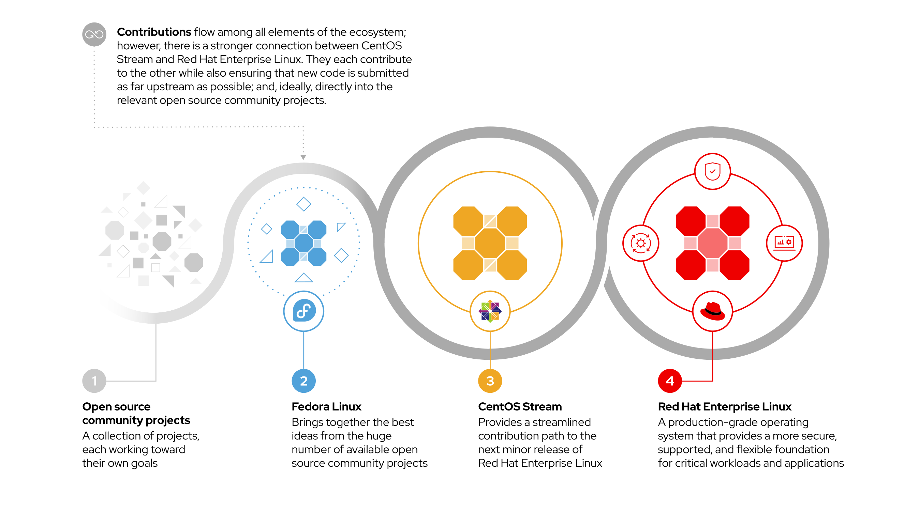
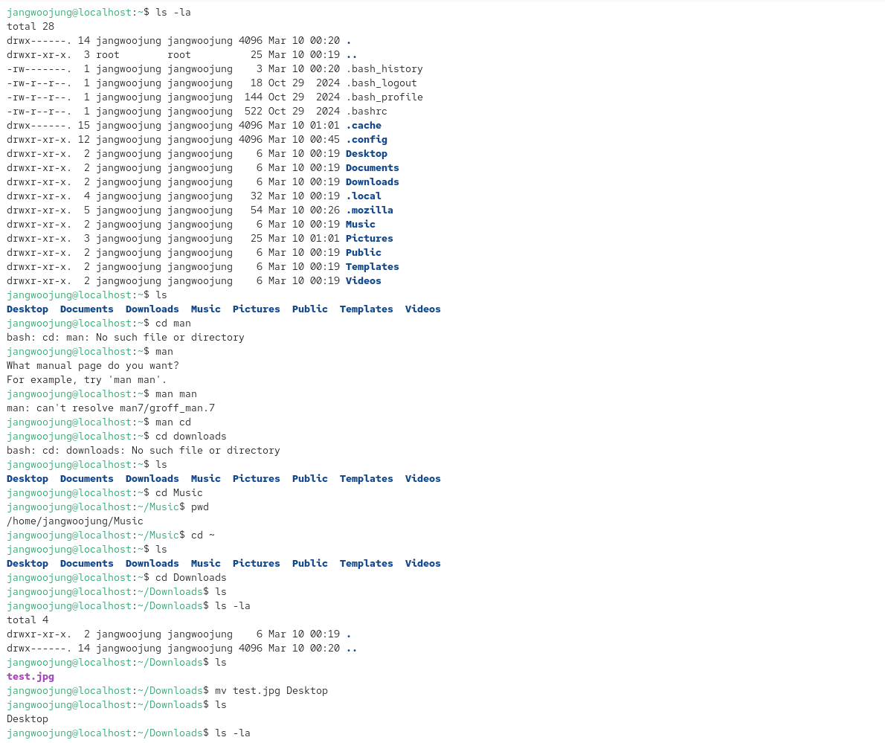
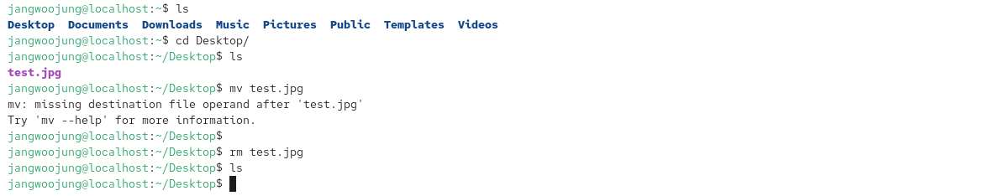

# 로키 리눅스의 등장 배경과 RHEL 생태계, 환경 설정, 기본 명령어 실습

## 리눅스란?

### UNIX

**1969 — 1971**: 1969년 Bell과 General Electric이 프로젝트에서 철수한 후, MULTICS가 너무 복잡하다고 판단한 두 명의 개발자 Ken Thompson과 Dennis Ritchie는 UNIX(UNiplexed Information and Computing Service -단일화된 정보 및 전산 서비스)의 개발을 시작합니다(Brian Kernighan은 나중에 합류했습니다). UNIX는 원래 어셈블리 언어로 개발되었으나, 개발자들은 1970년도 초반에 B 언어와 C 언어를 개발하여 UNIX를 완전히 다시 작성했습니다. 1970년에 개발되었으므로, UNIX/Linux 시스템의 시작 시점 기준일(epoch)은 1970년 1월 1일로 설정되어 있습니다.

### Linux

** 정식 명칭은 GNU/Linux이다

**1991**: 핀란드 학생인 **Linus Torvalds**는 자신의 개인용 컴퓨터에서 실행되는 운영 체제를 만들고(Unix 기반) 이름을 Linux로 지정합니다. 그는 Usenet 토론 포럼에 0.02라고 불리는 그의 첫 번째 버전을 게시하고, 다른 개발자들은 그의 시스템을 개선하는 것을 도왔습니다. Linux라는 용어는 이를 개발한 Linus의 이름과 UNIX 사이의 말장난입니다.

**2021**: Rocky Linux가 Red Hat 배포판을 기반으로 출시되었습니다.

# Rocky Linux 까지의 흐름 (등장배경)

**Red Hat Linux → RHEL(RedHat Enterprise Linux) → CentOS → Rocky Linux**

**Red Hat** : 미국의 오픈소스 기반 서비스 제공 기업

**Redhat Linux** : **Red Hat Linux**(Red Hat 리눅스)는 Red Hat에서 만든 Linux 배포판이다. Red Hat에서는 다른 Linux 배포판처럼 배포는 무료이고 기술 지원은 유료인 형식으로 운영하였다. 비교적 다양한 프로그램을 지원하였고, 이용이 편리하다는 평가를 들었다. 주요 Linux 배포판 중에서 패키지(RPM) 형태의 프로그램 배포를 처음으로 지원하였다고 한다.

**RHEL** : Red Hat Enterprise Linux , 2000년 Red Hat Linux에서 파생된 운영체제, 2003년 이후 Red Hat에서 지원하는 운영체제 커뮤니티의 **Fedora** 기반의 프로젝트로 변하게 되었다.

**Fedora** : 2003년 11월에 출시된 **페도라**(Fedora)는 Red Hat Linux 기반의 Linux 배포판이다. Red Hat Linux 9.0 버전을 이어가는 것으로, Red Hat이 후원하는 Fedora Project가 개발한다. 

**CentOS :** 2004년 5월 14일 RHEL에서 파생된 오픈소스 OS, CentOS는 바로 이 점을 이용한 리눅스로, RHEL의 소스를 기반으로 만들어지며 **철저하게 최신 버전의 RHEL을 포킹**하는데 중점을 두어 RHEL에서 최대한 추가나 제거를 자제하는 것을 원칙으로 했었다. 무료로 RHEL과 100% 동일한 환경을 제공한다는 존재의의를 가지고 있다.

**Rocky Linux :** 2020년 12월 8일, Red Hat은 Red Hat Enterprise Linux의 프로덕션 준비 다운스트림 버전인 CentOS의 개발을 중단하고 "CentOS Stream"이라는 운영 체제의 새로운 업스트림 개발 변형을 도입한다고 발표했다. CentOS Stream은, 다음 RHEL에 반영될 패키지로 구성된 일종의 얼리 액세스 버전으로 RHEL과 페도라의 중간쯤 되는 버전으로 볼 수 있다.

이는 무료로 RHEL과 100% 동일한 환경을 제공한다는 CentOS의 존재의의에 대한 사형선고나 다름없었기에, CentOS 사용자들은 크게 반발하였다. 이러한 흐름 속에서, CentOS 프로젝트의 공동설립자 중 하나인 Gregory Kurtzer는 RHEL과 1:1 대응되는 새로운 배포판을 만들고자 하였고, 여기에 사망한 또 다른 공동설립자 Rocky McGaugh의 이름을 따서 "Rocky Linux"라고 이름붙였다.

# RHEL 생태계

Fedora - CentOS Stream - RHEL 이 세가지의 흐름을 파악해보았다.

RHEL 생태계의 개발 흐름(업스트림 → 미드스트림 → 다운스트림)

- **Fedora**
    
    최신 기술을 먼저 도입하고 실험하는 **개발·혁신 단계**
    
- **CentOS Stream**
    
    다음 RHEL 버전을 준비하는 **중간 개발 단계**
    
- **RHEL**
    
    충분히 검증된 기술로 만든 **기업용 안정 배포판**
    
    ---
    
    # Linux 기본 개념
    
    리눅스를 시작하기 전에, 기본적 개념부터 짚고 넘어가보자!
    
    **Kernel** : 운영체제의 핵심 부분으로 시스템의 하드웨어와 소프트웨어 사이에서 중개 역할을 수행한다. CPU, 메모리, 저장장치, 입출력 장치 등을 관리하며 사용자 프로그램이 하드웨어를 직접 제어하지 않고도 사용할 수 있도록 한다. 리눅스에서는 **Linux kernel**이 이 역할을 담당한다.
    
    **Shell** : 사용자가 리눅스 시스템에 명령을 전달하기 위한 인터페이스 프로그램으로, 사용자가 입력한 명령어를 해석하여 커널에 전달하고 그 결과를 사용자에게 출력한다. 대표적인 셸로는 **Bash**, **Zsh** 등이 있다.
    
    **Terminal** : 셸을 실행하고 명령어를 입력할 수 있도록 제공되는 프로그램으로, 사용자가 리눅스 시스템과 상호작용할 수 있는 환경을 제공한다. GUI 환경에서는 **GNOME Terminal**과 같은 터미널 프로그램을 통해 셸을 사용할 수 있다.
    
    **Directory** : 파일을 체계적으로 정리하고 관리하기 위한 공간으로, 일반적으로 폴더와 같은 개념이다. 리눅스에서는 모든 파일이 디렉토리 구조 안에서 관리되며 최상위 위치는 루트 디렉토리(`/`)이다.
    
    **Process** : 실행 중인 프로그램을 의미한다. 사용자가 프로그램을 실행하면 해당 프로그램은 메모리에 올라가 하나의 프로세스로 동작하며 CPU와 메모리 자원을 할당받아 실행된다.
    
    **Daemon** : 시스템이 동작하는 동안 백그라운드에서 지속적으로 실행되는 서비스 프로그램을 의미한다. 사용자와 직접적으로 상호작용하지 않고 특정 기능을 수행하며 대표적으로 원격 접속 서비스를 제공하는 **sshd** 등이 있다.
    
    **Package** : 리눅스에서 프로그램을 설치하고 관리하기 위해 필요한 파일들을 하나로 묶어 놓은 설치 단위이다. RHEL 계열에서는 **RPM Package Manager** 형식의 패키지를 사용하며, **DNF** 명령어를 통해 설치 및 관리가 이루어진다.
    
    **Permission** : 리눅스에서 파일과 디렉토리에 대한 접근 권한을 의미하며, 읽기(Read), 쓰기(Write), 실행(Execute) 세 가지 권한으로 구성된다. 이를 통해 사용자와 그룹별로 파일 접근을 제어할 수 있다.
    
    # 환경 설정 실습
    
    홈서버를 구축하는 과정도 함께 진행하고자 해, 기존에 사용하지 않는 노트북을 사용하여 운영체제를 설치했다.
    
    USB를 FAT32로 포멧한 뒤,  Rocky Linux 10.1 버전을 usb에 구워 (Rufus 사용) 진행했다!
    
    언어는 기본으로 영어 - 한국어로 진행
    
    
    
    
        
    ---
    
    ## 기본 명령어 실습
    
    **1. 파일 및 디렉토리(폴더) 관리** 가장 빈번하게 사용되는 시스템 탐색 및 조작 명령어입니다.
    
    - **ls**: 현재 위치에 있는 파일과 디렉토리 목록을 보여줍니다. 상세한 정보를 보려면 `ls -l`을, 숨김 파일까지 보려면 `ls -al`을 사용합니다.
    - **cd**: 디렉토리(폴더)를 이동할 때 사용합니다 (예: `cd /home`).
    - **mkdir**: 새로운 디렉토리를 만듭니다.
    - **rm**: 파일을 삭제합니다. 빈 디렉토리를 지울 때는 `rmdir`을 사용하기도 합니다.
    - **cp**: 파일을 복사합니다.
    - **touch**: 내용이 없는 빈 파일을 생성하거나 파일의 수정 시간을 변경할 때 사용합니다.
    - **cat / less**: 텍스트 파일의 내용을 터미널 화면에서 바로 읽을 때 사용합니다.
    
    간단한 기본 명령어들 실습 진행  ( test.jpg 파일로 실습 )
    

