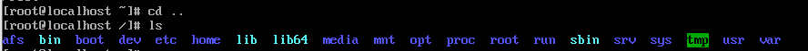

## 1. RHEL 개요 및 엔터프라이즈 리눅스 생태계

### 정의

Red Hat Enterprise Linux(RHEL)는 레드햇에서 개발한 상용 오픈소스 리눅스 배포판

### 특징

- 안정성: 수천 개의 하드웨어 및 소프트웨어 벤더와 호환성 인증 완료
- 보안: SELinux, 보안 패치(FIPS 140-3 등) 및 규준 준수 지원
- 지원: 유료 구독(Subscription)을 통한 장기 기술 지원(LTS) 제공

### [리눅스 주요 계열 및 특징 비교](https://distrowatch.com/dwres.php?resource=major)

| 구분          | Red Hat 계열 (Enterprise)   | Debian 계열 (Community/User)   | (Community/User) Arch 계열 (Expert/DIY) |
| ------------- | --------------------------- | ------------------------------ | --------------------------------------- |
| 철학          | 유료 지원 및 기업용 안정성  | 자유 소프트웨어 및 사용자 편의 | 단순함(Simplicity) 및 최신 기술         |
| 패키지 형식   | `.rpm`                      | `.deb`                         | `.pkg.tar.zst`                          |
| 관리 도구     | `dnf (과거 yum)`            | `apt (과거 apt-get)`           | `pacman`                                |
| 주요 배포판   | RHEL, Fedora, Rocky, Alma   | Debian, Ubuntu, Linux Mint     | Arch Linux, Manjaro                     |
| 업데이트 방식 | 포인트 릴리즈 (버전별 출시) | 포인트 릴리즈 (버전별 출시)    | 롤링 릴리즈 (버전 없이 계속 업데이트)   |

### 개발 생태계 구조

- **Fedora**: 최신 기술 테스트 베드 (가장 빠른 업데이트)
- **CentOS Stream**: RHEL의 차기 버전 개발용 업스트림
- **RHEL**: 실제 운영 환경용으로 검증된 최종 제품

```
[ Fedora ]  ----->  [ CentOS Stream ]  ----->  [ RHEL ]
 (Community)          (Next Version)          (Enterprise)
```

### REDHAT 계열의 엔터프라이즈 리눅스 생태계 변화

| 구분   | RHEL                       | CentOS Stream              | Rocky                    |
| ------ | -------------------------- | -------------------------- | ------------------------ |
| 성격   | 유료 상용 배포판           | RHEL의 업스트림(미리보기)  | RHEL 리빌드(무료 호환판) |
| 안정성 | 최고 (검증된 패치만 적용)  | 보통 (개발 및 테스트 단계) | 높음 (RHEL과 1:1 호환)   |
| 목적   | 기업용 서버, 미션 크리티컬 | 차기 RHEL 기능 테스트      | 기존 CentOS 사용자 대체  |
| 비용   | 유료 서브스크립션          | 무료                       | 무료 (커뮤니티 주도)     |

\*[Rocky Linux History](https://rockylinux.org/about)

## 2. 리눅스 디렉토리 구조



```
/ (Root)
├── bin  -> 기본 실행 파일 (ls, cp 등)
├── boot -> 부팅 관련 파일 (Kernel)
├── dev  -> 장치 파일 (Disk, Terminal)
├── etc  -> 시스템 설정 파일
├── home -> 일반 사용자 홈 디렉터리
├── root -> root 사용자 홈 디렉터리
├── sbin -> 시스템 관리자용 실행 파일
├── tmp  -> 임시 파일 저장소
├── usr  -> 사용자 프로그램 및 데이터
└── var  -> 로그, 스풀 등 가변 데이터
```

## 3. 리눅스 명령어

### `ls` (List): 디렉터리 내용 확인

- `-l`: 상세 정보 표시 (권한, 소유자, 크기, 수정 시간 등)
- `-a`: 숨김 파일(.으로 시작)을 포함하여 모든 파일 표시
- `-h`: 파일 크기를 K, M, G 등 읽기 쉬운 단위로 표시
- `-t`: 파일 수정 시간 순으로 정렬

### `cd` (Change Directory): 작업 디렉터리 이동

- `cd ~`: 현재 사용자의 홈 디렉터리로 이동
- `cd -`: 바로 이전에 작업했던 디렉터리로 이동
- `cd ..`: 한 단계 상위 디렉터리로 이동

### `pwd` (Print Working Directory): 현재 위치한 절대 경로 출력

### `mkdir` (Make Directory): 디렉터리 생성

- `-p`: 하위 디렉터리까지 한 번에 생성 (예: mkdir -p a/b/c)

### `cp` (Copy): 파일 또는 디렉터리 복사

- `-r`: 디렉터리를 복사할 때 하위 내용까지 모두 포함 (Recursive)
- `-p`: 원본 파일의 소유주, 그룹, 권한, 시간 정보를 유지하며 복사

### `mv` (Move): 파일 이동 또는 이름 변경

- `mv [file1] [file2]`: file1의 이름을 file2로 변경
- `mv [file1] [/tmp/]`: file1을 /tmp 디렉터리로 이동

### `rm` (Remove): 파일 또는 디렉터리 삭제

- `-f`: 삭제 확인 메시지 없이 강제 삭제 (Force)
- `-r`: 디렉터리와 그 내부 콘텐츠를 모두 삭제
