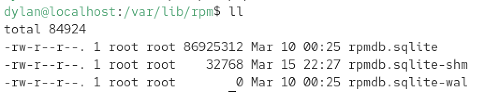
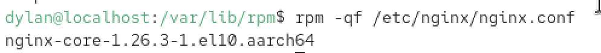
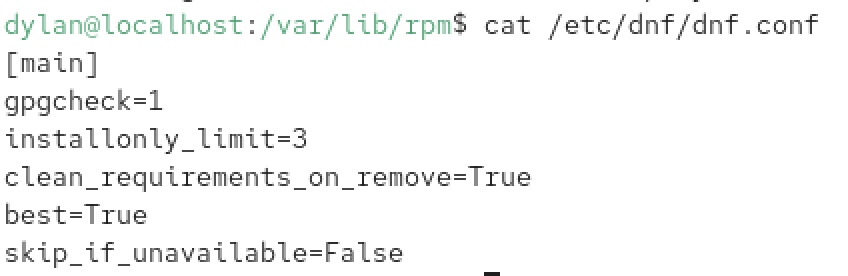
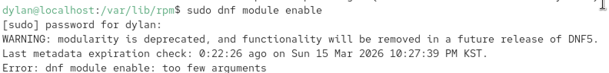
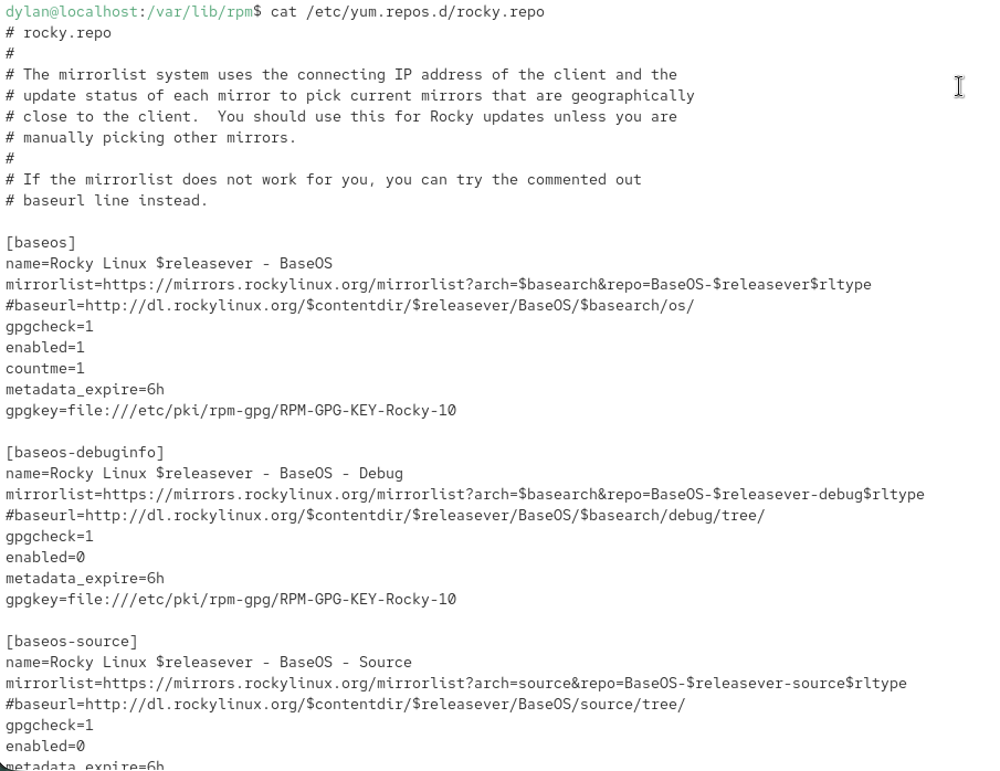
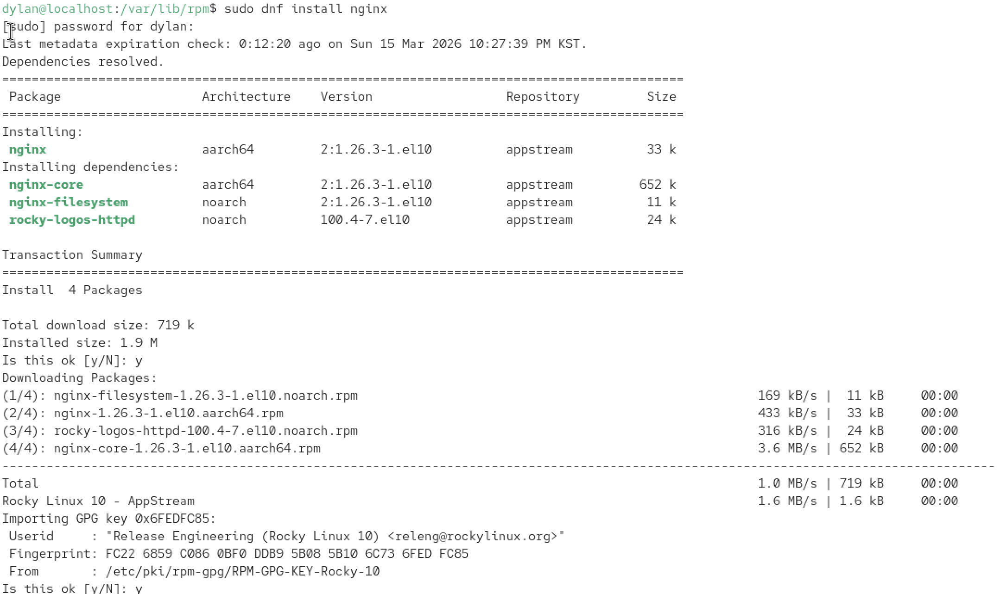
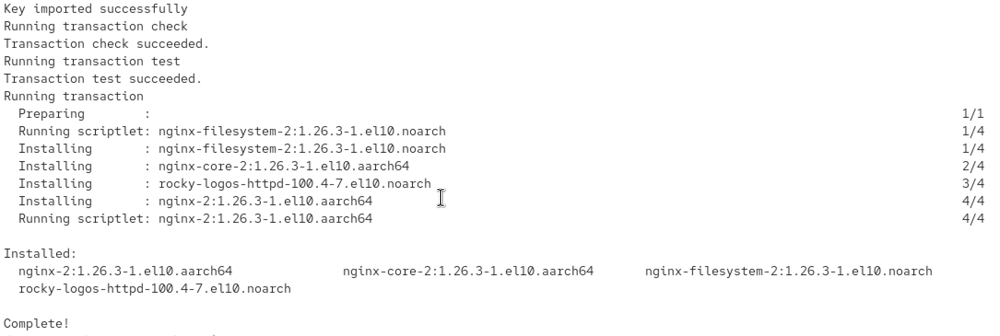
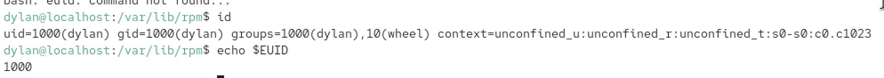

# Rocky Linux 스터디 — 2주차
## 패키지 관리 · 저장소 구조 · 사용자/그룹 · 파일 권한

## 1. RPM과 DNF — 개념과 차이

### 1-1. RPM이란

RPM(Red Hat Package Manager)은 패키지 파일을 직접 다루는 **저수준 도구**다.

> 출처: [RHEL 10 — Introduction to RPM](https://docs.redhat.com/en/documentation/red_hat_enterprise_linux/10/html/packaging_and_distributing_software/introduction-to-rpm)

공식 문서에 따르면 RPM 패키지는 다음 구성요소로 이루어진다.

- **GPG Signature** — 패키지 무결성 검증
- **Metadata(Header)** — 의존성, 설치 경로, 스크립트 등 패키지 정보
- **Payload** — 시스템에 설치될 파일들의 cpio 아카이브

> cpio(copy in/out)는 파일들을 하나의 아카이브로 묶거나 풀어내는 Unix 전통 도구입니다. tar와 비슷한 역할이지만 RPM이 Payload 형식으로 채택한 것이 바로 cpio입니다.


#### RPM 파일 내부 구조 (4섹션)

> 출처: [RPM V4 Package Format — rpm.org](https://rpm.org/docs/latest/manual/format_v4.html)  
> 출처: [RPM V6 Package Format — GitHub rpm-software-management](https://github.com/rpm-software-management/rpm/blob/master/docs/manual/format_v6.md)

```
RPM 파일 구조:

┌─────────────────────────────┐
│  Lead  (96 bytes)           │  ← 파일이 RPM임을 식별하는 매직 넘버 [0xED 0xAB 0xEE 0xDB]
├─────────────────────────────┤
│  Signature                  │  ← GPG 서명, SHA256 체크섬 (무결성·진위 검증)
├─────────────────────────────┤
│  Header                     │  ← 모든 메타데이터
│  - 패키지 이름/버전          │    (이름, 버전, 의존성, 설치 스크립트, 파일 목록)
│  - Requires / Provides      │
│  - Conflicts                │
│  - 설치 전/후 스크립트       │
├─────────────────────────────┤
│  Payload (cpio archive)     │  ← 실제 설치될 파일들 (압축된 cpio 형식)
└─────────────────────────────┘
```

> **RHEL 10.1 변경사항:** RHEL 10.1부터 OpenPGPv6 및 RPMv6 서명을 지원한다. 이전 버전과 호환되지 않으며, RPMv4 서명이 존재할 경우 이를 대신 사용한다.  
> 출처: [RHEL 10 Packaging and distributing software — Chapter 6](https://docs.redhat.com/en/documentation/red_hat_enterprise_linux/10/html/packaging_and_distributing_software/packaging-software)

#### RPM 파일명 구조

```
nginx-1.26.2-1.el10.x86_64.rpm
  │      │    │  │     └── 아키텍처 (x86_64, aarch64, noarch)
  │      │    │  └── 배포판 버전 (el10 = Enterprise Linux 10)
  │      │    └── 릴리즈 번호
  │      └── 패키지 버전
  └── 패키지 이름
```

#### RPM Database

RPM은 패키지를 설치하면 로컬 데이터베이스에 기록한다.

```
/var/lib/rpm/    ← RPM DB 위치

기록 내용:
- 설치된 모든 패키지 목록
- 각 패키지가 설치한 파일 경로 전체
- 각 파일의 체크섬 (변조 감지용)
- 패키지 간 의존 관계
- 설치 시각
```

이 DB 덕분에 `rpm -qf /etc/nginx/nginx.conf` 같은 역추적이 가능하다.  
파일 자체에 정보가 있는 것이 아니라 DB에서 조회하는 방식이다.





#### RPM Scriptlet — 설치 전후 실행 스크립트<AI가 추가함>

> 출처: [RHEL 10 Packaging and distributing software — Scriptlets (공식 PDF)](https://docs.redhat.com/en/documentation/red_hat_enterprise_linux/10/pdf/packaging_and_distributing_software/Red_Hat_Enterprise_Linux-10-Packaging_and_distributing_software-en-US.pdf)

```
설치 시 실행 순서:

%pretrans   ← 트랜잭션 시작 전 (여러 패키지 일괄 설치 시 한 번)
%pre        ← 이 패키지 파일 복사 전
(파일 복사 — Payload 압축 해제 및 경로에 배치)
%post       ← 파일 복사 후 (systemctl enable, ldconfig 등)
%posttrans  ← 트랜잭션 완전히 끝난 후

삭제 시 실행 순서:
%preun      ← 파일 삭제 전
(파일 삭제)
%postun     ← 파일 삭제 후
```

nginx를 설치할 때 `%post` 스크립트가 systemd 서비스 유닛을 등록한다.  
삭제 시에는 `%preun`, `%postun`이 서비스 해제 등을 처리한다.

---

### 1-2. DNF란

DNF(Dandified YUM)는 RPM의 의존성 문제를 해결한 **고수준 패키지 관리자**다.

> 출처: [DNF Wikipedia](https://en.wikipedia.org/wiki/DNF_(software))  
> 출처: [RHEL 10 Managing software with the DNF tool](https://docs.redhat.com/en/documentation/red_hat_enterprise_linux/10/html/managing_software_with_the_dnf_tool)

```
DNF = RPM + 의존성 자동 해결 + 저장소(Repository) 연동

dnf install nginx 실행 시:
1. 로컬 캐시된 메타데이터에서 nginx 검색
2. 의존성 SAT Solver 실행 (모두 로컬 계산)
3. 사용자에게 설치 목록 보여주고 확인
4. 확인 후 실제 .rpm 파일들 다운로드
5. GPG 서명 검증
6. RPM에게 설치 위임 → RPM이 DB 기록 + 파일 복사 + 스크립트 실행
```

> **Rocky Linux에서 yum = dnf:**  
> Rocky Linux와 RHEL에서 `yum` 명령은 `dnf`의 별칭(alias)이다.  
> 출처: [DNF Wikipedia](https://en.wikipedia.org/wiki/DNF_(software))

#### DNF 의존성 해결 — SAT Solver (libsolv)

> 출처: [DNF Wikipedia — Dependency Resolution](https://en.wikipedia.org/wiki/DNF_(software))  
> 출처: [Fedora Project Wiki — DNF Features](https://fedoraproject.org/wiki/Features/DNF)

DNF는 **libsolv**라는 외부 의존성 해결 라이브러리를 사용한다. openSUSE가 개발했으며, SAT(Boolean Satisfiability) 알고리즘 기반이다.

각 패키지는 세 가지 관계를 선언한다.

```
Requires  → 이 패키지가 동작하려면 필요한 것
Provides  → 이 패키지가 제공하는 것 (기능/파일 포함)
Conflicts → 동시에 설치되면 안 되는 것
```

`Requires`는 패키지 이름뿐 아니라 `libssl.so.3` 같은 파일이나 `webserver` 같은 추상적 기능을 가리킬 수도 있다. libsolv는 저장소 전체를 뒤져서 해당 `Provides`를 만족하는 패키지를 찾는다.

```
충돌 예시:
A requires B >= 2.0
A requires C
C conflicts D
E requires D
→ A와 E 동시 설치 시 충돌 → DNF가 계산 후 거부하거나 대안 탐색
```

> **DNF 설정 파일 위치:**  
> `/etc/dnf/dnf.conf` — `[main]` 섹션에 전역 설정 저장  
> 출처: [DNF Configuration Reference](https://dnf.readthedocs.io/en/latest/conf_ref.html)



#### DNF Metadata — 저장소 캐시 구조

```
저장소 서버 구조:
repodata/
  repomd.xml        ← 메타데이터의 메타데이터 (인덱스)
  primary.xml.gz    ← 모든 패키지 목록, 버전, 의존성
  filelists.xml.gz  ← 각 패키지가 설치하는 파일 목록
  other.xml.gz      ← 변경 이력(changelog)

로컬 캐시 위치: /var/cache/dnf/
캐시 삭제: dnf clean all
```

#### RPM vs DNF 비교

| 항목 | RPM | DNF |
|------|-----|-----|
| 역할 | 패키지 파일 직접 조작 | 패키지 관리 자동화 |
| 의존성 해결 | 수동 | 자동 (libsolv SAT Solver) |
| 저장소 연동 | X | O |
| DB 기록 주체 | RPM | RPM (DNF가 위임) |
| 주 사용 상황 | 오프라인, 단일 파일 설치 | 일반적인 모든 상황 |

---

## 2. Repository 구조와 설정

### 2-1. RHEL 10 / Rocky Linux 10 저장소 구조

> 출처: [RHEL 10 Managing software with the DNF tool — Distribution of content](https://docs.redhat.com/en/documentation/red_hat_enterprise_linux/10/html-single/managing_software_with_the_dnf_tool/index)  
> 출처: [RHEL 10 Package manifest](https://docs.redhat.com/en/documentation/red_hat_enterprise_linux/10/html-single/package_manifest/index)  
> 출처: [RHEL 10 Considerations in adopting RHEL 10](https://docs.redhat.com/en/documentation/red_hat_enterprise_linux/10/html-single/considerations_in_adopting_rhel_10/index)

#### BaseOS

OS가 부팅해서 존재하기 위해 반드시 필요한 패키지들이다.

```
BaseOS 예시 패키지:

커널/시스템 핵심
  kernel, kernel-core   ← Linux 커널
  glibc                 ← C 표준 라이브러리 (거의 모든 프로그램이 사용)
  systemd               ← init 시스템, 서비스 관리자
  bash                  ← 기본 셸

파일시스템/스토리지
  xfsprogs              ← XFS 파일시스템 도구 (Rocky 기본 FS)
  lvm2                  ← 논리 볼륨 관리

네트워크/보안
  NetworkManager        ← 네트워크 관리자
  openssh-server        ← SSH 서버
  firewalld             ← 방화벽
  selinux-policy-targeted ← SELinux 정책
  sudo                  ← 권한 상승 도구
  shadow-utils          ← useradd, passwd 등

패키지 관리
  dnf, rpm              ← 패키지 관리자 자체
```

특징: 변경 속도가 매우 느리며, 버그픽스/보안패치는 제공되지만 메이저 버전 업그레이드는 없다.

> **BaseOS 다운그레이드 불가 패키지:**  
> kernel, glibc, selinux, selinux-policy-* 등 BaseOS 핵심 패키지는 `dnf history undo`로도 다운그레이드가 지원되지 않는다.  
> 출처: [RHEL 10 Managing software — Handling package management history](https://docs.redhat.com/en/documentation/red_hat_enterprise_linux/10/html/managing_software_with_the_dnf_tool/handling-package-management-history)

#### AppStream

서버를 어떤 용도로 쓰느냐에 따라 선택적으로 설치하는 패키지들이다.

```
AppStream 예시 패키지:

웹 서버
  nginx, httpd

데이터베이스
  postgresql, mysql, mariadb
  (redis는 RHEL 10에서 Valkey로 대체됨)

런타임 언어
  python3.12, nodejs, php, ruby, golang

개발 도구
  git, gcc, maven
```

특징: BaseOS보다 자주 업데이트되며, 각 패키지마다 자체 수명주기를 보유한다. RHEL 10 전체 수명(~2035)보다 짧게 지원될 수 있다.

#### RHEL 10에서 AppStream의 중요한 변화

> 출처: [RHEL 10 Package manifest — Chapter 1](https://docs.redhat.com/en/documentation/red_hat_enterprise_linux/10/html/package_manifest/content)

```
RHEL 9:
  AppStream → RPM 또는 Module
  dnf module enable python:3.11  ← 이런 방식

RHEL 10:
  AppStream → RPM 또는 Flatpak (모듈 시스템 완전 폐지)
  dnf install python3.12         ← RPM 직접 설치로 단순화

신규: Rolling Streams
  빠른 업데이트가 필요한 컴파일러, 컨테이너 도구 등에 적용
  항상 최신 버전 하나만 유지 (버전 고정 불가)
```



#### CodeReady Linux Builder (CRB)

개발 헤더 파일, 소스코드 컴파일에 필요한 패키지들이 있다. 프로덕션 서버에는 불필요하며 Red Hat 공식 지원이 없다.

```
CRB 예시:
  glibc-devel       ← glibc 헤더 (.h 파일)
  kernel-headers    ← 커널 헤더
  openssl-devel     ← OpenSSL 헤더
```

#### EPEL (Extra Packages for Enterprise Linux)

Fedora 프로젝트가 관리하는 서드파티 저장소로, 공식 저장소에 없는 패키지를 제공한다.

```
EPEL 예시:
  htop, ncdu        ← 향상된 시스템 모니터
  fail2ban          ← 브루트포스 방어
  certbot           ← Let's Encrypt SSL 인증서
  ffmpeg            ← 미디어 변환 도구
```

### 2-2. 저장소 설정 파일

```bash
# 저장소 설정 파일 위치
ls /etc/yum.repos.d/
# rocky.repo, rocky-addons.repo, rocky-extras.repo 등

# 설정 파일 구조 예시
cat /etc/yum.repos.d/rocky.repo

# [baseos]
# name=Rocky Linux $releasever - BaseOS
# mirrorlist=https://mirrors.rockylinux.org/mirrorlist?arch=$basearch&repo=BaseOS-$releasever
# enabled=1        ← 활성화 여부 (1=활성, 0=비활성)
# gpgcheck=1       ← 패키지 서명 검증 활성화
# gpgkey=file:///etc/pki/rpm-gpg/RPM-GPG-KEY-Rocky-10
```



#### GPG 서명 검증 메커니즘

> 출처: [RHEL 10 Packaging and distributing software — Signing packages](https://docs.redhat.com/en/documentation/red_hat_enterprise_linux/10/html-single/packaging_and_distributing_software/index)

```
패키지 서명 흐름:

[Rocky Linux 빌드 서버]
  패키지 빌드
  → 개인키(Private Key)로 패키지에 서명
  → 서명된 패키지를 저장소에 배포
  → 공개키(Public Key)를 /etc/pki/rpm-gpg/ 에 배포

[사용자 시스템]
  패키지 다운로드
  → 로컬 공개키로 서명 검증
  → 일치하면 설치, 불일치하면 거부

gpgcheck=0 으로 끄면 서명 검증 없이 설치 → 보안상 위험
```

#### mirrorlist 메커니즘

```
1. DNF가 mirrorlist URL에 접속
2. 사용자 IP 기반으로 지리적으로 가까운 미러 목록 반환
3. DNF가 응답 속도가 빠른 미러 선택
4. 선택된 미러에서 실제 패키지 다운로드
```

---

## 3. DNF 패키지 실습

> 출처: [RHEL 10 Managing software with the DNF tool](https://docs.redhat.com/en/documentation/red_hat_enterprise_linux/10/html/managing_software_with_the_dnf_tool)

### 3-1. 설치

```bash
# 기본 설치
dnf install nginx

# 자동 yes (확인 없이)
dnf install -y nginx

# 여러 패키지 동시 설치
dnf install nginx httpd git

# 파일 경로로 패키지 찾아 설치
dnf install /usr/bin/python3

# 로컬 RPM 파일 설치 (의존성 자동 해결)
dnf install ./패키지.rpm

# 패키지 그룹 설치
dnf group install "Development Tools"
```





### 3-2. 검색 및 정보 확인

```bash
# 패키지 검색
dnf search nginx

# 설명까지 검색 (느림)
dnf search --all nginx

# 패키지 상세 정보
dnf info nginx

# 설치된 패키지 목록
dnf list --installed
dnf list --installed | grep nginx

# 패키지 그룹 목록
dnf group list

# 저장소 목록
dnf repolist
dnf repolist --all      # 비활성 포함 전체
```

### 3-3. 업데이트

> 출처: [RHEL 10 Managing software — Updating RHEL content](https://docs.redhat.com/en/documentation/red_hat_enterprise_linux/10/html/managing_software_with_the_dnf_tool/updating-rhel-content)

```bash
# 업데이트 가능 목록 확인만 (실제 설치 X)
dnf check-update

# 전체 업데이트
dnf upgrade

# 특정 패키지만
dnf upgrade nginx

# 보안 업데이트만
dnf upgrade --security
```

> **커널 업데이트 주의:**  
> 커널 패키지는 `dnf upgrade`를 해도 기존 버전이 삭제되지 않고 새 버전이 추가된다. `installonlypkgs` 설정에 해당하는 패키지(kernel, kernel-core, kernel-modules)에만 적용된다.  
> 출처: [RHEL 10 Managing software — Updating packages](https://docs.redhat.com/en/documentation/red_hat_enterprise_linux/10/html/managing_software_with_the_dnf_tool/updating-rhel-content)

### 3-4. 삭제

```bash
# 패키지 삭제
dnf remove nginx

# 불필요한 의존성 패키지 자동 정리
dnf autoremove

# 패키지 그룹 삭제
dnf group remove "Development Tools"
```

### 3-5. 히스토리 및 롤백

> 출처: [RHEL 10 Managing software — Handling package management history](https://docs.redhat.com/en/documentation/red_hat_enterprise_linux/10/html/managing_software_with_the_dnf_tool/handling-package-management-history)

```bash
# 작업 이력 확인
dnf history

# 특정 패키지 이력
dnf history list nginx

# 특정 트랜잭션 상세 보기
dnf history info 5

# 단일 트랜잭션 롤백
dnf history undo 5

# 특정 시점 이후 전체 롤백
dnf history rollback 3
```

> **롤백 불가 패키지:**  
> selinux, selinux-policy-*, kernel, glibc 및 glibc 의존성(gcc 등)은 dnf history undo/rollback으로 다운그레이드가 지원되지 않는다.

### 3-6. 저장소 관리

```bash
# EPEL 추가
dnf install epel-release

# 저장소 활성화/비활성화
dnf config-manager --enable epel
dnf config-manager --disable epel

# 특정 저장소에서만 설치
dnf install --enablerepo=epel htop

# 캐시 초기화
dnf clean all
dnf makecache
```

---

## 4. 사용자 및 그룹 시스템

### 4-1. Linux 사용자 시스템 구조 (핵심 개념)

#### 커널은 이름을 모른다

> 출처: [RHEL 10 Configuring authentication and authorization — Introduction to system authentication](https://docs.redhat.com/en/documentation/red_hat_enterprise_linux/10/html/configuring_authentication_and_authorization_in_rhel/introduction-to-system-authentication)

Linux 커널은 사용자 이름을 인식하지 않는다. 커널이 아는 것은 오직 **숫자(UID/GID)** 뿐이다.

```
커널 내부:
"john이 이 파일에 접근" → 의미 없음
"UID 1001이 이 파일에 접근" → 이것이 실제 판단 기준

/etc/passwd는 UID ↔ 사용자명 변환 매핑 테이블
→ 커널이 직접 읽는 것이 아니라
→ glibc의 NSS(Name Service Switch)가 읽어서 변환
```

#### NSS(Name Service Switch)

> 출처: [RHEL 10 Configuring authentication and authorization — Introduction to system authentication](https://docs.redhat.com/en/documentation/red_hat_enterprise_linux/10/html/configuring_authentication_and_authorization_in_rhel/introduction-to-system-authentication)

NSS는 사용자·그룹·호스트 정보를 어디서 가져올지 결정하는 저수준 메커니즘이다. 사용자 정보를 `/etc/passwd` 같은 로컬 파일에서 가져올 수도 있고, LDAP 디렉터리에서 가져올 수도 있다.

#### 사용자 종류

```
UID 0        → root (슈퍼유저)
UID 1~999    → 시스템/서비스 계정
UID 1000+    → 일반 사용자
```

#### 핵심 파일 3개

```
/etc/passwd  → 사용자 정보 (UID, 홈, 셸 등) — 모든 사용자 읽기 가능
/etc/shadow  → 비밀번호 해시              — root만 읽기 가능
/etc/group   → 그룹 정보

/etc/passwd 형식:
john:x:1001:1001:John Doe:/home/john:/bin/bash
  │  │  │    │     │          │          └── 기본 셸
  │  │  │    │     │          └── 홈 디렉토리
  │  │  │    │     └── 설명(GECOS)
  │  │  │    └── GID (주 그룹)
  │  │  └── UID
  │  └── 비밀번호(x = shadow에 저장)
  └── 사용자명
```

#### /etc/passwd와 /etc/shadow 분리 이유

원래 Unix에서는 비밀번호 해시가 `/etc/passwd`에 저장됐다. 그런데 이 파일은 모든 사용자가 읽어야 한다(이름↔UID 변환 필요). 해시를 오프라인으로 크래킹할 수 있어 Shadow Password 방식으로 분리되었다.

```
/etc/passwd → 모든 사용자 읽기 가능, 비밀번호 자리는 'x'
/etc/shadow → root만 읽기 가능, 실제 해시 + 만료 정보 저장
```

#### User Private Group (UPG)

> 출처: [RHEL 10 managing-user-groups-in-idm-cli](https://docs.redhat.com/en/documentation/red_hat_enterprise_linux/10/html/managing_idm_users_groups_hosts_and_access_control_rules/managing-user-groups-in-idm-cli)

RHEL/Rocky 계열에서는 사용자 생성 시 같은 이름의 그룹을 자동으로 함께 생성한다. 전통적 Unix에서 `users` 공통 그룹을 쓰던 방식과 달리, 각 사용자의 기본 그룹이 자기 자신뿐인 전용 그룹이 된다.

```
전통 Unix 방식:
모든 사용자 → users 그룹 → umask 022 필요 (그룹에게 쓰기 금지)

UPG 방식:
각 사용자 → 전용 그룹 → umask 002 사용 가능
협업 시에만 명시적으로 공유 그룹에 파일 배정
```

#### 프로세스 자격증명 — RUID, EUID, SUID, FSUID

> 출처: [Linux Kernel Credentials 공식 문서](https://docs.kernel.org/security/credentials.html)

프로세스는 단순히 UID 하나를 가지는 것이 아니라 여러 개의 ID를 동시에 가진다.

```
Real UID (RUID)       → 실제로 이 프로세스를 실행한 사용자
Effective UID (EUID)  → 권한 검사에 실제로 사용되는 UID(프로세스의 UID) ← 핵심
Saved UID (SUID)      → 권한 전환 후 복귀를 위해 저장된 UID
FS UID (FSUID)        → 파일 접근 시 사용 (보통 EUID와 동일)
```

평상시에는 RUID = EUID다. SetUID 비트가 설정된 파일을 실행하면 EUID가 파일 소유자로 변경된다.



#### passwd 명령 실행 흐름

SetUID(파일에 설정할 수 있는 특수 권한 비트 중 하나다) 비트가 동작하는 가장 대표적인 예다.
```bash
ls -l /usr/bin/passwd
# -rwsr-xr-x 1 root root ... /usr/bin/passwd
#     ↑
#     s = SetUID 비트 설정됨
#     실행 시 EUID를 파일 소유자(root)로 변경
```

john이 `passwd` 실행 시 단계별로 일어나는 일:
```bash
1. john이 passwd 실행
   RUID = 1001 (john)    ← "실행한 사람은 john"
   EUID = 1001 (john)    ← 처음엔 john 권한

2. SetUID 비트 감지
   커널이 파일에 s 비트 있음을 확인
   EUID를 파일 소유자(root = 0)로 변경

3. passwd 프로세스 실행 중
   RUID = 1001 (john)    ← "실행한 사람은 여전히 john"
   EUID = 0    (root)    ← "하지만 지금 동작 권한은 root"
   SUID = 0    (root)    ← "원래 권한(root) 저장"

4. /etc/shadow 접근 시
   커널이 EUID(0 = root) 확인
   → root는 모든 파일 접근 가능
   → /etc/shadow 수정 허용

5. passwd 종료
   프로세스 소멸
```


### 4-2. 사용자 관리 명령

```bash
# 사용자 생성 (홈 디렉토리 포함)
useradd -m -s /bin/bash -c "John Doe" john

# 시스템 계정 생성 (서비스용, UID 1~999)
useradd -r -s /sbin/nologin -d /var/lib/myapp myapp

# 비밀번호 설정
passwd john

# 그룹 포함 생성
useradd -G wheel,developers john   # wheel = sudo 권한 그룹

# 생성 확인
id john
# uid=1001(john) gid=1001(john) groups=1001(john),10(wheel)

# 사용자 수정
usermod -s /bin/zsh john           # 셸 변경
usermod -aG wheel john             # 그룹 추가 (-a 없으면 기존 그룹 모두 제거!)
usermod -L john                    # 계정 잠금
usermod -U john                    # 계정 해제

# 사용자 삭제
userdel -r john                    # 홈 디렉토리까지 삭제
```

### 4-3. 그룹 관리 명령

```bash
# 그룹 생성
groupadd developers
groupadd -g 2000 developers        # GID 직접 지정

# 그룹 이름 변경
groupmod -n devteam developers

# 그룹 삭제
groupdel developers

# 그룹 멤버 확인
getent group developers
```

### 4-4. sudo 권한 관리

> 출처: [RHEL 10 Security hardening — Managing sudo access](https://docs.redhat.com/en/documentation/red_hat_enterprise_linux/10/html/security_hardening/managing-sudo-access)

```bash
# sudo 설정 파일 편집 (반드시 visudo 사용)
visudo

# /etc/sudoers 주요 설정 예시
#누가    어디서=(누구로서) 무엇을
#WHO     WHERE=(AS_WHO)   WHAT

%wheel  ALL=(ALL) ALL                   # wheel 그룹 전체 sudo 허용
john    ALL=(ALL) NOPASSWD: ALL         # 비밀번호 없이 sudo
john    ALL=(ALL) /bin/systemctl restart nginx  # 특정 명령만

# wheel 그룹에 추가 = sudo 권한 부여
usermod -aG wheel john
```

> **보안 원칙:** 특정 사용자/그룹/명령을 허용하는 것이 특정 대상을 거부하는 것보다 안전하다.  
> 출처: [RHEL 10 Security hardening — Managing sudo access](https://docs.redhat.com/en/documentation/red_hat_enterprise_linux/10/html/security_hardening/managing-sudo-access)

---

## 5. 파일 권한과 소유권 관리

### 5-1. 파일 권한 시스템 원리

#### inode와 권한 저장 구조

파일 권한은 파일 내용 안에 저장되는 것이 아니라 **inode**에 저장된다.

```
inode 구조 (파일 메타데이터):
┌─────────────────────────────────┐
│ 소유자 UID                      │
│ 소유 그룹 GID                   │
│ 권한 비트 (rwxrwxrwx + 특수)    │
│ 파일 크기                       │
│ 생성/수정/접근 시각             │
│ 하드링크 수                     │
│ 실제 데이터 블록 위치 (포인터)  │
└─────────────────────────────────┘
```

파일명은 inode에 없다. 파일명은 디렉토리가 가진 `이름 → inode 번호` 매핑 테이블에 저장된다. 그래서 하드링크가 가능하다. 서로 다른 이름이 같은 inode를 가리킬 수 있기 때문이다.

#### 권한 비트 저장 방식

```
16비트 중 하위 12비트가 권한:

비트:  S S S | r w x | r w x | r w x
        특수   owner   group   other

특수 비트:
  첫 번째 S = SetUID (4)
  두 번째 S = SetGID (2)
  세 번째 S = Sticky Bit (1)

예: chmod 4755
  4 = 100 (SetUID)
  7 = 111 (rwx)
  5 = 101 (r-x)
  5 = 101 (r-x)

ls -l에서 보이는 rwxr-xr-x는 이 비트를 사람이 읽기 쉽게 변환한 것
```

#### 커널의 권한 검사 순서

> 출처: [Linux Kernel Credentials 공식 문서](https://docs.kernel.org/security/credentials.html)

```
1. 프로세스의 EUID가 0(root)인가?
   → YES: 모든 접근 허용 (권한 검사 통과)

2. 프로세스의 EUID == 파일의 소유자 UID인가?
   → YES: owner 권한(rwx)으로 판단, 종료

3. 프로세스의 EGID 또는 보조그룹 중 파일의 GID와 일치하는 것이 있는가?
   → YES: group 권한(rwx)으로 판단, 종료

4. 위 모두 해당 없음
   → other 권한(rwx)으로 판단
```

> **중요:** 검사는 순서대로 하나만 적용된다. 파일 소유자인데 owner 권한이 `---`이고 other 권한이 `rwx`라면, 소유자는 이 파일을 읽을 수 없다.

#### 디렉토리 권한의 의미

파일과 디렉토리의 rwx는 의미가 다르다.

```
파일:
  r → 파일 내용 읽기
  w → 파일 내용 수정
  x → 파일 실행

디렉토리:
  r → 파일 목록 조회 (ls)
  w → 파일 생성/삭제 가능
  x → 디렉토리 진입 (cd), 내부 파일 접근

⚠️ 파일 삭제는 파일 자체의 권한이 아니라
   그 파일이 있는 디렉토리의 w 권한으로 결정됨
```

### 5-2. umask — 기본 권한 설정

```
기본 권한 계산:
파일 base permission: 666 (rw-rw-rw-)
umask:               022
결과:                644 (rw-r--r--)

디렉토리 base: 777, umask 022 → 755

현재 umask 확인:
umask          # → 0022

일반 사용자 기본 umask: 002  → 파일 664, 디렉토리 775
root 기본 umask:       022  → 파일 644, 디렉토리 755
```

### 5-3. chmod — 권한 변경

```bash
# ── 숫자(8진수) 방식 ────────────────────────
chmod 755 script.sh       # rwxr-xr-x
chmod 644 config.conf     # rw-r--r--
chmod 600 id_rsa          # rw------- (SSH 키)
chmod 700 ~/private/      # rwx------

# 자주 쓰는 패턴
# 600 → 개인 파일 (SSH 키, 민감한 설정)
# 644 → 일반 파일 (웹 파일, 설정)
# 700 → 개인 스크립트
# 755 → 공개 스크립트, 웹 디렉토리
# 777 → 모두 허용 (보안상 거의 사용 안 함)

# ── 문자(심볼릭) 방식 ────────────────────────
chmod u+x script.sh       # owner에게 실행 권한 추가
chmod g-w file.txt        # group의 쓰기 권한 제거
chmod o+r file.txt        # other에게 읽기 권한 추가
chmod a+x script.sh       # 모두에게 실행 권한 추가

# ── 재귀 적용 ───────────────────────────────
chmod -R 755 /var/www/html
```

### 5-4. chown — 소유자 변경

```bash
# 소유자만 변경
chown john file.txt

# 소유자 + 그룹 동시 변경
chown john:developers file.txt

# 그룹만 변경
chown :developers file.txt

# 재귀 적용
chown -R john:developers /var/www/html
```

### 5-5. chgrp — 그룹 변경

```bash
# 그룹 변경 (chown :그룹명과 동일한 효과)
chgrp developers file.txt
chgrp -R developers /var/www/html
```

### 5-6. 특수 권한

#### SetUID (4) — 실행 시 소유자 권한으로 실행

> 출처: [Linux Kernel Credentials 공식 문서](https://docs.kernel.org/security/credentials.html)

```bash
ls -l /usr/bin/passwd
# -rwsr-xr-x root root ...  ← s = SetUID

# 일반 사용자가 실행 시:
# RUID = 일반 사용자
# EUID = root (파일 소유자) ← /etc/shadow 쓰기 가능

chmod u+s /usr/bin/myprogram
chmod 4755 /usr/bin/myprogram

# SetUID 파일 찾기 (보안 감사 시 중요)
find / -perm -4000 -type f 2>/dev/null
```

#### SetGID (2) — 디렉토리의 그룹 상속

```bash
# 디렉토리에 설정 시 하위에 생성되는 파일이 디렉토리 그룹 소속
chmod g+s /opt/project/
chmod 2775 /opt/project/
```

#### Sticky Bit (1) — 자기 파일만 삭제 가능

```bash
ls -ld /tmp
# drwxrwxrwt ...  ← t = Sticky Bit
# /tmp는 모두가 쓸 수 있지만 자기 파일만 삭제 가능

chmod +t /shared/
chmod 1777 /shared/
```

---

## 6. 저장소 설치 흐름 전체 그림

```
dnf install nginx 실행 시 내부 동작:

사용자 입력
  ↓
DNF: /var/cache/dnf/ 로컬 캐시에서 nginx 메타데이터 검색
  ↓
libsolv SAT Solver로 의존성 계산
  nginx(AppStream) → openssl-libs(BaseOS), pcre2(BaseOS), glibc(BaseOS)
  ↓
설치 목록 사용자에게 보여주고 확인
  ↓
AppStream/BaseOS 미러에서 .rpm 파일들 다운로드
  ↓
GPG 공개키(/etc/pki/rpm-gpg/)로 서명 검증
  ↓
RPM에게 설치 위임
  %pretrans 실행
  %pre 실행
  Payload 압축 해제 → /usr/sbin/nginx 등 파일 배치
  %post 실행 (systemd nginx.service 등록)
  %posttrans 실행
  RPM DB(/var/lib/rpm/) 기록
  ↓
설치 완료

nginx 프로세스 실행 시:
  master process → root로 실행 (80/443 포트 바인딩, 1024 이하는 root 필요)
  worker process → nginx 계정으로 권한 낮춤 (privilege drop)
  파일 접근마다 → 커널이 EUID vs inode의 UID/GID/권한비트 비교
```

---

## 7. 보안 원칙 요약

### 권한 최소화 원칙 (Principle of Least Privilege)

```
각 프로세스/사용자는 자신이 필요한 최소한의 권한만 가져야 한다

실천 방법:
✓ 서비스마다 전용 시스템 계정 사용 (useradd -r)
✓ /sbin/nologin으로 직접 로그인 차단
✓ 필요한 디렉토리에만 해당 계정 권한 부여
✓ sudo는 필요한 명령만 허용 (/etc/sudoers.d/ 활용)
✓ SetUID 파일 정기적으로 감사 (find / -perm -4000)
✓ gpgcheck=1 유지 (서명 검증 비활성화 금지)
```

---

## 8. 인증 시스템 구조 (심화 — 기업 환경)

> 출처: [RHEL 10 — Configuring authentication and authorization in RHEL, Chapter 1](https://docs.redhat.com/en/documentation/red_hat_enterprise_linux/10/html/configuring_authentication_and_authorization_in_rhel/introduction-to-system-authentication)

---

### 8-1. 왜 필요한가 — 단일 서버 방식의 한계

지금까지 공부한 `useradd`, `/etc/passwd` 방식은 **서버 1대** 기준이다.

```
소규모 (서버 1대):
  useradd john → /etc/passwd에 등록 → SSH 로그인

기업 환경 (서버 100대):
  서버마다 john 계정을 일일이 생성해야 함
  비밀번호 변경 시 100대 전부 수정
  퇴사 시 100대 전부 계정 삭제
  → 관리 불가능 → 중앙 집중식 인증 필요
```

---

### 8-2. 인증 방식 종류

| 방식 | 설명 |
|------|------|
| **패스워드 기반** | ID + 비밀번호. 가장 일반적 |
| **인증서 기반** | SSL 클라이언트 인증서로 서명 검증 |
| **Kerberos** | 티켓 기반. 한 번 인증으로 여러 서비스 접근 |
| **스마트 카드** | 물리적 카드에 저장된 인증서 사용 |
| **OTP** | 일회용 비밀번호 (추가 보안 단계) |
| **Passkey** | FIDO2 장치 기반 (YubiKey 등), 패스워드 없이 인증 |

---

### 8-3. 핵심 컴포넌트

#### Kerberos — 티켓 기반 인증

한 번 인증하면 **TGT(Ticket-Granting Ticket)** 를 발급받고, 이후 다른 서비스 접근 시 TGT를 재사용한다.

```
비유: 놀이공원 입장 팔찌

입장 시 신분 확인 한 번 → 팔찌(TGT) 발급
이후 각 놀이기구(서비스)마다 팔찌만 보여주면 됨

실제 동작:
1. 사용자가 KDC(Key Distribution Center)에 로그인
2. KDC가 TGT 발급
3. 메일 서버 접속 → TGT로 접속 티켓 요청
4. 파일 서버 접속 → TGT로 접속 티켓 요청
→ 비밀번호는 처음 한 번만 입력 = SSO(Single Sign-On)
```

#### NSS (Name Service Switch)

사용자/그룹 정보를 **어디서 가져올지** 결정하는 저수준 메커니즘이다.

```
/etc/nsswitch.conf:
passwd: sss files
# → 사용자 정보를 먼저 SSSD(sss)에서 찾고
#   없으면 /etc/passwd(files)에서 찾음
```

이전에 "커널은 UID만 안다"고 했는데, 그 UID를 얻기 위해 NSS가 어디를 볼지 결정한다.

#### PAM (Pluggable Authentication Modules)

인증 방식을 **플러그인처럼 교체 가능**하게 만드는 프레임워크다.

```
SSH 로그인 시 PAM이 하는 일:
  1. 비밀번호 검증 (pam_unix 또는 pam_sss 모듈)
  2. 계정 상태 확인 (만료 여부 등)
  3. 세션 설정 (홈 디렉토리 마운트 등)
  4. 감사 로그 기록

설정 파일: /etc/pam.d/sshd
```

#### SSSD (System Security Services Daemon)

외부 신원 제공자(AD, LDAP)와 로컬 시스템 사이의 **중간 다리** 역할을 한다.

```
SSSD의 역할:
  Active Directory / LDAP → SSSD → NSS / PAM → 로컬 시스템

캐싱 기능:
  → 네트워크가 끊겨도 이전에 로그인한 사용자는 오프라인 인증 가능
  → 매 요청마다 LDAP 서버에 묻지 않아도 됨 (성능 향상)
```

---

### 8-4. 전체 흐름

```
기업 환경에서 john이 Rocky Linux 서버에 SSH 로그인할 때:

john → ssh server.company.com
              ↓
         PAM (인증 정책 적용)
              ↓
         SSSD ("john이 누구냐?")
              ↓
    로컬 캐시 확인 → 없으면 Active Directory 질문
              ↓
    AD가 비밀번호 검증 후 Kerberos TGT 발급
              ↓
    SSSD가 결과 캐시 후 PAM에 전달
              ↓
    NSS가 john의 UID/GID/홈 디렉토리 반환
              ↓
    로그인 성공 (이후 다른 서버 접속 시 TGT 재사용)
```

---

### 8-5. 지금까지 배운 것과의 관계

```
지금까지 (단일 서버):          이 섹션 (기업 환경):
─────────────────────────      ─────────────────────────
useradd / /etc/passwd      →   LDAP / Active Directory
로컬 비밀번호 (/etc/shadow) →   Kerberos TGT
직접 SSH 비밀번호 입력      →   SSO (한 번만 인증)
NSS → /etc/passwd 조회     →   NSS → SSSD → AD 조회
PAM → pam_unix              →   PAM → pam_sss
```


## 📚 주요 출처

| 문서 | URL |
|------|-----|
| RHEL 10 Managing software with the DNF tool | https://docs.redhat.com/en/documentation/red_hat_enterprise_linux/10/html/managing_software_with_the_dnf_tool |
| RHEL 10 Packaging and distributing software | https://docs.redhat.com/en/documentation/red_hat_enterprise_linux/10/html/packaging_and_distributing_software |
| RHEL 10 Package manifest | https://docs.redhat.com/en/documentation/red_hat_enterprise_linux/10/html-single/package_manifest/index |
| RHEL 10 Considerations in adopting RHEL 10 | https://docs.redhat.com/en/documentation/red_hat_enterprise_linux/10/html-single/considerations_in_adopting_rhel_10/index |
| RHEL 10 Security hardening (sudo) | https://docs.redhat.com/en/documentation/red_hat_enterprise_linux/10/html/security_hardening/managing-sudo-access |
| RHEL 10 Using SELinux | https://docs.redhat.com/en/documentation/red_hat_enterprise_linux/10/html/using_selinux |
| RHEL 10 Configuring authentication and authorization | https://docs.redhat.com/en/documentation/red_hat_enterprise_linux/10/html/configuring_authentication_and_authorization_in_rhel |
| RPM V4 Package Format (rpm.org) | https://rpm.org/docs/latest/manual/format_v4.html |
| RPM V6 Package Format (GitHub) | https://github.com/rpm-software-management/rpm/blob/master/docs/manual/format_v6.md |
| Linux Kernel Credentials 공식 문서 | https://docs.kernel.org/security/credentials.html |
| DNF Wikipedia | https://en.wikipedia.org/wiki/DNF_(software) |
| DNF Configuration Reference | https://dnf.readthedocs.io/en/latest/conf_ref.html |

---