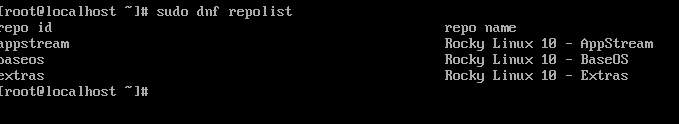
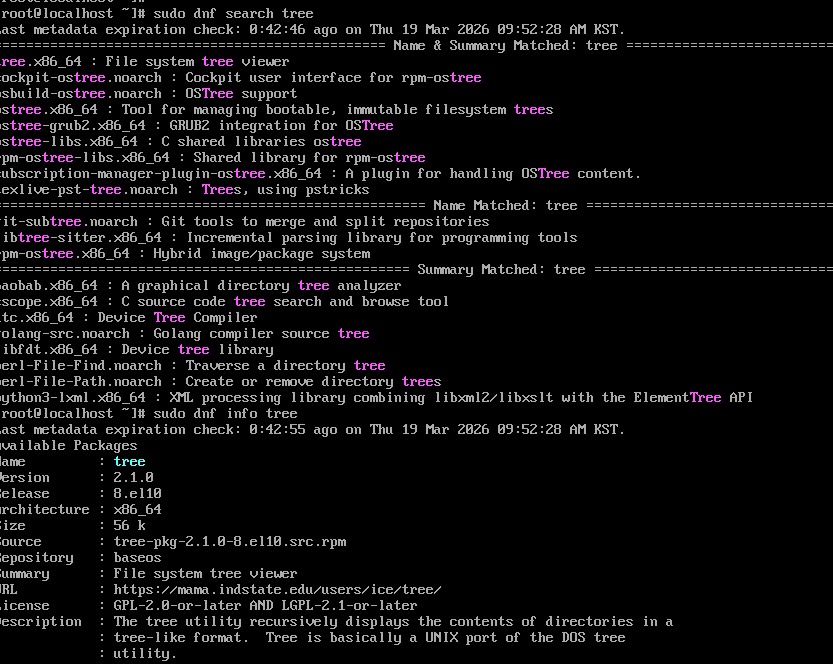
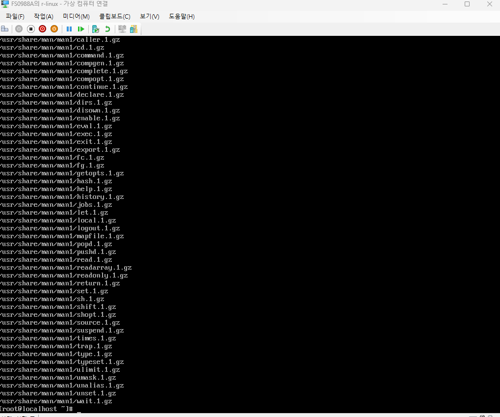
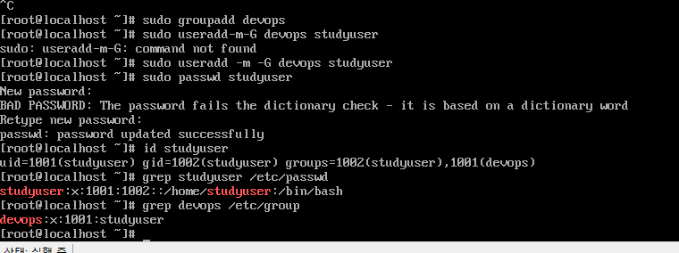
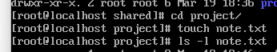
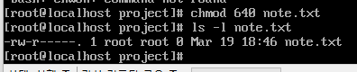

# Week 2. 패키지 및 사용자 관리

> 원본 노션: [리눅스 공부 - Week 2](https://platinum-cabin-2be.notion.site/Week-2-328cd0d242e180be8dffe4d4bac7bcb1?pvs=25)

## 1. 이번 주 학습 주제

- DNF와 RPM의 개념 및 차이 이해
- 패키지 설치, 업데이트, 삭제 실습
- Repository 구조와 설정 확인
- 사용자 및 그룹 생성, 변경, 삭제
- 파일 권한과 소유권 관리

## 2. 실습 환경

- Host OS: Windows 11
- Virtualization: Hyper-V
- Guest OS: Rocky Linux 10.1 Minimal
- 사용자 계정: `ilwoo`

## 3. 진행 내용

### 3-1. DNF와 RPM 개념 확인

- Rocky Linux에서 패키지를 관리할 때 주로 사용하는 도구는 `dnf`이다.
- `dnf`는 저장소(repository)에 등록된 패키지를 검색하고 설치, 업데이트, 삭제할 수 있는 상위 패키지 관리자이다.
- `yum`은 과거 Red Hat 계열에서 사용되던 패키지 관리자 이름이고, 현재는 `dnf`의 이전 세대 개념으로 이해하면 된다.
- `rpm`은 `.rpm` 패키지 파일과 설치된 패키지를 직접 다루는 저수준 도구이다.
- 정리하면, 일반적인 설치 및 업데이트는 `dnf`를 사용하고, 패키지 상세 정보 조회나 파일 목록 확인은 `rpm`을 사용하는 구조로 이해할 수 있었다.

### 3-2. Repository 확인

- `sudo dnf repolist` 명령으로 현재 활성화된 저장소를 확인했다.
- Rocky Linux에서는 `baseos`, `appstream` 등의 저장소가 활성화되어 있는 것을 확인할 수 있었다.
- `baseos`는 시스템 기본 구성과 관련된 패키지 저장소이고, `appstream`은 애플리케이션 및 추가 패키지들을 제공하는 저장소로 이해했다.
- repository는 Docker Hub처럼 하나의 단일 허브라기보다, 배포판이 제공하는 공식 패키지 공급원이라고 이해하는 것이 더 적절했다.

```bash
sudo dnf repolist
cat /etc/dnf/dnf.conf
ls /etc/yum.repos.d
```

- `dnf repolist` 결과 화면
- `/etc/yum.repos.d` 목록 확인 화면



### 3-3. 패키지 설치 및 제거 실습

- 실습용으로 가볍고 결과를 바로 확인할 수 있는 `tree` 패키지를 사용했다.
- `dnf search`로 검색하고, `dnf info`로 상세 정보를 확인한 뒤 설치를 진행했다.
- 설치 후 `tree --version` 또는 실제 디렉터리 경로에 대해 `tree`를 실행해 정상 동작을 확인했다.
- 이후 `dnf remove`를 통해 패키지를 삭제하며 설치/삭제 흐름을 실습했다.

```bash
sudo dnf search tree
sudo dnf info tree
sudo dnf install -y tree
tree --version
sudo dnf remove -y tree
```



### 3-4. RPM으로 패키지 정보 조회

- `rpm -qa`로 설치된 전체 패키지 목록 일부를 확인했다.
- `rpm -qi bash`로 bash 패키지의 상세 정보를 조회했다.
- `rpm -ql bash`로 bash 패키지가 설치한 파일 목록을 확인했다.
- 이를 통해 RPM은 개별 패키지 정보와 파일 구성을 직접 확인하는 데 유용하다는 점을 알 수 있었다.

```bash
rpm -qa
rpm -qi bash
rpm -ql bash
```



### 3-5. 사용자 및 그룹 관리

- `groupadd`로 그룹을 생성하고, `useradd`로 사용자를 생성했다.
- `-m` 옵션으로 홈 디렉터리를 만들고, `-G` 옵션으로 보조 그룹에 추가했다.
- `passwd`로 사용자 비밀번호를 설정하고, `id` 명령으로 UID, GID, 그룹 정보를 확인했다.
- `/etc/passwd`, `/etc/group` 파일을 통해 실제 사용자와 그룹 정보가 어떻게 저장되는지도 확인했다.

```bash
sudo groupadd devops
sudo useradd -m -G devops studyuser
sudo passwd studyuser
id studyuser
grep studyuser /etc/passwd
grep devops /etc/group
```



### 3-6. 파일 권한과 소유권 관리

- `ls -l`로 파일의 권한 구조를 확인했다.
- `chmod`로 권한을 변경하고, `chown`으로 소유자와 그룹을 변경했으며, `chgrp`로 그룹만 따로 변경해봤다.
- `640` 권한은 소유자에게 읽기/쓰기, 그룹에는 읽기만, 기타 사용자에게는 권한 없음이라는 의미로 이해했다.
- 이를 통해 리눅스에서 파일 접근 제어가 사용자, 그룹, 기타 사용자 기준으로 관리된다는 점을 확인했다





## 4. 개념 정리

### 4-1. DNF란

- DNF는 Rocky Linux와 같은 RPM 기반 배포판에서 사용하는 패키지 관리자이다.
- 저장소(repository)를 기반으로 패키지를 검색, 설치, 업데이트, 삭제할 수 있다.
- 의존성을 자동으로 계산하고 필요한 패키지를 함께 설치해주는 점이 핵심이다.

### 4-2. YUM이란

- YUM은 예전 Red Hat 계열에서 사용되던 패키지 관리자이다.
- 현재는 DNF가 주력이며, YUM은 이전 세대 개념 또는 호환 명령어로 이해하면 된다.

### 4-3. RPM이란

- RPM은 `.rpm` 패키지 파일 형식이자 패키지 관리 도구이다.
- 설치된 패키지 정보 조회, 파일 목록 확인, 패키지 파일 분석 등에 사용한다.
- 다만 의존성을 자동 처리하지 않기 때문에, 일반적인 설치 작업은 DNF를 사용하는 것이 더 적절하다.

### 4-4. DNF와 RPM 차이

- DNF: 저장소 기반 패키지 관리자, 설치/업데이트/삭제에 적합
- RPM: 패키지 자체를 직접 다루는 도구, 조회/검증/분석에 적합

정리하면 다음과 같이 이해할 수 있다.

```text
RPM (패키지 파일/패키지 정보)
   ↑
DNF (저장소 기반 패키지 관리자)
```

### 4-5. Repository란

- repository는 패키지를 모아둔 공급원 또는 서버이다.
- DNF는 여기서 패키지 정보를 읽고 필요한 파일을 내려받아 설치한다.
- 리눅스 전체 공통 허브 하나가 있는 구조라기보다, 각 배포판이 공식 저장소를 제공하는 방식에 가깝다.

### 4-6. 사용자와 그룹

- 사용자는 시스템에 로그인하거나 작업을 수행하는 계정이다.
- 그룹은 여러 사용자에게 공통 권한을 주기 위한 묶음이다.
- 리눅스는 사용자 단위뿐 아니라 그룹 단위로도 파일 접근 권한을 제어한다.

### 4-7. 파일 권한과 소유권

- 리눅스 파일 권한은 소유자(user), 그룹(group), 기타 사용자(other) 기준으로 나뉜다.
- `chmod`는 권한 변경, `chown`은 소유자 및 그룹 변경, `chgrp`는 그룹 변경 명령어이다.
- 예를 들어 `640`은 소유자 rw, 그룹 r, 기타 ---를 의미한다.
- `chmod`, `chown`, `chgrp` : 파일 권한과 소유권 관리

## 5. 배운 점

- DNF는 일반적인 패키지 설치와 업데이트, 삭제를 담당하는 상위 패키지 관리자라는 점을 이해했다.
- RPM은 설치 자체보다 패키지 정보 조회와 파일 분석에 더 적합하다는 점을 알 수 있었다.
- 저장소(repository)는 패키지를 공급하는 서버이며, 리눅스 배포판별로 관리된다는 점을 이해했다.
- 사용자와 그룹을 생성하고 파일 권한을 조정하면서 리눅스의 접근 제어 구조를 직접 경험할 수 있었다.
- `chmod`, `chown`, `chgrp`를 통해 소유자, 그룹, 권한이 실제로 어떻게 바뀌는지 확인했다.

## 6. 추가적으로 더 공부

### 1. Repository(저장소)란 무엇인가

repository는 패키지를 모아두고 배포하는 공급원이다. Rocky Linux에서 `dnf`는 이 저장소를 참고해서 어떤 패키지가 있는지 확인하고, 필요한 파일과 메타데이터를 내려받아 설치·업데이트·삭제를 수행한다. Rocky 문서에서는 DNF가 하나 이상의 설정 파일을 기반으로 repository를 사용하며, 저장소 설정 파일은 보통 `/etc/yum.repos.d/` 아래의 `.repo` 파일에 위치한다고 설명한다. 또한 `dnf repolist` 명령으로 현재 활성화된 저장소를 확인할 수 있다.

### 2. Repository는 Docker Hub 같은 공용 허브인가

repository는 Docker Hub처럼 전 세계가 하나의 중앙 허브만 쓰는 구조는 아니다. 더 정확히는 각 리눅스 배포판이 자기 배포판에 맞는 공식 저장소 세트를 제공하고, 실제 패키지는 여러 미러 서버를 통해 배포하는 방식에 가깝다. Rocky Linux에서는 `baseos`, `appstream`, `extras`, `crb` 같은 저장소가 보이며, 이는 Rocky Linux에서 공식적으로 제공하는 패키지 공급원이다. 따라서 repository는 “리눅스 전체 공용 허브”라기보다 배포판별 공식 패키지 저장소 체계라고 이해하는 것이 더 적절하다.

- VSCODE, CURSOR, Antigravity 모두 extension 저장소가 다른 것 처럼

### 3. 결국 DNF만으로 다 할 수 있는가

일반적인 패키지 설치, 업데이트, 삭제, 검색은 대부분 DNF만으로 충분하다. DNF는 저장소를 기반으로 의존성까지 계산해서 패키지를 관리하기 때문에, 실제 운영이나 실습에서는 `dnf install`, `dnf update`, `dnf remove`, `dnf search`를 주로 사용한다. 반면 RPM은 `.rpm` 파일 자체를 직접 다루거나, 설치된 패키지의 상세 정보와 파일 목록을 확인할 때 더 적합한 저수준 도구다. 즉, 평소 패키지 관리는 DNF, 패키지 자체 분석이나 상세 조회는 RPM이라고 구분하면 이해하기 쉽다.

## 7. 참고 자료

- Rocky Linux 공식 문서
- DNF Package Manager 가이드
- User and Group Management 관련 문서
- Software Management 관련 문서
