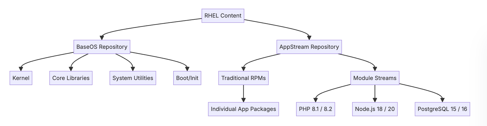
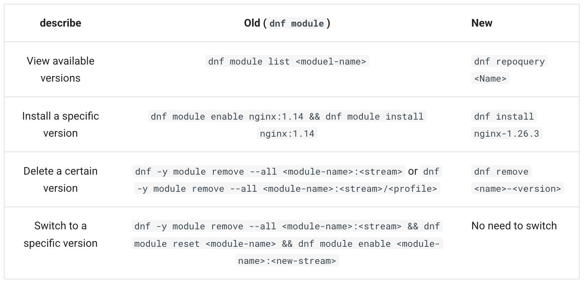
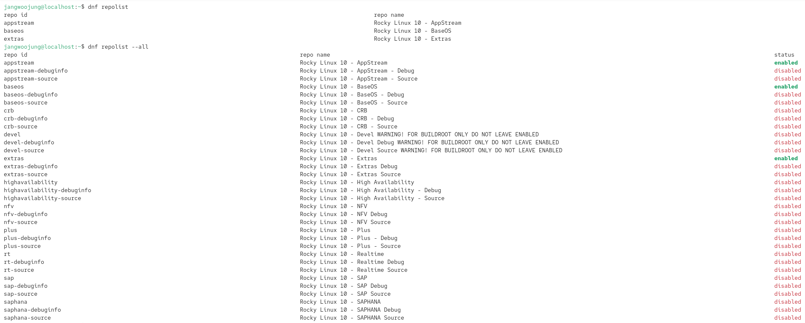
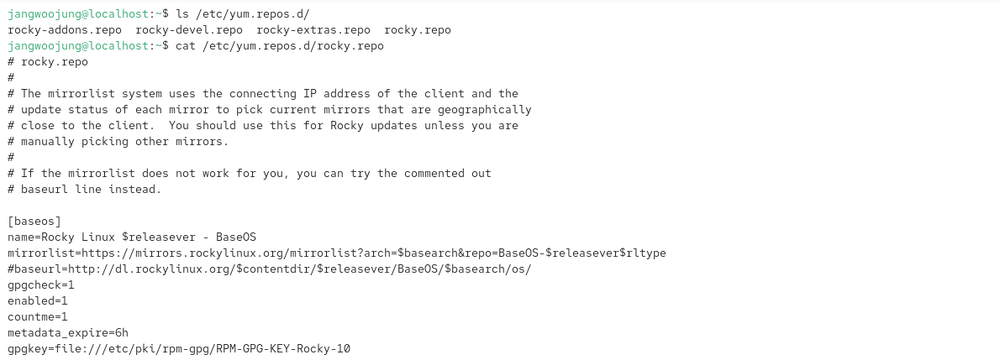
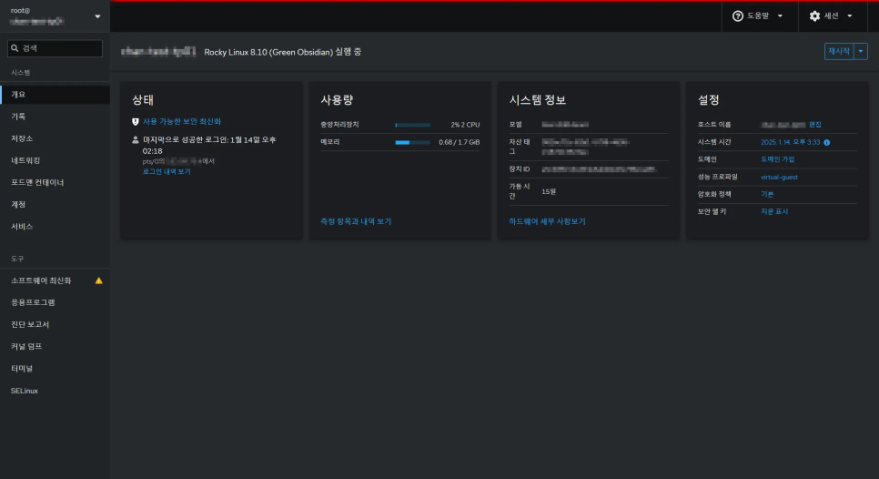
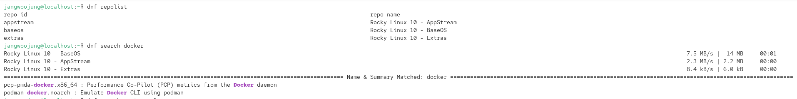
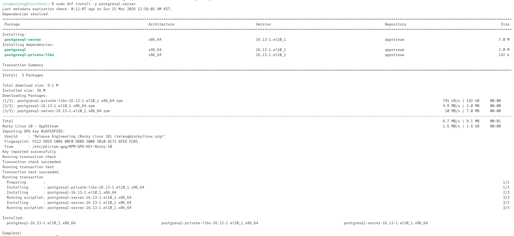
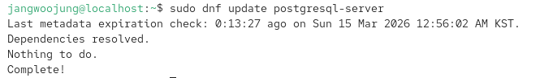
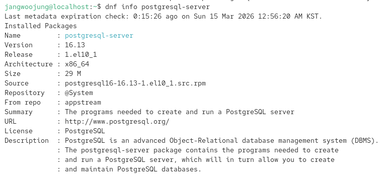

# 패키지 및 사용자 관리( DNF와 RPM, Repository, 사용자 및 그룹, 권한 )

## 패키지 관리자

여기서의 패키지? →  **패키지 = 프로그램 + 필요한 구성요소 + 설치 정보**

이와 같은 상황(문제)들에 모두 대응 가능하다!

- 프로그램을 실행시키기 위해선, 다른 “a”라는 라이브러리가 필요할 수 있다.
- 각각의 프로그램들은 각각 독자적으로 업데이트를 진행할 수 있다.
- 특정 프로그램들의 의존성 정리가 확실하지 않을 수 있다.

> Linux does not rely on random downloads or manual installers. Instead, it uses intelligent package management tools such as APT, YUM, and DNF to ensure software installs correctly, updates safely, and works without breaking the system.
> 

리눅스의 경우 인터넷의 랜덤 소스에서 다운 받는 것이 아닌 검증된 패키지를 repository 에서 다운 받는다.

또한 이를 관리하는 것이, Package manager tool 즉, 패키지 관리자가 되는 것이다.

**Package management** is the **automated process** of installing, upgrading, configuring, and removing software in Linux. Instead of manually compiling programs and resolving missing libraries, the package manager handles everything automatically.

패키지 매니저는 자동으로, 프로그램의 설치, 업데이트, 삭제등의 행위를 진행하게 된다. 프로그램을 manage 하는 것이다.

---

# 패키지 관리 시스템

## RPM (https://rpm.org/)

RPM Package Manager(RPM)은 리눅스 및 유닉스 계열 시스템에서 소프트웨어 패키지를 빌드·설치·업데이트·검증·삭제하는 오픈소스 패키지 관리 시스템이다.

간단하게 레드햇 계열 리눅스의 기본 **소프트웨어 패키지 형식(.rpm)이자 저수준(low-level)** 설치 도구로 보면 된다.

원래 Red Hat이 개발한 “Red Hat Package Manager”에서 출발해 현재는 다수의 배포판에서 핵심 구성요소로 사용된다.

ref. https://docs.centos.org/automotive-sig-documentation/features-and-concepts/con_rpm-packages-and-the-rpm-package-manager/?utm_source=chatgpt.com

---

다양한 종류의 패키지 관리자가 존재한다.

## YUM

**YUM(Yellowdog Updater, Modified)**은 Linux 계열에서 사용되는 오픈 소스 패키지 관리 도구로, RPM 기반 배포판(예: Red Hat Enterprise Linux, CentOS, Rocky Linux)에서 소프트웨어의 설치, 업데이트, 제거를 자동화한다. 의존성 해결 기능을 제공해 시스템 관리자가 손쉽게 소프트웨어 환경을 유지하도록 돕는다.

YUM은 패키지 저장소(repository)에서 메타데이터를 다운로드하고, 사용자가 요청한 **패키지와 그 의존 관계를 자동으로 분석**한다. 이후 필요한 모든 RPM 패키지를 올바른 순서로 설치하거나 제거한다. 이러한 **자동 의존성 해결 기능** 덕분에 일명 “**RPM 헬(RPM Hell)” 문제를 효과적으로 방지한다.**

## DNF

DNF(Dandified YUM)은 Red Hat 계열 배포판에서 사용되는 차세대 패키지 관리 도구다. Fedora 22(2015) 이후 기본 관리자로 채택되었으며 **Yellowdog Updater Modified (YUM) 을 대체**한다. DNF는 RPM Package Manager 을 기반으로 동작하며 의존성 해결 성능과 API 안정성을 **크게 개선**했다.

현재, RHEL 에서는 기존의 패키지 관리자 ‘yum’ 을 대체하는 ‘dnf’가 도입되어 사용되고 있다. ( REHL 8 버전 이후로, 적용되었다.

---

## Repository (RHEL)

리눅스에서 저장소(Repository)란 운영체제와 소프트웨어 패키지들이 안전하게 저장되고 배포되는 공식적인 중앙 저장 공간을 의미

** RHEL 8부터는 모든 패키지를 하나의 거대한 저장소에 넣던 방식(Monolithic)을 버리고, **OS의 핵심 부분**과 **사용자 애플리케이션**을 나누어 관리한다.

### **BaseOS (기본 운영 체제 저장소)**

- **역할:** 시스템 부팅과 실행에 필요한 가장 뼈대가 되는 **핵심 운영 체제 패키지**들을 담고 있음.
- **포함 패키지:** 리눅스 커널, 핵심 시스템 라이브러리(glibc), 시스템 관리 도구(systemd, bash), 기본 네트워크 도구 등.
- **특징:** 하위 호환성(ABI/API)을 절대적으로 보장하며, 운영체제 수명(최장 10년) 동안 버전이 크게 바뀌지 않고 **보안 및 버그 수정 업데이트만 제공된다**. 모듈 기능을 사용하지 않는 전통적인 RPM들로만 구성된다.

** ABI (Application Binary Interface)

### **AppStream (애플리케이션 스트림 저장소)**

- **역할:** 사용자가 서버를 운영할 때 필요한 **다양한 애플리케이션과 언어 런타임, 데이터베이스** 등을 제공한다.
- **포함 패키지:** 웹 서버(Nginx, Apache), 데이터베이스(PostgreSQL, MariaDB), 프로그래밍 언어(Python, PHP, Node.js) 등.
- **특징 (모듈 스트림):** 이 저장소의 가장 큰 핵심은 **'모듈(Module)'**. 하나의 소프트웨어에 대해 여러 버전을 선택해서 설치할 수 있다. 예를 들어, 시스템 기본 버전에 얽매이지 않고 필요에 따라 Node.js 18 버전이나 20 버전을 선택해 설치할 수 있다.

### **모듈(Module)**

- 단일 패키지가 아니라, 특정 애플리케이션이나 도구 세트를 구성하는 RPM 패키지들의 논리적인 묶음(컬렉션)

**모듈 스트림 (Module Stream)**

- 해당 모듈(소프트웨어)의 **버전**을 의미한다.
- **하나의 모듈은 여러 개의 스트림을 가질 수 있다**.
    - 예를 들어, `nodejs`라는 모듈 안에는 `18` 스트림과 `20` 스트림이 존재할 수 있으며, 사용자는 시스템에 설치할 Node.js의 메이저 버전을 선택할 수 있다.
- 시스템을 처음 설치하면 각 모듈에는 `[d]`로 표시된 **기본(Default) 스트림**이 지정되어 있어, 버전을 명시하지 않으면 기본 스트림이 설치된다.
- 각 스트림은 **지원 수명(Lifecycle)이 다를 수 있다.** 어떤 스트림은 OS 전체 수명과 같이 길게 지원되지만, 어떤 스트림은 더 짧은 기간만 지원될 수 있으므로 운영 계획에 맞춰 버전을 선택해야 한다.

**모듈 프로필 (Module Profile)**

- 선택한 스트림 안에서 **특정 사용 목적(Use case)에 맞게 사전에 정의된 패키지 세트**.
- 동일한 버전(스트림)을 설치하더라도 용도에 따라 설치되는 패키지 구성을 다르게 할 수 있다. 일반적으로 다음과 같은 프로필이 제공된다:
    - `common`: 대부분의 사용자가 필요로 하는 기본 패키지 세트.
    - `devel`: 개발용 헤더 파일 및 추가 개발 도구들이 포함된 세트.
    - `minimal`: 애플리케이션을 실행하기 위한 가장 최소한의 패키지만 포함된 세트.

### **CRB (Code Ready Builder) / PowerTools**

- **역할:** 일반적인 운영보다는 **개발자나 패키지 빌더들을 위한 라이브러리와 도구**들이 들어있는 저장소.
- **특징:** RHEL/로키 리눅스에 없는 추가 패키지 저장소인 **EPEL(Extra Packages for Enterprise Linux)**을 사용하려면, 반드시 이 CRB 저장소를 먼저 활성화해야 의존성 문제없이 설치가 가능!



> 
> 
> 
> ### **Modularity**
> 
> DNF modularity is deprecated, and Rocky Linux does not intend to provide AppStream content as modules in RL 10. In the future, RL 10 might provide additional application versions as RPM packages, software collections, or Flatpaks.
> 
> In other words, the `dnf module` command has been phased out in RL 10 because the next-generation DNF package manager (`dnf5`) has unified the API and no longer relies on the old modular architecture to manage multiple versions of the software. The relevant comparisons are as follows:
> 
> https://docs.rockylinux.org/10/release_notes/10_0/#modularity
> 

** Rocky Linux 10 버전 부터는 모듈 시스템(`dnf module` 명령어)의 지원이 중단된다.!

비교 표



**** (참고) 이미지 모드(Image Mode)의 등장**: RHEL 10은 기존의 `dnf` 기반 방식(Package Mode)을 그대로 지원하면서도, 운영체제 전체를 불변하는(Immutable) 컨테이너 이미지처럼 배포하고 원자적(Atomic)으로 업데이트할 수 있는 **이미지 모드(`bootc` 활용)**를 새로운 핵심 인프라 관리 기술로 도입했다.

## **Repository 설정 파일**

- RHEL 및 Rocky Linux에서 시스템이 바라보는 저장소(Repository) 설정은 주로 `/etc/yum.repos.d/` 디렉터리 내에 `.repo` 확장자를 가진 파일들로 저장된다
- **활성화된 저장소 목록 보기:** `dnf repolist` 명령어를 입력하면 시스템에 현재 활성화되어 패키지 설치가 가능한 저장소(BaseOS, AppStream 등) 목록이 출력된다. 특정 패키지를 찾을 수 없을 때 가장 먼저 확인해야 할 명령어다.
- **전체 저장소 목록 보기:** `dnf repolist --all` 명령어를 사용하면 현재 비활성화된 저장소를 포함하여 시스템에 등록된 전체 저장소 목록을 볼 수 있다. (비활성화된 것만 보려면 `-disabled` 옵션을 사용한다).
- **저장소 상세 정보 보기:** `dnf repoinfo <repository_name>` 명령어를 입력하면 특정 저장소의 추가적인 상세 정보를 조회할 수 있다.

**예시 화면





**3. Repository 설정 변경 및 관리 (config-manager)** 설정 파일을 `vi` 등의 문서 편집기로 직접 수정할 수도 있지만, `dnf config-manager` 명령어를 사용하면 더 안전하고 쉽게 설정을 관리할 수 있다.

- **새 저장소 추가:** `dnf config-manager --add-repo <repository_URL>` 명령어를 입력하면, 해당 URL을 기반으로 `/etc/yum.repos.d/` 경로에 새로운 `.repo` 설정 파일이 자동으로 생성된다 (추가된 저장소는 기본적으로 활성화된다).
- **저장소 활성화:** `dnf config-manager --enable <repository_id>`.
- **저장소 비활성화:** `dnf config-manager --disable <repository_id>`

---

## 사용자 및 그룹

리눅스는 다중 사용자(Multi-user) 운영체제로, 파일에 대한 접근을 통제하고 시스템 보안을 유지하기 위해 사용자 및 그룹 관리가 필수적이다.

### **관리 도구 및 방법**

- **웹 콘솔(Cockpit) 활용:** RHEL 및 Rocky Linux에서는 `Cockpit`이라는 웹 기반 관리 도구를 제공한다. 터미널 명령어 없이도 브라우저에서 클릭만으로 새 사용자 생성, 비밀번호 설정, 계정 잠금/해제, 그룹 멤버십 추가 등의 작업을 쉽게 수행할 수 있다.



```jsx
# systemctl enable --now cockpit.socket (활성화 명령어)
```

- **jCLI(명령어) 활용:** (일반 리눅스 지식) 터미널에서는 주로 다음과 같은 명령어를 사용한다.
    - `useradd` / `userdel`: 사용자를 생성하거나 삭제한다.
    - `groupadd` / `groupdel`: 그룹을 생성하거나 삭제한다.
    - `usermod`: 사용자의 그룹을 변경하거나 속성을 수정한다.
    - **명령어 사용법 및 예시**
        
        **1. 사용자 생성 및 비밀번호 설정**
        
        - **사용자 생성 (useradd):**
        - 가장 기본적으로 새로운 사용자를 생성하는 명령어다. 사용자의 홈 디렉터리(`/home/사용자명`)를 명시적으로 함께 생성하려면 `m` 옵션을 추가한다 (`sudo useradd -m [사용자명]`).
        - **비밀번호 설정 (passwd):**
        - 생성된 사용자가 로그인할 수 있도록 비밀번호를 지정한다. 명령어를 입력하면 비밀번호를 두 번 입력하라는 프롬프트가 나타난다.
        
        **2. 그룹 생성**
        
        - **그룹 생성 (groupadd):**
        - 시스템에 새로운 그룹을 생성한다. 특정 그룹 ID(GID)를 직접 지정하고 싶다면 `g` 옵션을 사용한다 (`sudo groupadd -g 2000 [그룹명]`).
        
        **3. 사용자를 특정 그룹에 추가**
        
        - **사용자 그룹 변경 (usermod):**
        - 기존 사용자를 특정 그룹에 추가할 때 가장 많이 사용하는 명령어다.
            - `G` 옵션은 사용자의 보조 그룹을 지정하며, `a` (append) 옵션과 함께 써야 **기존에 속해 있던 그룹에서 빠지지 않고** 새로운 그룹에만 추가로 속하게 된다.
        
        **4. 사용자 및 그룹 삭제**
        
        - **사용자 삭제 (userdel):**
        - 시스템에서 사용자를 삭제한다. 단, 사용자의 홈 디렉터리와 관련 파일들까지 한 번에 깔끔하게 삭제하려면 `r` 옵션을 붙여야 한다 (`sudo userdel -r [사용자명]`).
        - **그룹 삭제 (groupdel):**
        - 더 이상 사용하지 않는 그룹을 삭제한다.

### **사용자 및 그룹 생성 시 참고 사항 (UID/GID)**

- 시스템 사용자와 일반 사용자를 구분하기 위해, 일반 사용자의 사용자 ID(UID)와 그룹 ID(GID)는 기본적으로 1000번부터 할당된다. 대규모 환경에서는 충돌을 막기 위해 5000번 이상부터 설정하는 것도 권장된다.

```jsx
jangwoojung@localhost:~$ id
uid=1000(jangwoojung) gid=1000(jangwoojung) groups=1000(jangwoojung) context=unconfined_u:unconfined_r:unconfined_t:s0-s0:c0.c1023

```

### **보안 모범 사례 (Security Hardening)**

- **최소 권한의 원칙(Least Privilege):** 사용자에게는 필요한 업무를 수행할 수 있는 최소한의 권한만 부여해야 한다. 사용하지 않는 계정은 제거하고 민감한 역할은 관리자에게만 제한한다.
- **Root 계정 보호:** SSH를 통한 `root` 사용자의 직접 접속을 비활성화하는 것이 좋다. 관리 작업이 필요할 때는 비밀번호로 보호된 일반 계정에서 `sudo` 명령을 사용해 권한을 일시적으로 상승시켜 작업해야 한다.

---

## **파일 권한과 소유권 관리 (chmod, chown, chgrp)**

리눅스의 모든 파일과 디렉터리에는 보안을 위해 '소유권'과 '접근 권한'이 엄격하게 지정되어 있다. 기본적으로 파일을 생성한 사람이 그 파일의 소유자(User)가 되며, 생성자가 속한 그룹이 파일의 소유 그룹(Group)이 된다.

### **권한을 적용받는 대상 (User Types)**

- **u (User):** 파일의 소유자
- **g (Group):** 파일의 소유 그룹에 속한 사용자들
- **o (Others):** 소유자나 소유 그룹에 속하지 않은 나머지 모든 사용자
- **a (All):** 위 세 가지 대상을 모두 포함 (ugo)

### **접근 권한 (Permissions)의 종류**

파일인지 디렉터리인지에 따라 권한의 의미가 약간 다르다.

- **r (Read, 읽기 - 숫자 4):**
    - 파일: 내용을 읽거나 복사할 수 있다.
    - 디렉터리: 디렉터리 내부의 파일 목록을 볼 수 있다 (`ls`).
- **w (Write, 쓰기 - 숫자 2):**
    - 파일: 내용을 수정할 수 있다.
    - 디렉터리: 디렉터리 내부에 새로운 파일을 생성하거나 삭제할 수 있다. *(주의: 파일 자체의 쓰기 권한이 없더라도 디렉터리의 쓰기 권한이 있으면 파일을 삭제할 수 있다)*
- **x (Execute, 실행 - 숫자 1):**
    - 파일: 파일을 프로그램이나 스크립트처럼 실행할 수 있다.
    - 디렉터리: 해당 디렉터리 내부로 진입할 수 있다 (`cd`).

### **관리 명령어**

- **chmod (Change Mode):** 파일이나 디렉터리의 **접근 권한을 변경**한다. 권한은 오직 관리자(root)나 해당 파일의 소유자만 변경할 수 있다.
    - *8진수 방식:* `chmod 755 파일명` (소유자:rwx(7), 그룹:r-x(5), 기타:r-x(5)).
    - *기호 방식:* `chmod u+x 파일명` (소유자에게 실행 권한 추가).
    - `R` 옵션을 사용하면 하위 디렉터리와 파일까지 재귀적으로 권한을 변경한다.
- **chown / chgrp:** (일반 리눅스 지식)
    - `chown 사용자명 파일명`: 파일의 **소유자를 변경**한다.
    - `chgrp 그룹명 파일명`: 파일의 **소유 그룹을 변경**한다. (예: `chown user:group 파일명`으로 한 번에 변경도 가능하다).

### **기본 권한과 umask**

파일이나 디렉터리를 새로 만들 때 매번 권한을 설정하지 않아도 되는 이유는 **umask** 설정 때문이다.

- `umask`는 새로 생성되는 파일에 특정 권한이 부여되는 것을 '제한(마스킹)'하는 역할을 한다.
- 기본적으로 `umask` 값은 `022`로 설정되어 있으며, 이로 인해 새로 생성되는 파일은 소유자 외에는 쓰기 권한을 갖지 못하도록 안전하게 보호된다

---

# 실습

### 패키지 설치, 업데이트 삭제 등 - Rocky Linux 10

‘Docker’를 패키지 관리자 dnf를 통해 실습을 진행해보려 한다.



** 진행하던 중, 현재 RHEL 8이후에선 docker를 더 이상 공식 기본 도구로 사용 X 알게되었다.

→ Docker Daemon으로 인한 보안 이슈 → Daemon 없이 실행되는 “Podman” 사용!

먼저 postgresql-server를 통해 패키지 실습 진행

Install & Update





dnf info



### 사용자 그룹 및 권환 확인 실습 - RHEL 10

```jsx
cat /etc/passwd ->  사용자 목록 확인
cat /etc/group -> 그룹 목록 확인

jangwoojung@localhost:~$ whoami
jangwoojung
```

테스트를 위해 그룹 “ TEST “를 만들어 보고 진행하려 한다.

그 뒤 사용자 “tester1” , “tester2”를 통해 권한, 사용자와 관련된 실습을 진행했다.

```jsx
** 그룹 생성
jangwoojung@localhost:~$ sudo groupadd test1
jangwoojung@localhost:~$ sudo groupadd test2

jangwoojung@localhost:~$ cat /etc/group | grep test
test1:x:1001:
test2:x:1002:

** 사용자 생성
jangwoojung@localhost:~$ sudo useradd tester1
jangwoojung@localhost:~$ sudo useradd tester2
jangwoojung@localhost:~$ id tester1
uid=1001(tester1) gid=1003(tester1) groups=1003(tester1)
jangwoojung@localhost:~$ id tester2
uid=1002(tester2) gid=1004(tester2) groups=1004(tester2)

*그룹 할당
jangwoojung@localhost:~$ sudo usermod -aG test1 tester1
jangwoojung@localhost:~$ sudo usermod -aG test2 tester2
jangwoojung@localhost:~$ groups tester1
tester1 : tester1 test1
jangwoojung@localhost:~$ groups tester2
tester2 : tester2 test2

** 공통작업 폴더 생성
jangwoojung@localhost:~$ cd Documents
jangwoojung@localhost:~/Documents$ mkdir product
jangwoojung@localhost:~/Documents$ ls
product
jangwoojung@localhost:~/Documents$ ls -ld product/
drwxr-xr-x. 2 jangwoojung jangwoojung 6 Mar 15 01:44 product/

** 디렉터리 권한 변경
jangwoojung@localhost:~/Desktop$ sudo chown root:tester1 /product

jangwoojung@localhost:~/Desktop$ ls -ld /product
drwxrwxr-x. 2 root tester1 6 Mar 15 01:47 /product

jangwoojung@localhost:~/Desktop$ su - tester1
Password: 
Last failed login: Sun Mar 15 02:00:17 KST 2026 on pts/0
There were 2 failed login attempts since the last successful login.

tester1@localhost:~$ namei -l /home/jangwoojung/Desktop/product
f: /home/jangwoojung/Desktop/product
dr-xr-xr-x root        root        /
drwxr-xr-x root        root        home
drwx--x--x jangwoojung jangwoojung jangwoojung
drwxr-xr-x jangwoojung jangwoojung Desktop
drwxrwxr-x jangwoojung test1       product
tester1@localhost:~$ touch /home/jangwoojung/Desktop/product/test.txt
(이부분에서.. 상위그룹 권한에서 막히는 오류 발생했었다.)

jangwoojung@localhost:~$ su - tester2
Password: 
Last failed login: Sun Mar 15 02:19:34 KST 2026 on pts/0
There were 3 failed login attempts since the last successful login.
tester2@localhost:~$ touch /home/jangwoojung/Desktop/product/test2.txt
touch: cannot touch '/home/jangwoojung/Desktop/product/test2.txt': Permission denied
tester2@localhost:~$ su - jangwoojung
Password: 
Last login: Sun Mar 15 02:19:51 KST 2026 on pts/0
jangwoojung@localhost:~$ cd D
Desktop/   Documents/ Downloads/ 
jangwoojung@localhost:~$ cd Desktop/product/
jangwoojung@localhost:~/Desktop/product$ ls
test.txt

(tester2 는 권한 문제로 인해 생성 X)

** 소유자 변경
jangwoojung@localhost:~$ cd Desktop/product/
jangwoojung@localhost:~/Desktop/product$ ls
test.txt
jangwoojung@localhost:~/Desktop/product$ ls -l
total 0
-rw-r--r--. 1 **tester1** tester1 0 Mar 15 02:18 test.txt
jangwoojung@localhost:~/Desktop/product$ sudo chown tester2 /home/jangwoojung/Desktop/product/test.txt
jangwoojung@localhost:~/Desktop/product$ ls -l
total 0
-rw-r--r--. 1 **tester2** tester1 0 Mar 15 02:18 test.txt

** 그룹 변경
jangwoojung@localhost:~/Desktop/product$ sudo chgrp test2 /home/jangwoojung/Desktop/product/test.txt 
jangwoojung@localhost:~/Desktop/product$ ls -l
total 0
-rw-r--r--. 1 tester2 test2 0 Mar 15 02:18 test.txt

** 권한 변경
jangwoojung@localhost:~/Desktop/product$ sudo chmod 444 /home/jangwoojung/Desktop/product/test.txt 
jangwoojung@localhost:~/Desktop/product$ ls -l
total 0
-r--r--r--. 1 tester2 test2 0 Mar 15 02:18 test.txt

** 그룹 및 계정 삭세
jangwoojung@localhost:~$ sudo userdel -r tester1
jangwoojung@localhost:~$ 
jangwoojung@localhost:~$ sudo userdel -r tester2
jangwoojung@localhost:~$ 
jangwoojung@localhost:~$ sudo groupdel test1
jangwoojung@localhost:~$ sudo groupdel test2
jangwoojung@localhost:~$ 
jangwoojung@localhost:~$ id tester1
id: ‘tester1’: no such user
jangwoojung@localhost:~$ id tester2
id: ‘tester2’: no such user
jangwoojung@localhost:~$ cat /etc/group | grep test
jangwoojung@localhost:~$ 
```