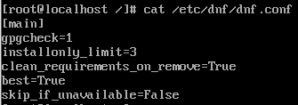

# 1. 패키지 관리 : RPM 과 DNF

```
[ 사용자 (User) ]
             |
      +------v------+
      |     DNF     |  <-- 의존성 계산, 리포지토리 관리 (두뇌)
      +------|------+
             |
      +------v------+
      |     RPM     |  <-- 실제 파일 압축 해제 및 기록 (엔진)
      +------|------+
             |
      +------v------+
      |  Linux OS   |  <-- 시스템 라이브러리 및 커널
      +-------------+
```

## RPM (Red Hat Package Manager)

- 윈도우의 `.msi`와 유사한 개별 설치 파일 단위. 의존성(필요한 다른 프로그램)을 자동으로 해결 불가
- "파일을 어디에 복사하고, 어떤 설정을 바꿀 것인가"라는 **저수준 작업**에 집중

## DNF (Dandified YUM)

- RPM의 상위 호환 도구. 인터넷 저장소(Repository)에서 패키지를 다운로드하며, 의존성 문제를 자동으로 해결

- "이 프로그램을 실행하기 위해 어떤 다른 프로그램이 필요한가"라는 **고수준 전략**을 담당

### YUM(Yellowdog Updater, Modified) 방식에서의 전환

- 성능과 메모리 효율
  - 의존성 계산 시 메모리를 과도하게 사용하고 속도가 저하
    <br/>-> 가상 제약 조건 해결 알고리즘 (SAT Solver)을 도입하여 적은 메모리로 빠른 계산 진행
- 파이썬 버전 업그레이드
  - YUM에서는 Python 2와 강한 결합
    <br/>-> DNF는 Python 3을 지원하여 확장 기능 개발이 쉬워짐

* [What You Need to Know About Fedora's Switch from Yum to DNF](https://www.linux.com/training-tutorials/what-you-need-know-about-fedoras-switch-yum-dnf/) - **Linux.com (The Linux Foundation)**
* [DNF Project Documentation](https://rpm-software-management.github.io/dnf/) - 공식 프로젝트 문서

### 패키지 관리 메커니즘

```
[ Remote Server ]                   [ Local Machine ]
 +--------------+                    +---------------+
 | Repository   |   (1) Metadata     | /var/cache/dnf |
 |  (Packages)  | ---------------->  | (SQLite DB)   |
 |  (Metadata)  |      Download      |               |
 +--------------+                    +-------|-------+
                                             | (2) SAT Solver
                                             v
                                     [ 최적의 설치 경로 계산 ]
```

- DNF는 미리 다운로드한 로컬 메타데이터(SQLite DB)를 뒤져 계산 진행

# 2. DNF

## DNF 구성

### 사용자 커스텀의 메뉴얼 : /etc/dnf/dnf.conf

```bash
cat /etc/dnf/dnf.conf
```



- `[main]` 섹션 : 전체적인 규칙 설정
  - `gpgcheck=1` : 다운로드 받은 패키지가 Red Hat에서 보낸 것인지 디지털 서명 확인
  - `installonly_limit=3` : 민감한 패키지를 업데이트할 때 만약을 대비하여 이전 버전 3개까지만 남겨두고 옛날 것부터 지움
  - `clean_requirements_on_remove=True` : 어떤 앱 삭제 시 앱의 의존성 패키지들도 함께 삭제
  - `best=True` : 패키지 설치 시 현재 시스템에서 사용 가능한 가장 최신 버전을 우선적으로 탐색
  - `skip_if_unavailable=False` : 레포지토리 중 하나라도 연결이 안 되면 바로 중지

### 전체 설정 확인

```bash
dnf config-manager --dump
```

- 이미 설정된 기본 설정 확인 가능

### DNF 플러그인

- 역할 : DNF의 기본 기능 외에 다양한 관리 능력을 부여하는 도구들
- 위치 : `/etc/dnf/plugins/` 디텍토리
- 파일명 : `<[>플러그인 이름>.conf`
- 플러그인 비활성화 : `/etc/dnf/plugins/versionlock.conf` 파일 편집
  ```conf
  [main]
  enabled=False
  ```

### DNF 패키지 관리 아키텍쳐

```
[ 레드햇 본사 서버 ]              [ 나의 로컬 컴퓨터 ]
+-------------------+             +-----------------------+
|  BaseOS 창고       |             |  1. 명령 입력:         |
|  AppStream 창고    | <---(인터넷)---|  dnf install nginx    |
| (수만 개의 RPM)     |             |           |           |
+-------------------+             |  2. 주소록 확인:       |
                                  |  /etc/yum.repos.d/    |
                                  |           |           |
                                  |  3. DNF의 의존성 계산   |
                                  |           |           |
                                  |  4. RPM 다운로드/설치   |
                                  |           |           |
                                  |  5. DB에 기록 저장      |
                                  +-----------------------+
```

## DNF 명령어

### DNF 조회

| 명령어                   | 목적                  |
| ------------------------ | --------------------- |
| `dnf search <단어>`      | 이름/요약 검색        |
| `dnf search -all <단어>` | 이름/요약/설명 검색   |
| `dnf repoquery <패키지>` | 패키지 상세 정보 조회 |
| `dnf provides <파일>`    | 파일로 패키지 역추적  |
| `dnf info <패키지명>`    | 패지키 상세 조회      |

### DNF 패키지 목록 관리

| 명령어                   | 목적                                           |
| ------------------------ | ---------------------------------------------- |
| `dnf list --all`         | 설치된 것 + 설치 가능한 것을 모두 나열         |
| `dnf search -all <단어>` | 현재 내 시스템에 설치된 패키지만 필터링        |
| `dnf list --available`   | 아직 설치하지 않았지만 설치 가능한 패키지 확인 |
| `dnf list --upgrades`    | 설치된 것 중 최신 버전이 나온 패키지 확인      |
| `dnf repoquery`          | 아키텍처와 버전을 더 상세한 형식으로 출력      |

### 패키지 그룹 조회

- 그룹 : 관련된 여러 패키지를 하나의 이름으로 묶어 놓은 것

| 명령어                         | 목적                                                     |
| ------------------------------ | -------------------------------------------------------- |
| `dnf group list`               | 설치 및 사용 가능한 모든 그룹 목록 확인                  |
| `dnf group info "<그룹명>"`    | 해당 그룹에 포함된 상세 패키지 구성(필수/기본/선택) 확인 |
| `dnf group summary`            | 설치된 그룹과 사용 가능한 그룹의 개수 요약               |
| `dnf group install "<그룹명>"` | 그룹 내 모든 패키지를 한 번에 설치                       |

### 패키지 설치

| 명령어                              | 목적                                                                  |
| ----------------------------------- | --------------------------------------------------------------------- |
| `dnf install <패키지명>`            | 패키지 기본 설치                                                      |
| `dnf install <패키지명>.<아키텍처>` | 아키텍쳐 지정 설치                                                    |
| `dnf install <파일의 절대 경로>`    | 패키지 이름을 몰라도 특정 실행 파일 경로만 알면 역추적하여 설치       |
| `dnf install <파일명.rpm>`          | 외부에서 가져온 RPM 설치 시, 부족한 의존성을 레포지토리에서 자동 보충 |

### 패키지 그룹 설치

| 명령어                            | 목적                       |
| --------------------------------- | -------------------------- |
| `dnf group install <그룹이름/ID>` | 특정 패키지 그룹 지정 설치 |

### 패키지 업데이트

| 명령어                       | 목적                                     |
| ---------------------------- | ---------------------------------------- |
| `dnf upgrade`                | 모든 패키지 및 해당 종속 항목을 업데이트 |
| `dnf upgrade <패키지명>`     | 단일 패키지를 업데이트                   |
| `dnf group upgrade <그룹명>` | 특정 패키지 그룹에서만 패키지를 업데이트 |

### 패키지 제거

| 명령어                                   | 목적             |
| ---------------------------------------- | ---------------- |
| `dnf remove <패키지명1> <패키지명2> ...` | 특정 패키지 제거 |

### 패키지 그룹 제거

| 명령어                               | 목적             |
| ------------------------------------ | ---------------- |
| `dnf group remove <그룹명> <그룹ID>` | 패키지 그룹 제거 |

## DNF 트랜잭션 관리 및 되돌리기

### DNF 트랜잭션

- DNF를 통해 패키지를 설치, 업데이트, 삭제할 때 발생하는 하나의 작업 단위
- 각 작업은 고유한 ID를 가지며 추적 가능

### 트랜잭션 관리 명령어

| 명령어                      | 목적                |
| --------------------------- | ------------------- |
| `dnf history`               | 전체 작업 이력 확인 |
| `dnf history info <ID>`     | 특정 작업 상세 확인 |
| `dnf history undo <ID>`     | 단일 작업 취소      |
| `dnf history rollback <ID>` | 특정 시점으로 복구  |

# 3. Repository 구조와 설정

```
[ Red Hat Content Delivery Network (CDN) ]
                       |
        _______________|________________
       |                                |
[ Repository: BaseOS ]        [ Repository: AppStream ]
|   (System Core)    |        |   (User Workspace)    |
|--------------------|        |-----------------------|
| - Kernel           |        | [ Module: Python ]    |
| - glibc            |        |   |- Stream 3.9       |
| - OpenSSH          |        |   |- Stream 3.12 (D)  |
| - Systemd          |        |                       |
| - DNF Tools        |        | [ Module: Postgres ]  |
|                    |        |   |- Stream 15        |
|____________________|        |   |- Stream 16        |
           |                  |_______________________|
           |                              |
           \______________  ______________/
                          ||
                  [ DNF SAT Solver ]
             (Dependency & Stream Resolution)
                          ||
                [ Local RHEL 10 System ]
```

## 저장소의 이중 구조

### BaseOS 저장소

- 역할 : 운영체제의 기본 기능을 수행하는 핵심 패키지 집합
- 특징
  - 하드웨어 실행과 부팅에 필수적인 요소들
  - 표준 RPM 형식으로 제공
  - OS 전체 수명 주기 동안 안정적으로 유지

### AppStream 저장소

- 역할 : 사용자가 필요한 다양한 사용자 공간 애플리케이션 제공
- 특징
  - 모듈성 : 애플리케이션 스트림(Application Streams) 메커니즘을 통해 동일한 소프트웨어에 대해 여러 버전(Streams) 선택권을 제공

## AppStream

\*[Introduction to AppStream](https://www.redhat.com/en/blog/introduction-appstreams-and-modules-red-hat-enterprise-linux)

### AppStream 구조

```
[ AppStream Repository ]  <-- 거대한 저장소 창고
      |
      +-- [ Module: PostgreSQL ]  <-- 소프트웨어 단위
      |         |
      |         +-- [ Stream: 10 ] (Default) <-- 버전 선택지 A
      |         |      |-- Profile: client (최소 도구)
      |         |      +-- Profile: server (데이터베이스 엔진 포함)
      |         |
      |         +-- [ Stream: 12 ]           <-- 버전 선택지 B
      |                |-- Profile: client
      |                +-- Profile: server
      |
      +-- [ Module: Python ]
                |-- [ Stream: 3.6 ]
                +-- [ Stream: 3.9 ] (Default)
```

- **모듈(Module)** : 하나의 소프트웨어 묶음 (ex. `postgresql` 설치 시 `postgresql-server` 등 많은 패키지 한번에 저장)
- **스트림(Stream)** : 한 소프트웨어의 여러 버전
- **프로필(Profile)** : 한 버전 내의 용도에 따라 다른 패키지 묶음

## AppStream 배포 형식

### RPM 형식 (표준 방식)

가장 일반적인 리눅스 패키지 설치 방식

- 설치 : `dnf install` 명령어로 즉시 설치
- RHEL 10의 변화 : 시스템 설치 시 바로 사용할 수 있는 표준 버전들을 RPM 형태로 제공

### 소프트웨어 컬렉션 (Software Collections, SCL)

한 시스템 안에 여러 버전의 동일한 소프트웨어를 공존시키고 싶을 때 사용

- RPM 기반 : 파일들을 시스템 표준 위치가 아닌 별도의 격리된 공간에 설치하도록 설계된 RPM 묶음

## 관련 명령어

### 레포지토리 관리

| 명령어               | 목적                                                     |
| -------------------- | -------------------------------------------------------- |
| `dnf repolist`       | 현재 사용 가능한(활성화된) 리포지토리 목록 확인          |
| `dnf repolist --all` | 비활성화된 것을 포함한 모든 리포지토리 조회              |
| `dnf repoinfo <ID>`  | 특정 리포지토리의 상세 정보(주소, 업데이트 일자 등) 확인 |

# 3. 사용자 및 권한 관리

\*[Managing users and groups](https://docs.redhat.com/en/documentation/red_hat_enterprise_linux/9/html/configuring_basic_system_settings/managing-users-and-groups_configuring-basic-system-settings)

## 사용자 및 그룹 관리

### 사용자(User)와 그룹(Group) 할당

- 리눅스에서 모든 프로세스와 파링은 특정 사용자(UID)와 그룹(GID)에 귀속
  - UID : 사용자를 식별하는 고유 숫자
    - `0` :` root`
    - `1~999` : 시스템 계정
    - `1000+` : 일반 사용자 계정
  - GID : 그룹을 식별하는 고유 숫자

### 사용자

- 사용자 개인 그룹(UPG) 시스템 구성을 사용하여 Linux 그룹 관리 간소화
  - 새 사용자가 시스템에 추가될 때마다 사용자 개인 그룹 생성

## 관리 명령어

### 사용자 관리

| 명령어            | 기능          | 설명                                         |
| ----------------- | ------------- | -------------------------------------------- |
| `useradd <ID>`    | 사용자 생성   | 기본 설정으로 계정 생성                      |
| `passwd <ID>`     | 비밀번호 설정 | 해당 사용자의 비밀번호 설정/변경             |
| `userdel -r <ID>` | 사용자 삭제   | 홈 디렉토리와 메일 스풀까지 모두 삭제 (`-r`) |
| `id <ID>`         | 사용자 삭제   | 사용자의 UID, GID, 소속 그룹 확인            |

### 그룹 관리

| 명령어                            | 기능           |
| --------------------------------- | -------------- |
| `groupadd <그룹ID>`               | 그룹 생성      |
| `usermod -aG <그룹ID> <사용자ID>` | 보조 그룹 추가 |
| `usermod -g 그룹ID <사용자ID>`    | 기본 그룹 변경 |
| `gpasswd -d <사용자ID> 그룹ID`    | 그룹에서 제거  |

## 파일 소유권 및 권한

### 권한 구조

```
-  rwx  r-x  r--  1  owner  group  1024  Mar 19 00:00  filename
|   |    |    |
|   |    |    +-- (3) Others: 소유자/그룹 외 나머지 사용자 권한
|   |    +------- (2) Group: 파일 소유 그룹 멤버의 권한
|   +------------ (1) Owner: 파일 소유자의 권한
+---------------- 파일 유형 (d: 디렉토리, -: 일반 파일, l: 링크)
```

### 권한의 의미

| 권한        | 파일(File)에서의 의미        | 디렉토리(Directory)에서의 의미    |
| ----------- | ---------------------------- | --------------------------------- |
| r (Read)    | 파일 내용 읽기 (`cat`, `vi`) | 디렉토리 내 파일 목록 확인 (`ls`) |
| w (Write)   | 파일 내용 수정 및 저장       | 파일 생성, 삭제, 이름 변경        |
| x (Execute) | 파일을 프로그램으로 실행     | 디렉토리 내부로 진입 가능 (`cd`)  |

## 권한 및 소유권 변경

### 소유권 변경

```bash
chmod <권한> <file>
```

### 소유자 변경

```bash
chown <user> <file>
```

### 그룹 변경

```bash
chgrp <group> <file>
```
