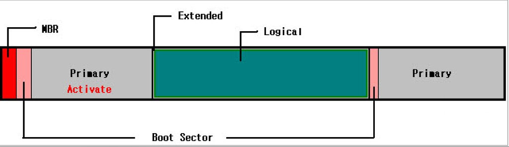

## 3주차 : 파일 시스템 및 스토리지 관리

<aside>

디스크와 파티션 구조 이해, 파티션 생성 및 관리, LVM의 개념과 볼륨 구성, 파일 시스템 생성 및 점검, 마운트·자동 마운트 설정(/etc/fstab) 실습

</aside>

### 왜 중요한가?

- 서버 장애의 30~40%는 스토리지 문제에서 발생
- 디스크 부족 / 마운트 오류 / fstab 오타 → 부팅 불가
- LVM 미사용 시 확장 불가 → 서비스 다운타임 발생

*즉, 스토리지는 "서비스 안정성"과 직결*

# 1. 디스크와 파티션 구조의 이해

| **계층** | **비유** | **항목** | **역할** |
| --- | --- | --- | --- |
| **1단계 (물리)** | **가공되지 않은 땅** | **Disk (`/dev/sdb`)** | 실제 하드웨어 장치 |
| **2단계 (기초)** | **땅의 경계선 긋기** | **MBR / GPT** | 디스크의 구획(Partition)을 나누는 **설계도 방식** |
| **3단계 (가상화)** | **공간의 자유로운 재배치** | **LVM** | 나뉜 구획들을 하나로 합치거나 다시 쪼개는 **관리 레이어** |
| **4단계 (활용)** | **방 안에 가구 배치** | **File System (XFS)** | 데이터를 저장하는 규칙 (포맷) |

사용자가 데이터를 저장하기 위해 거치는 단계는 '물리 → 논리 → 소프트웨어'의 흐름을 가진다.

## 1단계: Physical Device (하드웨어 인식)

컴퓨터에 디스크를 꽂으면 커널이 이를 장치 파일로 인식

- **장치명:** `/dev/sda`, `/dev/sdb` (SCSI/SATA), `/dev/nvme0n1` (NVMe)
- **상태:** 아직 데이터가 기록될 틀이 없는 'Raw' 상태

## 2단계: Partitioning (구획 나누기)

하나의 물리 저장장치를 시스템 내부에서 여러 디스크 공간으로 나누는 작업. 이때 **MBR**과 **GPT** 중 어떤 설계도를 쓸지 결정한다.

- **MBR (Master Boot Record):**
    - 고전적인 방식이며, 디스크의 첫 번째 섹터(512바이트)에 위치
    - **제한:** 주 파티션(Primary)은 최대 4개만 가능. 더 필요하면 1개를 '확장(Extended)'으로 지정하고 그 안에 '논리(Logical)' 파티션을 담아야 함
    - **한계:** 2TB 이상의 디스크는 인식하지 못함.
- **GPT (GUID Partition Table):**
    - **RHEL 10 및 현대 표준.** UEFI 부팅 방식과 짝을 이룸.
    - **장점:** 주 파티션을 128개까지 생성 가능하며, 디스크 끝에 복사본을 두어 복구 능력이 뛰어남. (8ZB까지 지원)

## 3단계: LVM Layer (가변적 용량 관리 - 선택 사항)

파티션을 직접 포맷하지 않고, LVM(Logical Volume Manager)이라는 추상화 계층을 두면 나중에 용량을 늘리거나 줄이기 매우 편리하다.(밑에서 자세히 설명)

1. **PV (Physical Volume):** 파티션(`/dev/sdb1`)을 LVM에서 쓸 수 있도록 등록
2. **VG (Volume Group):** 등록된 PV들을 하나의 커다란 '가상 저장소 바구니'로 합침.
3. **LV (Logical Volume):** 바구니(VG)에서 사용자가 필요한 만큼만 용량을 떼어내어 '가상 파티션'을 만듦. (실제 사용자가 마운트하는 대상)

## 4단계: File System (데이터 기록 규칙)

나뉜 구역에 어떤 방식으로 데이터를 저장할지 결정하는 단계이다. (포맷)

- **XFS:** RHEL의 기본 표준. 대용량 파일 처리에 강하고 확장성이 좋음
- **ext4:** 리눅스의 전통적인 파일 시스템. 안정성이 검증되어 있음

## 5단계: Mount Point (사용자 연결)

파일 시스템이 생성된 디스크를 리눅스 디렉터리 구조 내의 특정 폴더에 연결

- **명령어:** `mount /dev/data_vg/data_lv /data`
- **영구 설정:** 부팅 시마다 자동으로 연결되도록 `/etc/fstab` 파일에 기록해야 한다.

## 파티셔닝

### MBR (Master Boot Record) : 고전적 파티션 관리 시스템

- **정의:** 하드 디스크의 가장 첫 번째 섹터(512바이트)에 위치하며, 디스크 전체 관리를 담당
- **주요 기능:** 컴퓨터 부팅 시 가장 먼저 읽히며, 운영체제(OS)의 위치를 찾아 실행



### ① 주 파티션 (Primary Partition)

- **특징:** 물리적으로 독립된 구역이며, 운영체제 설치가 가능한 **'부팅 가능'** 공간
- **부트 섹터:** 각 주 파티션 앞에 할당. OS 설치 시 부트 레코드를 이곳에 기록하고, MBR은 이 정보를 읽어 부팅을 진행
- **개수 제한:** MBR 설계상 최대 **4개**까지 생성 가능

### ② 확장 파티션 (Extended Partition)

- **역할:** 주 파티션 4개 제한을 극복하기 위한 **'논리적 바구니'**
- **특징:** 데이터 직접 저장은 불가능하며, 내부의 '논리 드라이브'를 담는 용도로만 사용
- **구조:** 보통 [주 파티션 3개 + 확장 파티션 1개] 조합으로 구성하여 공간을 확장

### ③ 논리 드라이브 (Logical Drive)

- **특징:** 확장 파티션이라는 바구니 안에 생성되는 **'저장 전용'** 공간
- **활용:** 4개 이상의 파티션이 필요한 경우, 논리적 확장을 통해 추가 공간 확보

## 핵심 동작 원리 (부팅 과정)

1. **전원 ON:** 컴퓨터가 디스크 맨 앞의 **MBR**을 읽음
2. **OS 확인:** MBR 정보를 토대로 어떤 주 파티션의 **부트 섹터**를 읽을지 판단
3. **부팅 실행:** 운영체제가 자신의 부트 레코드를 MBR에 기록하여 스스로를 실행

---

## 한계와 대안

- **공간 제한:** 리눅스 기준 최대 4개의 주 공간으로 제한
- **확장 방식:** 부족한 공간은 **익스텐디드 공간**으로 확장하거나, **LVM** 계층을 통해 물리 공간을 논리적으로 쪼개어 사용

> **한 줄 정리: 주 파티션**은 부팅이 가능한 실질적인 방이며, **논리 드라이브**는 **확장 파티션**이라는 바구니 안에 담긴 저장 전용 공간.
> 

### GPT (GUID Partition Table : 현대적 표준 파티션 시스템) - RHEL에서 사용

- **정의:** GUID(전역 고유 식별자)를 기반으로 하는 차세대 파티션 관리 체계
- **표준:** **RHEL 10 및 UEFI** 환경에서 권장하는 표준 방식
- **주요 기능:** MBR의 용량 및 개수 제한을 해결하고 데이터 안전성을 강화


복잡한 확장/논리 구분 없이 모든 구역을 대등하게 취급

### ① 주 파티션 (Primary Partition)

- **특징:** 모든 파티션이 독립적인 주 파티션으로 동작
- **개수:** 최대 **128개**까지 생성 가능. (MBR의 4개 제한 해소)
- **역할:** 각 파티션마다 고유한 ID를 부여받아 부팅 및 데이터 저장에 자유롭게 사용

### ② 안전 장치 (Backup Table)

- **특징:** 파티션 테이블 정보-
맨 앞(LBA 1)과 맨 뒤(LBA n)에 **GPT Header**와 **Partition Table-**를  이중으로 저장
    - **복구:** 앞부분 데이터가 손상되어도 뒷부분 복사본으로 자동 복구 가능
- **Protective MBR (LBA 0):** 맨 앞에 구식 MBR인 척하는 영역을 두어, GPT를 모르는 옛날 프로그램이 디스크를 "빈 디스크"로 착각해 데이터를 지워버리는 것을 방지(보호)
- **무결성:** CRC32 체크섬을 통해 파티션 정보의 오염 여부를 스스로 검사

---

## 핵심 동작 원리 (부팅 과정)

1. **전원 ON:** 메인보드의 **UEFI**가 디스크의 GPT 헤더를 읽음
2. **복구 확인:** 테이블의 무결성을 검사하고 이상 없을 시 부팅 정보 로드
3. **부팅 실행:** 64비트 주소 체계를 통해 대용량 디스크에서도 정확하게 OS 위치 탐색

---

## 장점과 한계

- **용량:** 최대 **8ZB**(제타바이트) 지원. 2TB 이상의 물리 디스크에서 필수
- **단순성:** 확장 파티션 같은 '바구니' 개념 없이 직관적으로 공간 분할

한계 : 구형 32비트 OS에서는 활용 불가, 관리 데이터가 디스크 공간을 조금 더 차지, 구형 BIOS 메인보드에서 부팅 불가

> **한 줄 정리:GPT**는 복잡한 계층 없이 **128개의 독립적인 방**을 제공하며, 앞뒤로 복사본을 두어 **데이터 안전성**을 극대화한 현대적 설계도.
> 

*출처: [https://csj000714.tistory.com/611](https://csj000714.tistory.com/611)  ,*  [https://dakuo.tistory.com/60](https://dakuo.tistory.com/60), [https://present4n6.tistory.com/112](https://present4n6.tistory.com/112)

---

# 2. 파티션 생성 및 상세 관리

RHEL 10 환경에서는 `parted`를 통해 정밀하게 파티션을 제어

<aside>

## RHEL 공식문서

Red Hat Enterprise Linux는 `/dev/xy*N*` 형식의 파일 이름과 함께 파일 기반 이름 지정 체계를 사용한다. 장치 및 파티션 이름은 다음 구조로 구성된다.

**1. `/dev/` (위치)**

- 장치 파일이 저장되는 표준 디렉터리
- 하드 디스크 및 모든 파티션 관련 파일의 위치

**2. `xx` (유형)**

- 파티션을 포함하는 장치의 유형 표시
- 예: `sd` (SATA, SCSI), `nvme` (NVMe)

**3. `y` (식별)**

- 파티션을 포함하는 특정 장치의 순서
- 예: `/dev/sda` (첫 번째), `/dev/sdb` (두 번째)
- 26개 초과 시 `/dev/sdaa` 처럼 확장

**4. `N` (번호)**

- 파티션을 나타내는 숫자. (MBR 파티션 테이블 전용 규칙)
- **1 ~ 4:** 주(Primary) 또는 확장(Extended) 파티션
- **5 이상:** 논리(Logical) 파티션
    - 예: `/dev/sda3` (1번 하드, 3번째 주/확장 파티션)
    - 예: `/dev/sdb6` (2번 하드, 2번째 논리 파티션)
- 주의: `N`이 항상 파티션만을 의미하지는 않음
</aside>

## 실습: 디스크 정렬(Alignment)을 고려한 파티셔닝

```jsx
# 1. 새 디스크 인식 상태 상세 확인
lsblk -p  # 전체 경로 표시 (/dev/sdb 등)

# 2. GPT 라벨링 (기존 데이터 삭제 주의)
sudo parted /dev/sdb mklabel gpt

# 3. 파티션 생성 (단위: MiB 사용)
# 시작점 1MiB는 4K 섹터 정렬을 위해 필수적임 (성능 저하 방지)
sudo parted /dev/sdb mkpart primary xfs 1MiB 100%

# 4. 파티션 타입(Flag) 설정 (LVM으로 쓸 경우 추천)
sudo parted /dev/sdb set 1 lvm on

# 5. 결과 확인
sudo parted /dev/sdb print
```

---

# 3. LVM 개념과 볼륨 구성


LVM은 여러 개의 물리 디스크를 하나의 거대한 가상 풀로 묶는 것이 핵심!

<aside>

**Physical Volume (하단)**: 실제 하드디스크나 MBR/GPT로 나눈 파티션들

**Volume Group (중앙):** 하단에 있는 여러 물리 디스크들을 **하나의 거대한 용량 탱크**로 합친 상태
**Logical Volume (상단):** 통합된 탱크(VG)에서 사용자가 필요한 만큼만 용량을 떼어내서 만든 가상 파티션

</aside>

LVM은 여러 하드디스크를 VG(Volume Group)라는 하나의 큰 용량 탱크로 합친 뒤 LV(Logical Volume)에 필요한 만큼 나눠준다.

**[도커와의 비교]**

- 도커가 **애플리케이션 계층**을 추상화한다면, LVM은 **저장 장치 계층**을 추상화
- **유연성:** 도커 컨테이너를 껐다 켜거나 사양을 조절하기 쉽듯, LVM도 서비스 중단 없이 용량을 늘리거나 줄이는 것이 훨씬 자유롭다.

*출처: [https://everenew.tistory.com/497](https://everenew.tistory.com/497)*

## 실습: LVM 3단계 구성 및 확인

```jsx
# [1단계] PV 생성: 파티션을 LVM 재료로 등록
sudo pvcreate /dev/sdb1
sudo pvs -o +pv_uuid  # UUID까지 상세 확인

# [2단계] VG 생성: 여러 PV를 묶어 'vg_data'라는 이름의 풀 생성
# -s 옵션으로 Physical Extent(PE) 크기 지정 가능 (기본 4MiB)
sudo vgcreate vg_data /dev/sdb1

# [3단계] LV 생성: VG에서 필요한 만큼 용량 할당
# -L: 절대 용량(10G), -l: 상대 용량(예: -l +100%FREE)
sudo lvcreate -L 10G -n lv_storage vg_data

# [확인] 계층 구조 한눈에 보기
lsblk /dev/sdb
```

---

# 4. 파일 시스템 생성 및 정밀 점검

파일 시스템마다 관리 도구가 완전히 다르므로 주의해야 한다.

## 실습: 포맷 및 관리 도구 활용

```jsx
# 1. XFS 생성 (RHEL 10 기본)
# -f: 강제 포맷 (기존 파티션 정보 무시)
sudo mkfs.xfs -f /dev/vg_data/lv_storage

# 2. 상세 정보 출력 (Block Size, UUID 등)
sudo xfs_info /dev/vg_data/lv_storage
```

## 파일 시스템별 점검 명령어

| **상황** | **XFS 도구** | **ext4 도구** |
| --- | --- | --- |
| **단순 확장** | `xfs_growfs [마운트지점]` | `resize2fs [장치명]` |
| **일관성 검사** | `xfs_repair -n [장치명]` | `e2fsck -n [장치명]` |
| **실제 복구** | `xfs_repair [장치명]` | `e2fsck -p [장치명]` |

> **⚠️ 주의:** XFS는 로그 기반 복구 시스템이므로, 비정상 종료 시 부팅 과정에서 자동 복구. 수동 점검(`xfs_repair`)은 반드시 **언마운트(umount)** 상태에서 진행해야 한다.
> 

---

# 5. 마운트 및 /etc/fstab 영구 설정

실무에서는 장치명(`/dev/sdb1`)이 아닌 고유 식별자(UUID)를 사용하여 부팅 안정성을 확보

- 하드웨어 변경이나 디스크 추가 시 장치명이 바뀔 수 있지만, UUID는 파티션 생성 시 고정되므로 /etc/fstab 에서 UUID를 사용하면 부팅 시 마운트 실패 방지 가능

**⁠**

## 실습: 자동 마운트 프로세스

```jsx
# 1. 마운트 포인트 생성
sudo mkdir -p /mnt/data

# 2. 장치의 고유 UUID 추출 (매우 중요)
# blkid 명령어 결과에서 UUID="xxx" 부분 복사
sudo blkid /dev/vg_data/lv_storage
```

## /etc/fstab 필드 상세 분석 (`sudo vi /etc/fstab`)

```jsx
# [1.장치] [2.지점] [3.타입] [4.옵션] [5.덤프] [6.순서]
UUID=550e8400-e2... /mnt/data xfs defaults 0 0
```

- **defaults:** `rw, suid, dev, exec, auto, nouser, async` 옵션을 포함
- **0 (Dump):** 백업 여부 (현대 시스템에선 거의 0)
- **0 (Pass):** 부팅 시 fsck 순서. **XFS는 자체 복구 기능이 있으므로 0 권장**

## 안정성 검증

```jsx
# 1. 마운트 해제
sudo umount /mnt/data

# 2. fstab 전체 다시 읽기
# 여기서 에러가 나면 fstab에 오타가 있는 것임
sudo mount -a

# 3. 최종 결과 확인
df -Th | grep data
```

---

## 부팅 실패 시 대처

만약 `/etc/fstab` 오타로 인해 부팅 시 **Emergency Mode**로 진입했다면

1. **Read-Write 권한 획득:** `mount -o remount,rw /` (루트 파티션 쓰기 권장 확보)
2. **수정:** `vi /etc/fstab` 실행 후 잘못된 라인 앞에 `#` 붙여 주석 처리
3. **재시작:** `reboot` 호출
4. **원인 분석:** 부팅 후 `journalctl -xe` 명령어로 정확한 마운트 실패 로그 확인

## 실습인증


```jsx
user@localhost:~$ lsblk -p //디스크+파티션 존재 증명
NAME    MAJ:MIN RM  SIZE RO TYPE MOUNTPOINTS
/dev/sr0
         11:0    1 1024M  0 rom  
/dev/sr1
         11:1    1  9.5G  0 rom  /run/media/user/RHEL-10-1-BaseOS-x86_64
/dev/nvme0n1
│       259:0    0   40G  0 disk 
├─/dev/nvme0n1p1
│       259:1    0  600M  0 part /boot/efi
├─/dev/nvme0n1p2
│       259:2    0    1G  0 part /boot
└─/dev/nvme0n1p3
  │     259:3    0 38.4G  0 part 
  ├─/dev/mapper/rhel-root
  │     253:0    0 34.5G  0 lvm  /
  └─/dev/mapper/rhel-swap
        253:1    0  3.9G  0 lvm  [SWAP]
/dev/nvme0n2
│       259:4    0   20G  0 disk 
└─/dev/nvme0n2p1
  │     259:5    0   20G  0 part 
  └─/dev/mapper/vg_data-lv_storage
        253:2    0   20G  0 lvm  /mnt/data
        
        //LVM 구조 증명
user@localhost:~$ sudo pvs 
  PV             VG      Fmt  Attr PSize   PFree
  /dev/nvme0n1p3 rhel    lvm2 a--   38.41g    0 
  /dev/nvme0n2p1 vg_data lvm2 a--  <20.00g    0 
user@localhost:~$ sudo vgs
  VG      #PV #LV #SN Attr   VSize   VFree
  rhel      1   2   0 wz--n-  38.41g    0 
  vg_data   1   1   0 wz--n- <20.00g    0 
user@localhost:~$ sudo lvs
  LV         VG      Attr       LSize   Pool Origin Data%  Meta%  Move Log Cpy%Sync Convert
  root       rhel    -wi-ao---- <34.50g                                                    
  swap       rhel    -wi-ao----   3.91g                                                    
  lv_storage vg_data -wi-ao---- <20.00g  
  
  //파일시스템 증명                                                  
user@localhost:~$ df -Th
파일 시스템                    형식      크기  사용  가용 사용% 마운트위치
/dev/mapper/rhel-root          xfs        35G  6.3G   29G   19% /
devtmpfs                       devtmpfs  1.8G     0  1.8G    0% /dev
tmpfs                          tmpfs     1.8G   84K  1.8G    1% /dev/shm
efivarfs                       efivarfs  256K   57K  195K   23% /sys/firmware/efi/efivars
tmpfs                          tmpfs     725M  9.8M  715M    2% /run
tmpfs                          tmpfs     1.0M     0  1.0M    0% /run/credentials/systemd-journald.service
/dev/nvme0n1p2                 xfs       960M  344M  617M   36% /boot
/dev/nvme0n1p1                 vfat      599M  8.7M  591M    2% /boot/efi
tmpfs                          tmpfs     363M  136K  362M    1% /run/user/1000
/dev/sr1                       iso9660   9.5G  9.5G     0  100% /run/media/user/RHEL-10-1-BaseOS-x86_64
/dev/mapper/vg_data-lv_storage xfs        20G  424M   20G    3% /mnt/data
user@localhost:~$ cat /etc/fstab

#//fstab 설정 증명
# /etc/fstab
# Created by anaconda on Sun Mar 15 15:23:13 2026
#
# Accessible filesystems, by reference, are maintained under '/dev/disk/'.
# See man pages fstab(5), findfs(8), mount(8) and/or blkid(8) for more info.
#
# After editing this file, run 'systemctl daemon-reload' to update systemd
# units generated from this file.
UUID=7c9e0dae-367b-4726-a86f-79da4aba9bac /                       xfs     defaults        0 0
UUID=5d8584f5-707a-483b-8b03-14b6c33cf0f3 /boot                   xfs     defaults        0 0
UUID=EDDB-5B68          /boot/efi               vfat    umask=0077,shortname=winnt 0 2
UUID=4db48351-d139-45f4-b210-2aacb00c2ebe none                    swap    defaults        0 0
UUID=90af3a80-ac4e-4307-b17c-8e271af9b3fe /mnt/data xfs defaults 0 0
user@localhost:~$ sudo blkid /dev/vg_Data/lv_storage
#
//UUID 기반 마운트 증명
user@localhost:~$ sudo blkid /dev/vg_data/lv_storage
/dev/vg_data/lv_storage: UUID="90af3a80-ac4e-4307-b17c-8e271af9b3fe" BLOCK_SIZE="512" TYPE="xfs"
user@localhost:~$ ls -l /mnt/data //실제 사용 가능 증명
합계 0
-rw-r--r--. 1 user user 0  3월 21일  19:01 test.txt
user@localhost:~$ 

```
