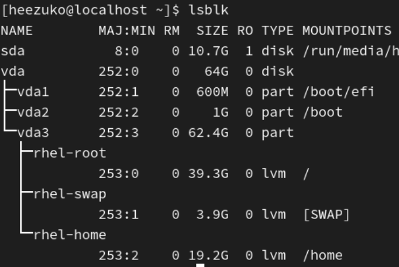
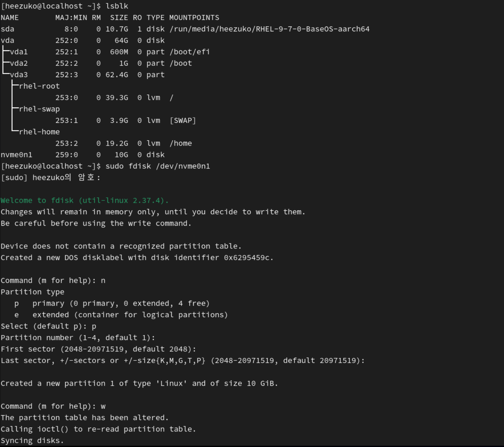
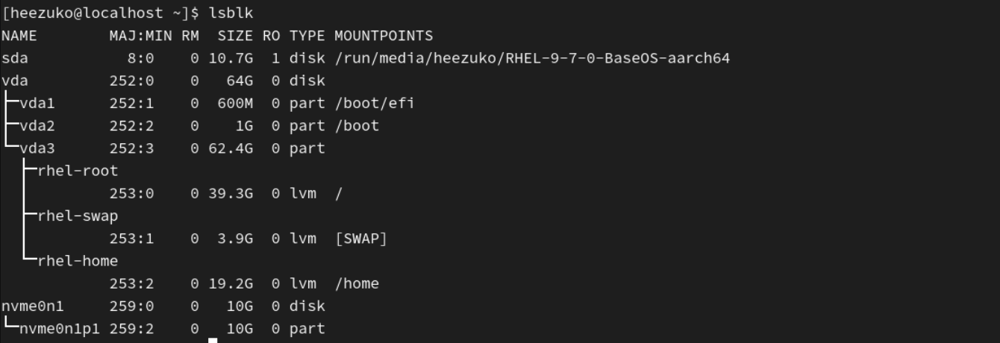
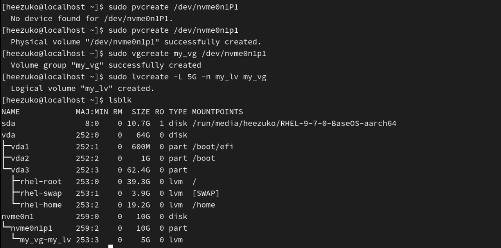
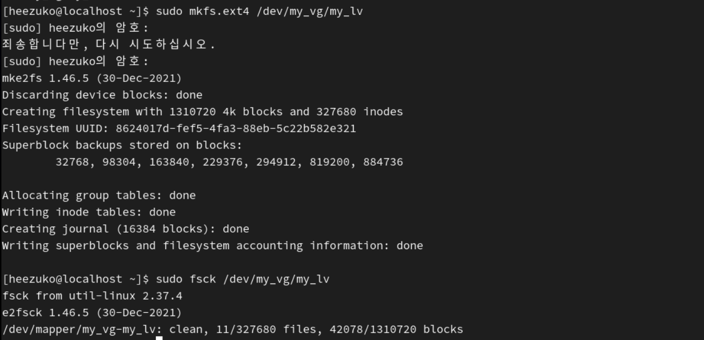

## 🐧 디스크 및 스토리지 관리 정리

- **디스크(Disk)**: 실제 저장장치 전체
- **파티션(Partition)**: 디스크를 나눈 논리적 공간
- **LVM(Logical Volume Manager)**: 저장공간을 유연하게 관리하는 방식
- **파일 시스템(File System)**: 파일을 저장하고 관리하는 규칙
- **마운트(Mount)**: 저장공간을 특정 디렉터리에 연결해서 실제로 사용 가능하게 하는 것
- **자동 마운트(/etc/fstab)**: 부팅할 때 자동으로 마운트되도록 설정하는 것

쉽게 비유하면?

- 디스크 = 큰 창고
- 파티션 = 창고 안의 칸
- 파일 시스템 = 칸 안을 정리하는 규칙
- 마운트 = 그 칸을 집 안의 문과 연결해서 사용하게 만드는 것
- LVM = 칸의 크기를 더 유연하게 바꿀 수 있게 해주는 관리 방식

### 1. 디스크

디스크는 저장 장치 전체를 의미한다.  
예를 들어 리눅스에서는 다음과 같은 이름으로 보인다.

- `/dev/sda`
- `/dev/sdb`
- `/dev/vda`

여기서 `sda`, `vda`는 **하나의 디스크 전체**를 뜻한다.

### 파티션

디스크를 바로 사용하는 것이 아니라, 필요에 따라 공간을 나누어 사용할 수 있다.  
이렇게 나눈 공간이 파티션이다.

예:

- `/dev/sda1`
- `/dev/sda2`
- `/dev/vda1`

 

`/dev/sda` = 디스크  
`/dev/sda1` = 그 디스크 안의 첫 번째 파티션

 

디스크와 파티션은 `lsblk` 명령어로 확인 가능하다.  
현재 시스템에 연결된 디스크와 파티션 구조를 트리 형태로 보여준다.

- `vda` 64GB 짜리 디스크
- `vda1` `vda2` `vda3` 그 디스크를 나눈 파티션
- `rhel-root` `rhel-swap` `rhel-home` 논리 볼륨

### 3. 파티션 생성 및 관리

#### 파티션을 나누는 이유?

: 디스크를 통째로 사용하기보다 목적에 따라 공간을 분리하면 관리가 쉬워진다.

#### 파티션 생성 명령어 `fidsk`

: 디스크 `/dev/sdb`에 파티션을 만들려면

<pre>sudo fdisk /dev/sdb</pre>

`fdisk` 실행 후 자주 사용하는 명령은 다음과 같다.

- n : 새 파티션 생성
- p : 파티션 정보 출력
- d : 파티션 삭제
- w : 저장 후 종료
- q : 저장하지 않고 종료

### 실습

1. 설정에서 드라이브 추가
2. sudo fdisk /dev/sdb
3. n 입력 → 새 파티션 생성
4. 기본값 선택 → 파티션 번호, 시작 섹터, 끝 섹터 지정
5. w 입력 → 저장 후 종료
   

- `lsblk`로 확인해보면 파티션이 생성된 것을 확인할 수 있다.
  

### 4. LVM(Logical Volume Manager)

LVM은 저장 공간을 더 유연하게 관리하기 위한 방식이다.

일반 파티션은 한번 나누면 나중에 크기 변경이 불편한 경우가 많지만, LVM은 저장 공간(여러 디스크)을 모아서 묶고, 다시 필요한 만큼 나누어 쓸 수 있어서 유연하다.

### LVM 구조

LVM은 보통 아래 3단계로 구성된다.

- PV (Physical Volume): 실제 디스크나 파티션을 LVM용 재료로 만든 것
- VG (Volume Group): PV 여러 개를 묶은 저장 공간 그룹
- LV (Logical Volume): VG 안에서 실제로 사용하는 논리적 공간

<pre>
디스크/파티션 → PV → VG → LV
</pre>

### 실습

    1.	/dev/sdb1 파티션 준비
    2.	pvcreate로 PV 생성
    3.	vgcreate로 VG 생성
    4.	lvcreate로 LV 생성

1. PV 생성
먼저 파티션을 LVM용 물리 볼륨으로 만든다.
<pre>sudo pvcreate /dev/sdb1</pre>
2. VG 생성
이제 PV를 묶어 Volume Group을 만든다.
<pre>sudo vgcreate my_vg /dev/sdb1</pre>
3. LV 생성
VG 안에서 실제 사용할 Logical Volume을 만든다.
<pre>sudo lvcreate -L 1G -n my_lv my_vg</pre>

- -L 1G : 크기를 1GB로 지정
- -n my_lv : 논리 볼륨 이름을 my_lv로 지정
- my_vg : 어떤 VG에서 만들지 지정

 

<pre>
1. 10G 디스크 내에 파티션을 생성한다.
2. pvcreate로 이 파티션을 LVM 재료로 바꾼다.
3. vgcreate로 PV를 10GB 짜리 VG로 만든다.
4. 10G 중 lvcreate로 5G 짜리 LVM 논리 볼륨을 만든다.
</pre>

#### + 나중에 늘리려면?

<pre>sudo lvextend -L +2G /dev/my_vg/my_lv</pre>

- 5G -> 7G

### 5. 파일 시스템

파일 시스템은 저장 공간에 파일과 디렉토리를 어떤 규칙으로 저장하고 관리할지 정하는 방식이다.  
ex) ext4, xfs

#### 파일 시스템을 만들어야 하는 이유?

디스크나 볼륨을 만들었다고 바로 파일을 저장할 수 있는 것은 아니다. 그 공간을 실제로 사용하려면 파일 시스템을 생성해야 한다.

#### 1. ext4 파일 시스템 생성

<pre>sudo mkfs.ext4 /dev/my_vg/my_lv</pre>

`/dev/my_vg/my_lv`에 ext4 파일 시스템을 생성한다.

#### 2. xfs 파일 시스템 생성

<pre>sudo mkfs.xfs /dev/my_vg/my_lv</pre>

### 5-1. 파일 시스템 점검

파일 시스템에 문제가 생겼을 때 검사하는 명령어가 필요하다.

#### 1. ext4 점검

<pre>sudo fsck /dev/my_vg/my_lv</pre>

#### 2. xfs 점검

<pre>sudo xfs_repair /dev/my_vg/my_lv</pre>

#### ⚠️ 주의점

파일 시스템 점검은 마운트 해제된 상태에서 하는 것이 안전하다. 필요 시, 점검 전에 먼저 언마운트한다.

<pre>sudo umount /mnt/data</pre>

### 6. 마운트(Mount)

마운트는 저장 공간을 특정 디렉토리에 연결하는 것이다. 리눅스에서는 디스크를 드라이브 문자(C:, D:)처럼 사용하는 것이 아니라 디렉토리에 연결해서 사용한다.

예를 들어 새 볼륨을 `/mnt/data`에 연결하면 사용자는 `/mnt/data` 폴더를 통해 그 저장공간을 사용하게 된다.

 

### 실습

1. 마운트 할 디렉토리 만들기
<pre>sudo mkdir /mnt/data</pre>
2. 마운트 하기
<pre>sudo mount /dev/my_vg/my_lv /mnt/data</pre>
3. 마운트 확인
<pre>df -h</pre>
4. 언마운트 (사용 해제)
<pre>sudo umount /mnt/data</pre>
