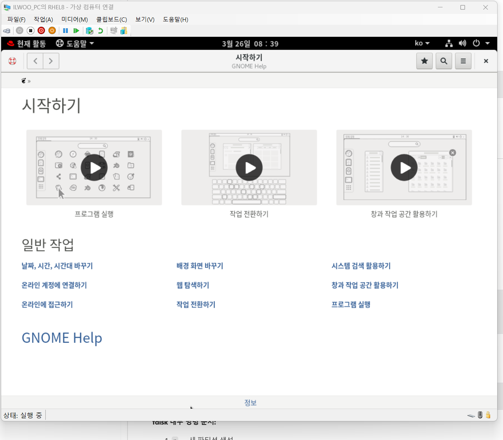
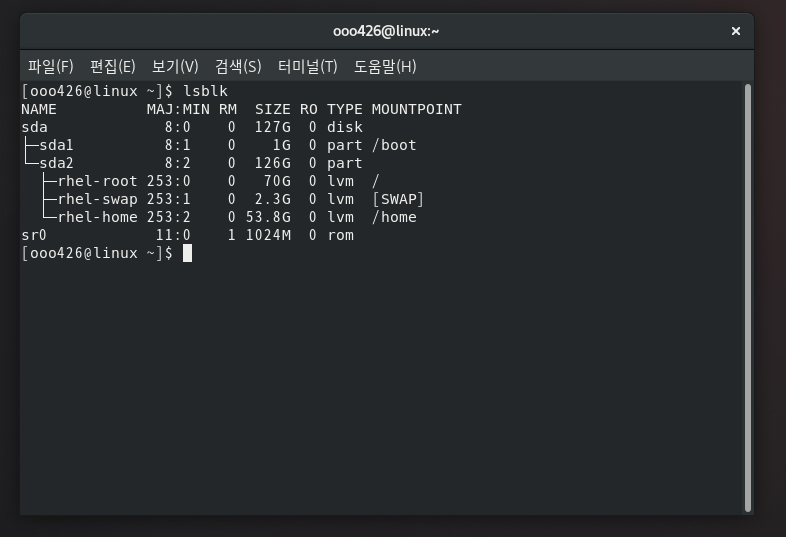
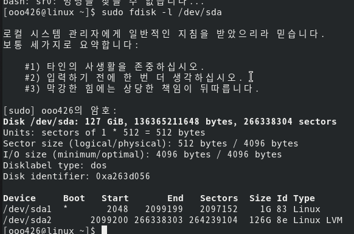
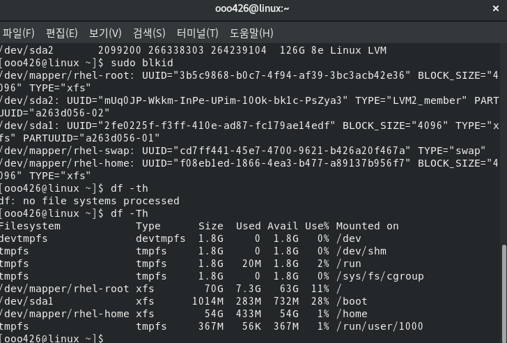
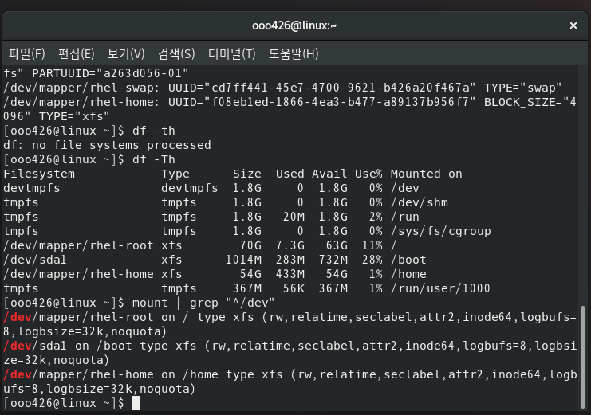
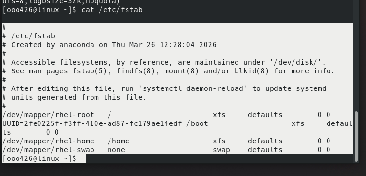
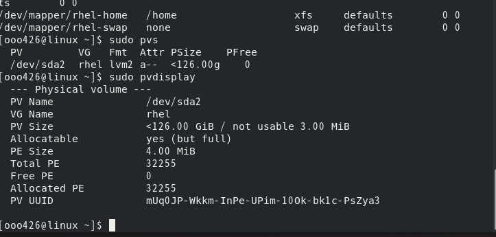
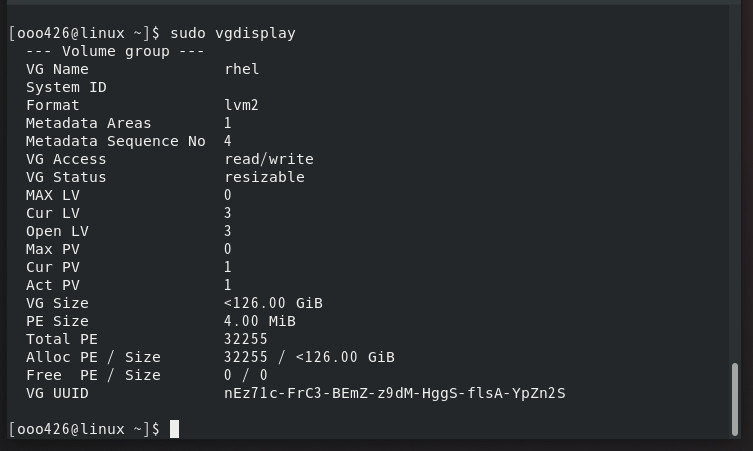
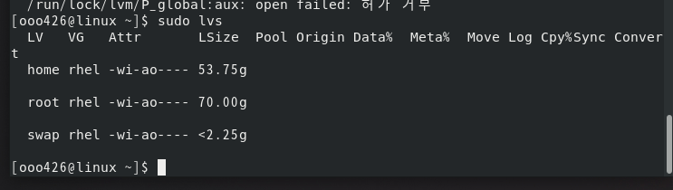
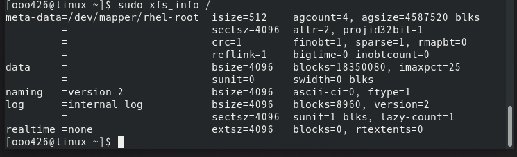

# Week 3. 파일 시스템 및 스토리지 관리

## 1. 이번 주 학습 주제

- 디스크와 파티션 구조 이해
- 파티션 및 파일 시스템 정보 확인
- LVM의 개념과 기존 볼륨 구조 분석
- 파일 시스템 정보 확인
- 마운트 구조와 자동 마운트 설정 (/etc/fstab) 이해

## 2. 실습 환경

- Host OS: Windows 11
- Virtualization: Hyper-V
- Guest OS: RHEL 8 (Red Hat Enterprise Linux 8) GUI 설치
- 사용자 계정: `ooo426`

> 참고: 이전 주차까지는 Rocky Linux를 사용했으나, 이번 주차부터는 RHEL 8 환경에서 실습을 진행했다.



> 이번 주차에서는 별도 디스크를 추가하지 않고, 설치 시 자동 구성된 디스크와 LVM 구조를 분석하고 이해하는 데 집중했다.

## 3. 진행 내용

### 3-1. 디스크와 파티션 구조 확인

리눅스에서 디스크는 `/dev/` 디렉터리 아래에 장치 파일로 표시된다.

- `/dev/sda`: 첫 번째 SCSI/SATA 디스크
- `/dev/sda1`, `/dev/sda2`: sda 디스크의 파티션
- `/dev/sr0`: CD/DVD 드라이브

> **sda란?**
> `sd`는 SCSI Disk의 약자로, 리눅스가 디스크를 인식하는 방식이다. 첫 번째 디스크는 `sda`, 두 번째는 `sdb`, 세 번째는 `sdc`... 순서로 이름이 붙는다. 뒤의 숫자(`sda1`, `sda2`)는 그 디스크 안의 파티션 번호이다. 윈도우에서 "디스크 0", "디스크 1"로 표시되는 것과 비슷한 개념이다.

```bash
lsblk
```

실행 결과 현재 시스템의 디스크 구조는 다음과 같았다:

```text
sda         127G  disk
├─sda1        1G  part  /boot
└─sda2      126G  part
  ├─rhel-root  70G  lvm  /
  ├─rhel-swap 2.3G  lvm  [SWAP]
  └─rhel-home 53.8G lvm  /home
sr0        1024M  rom
```

- `sda1`은 `/boot` 파티션으로, 부팅에 필요한 커널과 부트로더 파일이 저장된다.
- `sda2`는 나머지 공간 전체를 LVM으로 구성한 파티션이다.
- RHEL 8 설치 시 자동으로 이 구조가 만들어진 것이다.

> **root, swap, home이란?**
> 리눅스는 용도별로 영역을 나눠서 관리한다.
> - **root (`/`)**: 운영체제가 설치되는 최상위 디렉터리. 윈도우의 `C:\`와 비슷하다. 시스템 설정, 프로그램 등이 여기에 들어간다.
> - **swap**: 물리 메모리(RAM)가 부족할 때 디스크 일부를 임시 메모리처럼 쓰는 공간이다. 윈도우의 "페이지 파일(pagefile.sys)"과 같은 역할이다.
> - **home (`/home`)**: 사용자별 개인 파일이 저장되는 공간이다. 윈도우의 `C:\Users\사용자명` 폴더와 비슷하다. root와 분리하면 OS를 재설치해도 개인 파일을 보존할 수 있다.



### 3-2. 파티션 테이블 정보 확인

> **fdisk, gdisk란?**
> 디스크를 파티션으로 나누는 도구이다. 윈도우에서 "디스크 관리"에서 파티션을 나누는 것과 같은 역할을 한다.
> - `fdisk`: MBR 방식 파티션을 관리하는 도구
> - `gdisk`: GPT 방식 파티션을 관리하는 도구
>
> 여기서는 `-l` 옵션을 붙여 현재 파티션 정보를 읽기 전용으로 확인만 했다.

```bash
sudo fdisk -l /dev/sda
```

> **MBR과 GPT는 디스크 포맷인가?**
> 정확히는 "파티션 테이블 방식"이다. 디스크를 어떻게 나눌 것인지에 대한 규격이라고 보면 된다.
> - **MBR (Master Boot Record)**: 오래된 방식. 최대 4개 주 파티션, 2TB 디스크 제한. 레거시 BIOS와 함께 사용된다.
> - **GPT (GUID Partition Table)**: 최신 방식. 128개 이상 파티션, 2TB 초과 지원. UEFI 부팅과 함께 사용된다.
>
> 윈도우에서 디스크 관리 → "디스크 초기화" 할 때 MBR/GPT 선택하는 것과 같은 개념이다. 파일 시스템(NTFS, XFS 등)과는 별개의 것으로, MBR/GPT는 "디스크를 어떻게 나눌지", 파일 시스템은 "나눈 파티션 안에 데이터를 어떻게 저장할지"를 결정한다.



sudo 전에 멘트가 너무 웃겼습니다

### 3-3. 파일 시스템 및 UUID 확인

각 파티션과 볼륨에 어떤 파일 시스템이 사용되고 있는지 확인했다.

> **파일 시스템이란? 윈도우의 NTFS, FAT32와 같은 개념인가?**
> 맞다. 파일 시스템은 파티션 안에 데이터를 어떤 구조로 저장하고 관리할지 정하는 규격이다. 윈도우에서 USB를 포맷할 때 "NTFS", "FAT32", "exFAT" 중 선택하는 것과 동일한 개념이다.
>
> | 파일 시스템 | 주요 OS | 특징 |
> |------------|---------|------|
> | **NTFS** | Windows | 윈도우 기본. 대용량 파일, 권한 관리 지원 |
> | **FAT32** | 범용 | USB에 많이 사용. 4GB 파일 크기 제한 |
> | **XFS** | Linux (RHEL) | RHEL/CentOS 기본. 대용량에 강하고 확장 가능 |
> | **ext4** | Linux (Ubuntu) | 우분투 등에서 기본. 범용적이고 축소도 가능 |
>
> 결국 NTFS/FAT32나 XFS/ext4 모두 "파일을 저장하는 방식"이라는 점에서 같은 개념이다. 다만 각 OS에 최적화된 파일 시스템이 다른 것이다.

> **mkfs란?**
> `mkfs`는 **M**a**k**e **F**ile **S**ystem의 약자로, 파티션에 파일 시스템을 생성(포맷)하는 명령어이다. 윈도우에서 드라이브를 우클릭 → "포맷" 하는 것과 같다.
> - `mkfs.xfs /dev/sdb1` → XFS로 포맷
> - `mkfs.ext4 /dev/sdb1` → ext4로 포맷
>
> 이번 실습에서는 기존 시스템을 분석만 했으므로 직접 mkfs를 실행하지는 않았다.

```bash
# 블록 디바이스의 UUID와 파일 시스템 타입 확인
sudo blkid

# 마운트된 파일 시스템의 용량과 타입 확인
df -Th
```

- RHEL 8의 기본 파일 시스템은 XFS이다.
- `blkid`로 UUID를 확인할 수 있고, 이 UUID는 `/etc/fstab`에서 자동 마운트 설정에 사용된다.



### 3-4. 마운트 구조 확인

현재 시스템에서 어떤 장치가 어디에 마운트되어 있는지 확인했다.

```bash
# 실제 디바이스 마운트 정보만 필터
mount | grep "^/dev"

# 또는 트리 형태로 확인
findmnt -t xfs,ext4,swap
```

현재 마운트 구조:
- `/dev/sda1` → `/boot` (부팅 파일)
- `/dev/mapper/rhel-root` → `/` (루트 파일 시스템)
- `/dev/mapper/rhel-home` → `/home` (사용자 홈 디렉터리)
- `/dev/mapper/rhel-swap` → `[SWAP]` (스왑 영역)



### 3-5. /etc/fstab 확인

`/etc/fstab`은 부팅 시 자동으로 마운트할 장치를 정의하는 설정 파일이다.

```bash
cat /etc/fstab
```

**fstab 각 필드 설명:**

| 필드 | 설명 | 예시 |
|------|------|------|
| 장치 | UUID 또는 장치 경로 | `/dev/mapper/rhel-root` |
| 마운트 포인트 | 마운트할 디렉터리 | `/`, `/boot`, `/home` |
| 파일 시스템 타입 | xfs, ext4, swap 등 | `xfs` |
| 옵션 | 마운트 옵션 | `defaults` |
| dump | 백업 여부 (0 또는 1) | `0` |
| fsck 순서 | 부팅 시 점검 순서 | `0` |

- fstab에 오타가 있으면 부팅이 안 될 수 있으므로, 수정 후에는 반드시 `mount -a`로 테스트해야 한다.
- 현재 시스템에서는 LVM 장치가 `/dev/mapper/` 경로로 등록되어 있는 것을 확인할 수 있다.



### 3-6. LVM 구조 분석

현재 시스템은 이미 LVM으로 구성되어 있다. RHEL 8 설치 시 자동으로 만들어진 LVM 구조를 분석했다.

> **LVM이란?**
> LVM(Logical Volume Manager)은 물리 디스크를 논리적으로 묶어서 유연하게 관리하는 방식이다.
>
> 일반 파티션은 한번 크기를 정하면 나중에 바꾸기 어렵다. 예를 들어 C드라이브 100GB, D드라이브 50GB로 나눴는데 C드라이브가 꽉 차면 윈도우에서도 파티션 크기 변경이 까다로운 것과 같다.
>
> LVM은 이 문제를 해결한다. 디스크를 "저장소 풀"처럼 관리해서, 필요할 때 볼륨 크기를 늘리거나 줄일 수 있다. 특히 서버 환경에서 디스크 용량을 유연하게 관리해야 할 때 많이 사용한다.

**LVM 구조:**

```text
물리 디스크/파티션  →  PV (Physical Volume)
                         ↓
                    VG (Volume Group) ← 여러 PV를 하나로 묶음
                         ↓
                    LV (Logical Volume) ← 실제 사용할 볼륨
                         ↓
                    파일 시스템 (xfs)
                         ↓
                    마운트 (/, /home, [SWAP])
```

#### PV (Physical Volume) 확인

```bash
sudo pvs
sudo pvdisplay
```

- `sda2`가 PV로 등록되어 있는 것을 확인할 수 있다.



#### VG (Volume Group) 확인

```bash
sudo vgs
sudo vgdisplay
```

- `rhel`이라는 이름의 VG가 존재하며, `sda2`의 PV를 포함하고 있다.
- VG의 전체 크기, 사용된 크기, 남은 여유 공간(Free PE)을 확인할 수 있다.



#### LV (Logical Volume) 확인

```bash
sudo lvs
sudo lvdisplay
```

- `root`, `swap`, `home` 세 개의 LV가 존재한다.
- 각 LV의 크기와 어떤 VG에 속해 있는지 확인할 수 있다.



### 3-7. 현재 시스템의 전체 스토리지 구조 정리

확인한 내용을 바탕으로 현재 시스템의 전체 스토리지 구조를 정리했다.

```text
/dev/sda (127GB 물리 디스크)
├─ /dev/sda1 (1GB)
│    └─ XFS 파일 시스템 → /boot
│
└─ /dev/sda2 (126GB)
     └─ PV (Physical Volume)
          └─ VG: rhel
               ├─ LV: root  (70GB)   → XFS → /
               ├─ LV: swap  (2.3GB)  → swap → [SWAP]
               └─ LV: home  (53.8GB) → XFS → /home
```

### 3-8. XFS 파일 시스템 상세 정보 확인

현재 사용 중인 XFS 파일 시스템의 상세 정보를 확인했다.

```bash
# 루트 파일 시스템 정보
sudo xfs_info /

# /boot 파일 시스템 정보
sudo xfs_info /boot
```

- `xfs_info`로 블록 크기, 로그 크기 등 파일 시스템 내부 구조를 확인할 수 있다.



## 4. 개념 정리

### 4-1. 파티션과 파일 시스템의 관계

```text
디스크 (/dev/sda)
  └─ 파티션 (/dev/sda1)  ← fdisk/gdisk으로 생성
       └─ 파일 시스템 (xfs)  ← mkfs로 포맷
            └─ 마운트 (/boot)  ← mount로 연결
```

- 디스크를 파티션으로 나누고, 파티션에 파일 시스템을 만들고, 마운트해서 사용하는 3단계 흐름이다.
- 윈도우와 비교하면: 디스크 관리에서 파티션 나누기 → NTFS로 포맷 → 드라이브 문자(C:, D:) 할당하는 것과 같은 흐름이다.

### 4-2. MBR과 GPT 비교

| 항목 | MBR | GPT |
|------|-----|-----|
| 최대 파티션 수 | 주 파티션 4개 | 128개 이상 |
| 최대 디스크 크기 | 2TB | 8ZB 이상 |
| 관리 도구 | fdisk | gdisk |
| UEFI 지원 | 제한적 | 완전 지원 |

### 4-3. 주요 파일 시스템 비교

리눅스에서 사용하는 XFS, ext4는 윈도우의 NTFS, FAT32와 동일한 개념이다. 모두 "파티션 안에 데이터를 어떻게 저장하고 관리할지"를 정하는 규격이며, 각 OS에 최적화된 파일 시스템이 다를 뿐이다.

| 항목 | XFS | ext4 | NTFS | FAT32 |
|------|-----|------|------|-------|
| 주요 OS | RHEL 계열 | Ubuntu 계열 | Windows | 범용 (USB 등) |
| 최대 파일 크기 | 8EB | 16TB | 256TB | **4GB** |
| 축소 가능 | X | O | O | X |
| 특징 | 대용량에 강함 | 범용적 | 권한 관리, 암호화 | 호환성 높음, 제한 많음 |

### 4-4. LVM 용어 정리

| 용어 | 설명 | 윈도우 비유 |
|------|------|------------|
| PV (Physical Volume) | 물리 디스크/파티션을 LVM용으로 초기화 | 디스크 자체 |
| VG (Volume Group) | PV들을 묶은 저장소 풀 | 스토리지 풀 (저장소 공간) |
| LV (Logical Volume) | VG에서 할당한 논리 볼륨 | C:, D: 드라이브 |
| PE (Physical Extent) | LVM에서 데이터를 관리하는 최소 단위 (기본 4MB) | 할당 단위 |

### 4-5. LVM을 사용하는 이유

전통적인 파티션 방식은 한번 크기를 정하면 변경하기 어렵다. LVM은 이 문제를 해결한다:

- **유연한 크기 조절**: 볼륨을 나중에 확장하거나 축소할 수 있다
- **여러 디스크 통합**: 물리 디스크 여러 개를 하나의 VG로 묶어 사용할 수 있다
- **스냅샷 기능**: 특정 시점의 볼륨 상태를 저장할 수 있다
- **운영 중 변경**: 서비스 중단 없이 볼륨 크기를 변경할 수 있다 (XFS 확장 시)

### 4-6. 주요 명령어 정리

| 명령어 | 용도 |
|--------|------|
| `lsblk` | 블록 디바이스 목록 확인 |
| `fdisk -l` | 파티션 테이블 상세 정보 확인 |
| `blkid` | 블록 디바이스 UUID 및 파일 시스템 확인 |
| `df -Th` | 마운트된 파일 시스템 용량 및 타입 확인 |
| `mount` | 현재 마운트 정보 확인 |
| `findmnt` | 마운트 정보를 트리 형태로 확인 |
| `cat /etc/fstab` | 자동 마운트 설정 확인 |
| `pvs` / `pvdisplay` | PV 정보 확인 |
| `vgs` / `vgdisplay` | VG 정보 확인 |
| `lvs` / `lvdisplay` | LV 정보 확인 |
| `xfs_info` | XFS 파일 시스템 상세 정보 확인 |
| `mkfs.xfs` / `mkfs.ext4` | 파일 시스템 생성 (포맷) |

## 5. 배운 점

- RHEL 8을 GUI로 설치하면 자동으로 `/boot` 파티션과 LVM 기반의 root, swap, home 볼륨이 구성된다는 것을 확인했다.
- `lsblk`, `fdisk -l`, `blkid`, `df -Th` 등 여러 명령어를 조합하면 디스크의 전체 구조를 파악할 수 있다.
- LVM은 PV → VG → LV의 3단계 구조이며, `pvs`, `vgs`, `lvs` 명령으로 각 계층의 상태를 확인할 수 있다.
- `/etc/fstab`은 부팅 시 자동 마운트를 설정하는 핵심 파일이며, 잘못 수정하면 부팅이 안 될 수 있으므로 주의가 필요하다.
- XFS가 RHEL 8의 기본 파일 시스템이며, 확장은 가능하지만 축소는 불가능하다는 특성을 이해했다.
- 리눅스의 XFS/ext4와 윈도우의 NTFS/FAT32는 같은 "파일 시스템" 개념이며, 각 OS에 최적화된 것이 다를 뿐이라는 점을 이해했다.
- 별도 디스크 없이도 기존 시스템의 구조를 분석하는 것만으로 파일 시스템과 LVM의 개념을 충분히 학습할 수 있었다.

## 6. 참고 자료

- [Red Hat Enterprise Linux 공식 문서](https://docs.redhat.com/ko/documentation/red_hat_enterprise_linux/10/)
- Red Hat - 파일 시스템 관리 가이드
- Red Hat - 논리 볼륨 관리(LVM) 가이드
