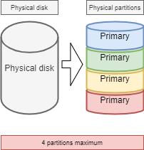
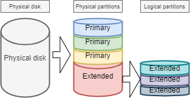
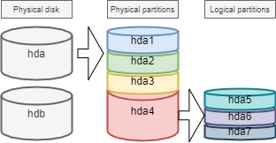
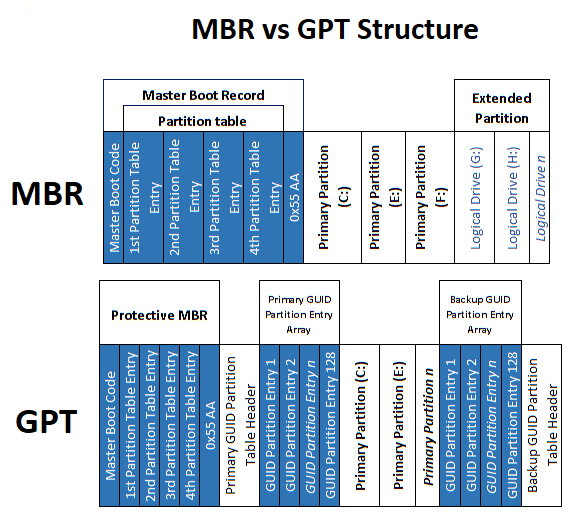
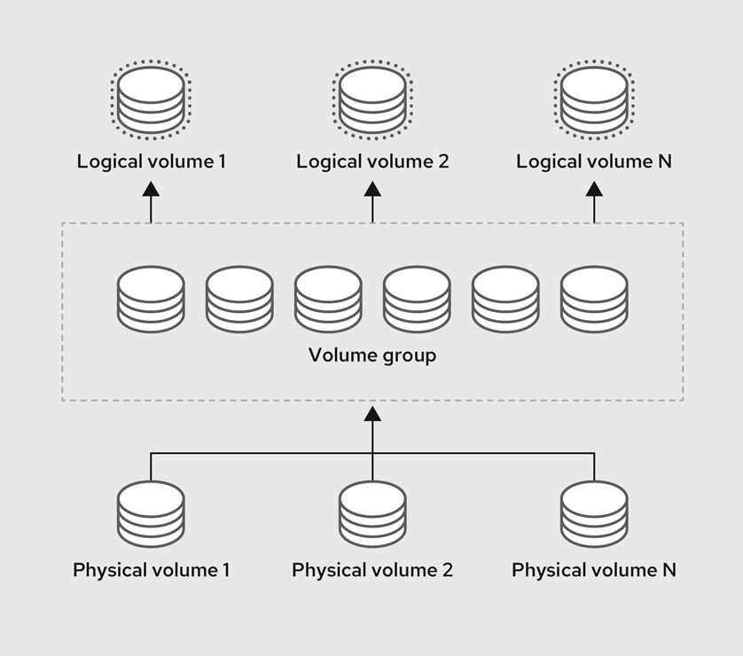
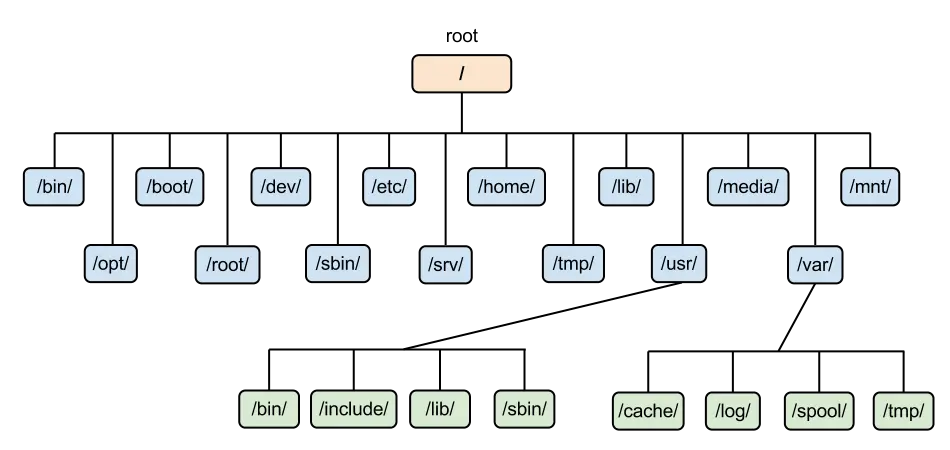
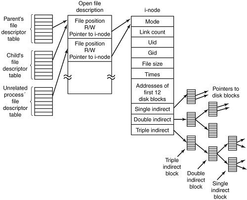

# 디스크와 파티션 구조 이해

## **파티션 기본 개념: MBR vs GPT**

### 파티션

파티션(Partition)은 **하나의 물리적인 하드 드라이브를 여러 개의 독립된 구역으로 나누는 것**을 말한다.

이러한 파티션 된 공간을 사용하기 위해선 두 작업이 필요하다.

- **파일 시스템 생성 (포맷 작업)** 디스크의 빈 공간을 운영 체제가 인식하고 데이터를 읽고 쓸 수 있는 구조로 초기화하는 과정.
- **마운트 (Mount)** 리눅스는 모든 시스템을 루트(**`/`**)를 시작점으로 하는 하나의 거대한 디렉터리 트리 구조로 관리.
    - 파일 시스템을 생성한 독립적인 파티션을 이 리눅스 디렉터리 트리 내부의 특정 폴더(마운트 포인트)에 연결해 주는 작업. 이 연결 작업이 완료되어야만 사용자가 해당 폴더로 들어가서 파티션에 실제 파일을 저장하고 사용할 수 있다.

**'파티션 분할 -> 파일 시스템 생성(포맷) -> 지정된 디렉터리에 마운트'** 순서로 작업을 진행해야 파티션이 완전히 활성화 되는 것이다.

- **구체적인 새로운 디스크 인식 흐름
    
    **1. Physical Disk (물리 디스크)**
    
    - **개념:** 실제 물리적인 하드웨어 장치(SSD/HDD 등)를 서버 섀시에 장착하는 물리적 단계다.
    - **예시:** 관리자가 1TB짜리 SATA SSD 하드웨어를 서버의 빈 슬롯에 꽂고 전원을 켠다.
    
    **2. Kernel Block Device (커널 블록 장치)**
    
    - **개념:** 리눅스 커널이 새로 장착된 주변기기를 감지하고, 데이터를 한 번에 한 문자씩이 아닌 **일정한 크기의 블록 단위(시스템 버퍼 사용)로 묶어서 전송하는 '블록 모드(Block mode)' 특수 장치**로 분류하고 통신을 준비하는 단계다.
    
    **3. /dev device file (장치 파일 생성)**
    
    - **개념:** 리눅스의 핵심 원칙인 "모든 것은 파일이다"에 따라, `udev` 서비스가 감지된 하드웨어를 사용자가 제어할 수 있도록 `/dev` 디렉터리 아래에 인터페이스 파일(특수 파일) 형태로 이름을 부여한다.
    - **예시:** 기존에 운영체제가 설치된 디스크가 하나(`sda`) 있었다면, 새로 꽂은 SATA SSD는 두 번째 디스크이므로 커널 규칙에 따라 **`/dev/sdb`*라는 블록 장치 파일로 시스템에 등록된다.
    
    **4. Partition (파티션 분할)**
    
    - **개념:** 거대한 하나의 물리 디스크(`/dev/sdb`)를 여러 개의 독립적인 논리 구역으로 쪼개거나 묶는 단계다. `parted`나 `cfdisk` 같은 도구를 사용해 디스크의 첫 부분에 **파티션 테이블(MBR 또는 GPT)**을 기록한다.
    - **예시:** 1TB 전체를 통째로 쓰기 위해 하나의 주 파티션(Primary partition)을 생성한다. 그러면 장치 파일 이름 뒤에 파티션 번호가 붙어 **`/dev/sdb1`*이라는 새로운 파티션 장치 파일이 만들어진다.
    
    **5. Filesystem (파일 시스템 생성)**
    
    - **개념:** 분할된 파티션(`/dev/sdb1`)은 아직 데이터를 기록할 수 없는 빈 도화지일 뿐이다. 운영체제가 파일과 디렉터리를 기록하고 권한을 통제할 수 있도록, 디스크에 **슈퍼 블록(Super block)과 아이노드 테이블(Inode table) 등 파일 시스템의 뼈대 구조를 입히는 포맷 작업**을 진행한다. 파일 시스템이 없이는 디스크 공간을 전혀 사용할 수 없다.
    - **예시:** 터미널에서 `mkfs -t xfs /dev/sdb1` 명령어를 사용해 해당 파티션을 RHEL/Rocky의 권장 파일 시스템인 XFS 파일 시스템으로 포맷한다.
    
    **6. Mount Point (마운트 포인트 연결)**
    
    - **개념:** 윈도우처럼 C: D: 드라이브가 나뉘는 것이 아니라, 리눅스는 오직 루트 디렉터리(`/`)에서 시작하는 단일 트리 구조만 가진다. 따라서 포맷된 파일 시스템을 사용하려면, 리눅스 트리 구조 안에 있는 기존의 빈 디렉터리에 연결해야 하는데 이 과정을 **마운트(Mount)**라고 한다.
    - **예시: 터미널에서 `mkdir /data`로 빈 폴더(마운트 포인트)를 만들고, `mount /dev/sdb1 /data` 명령어를 쳐서 디스크를 연결한다. 이제부터 사용자가 `/data` 폴더에 파일을 저장하면, 실제로는 새로 산 1TB SSD에 데이터가 기록된다. 재부팅 후에도 이 연결이 자동으로 유지되도록 하려면 반드시 /etc/fstab 파일에 해당 마운트 정보를 등록해야 한다.**
    - **디바이스 네이밍 규칙:** 리눅스 환경에서 모든 하드웨어는 파일로 취급된다. `udev` 서비스가 장치를 인식하여 `/dev/` 디렉터리에 이름을 부여한다. SCSI/SATA/USB 하드 디스크는 `/dev/sda`, `/dev/sdb` 순으로(a,b,c,d.. 처럼 알파벳 순서로), 가상 하드 디스크는 `/dev/vda` 등으로 이름이 붙는다. 파티션은 그 뒤에 숫자가 붙어 `/dev/sda1` 형태 (sda1, sda2, ..)로 표기된다.
    
    아직 다루지 않은 내용은 뒤에서 좀 더 다룰 예정
    

대표적인 파티션 테이블 방식 진행하는 방식이다.

- **MBR (Master Boot Record)**
    - **구조:** 디스크의 가장 첫 번째 섹터(0번 실린더, 0번 트랙, 1번 섹터)에 위치하여 물리 디스크의 파티션 분할 상태를 기록한다.
    - **용량 한계:** 인식할 수 있는 물리 디스크의 최대 크기가 2TB로 엄격하게 제한된다.
    - **파티션 제한:** 디스크 하나당 최대 4개의 주(Primary) 파티션만 생성할 수 있다. 그 이상의 파티션이 필요할 경우, 3개의 주 파티션과 1개의 확장(Extended) 파티션을 만든 뒤 논리 파티션으로 쪼개어 사용해야 한다.





블록 장치(저장 장치) 뒤의 숫자는 파티션을 나타낸다. MBR 파티션 테이블의 경우, 숫자 5가 첫 번째 논리 파티션이어야 한다.



- **GPT (GUID Partition Table)**
    - **특징:** MBR의 2TB 용량 한계를 극복하기 위해 도입된 최신 파티션 테이블 표준이다.
    - **대용량 지원:** 2TB 이상의 대용량 하드 디스크를 파티셔닝할 때 필수적으로 적용되는 방식이다.
    - **안정성 및 유연성:** 주/확장 파티션의 복잡한 구분이 사라졌으며, 파티션 테이블 구조가 개선되어 데이터 안정성이 높다.

실무 환경에서는 2TB를 초과하는 스토리지를 흔하게 다루므로 엔터프라이즈 환경의 표준은 GPT 방식이 많다고 한다.

** MBR vs GPT 테이블 구조



**** 리눅스의 대원칙: "모든 것은 파일이다 (Everything is a file)"**

- 리눅스는 텍스트 문서나 디렉터리뿐만 아니라 **하드 디스크, 파티션, 네트워크 리소스 같은 하드웨어 장치까지 모두 '파일'로 취급**한다.
- 스토리지 장치들은 **`/dev`** 디렉터리 아래에 저장되며, **`udev`** 서비스가 장치를 인식하여 첫 번째 디스크는 **`/dev/sda`**, 두 번째는 **`/dev/sdb`**와 같은 파일 이름을 부여한다. 따라서 디스크를 포맷하거나 분할할 때 물리적인 기계가 아닌 이 '장치 파일'을 대상으로 명령을 내리게 된다.

GNU/Linux 세계에서는 모든 것은 파일! 디스크의 경우 시스템에서 다음과 같이 인식됩니다.

| **하드웨어** | **장치 파일 이름** |
| --- | --- |
| IDE 하드디스크 | /dev/hd[a-d] |
| SCSI/SATA/USB 하드디스크 | /dev/sd[a-z] |
| 광학 드라이브 | /dev/cdrom 또는 /dev/sr0 |
| 플로피 디스크 | /dev/fd[0-7] |
| 프린터 (25 pins) | /dev/lp[0-2...] |
| 프린터 (USB) | /dev/usb/lp[0-15] |
| 마우스 | /dev/mouse |
| 가상 하드디스크 | /dev/vd[a-z] |

ref. https://www.kernel.org/doc/html/latest/admin-guide/devices.html

컴퓨터 파티션 구조 상세 분석

```jsx
jangwoojung@localhost:~$ lsblk --fs
NAME        FSTYPE      FSVER    LABEL UUID                                   FSAVAIL FSUSE% MOUNTPOINTS
nvme0n1                                                                                      
├─nvme0n1p1 vfat        FAT32          0F3C-37EC                               590.5M     1% /boot/efi
├─nvme0n1p2 xfs                        beb9e439-df75-4383-ab51-727ca5b6259a    478.6M    50% /boot
└─nvme0n1p3 LVM2_member LVM2 001       neMfLp-L1cJ-g8Tl-ui2R-Lpmg-Y7nb-79g2g1                
  ├─rl-root xfs                        bfd30e55-8635-44b1-8991-daede9520d1e     64.4G     8% /
  ├─rl-swap swap        1              5c355a67-75af-488f-803a-4990da8b9991                  [SWAP]
  └─rl-home xfs                        e74d5431-b85c-45fe-b9ed-10a74ce5a057    155.7G     2% /home
```

현재 **`nvme0n1`** 물리 디스크 1개를 **3개 파티션**으로 나누어 사용 중

| **장치명** | **파일 시스템** | **마운트 지점** | **역할 및 설명** |
| --- | --- | --- | --- |
| `nvme0n1p1` | FAT32 | `/boot/efi` | **EFI 시스템 파티션(ESP)**. 부팅 시 UEFI 펌웨어가 참조하는 필수 영역입니다. |
| `nvme0n1p2` | XFS | `/boot` | **커널 및 부트로더 영역**. 부팅에 필요한 리눅스 커널 파일들이 저장됩니다. |
| `nvme0n1p3` | LVM2_member | - | **LVM 물리 볼륨(PV)**. 실제 데이터가 담기는 큰 그릇이며 아래 LV들로 분할됩니다.
  • `rl-root` (XFS, `/`): OS 시스템 파일 및 설정
  • `rl-swap` (swap, `[SWAP]`): 가상 메모리
  • `rl-home` (XFS, `/home`): 사용자 데이터 |

LVM 내 파티션

| **장치명** | **파일 시스템** | **마운트 지점** |
| --- | --- | --- |
|   • `rl-root` (XFS, `/`): OS 시스템 파일 및 설정
 | XFS | `/` |
|   • `rl-swap` (swap, `[SWAP]`): 가상 메모리
 | SWAP | [SWAP] |
|   • `rl-home` (XFS, `/home`): 사용자 데이터 | XFS | /home |

## **스토리지 장치 이름 지정 규칙 및 식별자**

실무 환경에서는 스토리지 장치를 마운트하거나 설정 파일(**`/etc/fstab`**)에 등록할 때 **`/dev/sda`**나 **`/dev/nvme0n1`** 같은 전통적인 장치 이름을 그대로 사용하는 것을 지양한다. 커널의 병렬 부팅 프로세스나 하드웨어 추가/제거 시 장치 인식 순서가 달라져 이름이 변경될 위험이 있기 때문이다. _ AI

이를 해결하기 위해 Linux의 **`udev`** 시스템은 **`/dev/disk/`** 디렉터리 하위에 재부팅을 해도 변하지 않는 영구적인(Persistent) 식별자를 제공한다.

**1. 파일 시스템 식별자 (File System Identifiers)** 블록 장치 위에 생성된 '파일 시스템' 자체에 종속되는 식별자다.

- **UUID (Universally Unique Identifier):** **`mkfs`** 명령으로 파일 시스템을 생성할 때 부여되는 128비트 고유 값이다 (**`/dev/disk/by-uuid/`**). 디스크를 다른 시스템에 옮겨도 유지되지만, 파티션을 새로 포맷하면 값이 변경된다. 로컬 디스크를 마운트할 때 가장 권장되고 널리 쓰이는 방식이다.
- **Label:** 사용자가 임의로 지정한 파일 시스템의 이름이다 (**`/dev/disk/by-label/`**). 직관적이지만 시스템 내에서 이름이 중복될 위험이 있다.

**2. 장치 식별자 (Device Identifiers)** 포맷 여부와 관계없이 물리적인 '블록 장치(하드웨어)' 자체에 종속되는 식별자다.

- **WWID (World Wide Identifier):** SCSI 표준에서 요구하는 하드웨어 고유 식별자다 (**`/dev/disk/by-id/`**). 연결 경로가 바뀌어도 절대 변하지 않는다. 특히 SAN 스토리지 환경에서 여러 경로로 들어오는 디스크(Multipath)가 동일한 LUN인지 식별하고 묶어주는 핵심 기준이 된다.
- **PARTUUID:** GPT 파티션 테이블에서 파티션 단위로 부여되는 고유 식별자다 (**`/dev/disk/by-partuuid/`**).
- **Path:** 하드웨어의 물리적 연결 경로(PCI 슬롯, 포트 등)를 나타낸다 (**`/dev/disk/by-path/`**). 하드웨어를 다른 슬롯에 꽂으면 이름이 변하므로 신뢰성이 낮아 특정 스토리지 교체 작업 등 제한적인 상황에서만 쓰인다.

**현직자 관점 요약:** 일반적인 로컬 파일 시스템 마운트에는 **UUID**를 사용하고, 엔터프라이즈 환경에서 외부 SAN 스토리지를 연결하여 다중 경로(Multipath) 구성을 할 때는 디스크 고유의 **WWID**를 사용하여 **`/dev/mapper/mpathN`** 형태로 매핑하는 것이 표준이다.

** 로컬 환경에서 위 내용들 직접 확인해보았다.

```jsx
jangwoojung@localhost:~$ lsblk --fs
NAME        FSTYPE      FSVER    LABEL UUID                                   FSAVAIL FSUSE% MOUNTPOINTS
nvme0n1                                                                                      
├─nvme0n1p1 vfat        FAT32          0F3C-37EC                               590.5M     1% /boot/efi
├─nvme0n1p2 xfs                        beb9e439-df75-4383-ab51-727ca5b6259a    478.6M    50% /boot
└─nvme0n1p3 LVM2_member LVM2 001       neMfLp-L1cJ-g8Tl-ui2R-Lpmg-Y7nb-79g2g1                
  ├─rl-root xfs                        bfd30e55-8635-44b1-8991-daede9520d1e     64.4G     8% /
  ├─rl-swap swap        1              5c355a67-75af-488f-803a-4990da8b9991                  [SWAP]
  └─rl-home xfs                        e74d5431-b85c-45fe-b9ed-10a74ce5a057    155.7G     2% /home
```

```jsx
jangwoojung@localhost:~$ udevadm info --query=all --name=/dev/nvme0n1 | grep ID_WWN
E: ID_WWN=eui.0025388b0103231d
```

## **`fdisk` 유틸리티를 활용한 파티션 관리**

2TB 이하의 디스크나 MBR(Legacy) 방식, 혹은 기본적인 GPT 파티션 작업을 수행할 때 리눅스에서 가장 표준적으로 사용하는 도구이다.

1. **파티션 테이블 생성 (MBR/GPT 초기화)**: `fdisk /dev/sda` 진입 후 `o` 또는 `g`를 입력한다.
    ◦ **`o`**: 기존 MBR(DOS) 방식의 파티션 테이블을 생성한다.
    ◦ **`g`**: 최신 GPT 방식의 파티션 테이블을 생성한다. (기존 데이터 삭제 주의)
2. **파티션 생성**: `n` (New) 명령어를 입력한다.
    ◦ 파티션 번호, 시작 섹터, 마지막 섹터를 차례로 지정한다.
    ◦ 마지막 섹터 지정 시 `+2G`, `+500M` 처럼 용량 단위로 입력하여 크기를 결정한다.
    ◦ 예: `First sector: (엔터)`, `Last sector: +1G`

3. **파티션 타입(ID) 변경**: `t` (Type) 명령어를 활용한다.

- **83 (Linux):** 일반적인 리눅스 데이터 저장용.
- **82 (Linux swap):** 가상 메모리(Swap)용.
- **8e (Linux LVM):** **LVM 구성 시 필수 설정.**
- **fd (Linux raid auto):** 소프트웨어 RAID 구성 시 사용.
- **`L`**: 설정 가능한 모든 타입 목록을 확인.

4. **파티션 정보 확인 및 검증**: `p` (Print)를 눌러 미리보기 한다.
    ◦ 현재 메모리상에 설정된 파티션 목록, 크기, 타입 정보를 출력한다. 실제 디스크에 쓰기 전 최종 검토 단계이다.
5. **설정 저장 및 적용**: `w` (Write) 명령으로 마무리한다.
    ◦ 지금까지 작업한 내용을 실제 디스크의 파티션 테이블에 **영구적으로 기록**하고 종료한다.
    ◦ 작업을 취소하고 싶다면 **`q`**(Quit)를 눌러 저장 없이 빠져나온다.
6.  **커널에 변경 사항 적용**: `partprobe` 명령어를 실행한다.
    ◦ 새로 만든 파티션 장치 노드(예: `/dev/sda1`)를 커널이 즉시 인식하도록 강제 동기화하는 필수 마무리 작업이다.

## **parted 유틸리티를 활용한 파티션 관리**

2TB 이상의 대용량 디스크와 GPT 파티션 테이블을 다룰 때는 기존의 **`fdisk`** 대신 **`parted`** 유틸리티를 표준으로 사용한다. 명령어를 통한 핵심 관리 흐름은 다음과 같다.

- **파티션 테이블 생성 (GPT 초기화):** **`parted /dev/sda mklabel gpt`** 새 디스크를 GPT 형식으로 초기화한다. 디스크의 기존 데이터가 모두 삭제되므로 주의가 필요하다.
- **파티션 생성:** **`parted /dev/sda mkpart <이름> <파일시스템> <시작> <끝>`** 예: **`parted /dev/sda mkpart primary 1024MiB 20GiB`** 디스크의 용량을 단위(MiB, GiB 등)로 지정하여 시작과 끝 지점을 기반으로 파티션을 생성한다.
- **파티션 크기 조정 (확장):** **`parted /dev/sda resizepart <파티션번호> <새로운 끝 지점>`** 파티션의 물리적 크기를 늘리거나 줄일 수 있다. 파티션 크기를 늘린 후에는 파일 시스템 수준의 확장 작업이 추가로 필요하다.
- **파티션 삭제:** **`parted /dev/sda rm <파티션번호>`** 해당 번호의 파티션을 즉시 제거한다.
- **커널에 변경 사항 적용:** `partprobe`파티션 작업 후, 커널이 새로운 장치 노드(예: **`/dev/sda1`**)를 즉시 인식하도록 동기화해 주는 필수 마무리 작업이다.

** [비교] `fdisk` vs `parted` 주요 특징

| 구분 | `fdisk` | `parted` |
| --- | --- | --- |
| 인터페이스 | 대화형 (메뉴 선택 방식) | 명령어 라인 (단축 명령 방식) |
| 데이터 반영 | `w` 입력 시 일괄 저장 | 명령어 입력 즉시 디스크 반영 |
| 파티션 타입 | ID 번호(8e 등)로 세세히 지정 | 이름과 파일시스템 타입으로 지정 |
| 안정성 | 저장 전 취소가 가능하여 안전함 | 즉시 반영되므로 명령어 입력에 주의 필요 |

# LVM(Logical Volume Manager)

## LVM 아키텍처 이해

LVM은 물리적인 디스크의 제약을 벗어나 스토리지 공간을 유연하게 관리할 수 있도록 돕는 가상화 기술이다. LVM의 구조는 크게 3계층과 최소 할당 단위로 나뉜다.

- **PV (Physical Volume, 물리 볼륨):** LVM에서 사용할 수 있도록 초기화된 하드 디스크 파티션이나 디스크 전체를 의미한다.
- **VG (Volume Group, 볼륨 그룹):** 하나 이상의 PV를 묶어 만든 거대한 단일 스토리지 풀(Pool)이다. 물리적 디스크의 경계를 허물고 자원을 하나로 통합하는 역할을 한다.
- **LV (Logical Volume, 논리 볼륨):** VG라는 거대한 풀에서 필요한 만큼 용량을 할당받아 생성하는 가상의 파티션이다. 사용자와 애플리케이션은 이 LV에 파일 시스템을 포맷하고 마운트하여 실제 저장소로 사용하게 된다.
- **PE (Physical Extent) 및 LE (Logical Extent):** LVM이 공간을 할당하는 최소 저장 블록 단위이며, 기본 크기는 4MB이다. PV는 PE로 분할되고 LV는 LE로 분할되며, VG 내에서 PE와 LE는 1:1로 매핑되어 데이터가 처리된다.

요약하자면 여러 개의 물리 디스크(PV)를 하나의 큰 덩어리(VG)로 묶은 뒤, 필요한 크기만큼 다시 쪼개어(LV) 사용하는 방식이다.



## **LVM의 주요 장점 및 볼륨 유형**

실무에서 전통적인 파티션 대신 LVM을 표준으로 사용하는 이유는 압도적인 관리 편의성과 스토리지 확장성 때문이다. _ AI

**LVM의 핵심 장점**

- **유연한 크기 조정:** 시스템 가동 중에도 파일 시스템의 마운트 해제 없이 볼륨 크기를 동적으로 확장하거나 축소할 수 있다.
- **온라인 데이터 재배치:** **`pvmove`** 명령어를 사용하면 서비스 중단 없이 활성 데이터를 다른 디스크로 이동할 수 있어 무중단 디스크 교체 작업에 유리하다.
- **스냅샷 제공:** 논리 볼륨의 특정 시점(Point-in-time) 복사본을 생성하여 원본 데이터에 영향을 주지 않고 안전한 백업 및 변경 사항 테스트를 수행할 수 있다.

**LVM의 주요 볼륨 유형**

- **Linear (리니어 볼륨):** 가장 기본적인 형태로, 여러 물리 디스크 공간을 선형적으로 연결하여 하나의 거대한 가상 볼륨으로 사용한다.
- **Striped (스트라이프 볼륨):** 데이터를 여러 물리 볼륨에 분산(스트라이핑)하여 병렬로 읽고 쓴다. 대역폭을 동시에 활용하므로 I/O 처리량과 성능을 크게 향상시키며, 기본 스트라이프 크기는 64KB이다.
- **Thin (씬 볼륨):** 실제 물리 스토리지 풀(Thin Pool)보다 더 큰 가상 용량을 논리 볼륨에 할당하는 씬 프로비저닝(Thin Provisioning)을 제공한다. 실제 데이터가 기록될 때만 물리 공간을 점유하므로 초기 스토리지 비용을 낮추고 자원 활용도를 극대화할 수 있다. 단, 전체 풀의 공간 고갈(Out of space)을 막기 위한 엄격한 모니터링이 필수적이다.
- **VDO 및 RAID**: 인라인 데이터 중복 제거와 압축을 통해 스토리지 사용량을 줄여주는 VDO(Virtual Data Optimizer) 볼륨과, 디스크 장애 허용(Fault tolerance)을 위한 **다양한 RAID(0, 1, 4, 5, 6, 10) 볼륨 구성**도 지원한다.

### ** 볼륨 관리를 위한 LVM 주요 명령어들

| **항목** | **PV** | **VG** | **LV** |
| --- | --- | --- | --- |
| 스캔 | pvscan | vgscan | lvscan |
| 생성 | pvcreate | vgcreate | lvcreate |
| 표시 | pvdisplay | vgdisplay | lvdisplay |
| 제거 | pvremove | vgremove | lvremove |
| 확장 |  | vgextend | lvextend |
| 감소 |  | vgreduce | lvreduce |
| 사례 요약 정보 | pvs | vgs | lvs |

## **LVM 볼륨 구성 실습 (PV, VG, LV 생성)**

실제 스토리지에 LVM을 구성하는 단계는 아키텍처 구조와 동일하게 PV -> VG -> LV 순서로 진행된다.

- **PV (물리 볼륨) 생성:** 물리 디스크나 파티션을 LVM이 사용할 수 있도록 초기화한다. **`pvcreate /dev/sdb`** 명령어 하나로 해당 장치를 LVM용으로 간단히 초기화할 수 있으며, **`pvs`** 명령어로 생성 상태를 확인한다.
- **VG (볼륨 그룹) 생성:** 초기화된 PV들을 묶어 단일 스토리지 풀인 VG를 만든다. **`vgcreate my_vg /dev/sdb`** 형식으로 사용한다. 이때 공간을 나누는 최소 단위인 PE의 기본 크기는 4MB이며, 필요시 **`s`** 옵션으로 지정하여 변경할 수 있다. **`vgs`** 명령어로 생성된 VG와 여유 공간(VFree)을 확인한다.
- **LV (논리 볼륨) 생성:** VG의 가용 공간 내에서 실제 파일 시스템이 올라갈 LV를 할당한다. **`lvcreate --name my_lv --size 10G my_vg`** 형식으로 이름(**`-name`**)과 크기(**`-size`**)를 지정하여 생성한다. 이후 **`lvs`** 명령어를 통해 할당된 LV의 상태를 검증한다.

이제 생성된 LV 위에 파일 시스템을 포맷하고 마운트하여 사용할 수 있다.

## **LVM 볼륨 관리 실습 (확장, 축소, 삭제)**

실무에서 LVM을 사용하는 가장 큰 이유인 '동적 볼륨 관리'의 핵심 명령어와 주의사항이다.

- **논리 볼륨 확장 (Extend):** 시스템 가동 중에도 서비스 중단 없이 용량 확장이 가능하다. **`lvextend`** 명령어에 **`-resizefs`** 옵션을 함께 부여하면, 논리 볼륨의 물리적 확장과 그 위에 얹혀진 파일 시스템의 확장을 한 번의 명령어로 처리할 수 있어 실무에서 표준으로 쓰인다.
    
    예: **`lvextend --size +10G --resizefs /dev/my_vg/my_lv`**.
    
- **논리 볼륨 축소 (Reduce):** 데이터 손상 위험이 매우 커서 각별한 주의가 필요한 작업이다. **특히 엔터프라이즈 환경의 기본 파일 시스템인 XFS는 구조상 축소를 아예 지원하지 않는다**.
    - ext4 파일 시스템의 경우에만 축소가 가능하며, 반드시 마운트 해제(**`umount`**) 후 무결성 검사(**`e2fsck -f`**)를 거친 뒤에 진행해야 한다. 예: **`lvreduce --size 10G --resizefs /dev/my_vg/my_lv`**.
- **논리 볼륨 삭제 (Remove):** 더 이상 사용하지 않는 볼륨을 제거하여 VG의 가용 공간으로 반환한다. 마운트된 상태에서는 삭제할 수 없으므로 마운트 해제 후 실행한다.
    
    예: **`lvremove /dev/my_vg/my_lv`**.
    

현업에서 장애를 많이 유발하는 '축소' 작업 시의 파일 시스템 제약 사항(XFS 축소 불가)을 확실히 인지하는 것이 중요하다.

→ 추후 실습을 진행할때, 시스템 제약 사항을 실제로 경험하게 되었다.

### **** LVM 미러링(RAID 1) 구성 및 장애 복구 실습**

LVM RAID 1(미러링)은 동일한 데이터를 여러 물리 디스크에 중복 기록하여 단일 디스크 장애로부터 데이터를 안전하게 보호하는 구성이다.

- **미러링 볼륨(RAID 1) 생성:** **`lvcreate --type raid1 -m 1 -L 10G -n my_lv my_vg`** **`-type raid1`** 옵션과 함께 **`m 1`** (1개의 추가 미러 복사본, 총 2개)을 지정하여 생성한다. 데이터의 완벽한 복제본이 유지되지만, 가용 용량 대비 디스크 공간 효율은 떨어지게 된다.
- **장애 발생 및 상태 확인:** 특정 디스크가 물리적으로 고장 나면 **`lvs --all --options name,copy_percent,devices my_vg`** 명령어를 통해 **`[unknown]`** 상태로 표시되는 장치를 확인하여 장애를 인지할 수 있다.
- **장애 복구 및 동기화(Resync) 절차:** 기존 방식처럼 고장 난 디스크를 바로 제거하면 논리 볼륨이 중단될 위험이 있으므로, LVM RAID에서는 다음 순서로 복구한다.
    1. **새 디스크 추가:** 고장 난 장치를 대체할 충분한 용량의 새 물리 볼륨(PV)을 VG에 추가한다 (**`vgextend`**).
    2. **디스크 교체 및 재동기화:** **`lvconvert --repair my_vg/my_lv`** 명령을 실행한다. LVM이 새 디스크를 할당하여 미러링을 재구성하고 데이터를 다시 동기화(Resync)한다. 특정 디스크를 지정하려면 명령어 뒤에 교체할 PV 이름을 명시할 수 있다.
    3. **고장 난 디스크 제거:** 복구가 시작된 후 **`vgreduce --removemissing my_vg`** 명령으로 시스템에서 인식할 수 없는 고장 난 디스크를 VG에서 완전히 제거한다.
- **실무 팁:** **`/etc/lvm/lvm.conf`** 설정 파일에서 **`raid_fault_policy = "allocate"`**로 설정해 두면, VG 내에 여유 예비 디스크가 있을 경우 장애 발생 시 관리자의 개입 없이 자동으로 복구를 시도하도록 구성할 수 있다 _ AI

# 파일시스템

파일 시스템(File System)은 디스크나 파티션 같은 물리적 저장 매체에서 파일과 디렉터리를 체계적으로 생성, 저장, 검색, 수정, 삭제할 수 있도록 관리하는 논리적인 구조와 규칙이다. 주요 역할은 디스크 내 데이터의 물리적 위치 추적, 빈 공간 관리, 사용자 접근 권한(퍼미션) 제어 등이다. 



** 리눅스의 FHS 계층 이미지이다.

**파일 시스템의 전반적인 구조** 

리눅스의 일반적인 파일 시스템은 파티션을 포맷할 때 크게 다음과 같은 핵심 구조로 나뉘어 생성된다.

- **부트 블록 (Boot Block):** 파티션의 가장 첫 부분에 위치하며, 시스템 부팅 및 초기화에 필요한 코드가 저장되는 영역이다.
- **슈퍼 블록 (Super Block):** 파일 시스템의 전체적인 명세서 역할을 하는 핵심 메타데이터 영역이다. 파일 시스템의 타입, 전체 크기, 여유 블록 수, 전체 inode 개수 및 여유 inode 목록 등의 정보를 담고 있다. 시스템 가동 시 메모리(RAM)에 복사되며, 변경 사항은 **`sync`** 명령 등을 통해 디스크와 동기화된다.
- **아이노드 테이블 (Inode Table):** 개별 파일의 메타데이터를 담고 있는 고유한 레코드(inode)들의 집합이다. 각 파일은 파일 시스템 내에서 고유한 inode 번호를 가지며, 여기에는 파일의 종류 및 권한, 소유자, 크기, 타임스탬프, 그리고 실제 데이터가 담긴 '데이터 블록의 주소(포인터)' 정보가 저장된다.
- **데이터 블록 (Data Area / Block):** 실제 파일의 내용(데이터)이나 디렉터리 정보가 저장되는 나머지 파티션 공간이다.



(ref. https://www.sci.brooklyn.cuny.edu/~briskman/cisc/3350/lecture_notes/topic_01/20.html)

결과적으로 사용자가 특정 파일에 접근하면, 파일 시스템은 디렉터리를 통해 해당 파일의 inode 번호를 찾고, inode 테이블에서 데이터 블록의 물리적 위치를 확인하여 실제 데이터를 읽어오는 방식으로 동작한다.

## 파일 시스템 종류 비교

Red Hat Enterprise Linux(RHEL) 및 호환 배포판 환경에서 주로 사용되는 두 파일 시스템의 핵심적인 차이는 다음과 같다.

- **XFS (최신 엔터프라이즈 기본 파일 시스템)**
    - **구조 및 성능:** 64비트 고성능 저널링 파일 시스템으로, 대용량 파일 처리와 다중 스레드 병렬 I/O 환경(고대역폭)에 최적화되어 있다. 최대 1024 TiB의 파일 시스템 크기를 지원한다.
    - **안정성:** 메타데이터에서 복구할 수 없는 오류가 발생할 경우, 즉시 파일 시스템을 셧다운(EFSCORRUPTED)하여 2차적인 데이터 손상을 선제적으로 차단한다.
    - **실무 주의사항:** 구조적으로 **파일 시스템 축소(Shrink)를 절대 지원하지 않는다**. 용량을 줄여야 하는 상황이 발생하면 데이터를 전부 백업한 뒤 파일 시스템을 삭제하고 새로 생성해야만 하므로 초기 설계가 매우 중요하다.
- **ext4 (전통적인 파일 시스템)**
    - **구조 및 성능:** ext3에서 발전한 4세대 시스템으로 최대 50 TiB 용량을 지원한다. 대역폭이 제한적이거나 싱글 스레드 I/O 위주의 워크로드에서는 XFS보다 오히려 나은 성능을 보여줄 수 있다.
    - **유연성:** XFS와 가장 대비되는 장점으로, **오프라인 상태에서 파일 시스템의 축소(Shrink)가 가능**하다.
    - **메타데이터 오류 처리:** XFS와 달리 메타데이터 오류를 만나더라도 기본적으로 작업을 계속 진행하도록 설정되어 있다.

일반적인 대규모 서버 환경에서는 성능과 확장성이 압도적인 **XFS**를 표준으로 사용한다. 반면, 스토리지 공간이 부족하여 추후 볼륨 축소 작업이 빈번하게 예상되거나 I/O 대역폭이 제한된 환경에서는 예외적으로 **ext4**를 선택한다.

## **mkfs 명령어를 통한 파일 시스템 생성 실습**

블록 장치(LV 또는 물리 파티션)를 특정 파일 시스템으로 포맷할 때는 **`mkfs`** (make file system) 계열의 명령어를 사용한다.

- **XFS 파일 시스템 생성:** 기본 명령어는 **`mkfs.xfs <블록장치>`**를 사용한다. 블록 장치에 이미 기존 파일 시스템이 존재한다면 **`f`** 옵션을 추가해 강제로 덮어쓸 수 있다. 하드웨어 RAID 장치 위에 XFS를 올릴 때 시스템이 구조를 제대로 인식하지 못하면, **`d su=청크크기,sw=데이터디스크수`** 옵션으로 직접 스트라이프 구조를 지정하여 성능을 최적화할 수 있다.
- **ext4 파일 시스템 생성:** 기본 명령어는 **`mkfs.ext4 <블록장치>`** 형식이다. 생성 시점에 고정된 식별자를 부여하고 싶다면 **`U <UUID>`** 옵션을 사용하고, 직관적인 이름을 원한다면 **`L <라벨명>`** 옵션을 추가할 수 있다. ext4 역시 RAID 환경에서 성능을 높이기 위해 **`E stride=크기,stripe-width=크기`** 옵션을 지원한다.

포맷이 끝난 후에는 **`udevadm settle`** 명령을 실행해 커널이 새로운 장치 상태를 즉시 동기화하고 인식하도록 하는 것이 좋다.

## **파일 시스템 점검 및 손상 복구**

파일 시스템이 손상되었을 때 수행하는 필수적인 복구 절차다. 실무에서는 안전을 위해 복구 작업 전 **`xfs_metadump`**나 **`e2image`** 유틸리티를 사용해 사전 메타데이터 이미지를 백업해두는 것을 권장한다.

- **XFS 파일 시스템 점검 및 복구 (xfs_repair)**
    - 시스템 충돌 시 XFS는 마운트 과정에서 저널(로그)을 리플레이하여 자동 복구를 시도한다.
    - 따라서 수동 점검 전, 장치를 마운트했다가 다시 해제(**`mount`** -> **`umount`**)하여 저널을 먼저 리플레이해 주는 것이 좋다.
    - **상태 점검 (Dry run):** **`xfs_repair -n <블록장치>`** 명령을 사용하면 파일 시스템을 실제로 수정하지 않고 손상 여부만 검사한다.
    - **복구:** 반드시 마운트 해제 상태에서 **`xfs_repair <블록장치>`**를 실행한다.
    - **실무 주의사항:** 마운트 시 "Structure needs cleaning" 오류가 발생한다면 로그가 완전히 손상되어 리플레이가 불가능한 상태다. 이때는 **`xfs_repair -L <블록장치>`** 옵션을 써서 로그를 강제로 초기화(Force log zeroing)하여 복구할 수 있다. 하지만 진행 중이던 메타데이터 업데이트가 모두 유실되어 데이터 손실이 발생할 수 있으므로 반드시 최후의 수단으로만 사용해야 한다. _ A
- **ext4 파일 시스템 점검 및 복구 (e2fsck)**
    - ext 파일 시스템 계열은 **`e2fsck`** 유틸리티를 사용한다.
    - XFS와 마찬가지로 점검 전에 **`mount`** 후 **`umount`**를 거쳐 로그를 리플레이한다.
    - **상태 점검 (Dry run):** **`e2fsck -n <블록장치>`**를 사용한다.
    - **자동 복구:** **`e2fsck -p <블록장치>`** 명령을 실행하면 사용자 개입 없이 안전하게 수정할 수 있는 문제들을 자동으로 복구한다.

---

# 마운트(Mount)

마운트는 물리적인 디스크 파티션이나 볼륨에 생성된 파일 시스템을 Linux의 디렉터리 트리(마운트 포인트)에 연결하여 사용 가능하게 만드는 과정이다. 특정 디렉터리에 파일 시스템이 마운트되어 있는 동안에는 해당 디렉터리의 원래 내용에는 접근할 수 없다.

**mount 명령어 활용**

- **기본 사용법:** **`mount <장치> <마운트 포인트>`** 형식으로 사용한다. 실무에서는 장치 이름 대신 고유한 식별자인 **UUID를 사용하는 것**이 권장된다.
- **주요 옵션:**
    - **`a`**: **`/etc/fstab`**에 등록된 모든 파일 시스템을 한 번에 마운트한다.
    - **`t`**: XFS, ext4 등 마운트할 파일 시스템의 종류를 명시한다.
    - **`o`**: 세부 마운트 옵션을 쉼표로 구분하여 부여한다. 대표적으로 읽기 전용(**`ro`**), 읽기/쓰기(**`rw`**), 재마운트(**`remount`**) 등이 있다.

**umount 명령어 활용 및 장애 처리**

- **기본 사용법:** **`umount <마운트 포인트>`** 또는 **`umount <장치>`** 형식으로 연결을 해제한다.
- **Target is busy 오류:** 작업자가 마운트된 디렉터리 하위에 머물러 있거나, 특정 프로세스가 해당 파일 시스템의 리소스를 사용 중일 때 발생한다.
- **해결책:** 이때는 강제로 해제하기보다 **`fuser --mount <마운트 포인트>`** 명령어를 사용해 해당 파일 시스템을 점유하고 있는 프로세스 ID(PID)를 추적하여 안전하게 종료한 뒤 마운트를 해제해야 한다.

## **/etc/fstab 파일 구조와 각 필드의 의미**

시스템 재부팅 후에도 파일 시스템 마운트 상태를 영구적으로 유지하기 위해 사용하는 핵심 설정 파일이다. 최신 Linux 환경에서는 부팅 시 **`systemd-fstab-generator`**가 이 파일을 읽어 동적인 **`systemd-mount`** 유닛으로 변환하여 시스템에 적용한다.

파일은 총 6개의 필드로 구성되며 공백이나 탭으로 구분된다.

(실제 확인해 본 화면)

```jsx
jangwoojung@localhost:~$ less /etc/fstab

# /etc/fstab
# Created by anaconda on Mon Mar  9 15:02:13 2026
#
# Accessible filesystems, by reference, are maintained under '/dev/disk/'.
# See man pages fstab(5), findfs(8), mount(8) and/or blkid(8) for more info.
#
# After editing this file, run 'systemctl daemon-reload' to update systemd
# units generated from this file.
#
UUID=bfd30e55-8635-44b1-8991-daede9520d1e /                       xfs     defaults        0 0
UUID=beb9e439-df75-4383-ab51-727ca5b6259a /boot                   xfs     defaults        0 0
UUID=0F3C-37EC          /boot/efi               vfat    umask=0077,shortname=winnt 0 2
UUID=e74d5431-b85c-45fe-b9ed-10a74ce5a057 /home                   xfs     defaults        0 0
UUID=5c355a67-75af-488f-803a-4990da8b9991 none                    swap    defaults        0 0
```

1. **장치 (Device):** 마운트할 블록 장치를 지정한다. 실무에서는 장치 인식 순서 변경에 따른 마운트 실패 및 시스템 부팅 장애를 막기 위해 **`/dev/sda1`** 같은 물리적 장치명 대신 **`UUID=`** 또는 **`LABEL=`** 형태의 고유하고 영구적인 식별자를 사용하는 것이 강력히 권장된다.
2. **마운트 포인트 (Mount Point):** 장치가 연결될 절대 경로 디렉터리다. 단, 가상 메모리로 사용하는 스왑 파티션의 경우 경로 대신 **`swap`**이라고 명시한다.
3. **파일 시스템 타입 (File System Type):** **`xfs`**, **`ext4`**, **`swap`**, **`nfs`** 등 해당 장치가 포맷된 파일 시스템의 종류를 입력한다.
4. **마운트 옵션 (Mount Options):** 파일 시스템에 적용할 동작 옵션을 쉼표로 구분하여 나열한다. 일반적으로 **`defaults`**를 사용하며, 필요에 따라 읽기 전용(**`ro`**), 바이너리 실행 차단(**`noexec`**), 네트워크 대기(**`_netdev`**) 등의 특정 옵션을 추가할 수 있다.
5. **Dump (백업 여부):** 과거 **`dump`** 유틸리티가 파일 시스템 백업 여부를 결정할 때 사용했다 (0: 백업 안 함, 1: 백업 대상). RHEL 9 등 최신 엔터프라이즈 OS에서는 **`dump`** 유틸리티가 기본 운영 체제에서 제거되었으므로 실무에서는 항상 **`0`**으로 설정한다.
6. **Fsck (파일 시스템 점검 순서):** 시스템 부팅 시 **`fsck`** 유틸리티가 파일 시스템의 오류를 점검하는 순서를 지정한다.
    - **`0`**: 점검하지 않는다. 스왑이나 네트워크 파일 시스템, 또는 자체적인 저널링 복구 구조를 갖춘 최신 XFS 파일 시스템 등에 주로 설정한다.
    - **`1`**: 루트(**`/`**) 파일 시스템 전용으로, 가장 먼저 점검한다.
    - **`2`**: 루트를 제외한 나머지 일반 로컬 파일 시스템에 부여한다.
    
    **`/etc/fstab`** 파일을 수정한 뒤에는 **`systemd`**가 새로운 설정을 인식할 수 있도록 **`systemctl daemon-reload`** 명령을 실행해 주는 것이 표준 절차다.
    

### **파일 시스템 영구 마운트 설정 실습**

1. **UUID 확인:** **`lsblk --fs`** 명령을 사용하여 대상 파티션이나 논리 볼륨의 고유한 UUID 값을 확인한다.
2. **마운트 포인트 생성:** **`mkdir -p <디렉터리>`** 명령으로 파일 시스템이 연결될 디렉터리를 미리 생성한다.
3. **fstab 파일 수정:** **`/etc/fstab`** 파일을 열고 최하단에 **`UUID=<확인한값> /mnt/data xfs defaults 0 0`** 형식으로 마운트 정보를 입력 후 저장한다.
4. **systemd 데몬 리로드 (중요):** 시스템 부팅 시 fstab을 읽어 마운트 유닛을 생성하는 주체가 systemd이므로, 파일 수정 후에는 반드시 **`systemctl daemon-reload`** 명령을 실행하여 커널과 systemd에 변경 사항을 동기화해야 한다.
5. **마운트 검증 (필수 안전장치):** 서버 재부팅 전에 반드시 **`mount -a`** (fstab 전체 재적용) 또는 **`mount <마운트 포인트>`** 명령을 실행하여 에러 없이 마운트가 올라오는지 확인한다. fstab에 오타가 있는 상태로 재부팅을 강행하면 시스템이 부팅 불가 상태(Emergency mode)에 빠지는 대형 장애로 이어질 수 있다.

→ fstab 오류로 부팅이 실패하면 emergency mode에서 root로 진입 후 `/`를 rw로 remount하고 fstab을 수정한다.

## **** autofs를 활용한 온디맨드(On-demand) 마운트 구성**

**`/etc/fstab`**을 이용한 영구 마운트는 시스템 리소스를 지속적으로 점유하는 단점이 있다. 이를 해결하기 위해 사용하는 **`autofs`** 서비스는 사용자가 해당 디렉터리에 접근할 때만 파일 시스템을 자동으로 마운트하고, 지정된 시간 동안 사용하지 않으면 자동으로 연결을 해제하여 리소스를 절약한다. 특히 다수의 연결이 필요한 NFS(네트워크 파일 시스템) 환경에서 표준으로 사용된다.

**핵심 설정 파일 구조**

1. **마스터 맵 (/etc/auto.master):**
    - 기본 최상위 설정 파일로, **`[마운트 포인트] [맵 파일 위치]`** 형식으로 작성한다.
    - 예: **`/mnt/data /etc/auto.data`**.
2. **맵 파일 (/etc/auto.data 등):**
    - 실제 연결될 세부 정보를 담으며 **`[하위 디렉터리] [마운트 옵션] [소스 위치]`** 형식으로 작성한다.
    - 예: **`sales -fstype=xfs :/dev/hda4`** 또는 NFS의 경우 **`payroll -fstype=nfs4 personnel:/exports/payroll`**.

---

> ref. 
https://docs.rockylinux.org/10/ko/books/admin_guide/07-file-systems/#logical-volume-manager-lvm
https://docs.redhat.com/ko/documentation/red_hat_enterprise_linux/10/html/managing_file_systems/index
https://docs.redhat.com/ko/documentation/red_hat_enterprise_linux/10/html/configuring_and_managing_logical_volumes/index
>