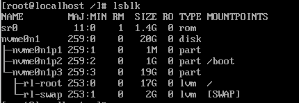

## I/O Stack Layer

```
[ User Space ]       (1) Application (ex: MySQL, dd, cp)
      |
-------------------- (2) System Call Interface (open, read, write) --------------------
      |
[ Kernel Space ]     (3) VFS (Virtual File System) : 추상화된 파일 인터페이스
      |                  |--> [ File System ] (XFS, Ext4) : 데이터 구조화/저널링
      |
                     (4) Generic Block Layer : 모든 블록 장치의 공통 처리 레이어
                         |--> [ I/O Scheduler ] (mq-deadline, Kyber) : 요청 순서 최적화
      |
                     (5) Device Mapper : LVM, RAID, 암호화 등의 논리적 매핑
      |
                     (6) SCSI/NVMe Middle Level : 프로토콜별 드라이버 레이어
      |
-------------------- (7) Hardware Driver (HBA, NVMe Driver) ---------------------------
      |
[ Hardware ]         (8) Physical Storage (SSD, HDD, NVMe)
```



### Upper Layer - The File System Layer

- 목적 : **데이터를 어떻게 조직할 것인가**
- 범위 : (3) VFS - [File System] (XFS, Ext4)
- 데이터 단위 : 파일, 디렉토리, 바이트 스트림
- rocky 구조  
      - `MOUNTPOINTS` : `r1-root`는 `/`(루트)에, `nvme0n1p2`는 `/boot`에 마운트

### Middle Layer - The Logical Volume Management / Device Mapper

- 목적 : **공간을 어떻게 배치할 것인가** (볼륨 중심)
- 범위 : (5) Device Mapper (LVM, DM-Cache, DM-Crypt 등)
- 데이터 단위 : 논리적 블록, 익스텐트(Extents)
- rocky 구조  
      - `r1-root`, `r1-swap` : 물리 파티션 위에 구성된 LVM

### Lower Layer - The Generic Block Layer & Driver

- 목적 : **하드웨어를 어떻게 식별하고 데이터를 보낼 것인가** (장치 중심)
- 범위 : (4) Generic Block Layer, (6) Middle Level, (7) Driver
- 데이터 단위 : 섹터(Sector), 블록(Block), BIO 구조체
- rocky 구조  
      - `nvme0n1` : NVMe 인터페이스를 통해 인식된 물리 디스크  
      - `nvme0n1p3` : GPT 파티션 테이블을 통해 나누어진 세 번째 구역
