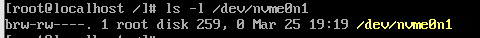
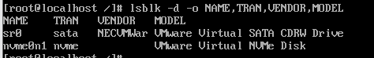
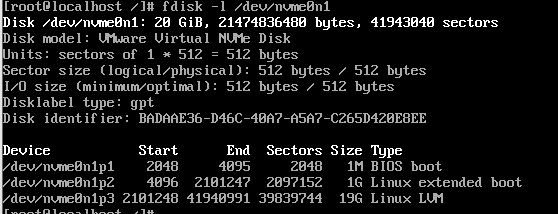
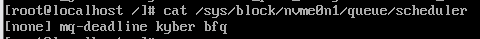

# 1. 블록 장치 추상화 및 식별 원리

## 1-1. [커널의 블록 레이어 구조와 `udev` 장치 관리자의 동작 방식](https://wiki.gentoo.org/wiki/Udev/ko)

### 리눅스 커널 블록 레이어 추상화 및 `udev` 기반 장치 관리 아키텍처

```
========================= [ 커널 공간 (Kernel Space) ] =========================
[ 1. 하드웨어 ] ----> [ 2. 커널 드라이버 ] ----> [ 3. 블록 레이어 (Block Layer) ]
 (SSD/HDD/USB)       (하드웨어 제어)         (I/O 스케줄링 및 객체화)
                                                     |
    +------------------------------------------------+
    |  (블록 장치 구조체 gendisk 등록)
    ▼
[ 4. Kobject / Sysfs ] ------------------------ [ 5. Netlink Socket ]
 (장치 정보의 데이터화)                          (uevent 신호 생성 및 발송)
 ( /sys/block/... )                                  |
=====================================================|==========================
                                                     | (경계선: 신호 전달)
======================== [ 사용자 공간 (User Space) ]  |  ========================
                                                     ▼
[ 7. 실사용 ] <------- [ 6-2. udev 결과물 ] <--- [ 6-1. udevd 데몬 ]
 (Mount 완료)         - /dev/sda 생성          (규칙 엔진 가동) <--- [ rules.d ]
 (데이터 읽기/쓰기)     - 권한/심볼릭링크 부여     (이벤트 수신/해석)
                     - 스크립트 실행

  <--- 실제 사용 --->   <--------------------- udev의 과정 --------------------->
================================================================================
```

1. **하드웨어 감지 및 인터럽트**

- CPU가 하드웨어로부터 인터럽트 신호를 받아 장치를 담당하는 커널 드라이버 호출

2. **장치 인식 및 기본 구조체 생성**

- 커널 내부에서 장치를 대표하는 `gendisk` 구조체 생성

3. **블록 레이어의 요청 큐(Request Queue) 할당**

- I/O 스케줄러를 설정하여 장치에 데이터를 쓸 대 어떤 순서로 보낼지 결정  
- 데이터를 주고받을 큐 생성

4. **Kobject 등록 및 Sysfs 노출**

- 모든 준비가 끝나면 커널이 장치를 Kobject(Kernel Object) 시스템에 등록하고 /sys/block/sda와 같은 경로에 장치의 정보를 텍스트 파일로 노출

5. **커널 이벤트 발생**

- 새로운 하드웨어 감지 시 리눅스 커널이 `uevent` 신호 전송

6. **`udevd` 데몬 수신**

- 백그라운드에서 실행중인 `udevd`가 신호를 가로챔

7. **규칙(Rules) 적용**

- `/etc/udev/rules.d/` 디렉토리에 저장된 규칙 파일들 확인

8. **결과 반영**

- 규칙에 따라 자치 노드를 생성하거나 권한을 설정하고, 지정된 명령 수행

### 커널 블록 레이어 구조

- Bio 구조체 (I/O 요청의 최소 단위)  
  - 어떤 디스크의 어느 섹터에, 어떤 데이터에 데이터를 읽거나 쓰라는 정보가 담겨 있음  
    <br/> -> 이 bio들을 효율적으로 처리하기 위해 묶거나 순서 변경

- Request Queue  
  - 인접한 섹터에 대한 여러 요청을 하나의 커다란 요청으로 합쳐 오버헤드를 줄임  

- I/O 스케줄러  
  - 큐에 쌓인 요청을 어떤 순서로 처리할지 결정하는 알고리즘  
    - MQ-Deadline : 마감시간을 정해 요청 지연 방지  
    - BFQ (Budget Fair Queueing) : 프로세스 간의 공평한 대역폭 할당  
    - Kyber : 빠른 장치에서 지연 시간을 극도로 낮추기 위한 스케줄러  

### udev 동작 방식이 생긴 과정

- 과거 리눅스는 하드웨어를 꽂으면 **커널이 직접 이름을 고정**해서 붙임
  <br/>-> USB나 핫플러그 디스크 등장 : 같은 디스크여도 **어느 포트에 먼저 꽂는지에 따라 이름이 변경**되어 시스템이 엉망이 됨
  <br/>=> **커널은 하드웨어만 감지하고, 이름은 사용자 공간의 `udev`가 규칙대로 붙임**

### udev의 특징

- **동적 관리** : 장치가 감지되 때만 `/dev`에 파일 생성
- **사용자 정의 이름** : 특정 USB를 꽂았을 때 항상 같은 이름으로 인식되도록 규칙 정의
- **이벤트 실행** : 장치 연결 시 특정 스크립트나 프로그램 자동 실행

## 1-2 Major/Minor Number와 `/dev` 노드 생성 메커니즘

### `/dev` (Device)

- 시스템에 연결된 모든 물리적, 가상 하드웨어 장치 노드들이 위치하는 디렉토리

### `/dev/sda`

- `sd` (SCSI Disk) : 대부분의 블록 장치에 공통으로 사용  
- `a` (Device Index) : 장치가 인식된 순서대로 알파벳 추가  
  - 첫 번째 디스크 : `sda`  
  - 두 번째 디스크 : `sdb`  
- `1` (Partition Number) : 디스크 내부의 파티션 번호  

### 장치 식별 체계


- Major Number : 장치의 종류 (259 : NVMe의 Major Number)  
- Minor Number : 해당 종류 내의 개별 장치 (0 : 첫 번째 구역)  

### 노드 생성 및 연결 메커니즘

1. 커널 드라이버가 장치 등록(`register_bikdev`)

- X 번(Major Number)을 사용하는 블록 장치 드라이버 라고 신고
  <br/>-> 커널이 해당 Major Number과 드라이버의 함수 포인터(`fops`)를 매핑 테이블에 저장 (`uevent` 발행)

2. `udev` : 정보 수집 + `mknod` 실행

- `mknod` 시스템 콜 : `uevent` 발생 시 메시지에 담긴 Major/Minor 번호 확인
  - ex) `mknod /dev/sda b 8 0`
    - `b` : 블록 장치(Block Device) 임을 명시
    - `8` : Major Number
    - `0` : Minor Number (첫 번째 장치)

3. 파일 시스템과 드라이버의 연결

- `/dev/sda` 파일 : (Major Number, Minor Number) 이라는 정보만 담은 특수 파일(Inode)

## 1-3. 스토리지 인터페이스별(SCSI, NVMe) 드라이버 및 큐(Queue) 처리 방식

### SCSI/SATA (Legacy)

- 물리적인 헤드 동작 -> 데이터 요청을 하나씩 처리하는 것이 일반적
- 병목 현상 : 여러 CPU 코어가 동시에 데이터를 요청 시 Lock 발생
- 명령어 제한 : 한 번에 보낼 수 있는 명령어 최대 32개 제한

### NVMe (Mordern)


- 구조 : CPU 코어당 독립적인 큐를 가짐
- 병렬 처리 : 각 코어가 자신의 큐에 직접 명령 -> 수많은 I/O 가능
- 명령어 수 : 최대 64,000개의 큐 생성 가능

# 2. 파티션 테이블 아키텍처 (MBR vs GPT)

## 2-1. 디스크 섹터 구조와 파티션 테이블 메타데이터 저장 영역


### 구역을 나누는 이유

- 과거에는 하드디스크 전체를 하나로 이용
  <br/> -> 운영체제 파일과 사용자 데이터를 분리하고 여러 운영체제를 설치하기 위해 구역 정리 필요

### 아키텍쳐 구조 (MBR vs. GPT)

- MBR (Master Boot Record)  
  - 전통적인 방식  
  - 디스크의 가장 첫 번재 섹터에 모든 정보를 다 넣음  
  - 한계 : 공간이 좁아 파티션을 딱 4개만 생성 가능  

  ```
  [ MBR 구조 (LBA 0) ]
  +-----------------------------------+----------------+-----------+
  | Boot Code (446B)                  | Partition Table| Magic Num |
  | (부트로더 위치 정보)                | (16B x 4)      | (55 AA)   |
  +-----------------------------------+----------------+-----------+
  ```

- [GPT (GUID Partion Table)](https://learn.microsoft.com/en-us/troubleshoot/windows-server/backup-and-storage/guid-partitioning-table-disk-faq)
  - 현대적 방식
  - 디스크의 뒷부분까지 넓게 사용 가능 -> 많은 파티션(기본 128개) 지원
  ```
  [ GPT 구조 (LBA 0 ~ 33) ]
  +---------+---------+-----------+----------------------------+
  | Protective| Primary | Partition | Actual Data Partition      |
  | MBR     | Header  | Entries   | (Files, Folders...)        |
  +---------+---------+-----------+----------------------------+
  ```

## 2-2. GPT의 이중화

### GPT 이중화 도입 이유

- 단일 장애점(SPOF) 극복 -> 복제 + 자가 진단 가능

### 데이터 보호 메커니즘

- 이중화 : 디스크의 맨 앞 + 맨 마지막 섹터에 같은 파티션 테이블 저장
  <br/>-> 앞부분이 깨지면 뒷부분을 보고 자동 복구
- CRC32 체크섬 : 헤더 정보가 변조되었거나 깨졌는지 확인
  <br/> -> 부팅 시 이 값이 맞지 않으면 커널이 파티션 테이블이 손상됨을 인지

## 2-3. 커널이 파티션 테이블을 메모리에 로드하는 과정 (`partprobe` 원리)

### 로드 과정이 필요한 이유

- 커널은 성능을 위해 매번 디스크를 확인하지 않고, 부팅 때 읽어둔 메모리 속의 복사본만 보고 판단
  <br/>-> 디스크 수정 시 커널이 이전 정보를 들고 있으면, 새로 만든 파티션에 데이터를 쓰려 해도 커널이 거절

### `partprobe`의 동작원리

1. **동기화 요청** : `partprobe /dev/sda` 명령 입력
2. **커널 호출 (`ioctl`)** :` partprobe`는 커널에 `BLKRRPART`(Block Re-Read Partition Table) 라는 특수 신호 전송
3. **디스크 재판독** : 신호 받은 커널은 디스크의 맨 앞을 읽어 새 정보 업데이트
4. **장치 파일 생성** : 메모리 업데이트 커널이 udev에 알림 -> udev가 실제 접근 경로 생성

# 3. 스토리지 I/O 스케줄러와 최적화

## RHEL의 기본 I/O 스케줄러(`mq-deadline`, `kyber`, `none`)별 동작 알고리즘


### mq-deadline (RHEL 9 기본값)

- 원리 : 모든 요청에 마감기한 부여 - 읽기 요청은 보통 쓰기 요청보다 짧은 기한 부여
  <br/> -> 기한이 다 된 요청부터 먼저 처리하여 특정 요청이 무한정 기다리는 것을 방지

### Kyber (from Meta)

- 원리 : 지연 시간 모니터링
  <br/>-> 작업이 너무 오래 걸린다고 판단되면 스스로 처리 속도를 조절하여 전체 응답속도를 일정하게 유지
