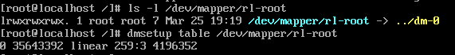

# 1. LVM의 뼈대와 메타데이터 구조

## 1-1. PV 헤더와 VG 메타데이터 영역(MDA)의 구조

### 도입 배경

- 소프트웨어만으로 디스크를 자유롭게 합치고 쪼개기 위해 도입

### LVM의 핵심 요소

- **PV** (Physical Volume, 물리 볼륨) : 실제 하드디스크나 파티션
- **VG** (Volume Group, 볼륨 그룹) : 여러 개의 PV르 하나로 합쳐놓은 커다란 가상 디스크 덩어리
- **LV** (Logical Volume, 논리 볼륨) : 커다란 VG에 사용자가 원하는 만큼 떼어내서 사용하는 가상 파티션

### PV와 VG의 내부 구조

```
[ 물리 볼륨 (PV) 전체 영역 ]
+-----------------------------------------------------------+
| 1. PV Label (Sector 0~1) : LVM 여부 (UUID, 식별자)      |
+-----------------------------------------------------------+
| 2. Metadata Area (MDA) : VG 설계도 제시"       |
|    - VG 이름, 생성 시간, 포함된 PV 목록, PE-LE 매핑 정보      |
+-----------------------------------------------------------+
| 3. Data Area (PE 할당 영역) : 실제 데이터가 저장되는 칸들      |
|    [ PE 0 ] [ PE 1 ] [ PE 2 ] ... [ PE n ]                |
+-----------------------------------------------------------+
```

- PV label : 디스크의 식별자
  - LVM의 시그니처 문자열 + 장치 고유 번호(UUID)
  - 시스템 부팅 시 커널이 이 라벨을 보고 LVM 소속 여부 판단
- MDA (Metadata Area) : VG의 모든 설정값 포함
  - VG에 속한 모든 PV에 복사되어 저장

## 1-2. 메타데이터 동기화 원리

### 동작 원리

- 원자적 업데이트
  - 사용자가 볼륨 크기를 늘리면, LVM은 VG에 속한 모든 PV의 MDA영역 동시에 업데이트

- 순차적 기록
  - 먼저 새로운 설계도를 빈 공간에 쓰고, 성공하면 기존 설계도를 '구버전'으로 밀어내고 새 버전을 '활성' 상태로 변경 (트랜잭션 방식)

## 1-3. LVM 필터링 메커니즘

### 필터링 필요 이유

- 현대 서버에서는 안정성을 위해 하나의 디스크에 두 개의 케이블 연결
  <br/> -> 리눅스가 하나의 디스크를 두 개로 오해 가능
  <br/> -> LVM이 두 장치를 모두 PV로 인식해버리면 메타데이터 충돌

### 필터링 동작 방식

- `/etc/lvm/lvm.conf` 파일의 `filter` 설정 확인

# 2. 주소 변환 메커니즘

## 2-1. PE(Physical Extent)와 LE(Logical Extent)의 개념

Extent : LVM 아키텍쳐에서 데이터를 나누는 가장 작은 단위 (4mb)

### PE (Physical Extent)

- 물리적 디스크(PV)를 일정한 크기로 나눈 실제 블록

### LE (Logical Extent)

- 논리적 볼륨(LV) 관점에서 바라본 블록 단위

### PE와 LE의 관계

- 사용자가 데이터를 작성할 때는 LE에 작성
- LVM 엔진은 실제 물리 장치의 PE에 할당
  - 일반적으로 1:1 매핑
  - RAID 1 같은 경우 하나의 LE가 여러 개의 PE를 가질 수 있음

## 2-2. Extent 매핑 테이블 동작

사용자가 파일에 접근하려 할 때, OS는 LV의 몇 번째 블록(LE)을 가져오라고 명령하여 LVM이 매핑 테이블을 참조하여 주소 변환



### 동작 순서

1. 요청 수신

- 파일 시스템이 특정 LE 번호에 대한 읽기/쓰기 요청 전송

2. 테이블 조회

- 볼륨 그룹(VG) 메타데이터에 저장된 매핑 테이블을 확인

3. 주소 변환

- 논리적 오프셋을 물리적 디스크의 절대 주소(섹터 번호)로 계산하여 변환

4. I/O 실행

- 최종적으로 계산된 물리 주소로 데이터 전송

## 2-3. Device Mapper(dm)와 LVM 통신

### 역할 분담

- LVM (User Space Tools)
  - 사용자의 명령(lvcreate, lvextend 등)을 받아 어떻게 매핑할지의 전략 구축
    - 해당 정보는 VG 메타데이터에 저장
- Device Mapper (Kernal Space)
  - LVM이 세운 전략을 토대로 실제 I/O 요청을 가로채 주소 리다이렉션 진행

### 통신 과정

1. 설정 단계

- 사용자가 LVM 명령어 실행 시 LVM 도구가 `/dev/mapper` 경로에 가상 장치를 생성하고 매핑 정보를 커널의 Device Mapper에 전달

2. 실행 단계

- 응용 프로그램이 `/dev/vg_name/lv_name`에 데이터를 쓰면, 커널의 Devicde Mapper가 이를 가로챔

3. 변환

- Device Mapper는 커널 내부에 로드된 매핑 테이블을 보고, 실제 하드디스크 드라이버로 I/O 요청 전달

# 3. 유연한 공간 관리와 스냅샷

## 3-1. lvextend와 온라인 매핑 갱신

### 도입 배경

- 과거 : 파티션 크기를 키우려면 컴퓨터를 끄고 리포맷 필요
  <br/>-> LVM은 매핑 테이블만 수정하면 서비스 중단없이 용량 증대 가능

### 동작 원리

1. 명령 하달

- 사용자가 `lvextend -L +10G /dev/vg01/lv01`을 실행

2. 메타데이터 업데이트

- LVM 관리자가 VG 설계도(MDA)를 수정
  <br/>-> 남는 물리 조각(PE) 10GB를 해당 논리 볼륨(LV)에 할당

3. Device Mapper 갱신

- 커널의 Device Mapper 모듈이 "이제 이 LV는 더 넓은 영역을 가리킨다"라고 실시간으로 매핑 테이블을 업데이트

4. 파일 시스템 인지

- 상위 레이어인 파일 시스템(XFS 등)에 변화를 알려주면(`xfs_growfs`), 파일 시스템이 늘어난 공간을 즉시 사용하기 시작

## 3-2. Copy-on-Writer(CoW) 방식의 스냅샷

### 동작 원리

1. 스냅샷 생성

- 처음엔 실제 데이터를 복사하지 않고, 원본을 가리키는 **'포인터'**만 생성

2. 데이터 변경 발생

- 원본 데이터에 새로운 내용이 쓰여지려고 하면, LVM이 잠시 멈추고 **'원래 있던 데이터'**를 스냅샷 전용 공간(Snapshot COW partition)으로 복사

3. 변경 완료

- 복사가 끝난 후에야 원본에 새 데이터를 작성

4. 조회

- 사용자가 스냅샷을 열면, 변하지 않은 부분은 원본에서 읽고, 변한 부분은 스냅샷 공간에서 읽어와서 '과거 시점'을 재현

## 3-3. Thin Provisioning과 Over-provisioning

### Thin Provisioning

- 사용자에게 "너 1TB 가졌어"라고 가짜 수표를 발행
- 실제 물리 공간은 사용자가 파일을 저장하는 순간에만 조금씩 사용 (Chunk 단위 할당)

### Over-provisioning

- 실제 물리 디스크가 100GB인데, 논리적으로는 500GB를 생성해서 운영하는 방식

# 4. 데이터 무결성과 장애 복구

## 4-1. LVM 아카이브 및 백업 파일

### 도입 배경

- LVM 설정을 변경하다가 실수로 볼륨을 삭제하거나 설정을 잘못 건드렸을 때, 이전의 '정상적인 설계도'로 돌아갈 방법이 필요

### 동작 방식

- Backup (`/etc/lvm/backup`): 현재 시스템에서 사용 중인 최신 VG 설계도를 텍스트 파일로 보관

- Archive (`/etc/lvm/archive`): 설정 변경 명령(vgs, lvextend 등)이 실행되기 직전의 과거 설계도들을 번호를 매겨 차곡차곡 저장

## 4-2. pvmove의 데이터 미러릴 메커니즘

### 동작 원리 : 임시 미러링

1. 임시 미러 생성

- 데이터를 옮길 대상(PV) 사이에 임시 미러(Mirror) 계층 생성

2. 데이터 복제

- 백그라운드에서 데이터를 한 조각(Extent)씩 새 디스크로 복사

3. 동시 쓰기

- 복사 중에 발생하는 새로운 쓰기 요청은 원본과 대상 디스크 양쪽 모두에 기록하여 데이터 일관성을 유지

4. 연결 전환

- 모든 데이터가 복사되면 원본 디스크와의 연결을 끊고 새 디스크를 주 장치로 승격

## 4-3. 장애 복구 시나리오

### 핵심 원리

- 메타데이터만 살리면 데이터는 돌아온다

### 주요 복구 단계

1. 설계도 확인

- `vgcfgrestore --list` 명령으로 `/etc/lvm/archive`에 있는 과거의 정상적인 설계도 목록을 확인

2. 설계도 주입

- `vgcfgrestore` 명령을 사용하여 깨진 디스크의 MDA 영역에 정상적인 설계도를 다시 작성

3. 활성화

- 설계도가 복구되면 vgchange -ay 명령으로 볼륨 그룹을 다시 활성화하여 상위 레이어(파일 시스템)가 데이터 조회 가능
