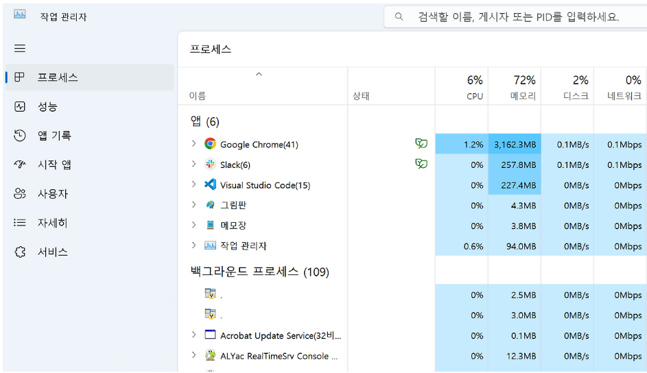

# Week 4


# 4주차 : 서비스 관리와 프로세스 제어

<aside>

systemd 구조와 서비스 관리 개념 이해, 서비스 시작·중지·재시작·자동 실행 설정(systemctl), 프로세스 조회 및 제어(ps, top, kill, nice), 작업 스케줄링(cron, at), cgroup 기반 자원 제어 기초

</aside>

## 1. 프로세스와 서비스(운영체제)의 차이

### 프로세스

- 실행 단위. 메모리에 적재되어 CPU에 의해 실행되는 컴퓨터 프로그램.



작업관리자에서 프로세스 확인 가능!

- 각 프로세스는 고유한 프로세스 ID를 가지고, 운영체제는 프로세스 간 자원공유 관리
- 눈에 보이는 프로세스: foreground 프로세스 = fg
    - 인터넷, 카카오톡, 메모장, 그림판 등
- 눈에 보이지 않는 프로세스 : background 프로세스 = bg
    - 백신 프로그램, 그래픽 드라이버, 마이크 드라이버 등

### 서비스

- 백그라운드에서 실행되는 응용 프로그램.
- 윈도우 OS에서는 백그라운드에서 실행되는 응용 프로그램을 service라고 부르고, 유닉스(리눅스) OS에서는 daemon이라고 부름.


작업관리자에서 찾아볼 수 있음

즉, 서비스도 결국 프로세스로 실행되지만, 모든 프로세스가 서비스인 것은 아닌 관계

주로 데몬 형태로 동작. 

- **데몬**: 유닉스 운영체제에서 부팅 때 자동으로 켜져, 사용자 제어 없이 백그라운드에서 계속 실행
- 터미널 직접 연결 없이 백그라운드에서 계속 실행
- 꺼지지 않고 실시간으로 클라이언트와 통신 지속. 백그라운드 프로세스 범주 안에 속함.
    - 사용자의 요청을 기다리고 있다가 요청이 발생하면 이에 적절히 대응하는 리스너와 같은 역할.
    - 데몬의 어원 : 유령은 걷지 않고 항상 떠 있다 → 백그라운드에서 조용하게 항상 수행
    - 항상 돌아가고 있어야 하는 웹서버에 적함 → 일반적으로 서버에서 주로 사용 EX. httpd

출처: [https://it-serial.tistory.com/entry/Linux-프로세스란-데몬-vs-서비스](https://it-serial.tistory.com/entry/Linux-%ED%94%84%EB%A1%9C%EC%84%B8%EC%8A%A4%EB%9E%80-%EB%8D%B0%EB%AA%AC-vs-%EC%84%9C%EB%B9%84%EC%8A%A4) / [https://btcd.tistory.com/1635](https://btcd.tistory.com/1635)

## 2. 시스템 부팅 후 서비스가 자동으로 올라오는 구조

- 시스템 부팅 → 커널 실행 → 사용자 공간 초기화 작업
- 초기화 담당 첫번째 프로세스:  `init` 계열 프로세스 실행
    - 현대 리눅스 배포판에서는 대부분 `systemd` 사용

### systemd

- 단순 부팅 도구가 아닌, 시스템 초기화와 서비스 관리를 함께 담당하는 핵심 구성 요소
    - 어떤 서비스를 부팅 시 자동 실행할지 결정, 서비스 간 의존관계 관리, 상태 추적, 필요하다면 재시작까지 수행
- 필요한 서비스 자동 실행

### `init`, `systemd`가 필요한 이유

Init은 서비스를 실행한다. 실행된 서비스는 항상 Init만을 부모 프로세스로 가진다. 따라서 일반적으로 우리가 쉘에서 프로그램 실행 / 종료를 하듯이 해당 서비스를 종료하거나, 재시작하기 까다롭다. (nohup, 시그널 등을 활용하면 가능하기는 하다.) 

또한 쉘 프로그램에서는 서비스 프로그램의 로그나 상태 등을 알 수 없다. (쉘에서 서비스의 로그를 알 수 없는 이유는 일반적으로 로그를 출력하는 stdout / stderr에 대한 파이프 라인이 연결되어 있지 핞기 때문이다. 

그렇기 때문에 init이 서비스의 생명주기 관리 및 모니터링을 한다.

- 부팅 시 필수 서비스 실행
- 서비스 상태 관리
- 서비스 간 의존성 처리
- 자동 실행 관리
- 장애 대응 기반 제공

### 실습

```bash
ps -p 1 -o pid,ppid,cmd //PID 1 프로세스 확인 (systemd 여부 확인)
```

---

## 3. `systemd`와 `systemctl`

### `systemd`의 역할

<aside>

**systemd** 는 Linux 운영 체제용 시스템 및 서비스 관리자입니다. 이는 SysV init 스크립트와 역호환되도록 설계되었으며 부팅 시 시스템 서비스의 병렬 시작, 필요에 따라 데몬 활성화 또는 종속성 기반 서비스 제어 논리와 같은 여러 기능을 제공합니다. Red Hat Enterprise Linux 7에서 systemd는 Upstart를 기본 init 시스템으로 대체합니다.

</aside>

- 시스템 초기화
- 서비스 시작 및 종료 관리
- 서비스 상태 추적
- 자동 실행 관리
- 자원 제어 연계
- 로그 관리 연계
- 관리 대상을 unit이라는 단위로 처리. (unit : systemd가 다루는 모든 객체의 기본 단위)


각각의 서비스들을 이벤트 방식으로 관리하는 방법. 이 방법은 각 서비스들이 실행되는 조건(예를 들어서 "로깅서비스가 실행되려면, 마운트 서비스가 완료되어야 한다."와 같은 조건)이 충족될 때, 서비스를 실행한다. 따라서 실행순서가 정해진 config 파일 대신, 각 서비스의 실행 조건을 기록한 여러 파일들의 집합으로 구성된다. 

구현하기 어렵기는 하지만, 이 방법은 서비스 개수가 많더라도 새로운 서비스를 추가할 때 사이드 이펙트가 없거나 적다. 또한 조건을 만족한 서비스들을 병렬적으로 처리할 수 있어 속도가 빠르다.

출처: [https://www.kernelpanic.kr/17](https://www.kernelpanic.kr/17)

### `unit` 개념

- `systemd`가 관리하는 기본 단위

### 주요 unit 종류

- `service`: 서비스 단위
- `target`: 시스템 목표 상태
- `socket`: 소켓 기반 활성화 단위
- `timer`: 시간 기반 실행 단위

### `service`와 `target`

- **service**: 실제 서비스 실행 단위
    - 예: `nginx.service`, `cron.service`
- **target**: 여러 unit 묶음
    - 예: `multi-user.target` (텍스트 기반 다중 사용자 환경) , `graphical.target` (GUI까지 포함된 환경)

### `systemctl` 주요 명령어

```bash
systemctl status <서비스명> //서비스 상태 조회 (실행 여부, PID, 로그 확인)
systemctl start <서비스명> //현재 즉시 서비스 실행(지금상태와 관련)
systemctl stop <서비스명> //서비스 즉시 중지
systemctl restart <서비스명> //서비스 재시작 (stop → start)
systemctl reload <서비스명> //서비스 설정만 다시 로드 (프로세스 재시작 없음)
systemctl enable <서비스명> //다음 부팅부터 자동 실행되도록 등록(부팅 이후 동작과 관련된 설정)
systemctl disable <서비스명> //부팅 시 자동 실행 해제
systemctl is-enabled <서비스명> //자동 실행 설정 여부 확인
```

### 핵심 구분

- `start`: 현재 서비스 실행
- `stop`: 현재 서비스 중지
- `restart`: 서비스 재시작
- `enable`: 부팅 시 자동 실행 설정
- `disable`: 부팅 시 자동 실행 해제

### 실습

```bash
systemctl list-units --type=service //현재 실행 중인 서비스 목록 조회
systemctl status cron //특정 서비스 상태 확인
systemctl is-enabled cron //부팅 시 자동 실행 여부 확인
```

```bash
sudo systemctl stop cron //서비스 중지
sudo systemctl start cron //서비스 시작
sudo systemctl restart cron //서비스 재시작
systemctl status cron //변경 후 상태 확인
```

```bash
sudo systemctl disable cron //부팅 시 자동 실행 해제
systemctl is-enabled cron //disable 적용 여부 확인
sudo systemctl enable cron //부팅 시 자동 실행 설정
systemctl is-enabled cron //enable 적용 여부 확
```

---

## 4. 프로세스 조회와 제어

### 프로세스란?

- 실행 중인 프로그램이라는 가장 기본적인 실행 단위
    - 고유한 PID 가짐. 대부분 어떤 부모 프로세스에 의해 생성 → PPID도 함께 존재. → PPID를 통한 관계 확인 가능

### foreground / background

- **foreground**: 터미널과 직접 연결된 실행 방식
- **background**: 뒤에서 실행되는 방식

### 실습

```bash
sleep 100 //forground 실행
sleep 100 & //background 실행
```

- foreground 실행 확인
- background 실행 확인

### 프로세스 확인

## `ps`

- 현재 실행 중인 프로세스 조회 명령어

```bash
ps // 현재 셸 기준 프로세스 확인
ps -ef // 전체 프로세스 상세 조회
ps aux //CPU, 메모리 사용량 포함 조회
```

### `top`

- 실시간 프로세스 상태 확인 도구
- CPU 사용량 확인
- 메모리 사용량 확인
- 자원 많이 사용하는 프로세스 확인

```bash
top
```

### `kill`과 signal

- `kill`: 프로세스 종료 전용 명령어가 아니라 signal 전달 명령어

### 대표 signal

- `SIGTERM (15)`: 정상 종료 요청
- `SIGKILL (9)`: 강제 종료
- `SIGSTOP`: 일시 중지
- `SIGCONT`: 재개

```bash
kill <PID> //기본 종료 요청 (SIGTERM)
kill -15 <PID> //정상 종료 요청 (명시적 SIGTERM)
kill -9 <PID> //기본 종료 요청 (SIGTERM)
```

- 운영에서는 보통 정상 종료 요청부터 수행, 반응이 없을 때만 강제 종료 사용.
- kill -9부터 바로 사용은 지양해야 한다.

### `nice`

- CPU 우선순위 조정 명령어
- nice 값 증가 = 우선순위 하락 (시스템 자원을 다른 프로세스에 더 양보하는 방향)
- CPU 양보 정도 조정

```bash
nice -n 10 sleep 300 & //낮은 우선순위로 프로세스 실행
ps -o pid,ni,cmd -C sleep //nice 값 확인
```

```bash
renice 5 -p <PID> //이미 실행중인 프로세스 우선순위 변경에는 renice 사용 가능
```

---

## 5. 작업 스케줄링

### `cron`

- 반복 실행 목적의 스케줄링 도구
- 백업, 로그 정리, 주기적 상태 점검, 배치 작업 실행등에 활용

### 기본 형식

```
분 시 일 월 요일 명령어
```

### 예시

```
*/2 * * * * echo "cron test $(date)" >> /tmp/cron_test.log //2분마다 명령어 실행
```

### 관련 명령어

```bash
crontab -e //작업 등록 및 수정
crontab -l //현재 등록된 작업 확인
```

### `at`

- 1회성 작업 예약 도구
- 특정 시점 한 번 실행 목적 ex) 10분 뒤 임시 작업 실행, 일정 시간 뒤 재부팅, 특정 시점 파일 정리

```bash
at now + 1 minute //1분 뒤 실행할 작업 등록
echo "at test $(date)" >> /tmp/at_test.log //실행할 명령 입력
```

```bash
atq //예약된 at 작업 확인
atrm <작업번호> //예약 작업 삭제
```

### 운영 활용 예시

- `cron`: 주기적 백업
- `cron`: 로그 정리
- `cron`: 헬스체크 스크립트 실행
- `at`: 일정 시간 뒤 임시 작업 실행
- `at`: 특정 시점 재부팅 예약

확인

```bash
cat /tmp/cron_test.log //실행 결과 확인
```

- cron환경은 일반 셸 환경과 다를 수 있기 때문에 실제 사용 시에는 절대경로를 사용해야 한다.

---

## 6. `cgroup` 기반 자원 제어 기초

### 자원 제한이 필요한 이유

- 서버환경에서는 하나의 서비스가 CPU나 메모리를 과도하게 사용하면 다른 서비스까지 영향 받을 수 있음 → 자원 제한 기능 필요
    - 특정 서비스의 CPU 과다 사용 방지
    - 메모리 독점 방지
    - 디스크 IO 과부하 방지
    - 여러 서비스 간 자원 분리 필요성
    - 안정적인 윤영 환경 유지 필요성

### `cgroup` 개념

- control groups의 약자
- 프로세스 그룹 단위 자원 관리 기능
- CPU, 메모리, IO 사용량 추적 및 제한 기능

### `systemd`와 `cgroup`의 관계

systemd와 cgroup은 분리된 개념 x 연결된 구조.

- `systemd`: 서비스 단위 프로세스 관리.
- `cgroup`: 자원 단위 관리
- `systemd`가 서비스별 프로세스를 내부적으로 `cgroup`으로 묶어 자원 사용 추적, 제한

>> 서비스 관리가 `systemctl` 수준에서 끝나는 것이 아니라, 실제 자원 제어까지 이어지는 구조

### 6.4 자원 제한 예시

- `CPUQuota`: CPU 사용 비율 제한
- `MemoryMax`: 최대 메모리 사용량 제한

### 대표적인 제한 설정

```
[Service]
CPUQuota=20% //CPU 사용 비율 제한
MemoryMax=200M //최대 메모리 사용량 제한
```

### 실습

```bash
systemctl show cron | grep -E 'CPU|Memory|Tasks'//관련 정보 확인 명령어
```

```bash
sudo systemctl edit cron //설정 예시 확인용 명령어
```

적용 명령어

```bash
sudo systemctl daemon-reload //systemd 설정 변경 반영
sudo systemctl restart cron //변경된 설정 적용
systemctl show cron | grep -E 'CPUQuota|MemoryMax' //적용된 자원 제한 값 확인
```

---

그러나 실제 운영 환경에서는 핵심 서비스에 무리한 제한 적용 시 장애 가능성 → 테스트 환경 중심 실습 권장

## 실습 인증


```jsx
user@localhost:~$ sudo systemctl stop crond
[sudo] user 암호: 
user@localhost:~$ systemctl status crond
○ crond.service - Command Scheduler
     Loaded: loaded (/usr/lib/systemd/system/crond.service; enabled; preset: en>
     Active: inactive (dead) since Sun 2026-03-29 22:36:37 KST; 46s ago
   Duration: 43min 59.433s
 Invocation: 33cdfe32bdd64e708bc43396e0384777
    Process: 1443 ExecStart=/usr/sbin/crond -n $CRONDARGS (code=exited, status=>
   Main PID: 1443 (code=exited, status=0/SUCCESS)
      Tasks: 1 (limit: 22612)
     Memory: 540K (peak: 3.5M)
        CPU: 113ms
     CGroup: /system.slice/crond.service
             └─3636 /usr/sbin/anacron -s

 3월 29 22:01:01 localhost.localdomain anacron[3636]: Anacron started on 2026-0>
 3월 29 22:01:01 localhost.localdomain anacron[3636]: Will run job `cron.monthl>
 3월 29 22:01:01 localhost.localdomain anacron[3636]: Jobs will be executed seq>
 3월 29 22:01:01 localhost.localdomain run-parts[3638]: (/etc/cron.hourly) fini>
 3월 29 22:01:01 localhost.localdomain CROND[3622]: (root) CMDEND (run-parts /e>
 3월 29 22:36:37 localhost.localdomain systemd[1]: Stopping crond.service - Com>
 3월 29 22:36:37 localhost.localdomain crond[1443]: (CRON) INFO (Shutting down)
 3월 29 22:36:37 localhost.localdomain systemd[1]: crond.service: Deactivated s>
 3월 29 22:36:37 localhost.localdomain systemd[1]: crond.service: Unit process >
 3월 29 22:36:37 localhost.localdomain systemd[1]: Stopped crond.service - Comm>

user@localhost:~$ sudo systemctl start crond
user@localhost:~$ systemctl status crond
● crond.service - Command Scheduler
     Loaded: loaded (/usr/lib/systemd/system/crond.service; enabled; preset: en>
     Active: active (running) since Sun 2026-03-29 22:38:20 KST; 5s ago
 Invocation: da75c1d780104f36bb717f2dd8cfaaa2
   Main PID: 3929 (crond)
      Tasks: 2 (limit: 22612)
     Memory: 1.4M (peak: 3.5M)
        CPU: 26ms
     CGroup: /system.slice/crond.service
             ├─3636 /usr/sbin/anacron -s
             └─3929 /usr/sbin/crond -n

 3월 29 22:38:20 localhost.localdomain systemd[1]: Started crond.service - Comm>
 3월 29 22:38:20 localhost.localdomain crond[3929]: (CRON) STARTUP (1.7.0)
 3월 29 22:38:20 localhost.localdomain crond[3929]: (CRON) INFO (Syslog will be>
 3월 29 22:38:20 localhost.localdomain crond[3929]: (CRON) INFO (RANDOM_DELAY w>
 3월 29 22:38:20 localhost.localdomain crond[3929]: (CRON) INFO (running with i>
 3월 29 22:38:20 localhost.localdomain crond[3929]: (CRON) INFO (@reboot jobs w>

user@localhost:~$ ^C
^C
suuser@localhost:~$ sudo systemctl restart crond
user@localhost:~$ systemctl status crond
● crond.service - Command Scheduler
     Loaded: loaded (/usr/lib/systemd/system/crond.service; enabled; preset: en>
     Active: active (running) since Sun 2026-03-29 22:38:53 KST; 9s ago
 Invocation: e13cd75f86fa42d194f8558efa4e1088
   Main PID: 3971 (crond)
      Tasks: 2 (limit: 22612)
     Memory: 1.4M (peak: 3.5M)
        CPU: 18ms
     CGroup: /system.slice/crond.service
             ├─3636 /usr/sbin/anacron -s
             └─3971 /usr/sbin/crond -n

 3월 29 22:38:53 localhost.localdomain systemd[1]: Started crond.service - Comm>
 3월 29 22:38:53 localhost.localdomain crond[3971]: (CRON) STARTUP (1.7.0)
 3월 29 22:38:53 localhost.localdomain crond[3971]: (CRON) INFO (Syslog will be>
 3월 29 22:38:53 localhost.localdomain crond[3971]: (CRON) INFO (RANDOM_DELAY w>
 3월 29 22:38:53 localhost.localdomain crond[3971]: (CRON) INFO (running with i>
 3월 29 22:38:53 localhost.localdomain crond[3971]: (CRON) INFO (@reboot jobs w>

user@localhost:~$ systemctl is-enabled crond
enabled
user@localhost:~$ sudo systemctl disable crond
Removed '/etc/systemd/system/multi-user.target.wants/crond.service'.
user@localhost:~$ systemctl is-enabled crond
disabled
user@localhost:~$ sudo systemctl enable crond
Created symlink '/etc/systemd/system/multi-user.target.wants/crond.service' → '/usr/lib/systemd/system/crond.service'.
user@localhost:~$ systemctl is-enabled crond
enabled
user@localhost:~$ sleep 300 &
[1] 4315
user@localhost:~$ ps -ef | grep sleep
user        4315    3808  0 22:40 pts/0    00:00:00 sleep 300
user        4318    3808  0 22:40 pts/0    00:00:00 grep --color=auto sleep
user@localhost:~$ kill 4315
[1]+  종료됨               sleep 300
user@localhost:~$ ps -ef | grep sleep
user        4326    3808  0 22:42 pts/0    00:00:00 grep --color=auto sleep
user@localhost:~$ nice -n 10 sleep 300 &
[1] 4329
user@localhost:~$ ps -o pid,ni,cmd -C sleep
    PID  NI CMD
   4329  10 sleep 300
user@localhost:~$ crontab -l
no crontab for user
user@localhost:~$ crontab -e
no crontab for user - using an empty one
crontab: installing new crontab
user@localhost:~$ cat /tmp/cron_test.log
cat: /tmp/cron_test.log: 그런 파일이나 디렉터리가 없습니다
user@localhost:~$ crontab -e
crontab: installing new crontab
Backup of user's previous crontab saved to /home/user/.cache/crontab/crontab.bak
user@localhost:~$ crontab -e
crontab: installing new crontab
Backup of user's previous crontab saved to /home/user/.cache/crontab/crontab.bak
[1]+  완료                  nice -n 10 sleep 300
user@localhost:~$ cat /tmp/cron_test.log
cron test 2026. 03. 29. (일) 22:46:01 KST
cron test 2026. 03. 29. (일) 22:48:01 KST
cron test 2026. 03. 29. (일) 22:50:01 KST
user@localhost:~$ sudo systemctl stop crond
[sudo] user 암호: 
죄송합니다만, 다시 시도하십시오.
[sudo] user 암호: 
죄송합니다만, 다시 시도하십시오.
[sudo] user 암호: 
user@localhost:~$ sudo systemctl stop crond
user@localhost:~$ cat /tmp/cron_test.log
cron test 2026. 03. 29. (일) 22:46:01 KST
cron test 2026. 03. 29. (일) 22:48:01 KST
cron test 2026. 03. 29. (일) 22:50:01 KST
cron test 2026. 03. 29. (일) 22:52:01 KST
user@localhost:~$ sudo systemctl start crond
user@localhost:~$ sudo systemctl start crond
user@localhost:~$ cat /tmp/cron_test.log
cron test 2026. 03. 29. (일) 22:46:01 KST
cron test 2026. 03. 29. (일) 22:48:01 KST
cron test 2026. 03. 29. (일) 22:50:01 KST
cron test 2026. 03. 29. (일) 22:52:01 KST
user@localhost:~$ systemctl status atd
● atd.service - Deferred execution scheduler
     Loaded: loaded (/usr/lib/systemd/system/atd.service; enabled; preset: enab>
     Active: active (running) since Sun 2026-03-29 21:52:38 KST; 1h 4min ago
 Invocation: 838ba9df423140bdb71e801d67779e78
       Docs: man:atd(8)
   Main PID: 1441 (atd)
      Tasks: 1 (limit: 22612)
     Memory: 324K (peak: 1.2M)
        CPU: 26ms
     CGroup: /system.slice/atd.service
             └─1441 /usr/sbin/atd -f

 3월 29 21:52:38 localhost.localdomain systemd[1]: Started atd.service - Deferr>
 3월 29 21:52:38 localhost.localdomain (atd)[1441]: atd.service: Referenced but>

user@localhost:~$ at now + 1 minute
warning: commands will be executed using /bin/sh
at Sun Mar 29 23:01:00 2026
at> echo "at test $(date)" >> /tmp/at_test.log
at> <EOT>
job 1 at Sun Mar 29 23:01:00 2026
user@localhost:~$ atq
user@localhost:~$ cat /tmp/at_test.log
at test 2026. 03. 29. (일) 23:01:34 KST
user@localhost:~$ atq
user@localhost:~$ systemctl show crond | grep -E 'CPU|Memory|Tasks'
MemoryCurrent=1564672
MemoryPeak=4005888
MemorySwapCurrent=0
MemorySwapPeak=0
MemoryZSwapCurrent=0
MemoryAvailable=2337480704
EffectiveMemoryMax=3797233664
EffectiveMemoryHigh=3797233664
CPUUsageNSec=195211000
TasksCurrent=2
EffectiveTasksMax=22612
CPUAccounting=yes
CPUWeight=[not set]
StartupCPUWeight=[not set]
CPUShares=[not set]
StartupCPUShares=[not set]
CPUQuotaPerSecUSec=infinity
CPUQuotaPeriodUSec=infinity
MemoryAccounting=yes
DefaultMemoryLow=0
DefaultStartupMemoryLow=0
DefaultMemoryMin=0
MemoryMin=0
MemoryLow=0
StartupMemoryLow=0
MemoryHigh=infinity
StartupMemoryHigh=infinity
MemoryMax=infinity
StartupMemoryMax=infinity
MemorySwapMax=infinity
StartupMemorySwapMax=infinity
MemoryZSwapMax=infinity
StartupMemoryZSwapMax=infinity
MemoryZSwapWriteback=yes
MemoryLimit=infinity
TasksAccounting=yes
TasksMax=22612
ManagedOOMMemoryPressure=auto
ManagedOOMMemoryPressureLimit=0
ManagedOOMMemoryPressureDurationUSec=[not set]
MemoryPressureWatch=auto
MemoryPressureThresholdUSec=200ms
LimitCPU=infinity
LimitCPUSoft=infinity
CPUSchedulingPolicy=0
CPUSchedulingPriority=0
CPUAffinityFromNUMA=no
CPUSchedulingResetOnFork=no
MemoryDenyWriteExecute=no
MemoryKSM=no
user@localhost:~$ 

```
