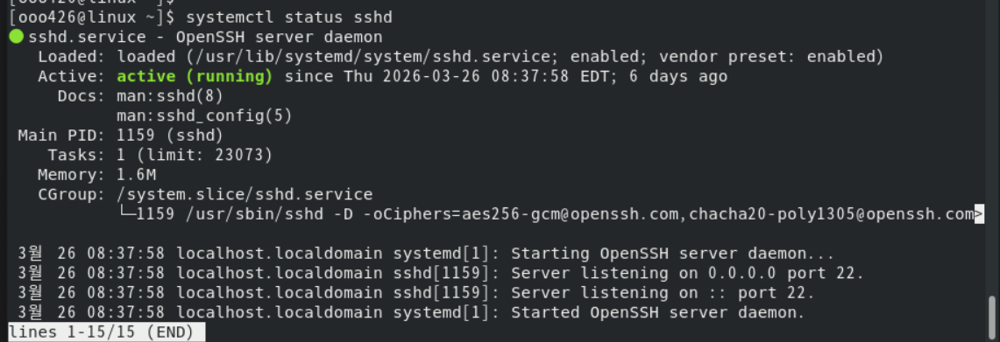
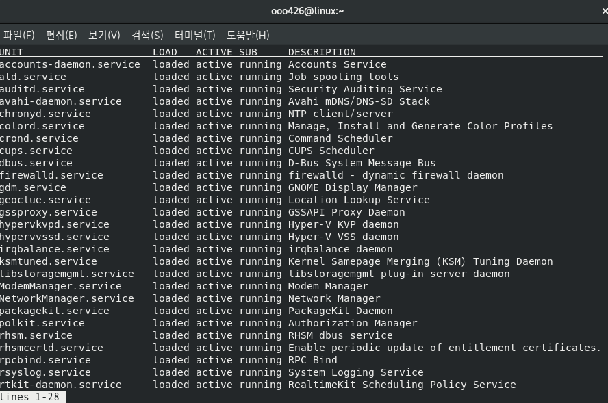
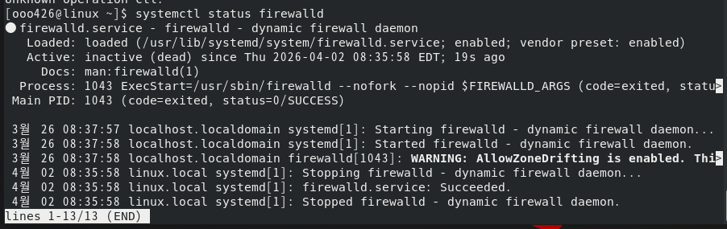
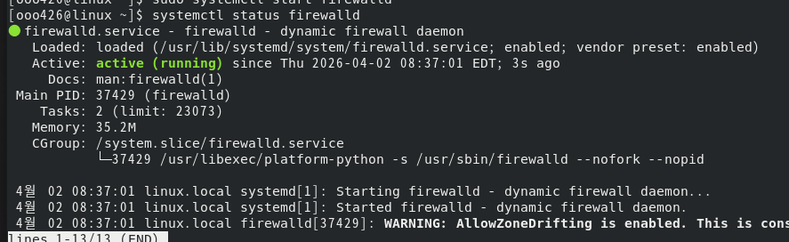
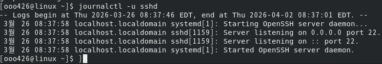
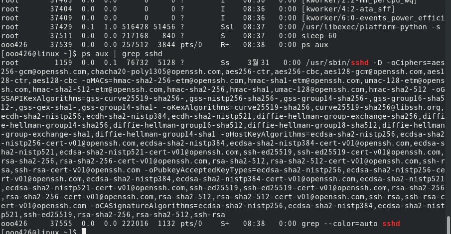
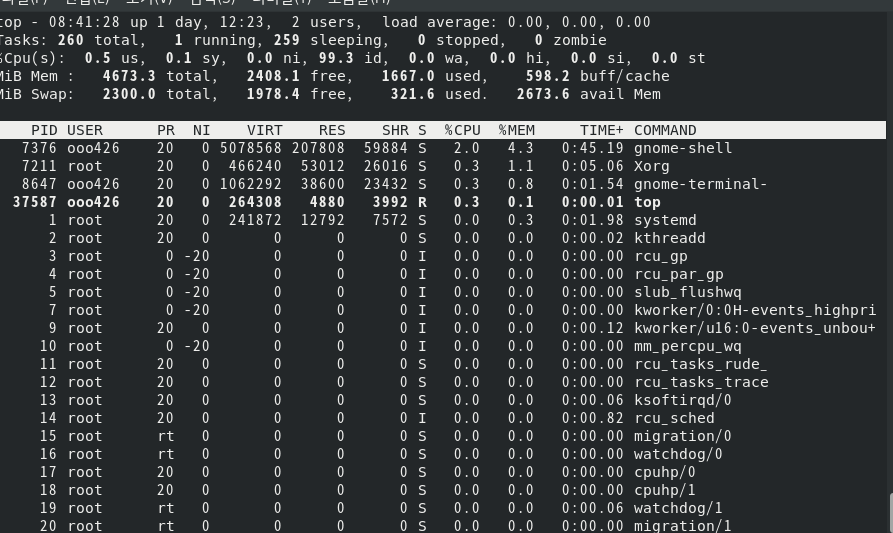
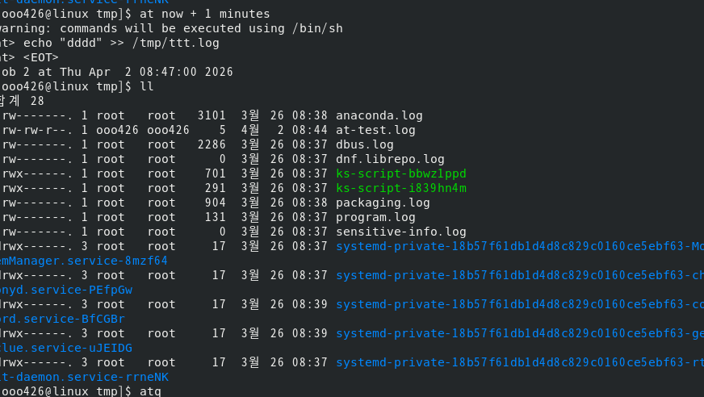
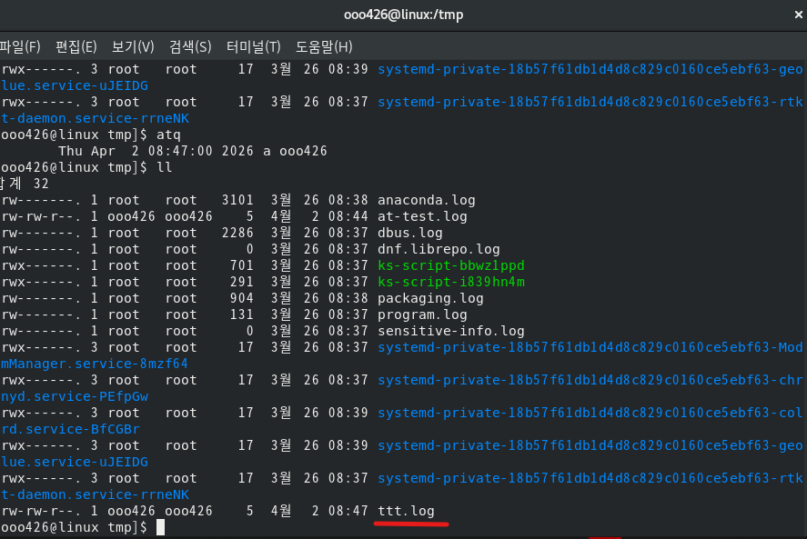
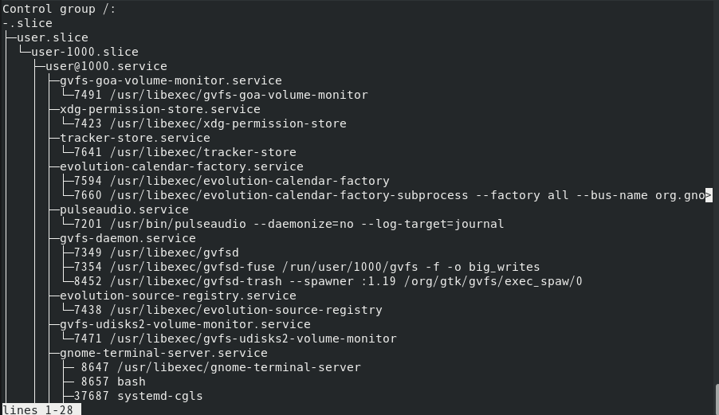

# Week 4. 서비스 관리와 프로세스 제어

## 1. 이번 주 학습 주제

- systemd 구조와 서비스 관리 개념 이해
- 서비스 시작/중지/재시작/자동 실행 설정 (systemctl)
- 프로세스 조회 및 제어 (ps, top, kill, nice)
- 작업 스케줄링 (cron, at)
- cgroup 기반 자원 제어 기초

## 2. 실습 환경

- Host OS: Windows 11
- Virtualization: Hyper-V
- Guest OS: RHEL 8 (Red Hat Enterprise Linux 8) GUI 설치
- 사용자 계정: `ooo426`

---

# Part 1. systemd 구조와 서비스 관리

## 3. 핵심 개념 정리

### 3-1. 리눅스 부팅과 init 시스템

리눅스가 부팅되면 커널은 가장 먼저 **PID 1** 프로세스를 실행한다. 이 프로세스가 나머지 모든 서비스(네트워크, 로그인, 원격 접속 등)를 시작시키는 역할을 한다. 이렇게 시스템의 첫 번째 프로세스로서 전체 서비스를 관리하는 프로그램을 **init 시스템**이라고 부른다.

### 3-2. SysVinit이란?

**SysVinit**(System V init)은 유닉스 시절부터 수십 년간 사용된 전통적인 init 시스템이다.

**동작 방식**:
- `/etc/init.d/` 디렉터리에 있는 쉘 스크립트를 **순서대로 하나씩** 실행
- 각 스크립트가 `start`, `stop`, `restart` 같은 인자를 받아 서비스를 제어
- **런레벨(runlevel)** 개념으로 시스템 모드를 구분 (0=종료, 3=CLI, 5=GUI 등)

**한계점**:
- 서비스를 하나씩 순차 실행하므로 **부팅이 느림**
- 서비스 간 의존성 관리가 어려움 (A가 B에 의존하면 수동으로 순서 지정)
- 스크립트마다 형식이 달라 관리가 복잡
- 서비스 상태 추적이 불확실 (죽은 프로세스를 감지하기 어려움)

```bash
# SysVinit 방식 (과거) - 참고용
/etc/init.d/sshd start     # 서비스 시작
/etc/init.d/sshd stop      # 서비스 중지
chkconfig sshd on           # 부팅 시 자동 시작
```

> 쉽게 말해, SysVinit은 "서비스별로 각각 쉘 스크립트를 만들어서 순서대로 실행하는 방식"이다.

### 3-3. systemd란?

**systemd**(System Daemon)는 SysVinit을 대체하기 위해 만들어진 **현대적인 init 시스템**이다. RHEL 7(2014년)부터 기본 init 시스템으로 채택되었다.

**핵심 역할**: 커널이 가장 먼저 실행하는 **PID 1 프로세스**로서, 시스템 부팅부터 서비스 관리, 로그 수집까지 모든 것을 통합 관리한다.

| 항목 | SysVinit (과거) | systemd (현재) |
|------|----------------|---------------|
| 서비스 시작 | 순차 실행 (느림) | **병렬 실행** (빠름) |
| 서비스 정의 | 쉘 스크립트 (`/etc/init.d/`) | **유닛 파일** (`.service`) |
| 의존성 관리 | 수동 순서 지정 | **자동 의존성 분석** |
| 서비스 제어 | `/etc/init.d/서비스 start` | **`systemctl start 서비스`** |
| 상태 추적 | 불확실 | **cgroup으로 정확한 추적** |
| 로그 관리 | 각 서비스마다 별도 | **journald로 통합** |
| 시스템 모드 | 런레벨 (0~6) | **Target** |

> 쉽게 말해, systemd는 "모든 서비스를 통일된 형식(유닛)으로 관리하고, 가능하면 동시에 시작시키는 시스템"이다.

### 3-4. 유닛(Unit)이란?

systemd가 관리하는 모든 대상을 **유닛(Unit)**이라고 부른다. 서비스뿐만 아니라 마운트, 타이머, 소켓 등도 모두 유닛이다. 각 유닛은 `.service`, `.target` 같은 확장자를 가진 설정 파일로 정의된다.

| 유닛 타입 | 확장자 | 설명 | 예시 |
|-----------|--------|------|------|
| **Service** | `.service` | 백그라운드 서비스(데몬) 관리 | `sshd.service`, `crond.service` |
| **Target** | `.target` | 유닛 그룹 (런레벨 대체) | `multi-user.target`, `graphical.target` |
| **Socket** | `.socket` | 소켓 활성화 (요청이 올 때 서비스 시작) | `cups.socket` |
| **Timer** | `.timer` | 시간 기반 서비스 활성화 (cron 대체) | `logrotate.timer` |
| **Mount** | `.mount` | 파일 시스템 마운트 관리 | `home.mount` |

> **서비스(Service)**: 유닛의 한 종류. 백그라운드에서 실행되는 프로그램(데몬)을 의미한다. SSH 서버(sshd), 방화벽(firewalld), 시간 동기화(chronyd) 등이 대표적이다.

> **Target**: 여러 유닛을 묶은 그룹이다. 예를 들어 `multi-user.target`은 "CLI 환경에서 필요한 서비스들의 묶음"이고, `graphical.target`은 "GUI까지 포함한 서비스들의 묶음"이다. 과거의 런레벨(runlevel)을 대체한다.

#### 유닛 파일 구조

유닛 파일은 `/usr/lib/systemd/system/`에 위치한다. 실제 sshd 서비스의 유닛 파일 구조를 살펴보면:

```ini
[Unit]
Description=OpenSSH server daemon          # 서비스 설명
After=network.target                       # network 이후에 시작

[Service]
Type=notify                                # 시작 완료를 systemd에 알림
ExecStart=/usr/sbin/sshd -D               # 실행 명령어
ExecReload=/bin/kill -HUP $MAINPID        # reload 시 실행할 명령
Restart=on-failure                         # 비정상 종료 시 재시작

[Install]
WantedBy=multi-user.target                 # enable 시 이 target에 연결
```

| 섹션 | 역할 |
|------|------|
| `[Unit]` | 서비스 설명, 의존성, 시작 순서 정의 |
| `[Service]` | 실제 실행 방법 (시작/중지/재시작 명령) |
| `[Install]` | `systemctl enable` 시 어떤 target에 등록할지 |

### 3-5. systemctl이란?

**systemctl**(System Control)은 systemd를 제어하는 **명령어 도구**이다. 서비스 시작/중지, 상태 확인, 부팅 시 자동 실행 설정 등 systemd의 모든 기능을 이 명령어로 수행한다.

```
systemd  = 시스템을 관리하는 "엔진" (PID 1 프로세스)
systemctl = 그 엔진을 조작하는 "리모컨" (사용자가 입력하는 명령어)
```

## 4. 실습: systemctl로 서비스 관리하기

> 아래 실습은 이미 설치된 서비스(sshd, firewalld, crond)를 사용한다. 별도 설치 필요 없음.

### 4-1. 서비스 상태 확인

```bash
# sshd 서비스 상태 확인
systemctl status sshd
```

출력에서 확인할 수 있는 정보:
- **Active**: `active (running)` = 실행 중, `inactive (dead)` = 정지됨
- **Loaded**: `enabled` = 부팅 시 자동 시작, `disabled` = 수동으로만 시작
- **Main PID**: 서비스의 프로세스 ID
- **CGroup**: 이 서비스가 속한 cgroup 경로

```bash
# 서비스가 실행 중인지 간단히 확인
systemctl is-active sshd

# 부팅 시 자동 시작 설정 여부
systemctl is-enabled sshd

# 현재 실행 중인 서비스 전체 목록
systemctl list-units --type=service --state=running
```




### 4-2. 서비스 시작/중지/재시작

```bash
# firewalld 서비스로 실습

# 서비스 중지
sudo systemctl stop firewalld
systemctl status firewalld    # inactive (dead) 확인

# 서비스 시작
sudo systemctl start firewalld
systemctl status firewalld    # active (running) 확인

# 서비스 재시작 (중지 후 시작)
sudo systemctl restart firewalld

# 서비스 리로드 (프로세스 재시작 없이 설정만 다시 읽기)
sudo systemctl reload firewalld
```

> **restart vs reload**: `restart`는 서비스를 완전히 종료했다가 다시 시작하는 것이고, `reload`는 프로세스를 유지한 채 설정 파일만 다시 읽는 것이다. 서비스 중단 없이 설정을 반영하려면 reload를 사용한다 (지원하는 서비스만 가능).

### 4-3. 부팅 시 자동 실행 설정

```bash
# 부팅 시 자동 시작 등록
sudo systemctl enable firewalld

# 자동 시작 해제
sudo systemctl disable firewalld

# 즉시 시작 + 부팅 자동 실행을 동시에
sudo systemctl enable --now firewalld
```

> **enable vs start**: 이 두 명령은 독립적이다.
> - `enable`: **다음 부팅부터** 자동으로 시작되도록 등록 (지금 당장 시작하지 않음)
> - `start`: **지금 즉시** 서비스를 시작 (다음 부팅에는 영향 없음)
> - `enable --now`: 둘 다 동시에 수행 (실무에서 가장 많이 사용)




### 4-4. Target 확인

```bash
# 현재 기본 타겟(부팅 모드) 확인
systemctl get-default
```

| 기존 런레벨 | systemd Target | 설명 |
|-------------|---------------|------|
| 0 | `poweroff.target` | 시스템 종료 |
| 1 | `rescue.target` | 단일 사용자 (복구 모드) |
| 3 | `multi-user.target` | CLI 멀티유저 |
| 5 | `graphical.target` | GUI 멀티유저 |
| 6 | `reboot.target` | 재부팅 |

### 4-5. journalctl - systemd 로그 조회

systemd는 **journald**라는 통합 로그 시스템을 내장하고 있다. 모든 서비스의 로그를 한곳에서 조회할 수 있다.

```bash
# 특정 서비스 로그 확인
journalctl -u sshd

# 최근 로그 20줄만 보기
journalctl -u sshd -n 20

# 실시간 로그 추적 (tail -f와 유사)
journalctl -f -u sshd

# 오늘 로그만 보기
journalctl --since today
```


---

# Part 2. 프로세스 조회 및 제어

## 5. 핵심 개념 정리

### 5-1. 프로세스란?

**프로세스(Process)**란 실행 중인 프로그램이다. 터미널에 명령어를 입력하면 하나의 프로세스가 생성되고, 모든 프로세스는 고유한 **PID(Process ID)**를 가진다.

- **포그라운드 프로세스**: 터미널을 점유하고 실행. 끝날 때까지 다른 명령 입력 불가 (예: `top`)
- **백그라운드 프로세스**: 뒤에서 실행. 터미널을 계속 사용 가능 (예: `sleep 100 &`)
- **데몬(Daemon)**: 부팅 시 자동 시작되어 백그라운드에서 계속 실행되는 서비스 프로세스 (예: `sshd`, `crond`)

### 5-2. 시그널(Signal)이란?

프로세스에게 특정 동작을 요청하는 **소프트웨어적 신호**이다. `kill` 명령어가 시그널을 보내는 역할을 한다.

| 시그널 | 번호 | 설명 | 예시 |
|--------|------|------|------|
| **SIGTERM** | 15 | 정상 종료 요청 (`kill`의 기본값) | `kill <PID>` |
| **SIGKILL** | 9 | 강제 종료 (거부 불가) | `kill -9 <PID>` |
| **SIGHUP** | 1 | 설정 다시 읽기 | `kill -1 <PID>` |
| **SIGINT** | 2 | 인터럽트 | `Ctrl+C` |
| **SIGTSTP** | 20 | 일시 중지 | `Ctrl+Z` |

> **SIGTERM vs SIGKILL**: `SIGTERM`(15)은 "정리하고 종료해줘"라는 정중한 요청이고, `SIGKILL`(9)은 "지금 당장 죽어"라는 강제 명령이다. 항상 SIGTERM을 먼저 시도하고, 응답이 없을 때만 SIGKILL을 사용해야 한다. SIGKILL은 프로세스가 임시 파일 정리나 데이터 저장 없이 즉시 종료되므로 데이터 손실 위험이 있다.

## 6. 실습: 프로세스 조회 및 제어

### 6-1. ps - 프로세스 목록 조회

```bash
# 현재 터미널의 프로세스만
ps

# 모든 프로세스 상세 조회 (가장 많이 사용하는 형태)
ps aux

# 특정 프로세스 검색
ps aux | grep sshd
```

**ps aux 출력 주요 컬럼**:

| 컬럼 | 설명 |
|------|------|
| USER | 프로세스 소유자 |
| PID | 프로세스 ID |
| %CPU | CPU 사용률 |
| %MEM | 메모리 사용률 |
| STAT | 프로세스 상태 |
| COMMAND | 실행 명령어 |

**STAT 컬럼 상태 코드**:

| 코드 | 의미 | 설명 |
|------|------|------|
| R | Running | CPU에서 실행 중 |
| S | Sleeping | 이벤트 대기 중 (인터럽트 가능) |
| D | Disk Sleep | I/O 대기 (인터럽트 불가) |
| Z | Zombie | 종료되었으나 부모가 회수하지 않음 |
| T | Stopped | 중지됨 (Ctrl+Z) |



### 6-2. top - 실시간 프로세스 모니터링

```bash
# 실시간 모니터링 시작
top
```

**top 화면 주요 조작키**:

| 키 | 기능 |
|----|------|
| `q` | 종료 |
| `M` | 메모리 사용량 순 정렬 |
| `P` | CPU 사용량 순 정렬 |
| `k` | 프로세스 종료 (PID 입력) |
| `1` | CPU 코어별 사용량 표시 |



### 6-3. kill - 프로세스 종료

```bash
# 테스트용 프로세스 생성
sleep 300 &
ps aux | grep sleep     # PID 확인

# 정상 종료 (SIGTERM, 기본값)
kill <PID>

# 강제 종료 (응답 없을 때만 사용)
kill -9 <PID>

# 이름으로 종료
killall sleep

# 패턴으로 종료
pkill -f "sleep 300"
```

### 6-4. nice / renice - 프로세스 우선순위

**nice 값**은 프로세스의 CPU 우선순위를 결정한다. 범위는 **-20(최고 우선순위) ~ 19(최저 우선순위)**이다.

```bash
# 낮은 우선순위로 실행 (다른 프로세스에 양보)
nice -n 10 sleep 500 &

# 실행 중인 프로세스 우선순위 변경
renice -n 5 -p <PID>

# nice 값 확인
ps -eo pid,ni,comm | head -20
```

> 일반 사용자는 0~19 범위만 설정 가능. 음수 값(-20~-1)은 root 권한 필요.

---

# Part 3. 작업 스케줄링과 cgroup

## 7. 핵심 개념 정리

### 7-1. 작업 스케줄링이란?

특정 시간에 자동으로 명령을 실행하도록 예약하는 것이다.

| 도구 | 용도 | 예시 |
|------|------|------|
| **cron** | 반복 실행 (매일, 매주 등) | 매일 새벽 백업, 매시간 상태 체크 |
| **at** | 일회성 실행 | 오후 6시에 한 번만 리포트 생성 |

### 7-2. cgroup이란?

**cgroup(Control Group)**은 프로세스 그룹의 **CPU, 메모리, I/O 등 자원 사용량을 제한**하는 리눅스 커널 기능이다.

왜 필요한가? 하나의 서비스가 CPU나 메모리를 독점하면 다른 서비스에 영향을 준다. cgroup을 사용하면 서비스별로 자원 상한선을 설정할 수 있다.

systemd는 내부적으로 cgroup을 활용해 각 서비스를 **slice**라는 그룹으로 분류하여 관리한다.

```
cgroup 계층 구조
├─ system.slice     ← 시스템 서비스 (sshd, crond 등)
├─ user.slice       ← 사용자 세션
└─ machine.slice    ← 가상머신/컨테이너
```

> **cgroup과 컨테이너**: Docker, Kubernetes 같은 컨테이너 기술은 내부적으로 cgroup을 사용하여 컨테이너별 CPU, 메모리를 격리한다. cgroup을 이해하면 컨테이너의 자원 관리 원리를 이해할 수 있다.

## 8. 실습: cron과 at

### 8-1. cron - 반복 작업 스케줄링

**crond**는 시스템에 기본 설치된 데몬으로, 사용자가 등록한 반복 작업을 정해진 시간에 실행한다.

```bash
# 현재 사용자의 crontab 편집
crontab -e

# 등록된 crontab 확인
crontab -l
```

**crontab 시간 형식**:

```
분(0-59)  시(0-23)  일(1-31)  월(1-12)  요일(0-7)  명령어
   *         *         *         *         *        command
```

**예시**:

```bash
# 매일 새벽 2시에 백업
0 2 * * * /home/ooo426/backup.sh

# 매주 월요일 오전 9시
0 9 * * 1 /home/ooo426/report.sh

# 5분마다 실행
*/5 * * * * /home/ooo426/health-check.sh

# 매월 1일 자정
0 0 1 * * /home/ooo426/cleanup-logs.sh
```

#### 시스템 cron 디렉터리

```bash
ls /etc/cron.*
```

| 디렉터리 | 실행 주기 |
|----------|----------|
| `/etc/cron.hourly/` | 매시간 |
| `/etc/cron.daily/` | 매일 |
| `/etc/cron.weekly/` | 매주 |
| `/etc/cron.monthly/` | 매월 |

### 8-2. at - 일회성 예약 실행

```bash
# 지금부터 10분 후 실행
at now + 10 minutes
> echo "작업 완료" >> /tmp/at-test.log
> Ctrl+D (입력 종료)

# 예약된 작업 확인
atq

# 예약 작업 삭제
atrm <job-number>
```
> **cron vs at**: 매일 반복되는 백업은 `cron`, 서버 점검 후 한 번만 재시작하는 작업은 `at`을 사용한다.




### 8-3. cgroup 확인

```bash
# systemd의 cgroup 계층 구조 (트리 형태)
systemd-cgls

# 서비스별 자원 사용량 실시간 모니터링 (top과 유사)
systemd-cgtop
```



#### 서비스별 자원 제한 설정

```bash
# crond 서비스에 CPU 제한 (최대 30%)
sudo systemctl set-property crond.service CPUQuota=30%

# 메모리 제한 (최대 256MB)
sudo systemctl set-property crond.service MemoryMax=256M

# 적용된 제한 확인
systemctl show crond.service | grep -E "CPUQuota|MemoryMax"
```

| 항목 | cgroup v1 | cgroup v2 |
|------|-----------|-----------|
| 구조 | 컨트롤러별 독립 계층 | 통합된 단일 계층 |
| RHEL 버전 | RHEL 7 기본 | RHEL 8 지원, RHEL 9 기본 |

---

## 9. 전체 구조 요약

```
시스템 부팅
  └─ systemd (PID 1) ← 과거에는 SysVinit이 담당
       │
       ├─ 유닛(Unit) 관리
       │    ├─ sshd.service      (원격 접속 서비스)
       │    ├─ firewalld.service (방화벽 서비스)
       │    ├─ crond.service     (cron 데몬)
       │    └─ graphical.target  (GUI 모드 유닛 그룹)
       │
       ├─ cgroup (자원 제어)
       │    ├─ system.slice  → 시스템 서비스
       │    ├─ user.slice    → 사용자 세션
       │    └─ machine.slice → 컨테이너/가상머신
       │
       └─ journald (통합 로그)
            └─ journalctl -u <서비스> 로 조회

관리 명령어:
  systemctl           → 서비스 제어 (start/stop/enable/status)
  ps, top             → 프로세스 조회/모니터링
  kill, nice/renice   → 프로세스 제어/우선순위
  cron, at            → 작업 스케줄링
  systemd-cgls/cgtop  → cgroup 자원 확인
```

---

## 10. 참고 자료

- [Red Hat - Managing Services with systemd](https://docs.redhat.com/en/documentation/red_hat_enterprise_linux/8/html/configuring_basic_system_settings/managing-services-with-systemd_configuring-basic-system-settings)
- [Red Hat - Monitoring and Managing System Status and Performance](https://docs.redhat.com/en/documentation/red_hat_enterprise_linux/8/html/monitoring_and_managing_system_status_and_performance/)
- [Red Hat - Automating System Tasks](https://docs.redhat.com/en/documentation/red_hat_enterprise_linux/8/html/configuring_basic_system_settings/assembly_automating-system-tasks_configuring-basic-system-settings)
