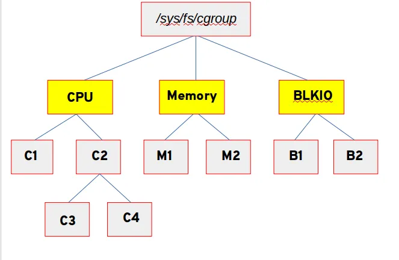
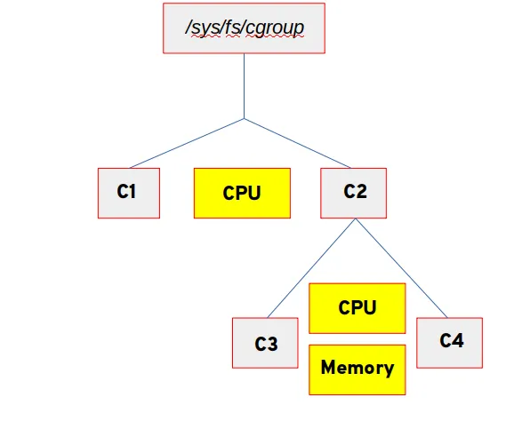

# 시스템 프로세스 식별 및 제어

(프로세스 상태, 시그널 제어, 우선순위 등)

앞서 확인한, 켜진 서비스(프로세스)들이 본격적으로 운영되면서 CPU와 메모리를 소모할 때, 이를 모니터링하고 제어하는 '운영' 단계를 다룰때 필요한 기술들이다. 문제를 판단하고 개입할 수 있는 기술들인 것이다.

## 프로세스 상태와 자원 점유 원리

리눅스 커널은 수많은 프로세스가 제한된 하드웨어(CPU, 메모리)를 효율적으로 나누어 쓸 수 있도록 상태를 추적하고 자원을 통제한다.

- **CPU 스케줄링과 시분할**
    - 메모리에 적재된 프로세스들은 커널의 스케줄러에 의해 CPU 사용 시간을 배분받는다.
    - 일반적인 프로세스는 **`SCHED_OTHER`** 정책에 따라 공평하게 시간을 나누어 쓰지만, 지연 시간이 짧아야 하는 중요한 작업은 **`SCHED_FIFO`**나 **`SCHED_RR`** 같은 실시간(Realtime) 스케줄링 정책을 통해 CPU를 우선적으로 선점한다.
    - **우선순위(PR)와 Nice(NI) 값:** 커널이 프로세스의 실행 순서를 결정하는 두 가지 핵심 지표다. 커널의 절대적인 우선순위(Priority)는 숫자가 낮을수록 먼저 실행됨을 의미한다.
    - **Nice(양보)의 작동 원리:** 일반 사용자는 커널의 절대 우선순위를 직접 변경할 수 없지만, **Nice 값**을 조정하여 커널에 우선순위 변경을 요청할 수 있다.
        - Nice 값은 -20부터 +19까지 지정할 수 있다.
        - 이름 그대로 "다른 프로세스에게 CPU를 얼마나 양보할 것인가?"를 나타내는 수치다.
        - 값이 높을수록(+19) 남에게 CPU를 많이 양보하여 우선순위가 최하위로 밀려나고, 값이 낮을수록(-20) 절대 양보하지 않아 최고 우선순위를 차지하게 된다.
        - 실무에서는 대규모 압축이나 백업 같이 CPU를 많이 먹는 작업의 Nice 값을 일부러 높여서(양보하게 만들어서), 웹 서버 같은 핵심 서비스의 속도가 느려지지 않도록 통제하는 원리다.

        > **`ps -eo pid,comm,nice,pri,stat`**: 각 프로세스의 우선순위(`nice`)와 현재 상태(`stat`)를 확인

        > `chrt` 명령줄 툴을 사용하여 스케줄러 정책 및 우선 순위를 확인 및 조정 가능하다.

        | **Short option** | **Long option** | **Description** |
        | --- | --- | --- |
        | `-f` | `--fifo` | Set schedule to `SCHED_FIFO` |
        | `-o` | `--other` | Set schedule to `SCHED_OTHER` |
        | `-r` | `--rr` | Set schedule to `SCHED_RR` |

- **메모리 오버커밋(Overcommit) 메커니즘**
    - 커널은 프로세스가 메모리를 대량으로 요청(malloc)할 때, 실제 물리적 메모리보다 더 많은 용량을 허용하는 '**오버커밋**'을 기본 정책으로 사용한다.
    - 즉, 프로세스가 당장 쓰지 않을 메모리까지 미리 확보해 두더라도 커널은 일단 요청을 수락한 뒤, 실제 데이터가 기록될 때만 물리 메모리를 조금씩 할당하여 한정된 자원을 효율적으로 쓴다.
- **OOM(Out of Memory) 제어**
    - 오버커밋 환경에서 여러 프로세스들이 한꺼번에 물리 메모리의 한계를 초과하여 점유하려 들면 시스템 전체가 멈출 위험이 있다.
    - 이때 커널은 **OOM 제어 메커니즘**을 개입시켜, 시스템 보호를 위해 우선순위가 낮거나 메모리를 과도하게 소모하는 프로세스를 강제로 종료(Kill)해 버린다.
        - **OOM Score (`oom_score`):** 커널은 메모리 고갈 시 각 프로세스에 점수를 매긴다. 메모리를 많이 쓰면서도 시스템 운영에 덜 중요한 프로세스가 높은 점수를 받는다.

- **스왑(Swap) 발생과 성능 저하**
    - 시스템 물리 메모리가 한계에 달하면, 커널은 당장 쓰이지 않는 메모리 페이지를 디스크의 스왑 영역으로 밀어내고(Swap-out), 필요할 때 다시 메모리로 가져온다(Swap-in). 그러나 디스크 I/O는 RAM보다 현저히 느리므로, 스왑 교체가 빈번해지면 시스템이나 가상 머신의 성능이 급격히 저하된다. 따라서 활발한 스왑 입출력 지표는 메모리 증설이나 메모리 누수 점검이 시급하다는 강력한 신호다.

| **명령어** | **용도** | **핵심 확인 항목** |
| --- | --- | --- |
| **`free -h`** | 메모리 전체 상태 | `available` (실제 가용량), `swap` (디스크 전용량) |
| **`vmstat 1`** | 동적 메모리 변화 추적 | **`si` / `so`** (Swap-in/out), `buff/cache` |
| **`dmesg \| grep -i oom`** | 시스템 사고 조사 | **OOM Killer**가 강제로 종료시킨 프로세스 기록 |
| **`ps -eo pid,rss,vsz,comm`** | 프로세스별 메모리 상세 | `RSS` (실제 점유 RAM), `VSZ` (가상 메모리 크기) |

- **대기(Delay) 상태 추적**
    - 프로세스는 항상 실행 상태인 것이 아니라, 사용 가능한 CPU를 기다리거나 디스크 I/O 등의 자원이 확보될 때까지 대기 상태에 놓이게 된다.
    - 커널의 딜레이 어카운팅(Delay Accounting) 기능은 이러한 지연 통계를 정확히 추적하여, 관리자가 해당 프로세스의 CPU나 I/O 우선순위를 알맞게 튜닝할 수 있도록 돕는다.

### 모니터링 지표

**로드 에버리지와 메모리 페이징**

시스템의 자원 상태를 정확히 파악하기 위해서는 단순한 'CPU/메모리 사용률(%)'을 넘어, 커널이 보고하는 핵심 성능 지표들의 의미를 이해해야 한다.

- **로드 에버리지 (Load Average)**
    - 시스템의 전반적인 부하(Load) 상태를 보여주는 지표다.
    - 단순히 CPU가 얼마나 연산 중인지가 아니라, '실행을 위해 CPU 할당을 기다리고 있거나(Runnable 상태), 디스크 I/O 작업이 끝나기를 대기 중인(Uninterruptible sleep 상태) 프로세스의 평균 개수'를 의미한다.
    - 통상 1분, 5분, 15분 단위로 측정되며, 이 수치가 시스템의 전체 CPU 코어 수보다 지속적으로 높다면 작업을 처리하지 못해 대기열(Queue)이 쌓이고 있다는 뜻이다.

| **명령어** | **용도** | **핵심 확인 항목** |
| --- | --- | --- |
| **`uptime`** | 시스템 전체 부하 확인 | Load Average (1분, 5분, 15분 단위 평균치) |
| **`lscpu`** | CPU 하드웨어 정보 | Core 개수, Hyper-threading 여부, Cache 크기 |
| **`top`** | 실시간 프로세스 감시 | `%CPU` (개별 프로세스 점유율), `niced` (우선순위) |
| **`mpstat -P ALL 1`** | 코어별 상세 분석 | `%usr`(사용자), `%sys`(커널), **`%iowait`**(I/O 대기) |

**메모리 페이징(Paging)과 페이지 폴트(Page Fault)**

- 리눅스 커널은 메모리를 '**페이지(Page)**'라는 고정된 블록 단위(기본 4KB)로 쪼개어 관리한다.
- 프로세스가 실행 중 필요한 데이터가 물리 메모리(RAM)에 없을 때 '페이지 폴트'가 발생한다. 남은 여유 공간이나 캐시에서 빠르게 할당받는 '마이너 페이지 폴트'는 정상적이지만, 디스크에서 직접 데이터를 읽어와야 하는 '메이저 페이지 폴트'가 잦아지면 시스템 지연(Latency)이 크게 발생한다.

### 시그널(Signal) 제어 원리

운영 체제나 시스템 관리 데몬(예: **`systemd`**)은 실행 중인 프로세스의 상태를 제어하거나 종료하기 위해 '시그널(Signal)'이라는 소프트웨어 인터럽트(메시지)를 프로세스에 전달한다.

- **SIGTERM (종료 요청):** 프로세스에게 작업을 멈추고 종료하라는 요청 신호다. **`systemd`**가 서비스를 중지할 때 가장 먼저 이 시그널을 보내며, 프로세스는 이 신호를 받고 열려 있는 파일이나 네트워크 연결을 안전하게 닫은 후 스스로 종료할 수 있는 기회를 가진다.
- **SIGKILL (강제 종료):** 프로세스가 SIGTERM에 응답하지 않고 멈춰 있거나(행업), 시스템 보호를 위해 즉시 없애야 할 때 커널이 사용하는 강력한 신호다. **`systemd`** 역시 SIGTERM 이후에도 종료되지 않고 남아있는 프로세스들에게 최종적으로 SIGKILL을 보내어 메모리에서 강제로 삭제한다. 이 시그널은 프로세스가 차단하거나 무시할 수 없다.

| **번호** | **이름** | **기본 동작** | **의미 및 용도** |
| --- | --- | --- | --- |
| **1** | **SIGHUP** | 종료 | **Hangup.** 터미널 접속이 끊겼을 때 발생. 주로 **설정 파일 재로드**에 사용 (nginx, sshd 등) |
| **2** | **SIGINT** | 종료 | **Interrupt.** 사용자가 **Ctrl + C**를 눌렀을 때 발생. 프로세스를 안전하게 중단함 |
| **3** | **SIGQUIT** | 종료+코어덤프 | **Quit.** 사용자가 **Ctrl + \\**를 눌렀을 때 발생. 종료 시 디버깅을 위한 코어 덤프를 생성함 |
| **9** | **SIGKILL** | **강제 종료** | **Kill.** 프로세스를 즉시 제거. 가로채기나 무시가 절대 불가능함 |
| **11** | **SIGSEGV** | 종료+코어덤프 | **Segmentation Fault.** 잘못된 메모리 영역을 참조했을 때 커널이 보내는 에러 신호 |
| **15** | **SIGTERM** | 종료 | **Terminate.** **정상 종료 요청.** `kill` 명령의 기본값이며 안전한 자원 회수를 유도함 |
| **17** | **SIGCHLD** | 무시 | **Child.** 자식 프로세스가 종료되거나 멈췄을 때 부모에게 알림. (좀비 프로세스 방지 관련) |
| **18** | **SIGCONT** | 다시 시작 | **Continue.** 멈춰있던(Stopped) 프로세스를 다시 실행함 |
| **19** | **SIGSTOP** | **일시 정지** | **Stop.** 프로세스를 즉시 멈춤. SIGKILL처럼 무시할 수 없음 (Ctrl + Z와 유사) |

---

## 프로세스 제어

리눅스에선 커널이 메모리에 적재된 프로그램의 생명주기와 자원 점유율을 관리하는 핵심 기능이다. 관리자는 이를 통해 특정 프로세스가 CPU나 메모리를 과도하게 독점하지 않도록 **실행 우선순위(Nice 값)**를 조정하고, 문제가 발생한 프로세스에 시그널(Signal)을 보내어 중지하거나 강제 종료할 수 있다.

즉, 시스템의 안정성을 유지하기 위해 프로세스를 감시하고 개입하는 모든 행위를 뜻한다.

**정적 프로세스 조회 (`ps`)**

| **명령어 및 세부 옵션** | **기능 설명** |
| --- | --- |
| **`ps -e`** 또는 **`ps -A`** | 실행 중인 모든 프로세스 출력 |
| **`ps -f`** | 풀 포맷 출력 (UID, PID, PPID 등 상세 정보 포함) |
| **`ps -ef`** | 모든 프로세스를 상세 포맷으로 출력 (실무 표준) |
| **`ps aux`** | BSD 스타일 출력 (사용자, CPU/메모리 점유율 확인에 유용) |
| **`ps -o <항목>`** | 원하는 정보만 지정 출력 (예: **`ps -e -o pid,%cpu`**) |

**동적 자원 모니터링 (`top`)**

| **명령어 및 세부 옵션** | **기능 설명** |
| --- | --- |
| **`top`** | 실시간 자원 상태 및 프로세스 갱신 (기본 3초 주기) |
| **`top -d <초>`** | 화면 갱신 주기를 지정한 초 단위로 설정 |
| **`top -p <PID>`** | 특정 프로세스(PID)만 지정하여 추적 |
| **`top -u <사용자>`** | 특정 사용자가 실행한 프로세스만 추적 |
| **`P`** (실행 중 입력) | CPU 사용률이 높은 순서대로 정렬 |
| **`M`** (실행 중 입력) | 메모리 사용률이 높은 순서대로 정렬 |

**프로세스 시그널 제어 (`kill`)**

| **명령어 및 세부 옵션** | **기능 설명** |
| --- | --- |
| **`kill -l`** | 사용 가능한 모든 시그널 목록 확인 |
| **`kill -15 <PID>`** | **SIGTERM**: 프로세스에 부드러운 종료 요청 (기본값) |
| **`kill -9 <PID>`** | **SIGKILL**: 응답 없는 프로세스 즉시 강제 종료 |
| **`kill -1 <PID>`** | **SIGHUP**: 프로세스 종료 없이 설정 파일만 다시 읽어들임 |

**프로세스 우선순위 조정 (`nice` / `renice`)**

| **명령어 및 세부 옵션** | **기능 설명** |
| --- | --- |
| **`nice -n <값> <명령>`** | 프로그램을 **새로 실행**할 때 우선순위(Nice 값) 지정 |
| **`renice -n <값> -p <PID>`** | **이미 실행 중**인 특정 프로세스의 우선순위 실시간 변경 |
| **`renice -n <값> -u <사용자>`** | 특정 사용자의 모든 프로세스 우선순위를 한 번에 변경 |

---

## RHEL 전용: 시스템 튜닝 (tuned)

RHEL 계열 시스템에는 용도에 맞춰 커널 파라미터를 자동으로 최적화해 주는 `tuned` 도구가 있다.

| **명령어** | **용도** |
| --- | --- |
| **`tuned-adm active`** | 현재 적용된 튜닝 프로파일 확인 |
| **`tuned-adm list`** | 사용 가능한 모든 프로파일(virtual-guest, throughput-performance 등) 나열 |
| **`tuned-adm profile [이름]`** | 특정 용도(예: 데이터베이스 서버 등)에 맞춰 프로파일 변경 |
| **`tuned-adm recommend`** | 현재 상황에 맞는 추천 프로파일 확인 |

---

# 자동화된 작업 스케줄링 구조

프로세스 제어가 '지금 실행 중인 것'을 다루는 기술이라면, 작업 스케줄링은 '앞으로 실행될 것'을 사전에 정의해두는 기술이다. 두 영역 모두 시스템 운영 자동화의 핵심을 이룬다.

## 작업 스케줄러의 역할

리눅스 시스템의 안정적인 운영을 위해서는 백업, 로그 로테이션, 보안 점검 등 사용자 개입 없이 백그라운드에서 자동으로 실행되어야 하는 작업들이 필수적이다.

작업 스케줄러는 시스템 클럭과 동기화되어 백그라운드에서 조용히 대기하다가, 관리자가 미리 정의해 둔 특정 시간이나 조건이 충족되는 순간 해당 스크립트나 명령어를 정확히 트리거(Trigger)하여 실행시키는 데몬 역할을 수행한다. 이를 통해 관리자의 수동 개입에 따른 오류를 줄이고 시스템 유지보수 작업을 완벽하게 자동화할 수 있다.

리눅스 환경에서는 목적에 따라 크게 두 가지 스케줄러 데몬이 이 역할을 분담한다.

- **주기적으로 계속 반복되는 작업:** **`crond`** 데몬이 담당하여 처리한다.
- **특정 시점에 딱 한 번만 실행되고 끝나는 일회성 예약 작업:** **`atd`** (또는 batch) 데몬이 담당하여 처리한다.

## 주기적 반복 작업 (cron)

- **crond 데몬과 crontab**
    - 백그라운드에서 상주하는 **`crond`** 데몬은 시스템 클럭과 동기화되어 1분마다 깨어난다. 깨어날 때마다 예약 작업 목록이 담긴 **`crontab`**(Cron Table)을 검사하고, 현재 시각과 일치하는 작업을 즉시 실행한다.
- **시간 지정 원리:** 작업 주기는 분, 시, 일, 월, 요일의 5가지 시간 필드를 조합하여 제어된다. 이를 통해 '매주 월요일 새벽 3시'나 '매월 1일 자정'처럼 규칙적인 실행 조건을 정밀하게 설정할 수 있다.

    ```bash
    * * * * * command
    │ │ │ │ │
    │ │ │ │ └─ 요일 (0~7, 0/7=일)
    │ │ │ └── 월 (1~12)
    │ │ └──── 일 (1~31)
    │ └────── 시 (0~23)
    └──────── 분 (0~59)
    ```

- **작업 격리와 제어**
    - 시스템 전역에 영향을 미치는 작업(**`/etc/crontab`** 등)과 일반 사용자가 개별적으로 예약하는 작업이 물리적으로 분리되어 관리된다. 또한, 관리자는 **`cron.allow`** 및 **`cron.deny`** 파일을 통해 특정 사용자만 예약 시스템을 이용하도록 접근 권한을 엄격하게 통제할 수 있다.
- **명령어**

    | 명령어 | 설명 |
    | --- | --- |
    | `crontab -e` | 현재 사용자 작업 편집 |
    | `crontab -l` | 등록된 작업 확인 |
    | `crontab -r` | 작업 전체 삭제 |
    | `crontab -u user -e` | 특정 사용자 작업 편집 (root만 가능) |
    | `systemctl status crond` | cron 서비스 상태 확인 |
    | `systemctl restart crond` | cron 재시작 |

- **최신 RHEL 환경의 변화:** 과거에는 시스템의 로그를 정리하는 **`logrotate`** 같은 작업도 모두 cron에 의존했으나, RHEL 9부터는 이러한 시스템 핵심 유지보수 작업들이 더 세밀한 자원 추적이 가능한 **`systemd`** 타이머(**`.timer`** 유닛)로 이관되어 관리되는 추세다.

## 일회성 예약 작업 (at/batch)

리눅스 시스템에서 주기적인 반복 없이 특정한 시점에 딱 한 번만 작업을 실행해야 할 때는 **`at`**과 **`batch`** 메커니즘을 사용한다. 이 작업들은 **`atd`** 데몬에 의해 백그라운드에서 관리된다.

- **지정 시간 실행 (at):** 관리자가 구체적인 미래의 시간(예: "오늘 밤 11시", "내일 오후 2시 30분")을 지정하여 작업을 예약하면, **`atd`** 데몬이 이를 대기열(Queue)에 담아두었다가 정확히 해당 시각에 스크립트나 명령어를 단 한 번 실행한다. 작업이 완료되면 대기열에서 즉시 삭제되므로 깔끔한 관리가 가능하다.

    | 명령어 | 설명 |
    | --- | --- |
    | `at 23:00` | 오늘 23시에 작업 예약 |
    | `at now + 1 hour` | 1시간 뒤 실행 |
    | `atq` | 예약 목록 확인 |
    | `atrm 작업번호` | 작업 삭제 |
    | `systemctl status atd` | at 데몬 상태 확인 |

    사용 예시

    ```bash
    at 23:00
    > /backup.sh
    > Ctrl+D
    ```

- **시스템 부하 기반 실행 (batch):** 시간 기준이 아니라 '시스템의 현재 부하 상태(Load Average)'를 기준으로 작동하는 특별한 예약 방식이다. 특정 작업을 예약해 두면, 시스템의 로드 에버리지가 안전한 수준(기본값 1.5 이하)으로 떨어질 때까지 대기하다가 시스템 자원이 여유로워질 때 작업을 실행한다. 백업이나 대규모 데이터 압축처럼 자원 소모가 큰 작업을 서비스 운영에 지장 없이 처리할 때 매우 유용하다.

    | 명령어 | 설명 |
    | --- | --- |
    | `batch` | 시스템 부하 낮을 때 실행 |
    | `atq` | batch 작업도 같이 확인됨 |

    사용 예시

    ```bash
    batch
    > tar -czf backup.tar.gz /data
    > Ctrl+D
    ```

- **접근 통제:** **`cron`**과 마찬가지로 **`/etc/at.allow`** 및 **`/etc/at.deny`** 설정 파일을 통해 허가된 사용자만 일회성 예약 시스템을 이용하도록 접근 권한을 엄격하게 통제할 수 있다.

---

# 리눅스 커널의 자원 제어 및 격리 (cgroup)

앞서 살펴본 프로세스 제어와 스케줄링이 '무엇을, 언제 실행할 것인가'를 다뤘다면, cgroup은 '실행 중인 프로세스가 자원을 얼마나 쓸 수 있는가'를 커널 수준에서 강제하는 메커니즘이다.

## cgroup(Control Groups)의 개념

cgroup(Control Groups)은 시스템에서 실행되는 프로세스들을 추적하고, 시스템 리소스(CPU, 메모리, 네트워크 등)를 할당 및 분할(Partitioning)하기 위해 엄격하게 통제하는 리눅스 커널의 핵심 하위 시스템(Subsystem)이다.

- **리소스 격리와 제한:** 시스템 내의 프로세스들을 특정 그룹으로 묶어, 단일 프로세스나 애플리케이션이 전체 시스템 자원을 과도하게 독점하여 시스템을 마비시키는 것을 방지한다.
- **컨테이너의 핵심 기술:** 시스템 자원을 논리적으로 쪼개고 할당할 수 있는 특성 때문에, 오늘날 널리 쓰이는 리눅스 컨테이너(Linux Containers) 기술에서 자원 관리를 담당하는 가장 핵심적인 기반 역할도 수행하고 있다.
- **계층 구조 통제:** cgroup은 디렉터리 트리와 같은 계층 구조를 띠며, 부모 그룹에 설정된 자원 한도(Limit)는 그 아래에 속한 하위 프로세스들에게도 상속되어 일관되게 적용된다.

## cgroup v1 vs v2의 구조적 차이

RHEL 9부터는 cgroup v2가 기본 통제 방식으로 적용되었으며, 향후 릴리스에서는 v1의 지원이 완전히 중단될 예정이다. 두 버전의 가장 핵심적인 구조적 차이는 '계층 모델'에 있다.

- **다중 계층 구조의 복잡성 (cgroup v1):** 과거 v1 환경에서는 CPU, 메모리, I/O 등 각 자원 컨트롤러마다 별도의 독립적인 계층(디렉터리 트리)을 가질 수 있었다. 이로 인해 하나의 프로세스가 CPU 그룹과 메모리 그룹에 각각 다르게 얽힐 수 있어 관리가 복잡해지고 컨트롤러 간의 협력이 매우 어려웠다.
- **단일 계층(Single hierarchy) 모델 (cgroup v2):** v2는 이러한 복잡성을 해결하기 위해 시스템 전체에 오직 하나의 통합된 계층 구조만을 허용한다. 즉, 모든 프로세스는 동시에 단 하나의 cgroup에만 속하도록 엄격하게 강제되며, 이 단일 그룹 내에서 필요한 모든 자원을 한꺼번에 통제받는다.
- **모니터링 제어 파일의 변화:** v1에서 서브시스템 정보를 확인하던 **`/proc/cgroups`** 파일은 v2 환경에서도 호환·정보 용도로 여전히 존재한다. 다만 v2의 단일 계층 구조 하에서는 이 파일이 실무 점검의 중심이 아니며, 실제 상태 확인은 **`/sys/fs/cgroup/`** 하위의 제어 파일들을 통해 이루어진다. 그 중 **`cgroup.stat`** 파일을 통해 각 서브시스템의 인스턴스 수를 명확하게 파악할 수 있다.





## systemd와의 통합 원리

RHEL 9부터는 cgroup v2가 시스템의 기본 리소스 제어 모드로 적용되었으며, 시스템 및 서비스 관리자인 **`systemd`**와 완벽하게 통합되어 동작한다.

- **통합의 이점:** 과거에는 커널의 cgroup을 제어하기 위해 복잡한 전용 도구와 계층 설정이 필요했다. 하지만 이제는 **`systemd`**가 cgroup v2의 단일 계층 구조를 직접 관리하므로, 시스템에서 실행되는 모든 서비스와 데몬이 자동으로 cgroup의 엄격한 추적 아래 놓이게 된다.
- **직관적인 자원 제어:** 관리자는 복잡한 커널 명령어를 외울 필요 없이, 서비스의 유닛(Unit) 파일(**`.service`**) 내부에 **`MemoryMax=`**나 **`CPUQuota=`**와 같은 직관적인 파라미터만 선언해주면 된다. 그러면 **`systemd`**가 이를 해석하여 해당 서비스와 파생된 모든 하위 프로세스들의 CPU 및 메모리 사용량을 알아서 제한하고 격리한다.

## 모니터링 & 실시간 확인

### 기본 모니터링 명령어

| 명령어 | 설명 |
| --- | --- |
| `systemd-cgtop` | cgroup별 실시간 사용량 |
| `systemd-cgls` | cgroup 트리 구조 |
| `top / htop` | 전체 프로세스 |
| `systemctl status 서비스` | 서비스 상태 |

## cgroup v2 구조

`/sys/fs/cgroup/` 하위는 **slice → service/scope** 의 계층으로 이루어진다. `slice`는 논리적 자원 분리 경계이고, `service`는 systemd가 직접 관리하는 서비스 단위, `scope`는 systemd 외부(예: 사용자 로그인 세션)에서 생성된 프로세스 묶음이다.

```bash
/sys/fs/cgroup/              ← (하나의 통합된 자원 관리 공간)
│
├── system.slice/           ← 시스템 서비스 그룹
│   ├── httpd.service/      ← 웹 서버 (하나의 서비스 단위)
│   │   ├── cpu.max         ← CPU 제한 정책
│   │   ├── memory.max      ← 메모리 제한 정책
│   │   └── cgroup.procs    ← 이 그룹에 속한 프로세스들
│   │
│   ├── sshd.service/
│   └── crond.service/
│
├── user.slice/             ← 사용자 세션 그룹
│   ├── user-1000.slice/
│   │   ├── session-1.scope ← 로그인 세션
│   │   └── session-2.scope
│
└── init.scope              ← PID 1 (systemd)
```

각 서비스 디렉터리 안에 위치하는 제어 파일들은 커널이 직접 읽고 적용하는 인터페이스다. 주요 파일의 역할은 다음과 같다.

| **파일** | **역할** |
| --- | --- |
| **`cpu.max`** | `quota period` 형식으로 CPU 사용량을 제한 (`100000 1000000` = 10%) |
| **`memory.max`** | 메모리 사용 상한선. 초과 시 OOM killer가 해당 cgroup 내 프로세스를 종료 |
| **`cgroup.procs`** | 현재 이 cgroup에 속한 프로세스들의 PID 목록. 여기에 PID를 쓰면 해당 그룹으로 이동 |

### systemctl set-property 사용법

`systemctl set-property`는 실행 중인 서비스에 cgroup 기반 리소스 제한을 즉시 적용하는 명령어다. 내부적으로는 드롭인 파일을 자동 생성하지만, 사용자가 직접 설정 파일을 편집할 필요가 없어 빠르고 간편하다.

```bash
# 영구 적용 (기본)
systemctl set-property httpd MemoryMax=1G

# 임시 적용 (재부팅 시 사라짐)
systemctl set-property --runtime httpd MemoryMax=1G
```

---

### 설정 저장 위치

`set-property` 명령어로 적용된 설정은 원본 `.service` 파일을 직접 수정하지 않고, 별도의 드롭인(drop-in) 파일로 저장된다.

```
/etc/systemd/system.control/httpd.service.d/

# 또는

/etc/systemd/system/httpd.service.d/
```

**설정 확인 / 삭제**

```bash
# 특정 값 확인
systemctl show httpd -p MemoryMax

# 전체 확인
systemctl show httpd

# 설정 초기화
systemctl set-property httpd MemoryMax=
```

---

### 서비스 설정 파라미터

| **리소스** | **설정 파라미터** | **명령어 예시** | **상세 설명** |
| --- | --- | --- | --- |
| **CPU** | **`CPUQuota`** | `systemctl set-property httpd CPUQuota=20%` | 서비스가 전체 CPU 시간 중 최대 20%만 점유하도록 제한. |
| **메모리** | **`MemoryMax`** | `systemctl set-property httpd MemoryMax=512M` | **Hard Limit.** 이 수치를 넘기면 커널이 즉시 프로세스를 종료(OOM Kill)시킨다. |
| **메모리** | **`MemoryHigh`** | `systemctl set-property httpd MemoryHigh=400M` | **Soft Limit.** 이 수치를 넘기면 프로세스 속도를 늦추거나 메모리를 적극적으로 회수한다. |
| **I/O (읽기)** | **`IOReadBandwidthMax`** | `systemctl set-property httpd IOReadBandwidthMax=/dev/sda 1M` | 특정 디스크(`/dev/sda`)의 읽기 속도를 초당 1MB로 제한한다. |
| **I/O (쓰기)** | **`IOWriteBandwidthMax`** | `systemctl set-property httpd IOWriteBandwidthMax=/dev/sda 1M` | 특정 디스크의 쓰기 속도를 초당 1MB로 제한한다. |
| **태스크** | **`TasksMax`** | `systemctl set-property httpd TasksMax=100` | 해당 서비스가 생성할 수 있는 최대 프로세스/스레드 수를 100개로 제한한다. |
| **CPU 우선순위** | **`CPUWeight`** | `systemctl set-property httpd CPUWeight=200` | 기본값은 100입니다. 숫자가 높을수록 CPU 경쟁 시 자원을 더 많이 할당받는다. |
| **I/O 가중치** | **`IOWeight`** | `systemctl set-property httpd IOWeight=200` | 디스크 읽기/쓰기 경쟁이 발생했을 때 우선순위를 결정한다. |
| **장치 접근** | **`DeviceAllow`** | `systemctl set-property httpd DeviceAllow=/dev/null rw` | 특정 하드웨어 장치에 대한 접근 권한을 제한하거나 허용하여 보안을 강화한다. |

**MemoryMax vs MemoryHigh 차이**

| 항목 | MemoryHigh | MemoryMax |
| --- | --- | --- |
| 의미 | 소프트 제한 (Soft Limit) | 하드 제한 (Hard Limit) |
| 동작 | 속도 제한 / 압박 | 즉시 OOM Kill |
| 목적 | 완만한 제어 | 강제 차단 |
| 서비스 영향 | 성능 저하 | 프로세스 종료 |

---

## Ref.

| 주제 | 문서 |
| --- | --- |
| 시스템 성능 모니터링 및 tuned | [시스템 상태 및 성능 모니터링 및 관리 — RHEL 10](https://docs.redhat.com/ko/documentation/red_hat_enterprise_linux/10/html/monitoring_and_managing_system_status_and_performance/index) |
| 커널 스케줄링 및 cgroup | [커널 관리, 모니터링 및 업데이트 — RHEL 10](https://docs.redhat.com/ko/documentation/red_hat_enterprise_linux/10/html/managing_monitoring_and_updating_the_kernel/index) |
| systemd와 cgroup 통합, 서비스 리소스 제어 | [systemd 장치 파일을 사용하여 시스템 사용자 지정 및 최적화 — RHEL 10](https://docs.redhat.com/ko/documentation/red_hat_enterprise_linux/10/html/using_systemd_unit_files_to_customize_and_optimize_your_system/index) |
| SELinux 및 보안 | [SELinux 사용 — RHEL 10](https://docs.redhat.com/ko/documentation/red_hat_enterprise_linux/10/html/using_selinux/index) |
