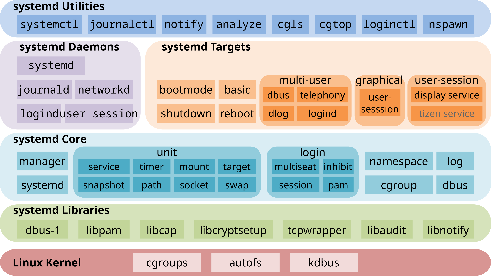

# 시스템 초기화 및 서비스 관리의 기반

## 사전 지식

**초기화 (Initialization):** 컴퓨터 전원을 켜고 OS가 하드웨어를 점검한 뒤, 사용자가 쓸 수 있게 '첫 세팅'을 하는 과정

**Kernel & User Space:** 하드웨어를 컨트롤하는 영역(Kernel Space)과 프로세스가 동작하는 영역(User Space)으로 구분된다.

**PID:** 시스템에서 실행되는 모든 프로그램에 부여되는 고유 식별자 (주민등록번호와 같은 개념)

---

## 초기화 프로세스 (SysV init → systemd)

리눅스의 시스템 부팅과 서비스 관리 방식은 전통적인 'SysV init'에서 현대의 'systemd'로 변경을 거쳤다.

### SysV init의 한계 (과거 방식)

- 과거 리눅스는 쉘 스크립트 기반의 **SysV init**을 사용하여 시스템을 부팅했다.
- 이 방식은 서비스들을 미리 정해진 순서대로 **순차적(Sequential)으로 실행**해야만 했다.
    - **런레벨 시스템 ( ↔ systemd unit 내 .target )**
        - 런레벨 0: 시스템 종료
        - 런레벨 1: 단일 사용자 모드
        - 런레벨 3: 멀티유저 모드 (CLI)
        - 런레벨 5: 그래픽 사용자 인터페이스 모드
        - 런레벨 6: 시스템 재부팅
    - **디렉토리 구조**
        - `/etc/init.d/`: 서비스 스크립트 저장
        - `/etc/rcN.d/`: 각 런레벨(N)별 심볼릭 링크
        - `/etc/inittab`: 기본 런레벨 및 init 설정
- 문제는 앞선 네트워크 서비스가 완전히 켜질 때까지 웹 서버 등 다음 서비스가 무작정 대기해야 하므로 부팅 속도가 매우 느렸고, 복잡해지는 현대 환경에서 서비스 간의 의존성을 스크립트만으로 관리하기에는 한계가 뚜렷했다.
    - N 런레벨으로 변경 시, `/etc/rcN.d` 내 스크립트들을 순차적으로 실행해야만 하는 상황

### systemd의 도입 (현대 표준)

이러한 SysV init의 순차 실행 한계를 극복하기 위해 도입된 것이 **`systemd`**다. 현재 RHEL 환경에서 시스템 서비스 시작 및 중지 등을 제어하는 핵심 데몬으로, 부팅 시 가장 먼저 실행되어 **프로세스 ID(PID) 1번**을 부여받고 시스템 전체를 통제한다.

- **병렬(Parallel) 처리:** 소켓(Socket) 및 D-Bus 활성화 기술을 사용하여, 서비스들이 서로의 완전한 시작을 기다릴 필요 없이 **동시에(병렬로) 시작**될 수 있게 만들어 부팅 속도를 비약적으로 향상시켰다.
    - **D-Bus:** Desktop Bus. 같은 머신에서 동시에 실행 중인 여러 프로세스 간의 통신을 가능케 하는 소프트웨어 버스. 리눅스 환경에서는 여러 개의 버스를 열거해서 사용자 세션을 나눠 관리한다.
    - **소켓:** 네트워크 혹은 프로세스 간 통신(IPC)을 위한 인터페이스.
- **스크립트 탈피:** 길고 복잡한 쉘 스크립트 대신, 목적이 명확히 정의된 **`.service`**, **`.socket`**, **`.target`** 등의 규격화된 '**유닛(Unit) 파일**'을 사용하여 의존성 관리를 단순화했다.
- **통합 보안 및 자원 제어:** 단순히 서비스를 켜고 끄는 것을 넘어, 리눅스 커널의 **cgroup**과 연동하여 서비스별 리소스를 추적 및 제한하고, SELinux와 상호작용하여 프로세스와 유닛 파일의 접근 권한을 확인하는 액세스 관리자 역할까지 수행한다.
- **장치 및 종속성 관리**

> **Red Hat Enterprise Linux:** RHEL 7부터 systemd 기본 도입

---

## 프로세스(Process), 데몬(Daemon), 서비스(Service)의 구조적 차이

리눅스 시스템에서 실행되는 작업 단위들은 그 역할과 관리 방식에 따라 크게 세 가지로 구분된다.

- **프로세스 (Process):** 디스크에 저장된 프로그램이 메모리에 적재되어 커널에 의해 실행되고 있는 동적인 상태를 의미한다. 시스템으로부터 CPU와 메모리 자원을 할당받아 작업을 수행하며, 작업이 끝나면 종료된다.
- **데몬 (Daemon):** 사용자가 직접 제어하는 터미널(포그라운드) 환경에서 벗어나, 백그라운드에서 실행되며 특정한 시스템 요건이나 네트워크 요청이 올 때까지 지속적으로 대기하는 특수한 목적의 프로세스다. **`systemd`**나 **`sshd`**처럼 이름 끝에 보통 'd'가 붙는 특징이 있다.
    - 대개 PID 1번인 `systemd`(또는 `init`)를 부모로 가진다.
- **서비스 (Service):** 최신 RHEL의 **`systemd`** 환경에서 데몬을 포괄하여 관리하는 더 넓은 의미의 논리적 단위이다.
    - 백그라운드에서 동작하는 데몬 프로세스 자체뿐만 아니라, 해당 데몬의 실행 조건, 다른 프로그램과의 의존성, 시작 및 중지 규칙 등의 관리 정책까지 모두 포함하여 **`systemd`** 데몬에 의해 통제된다.
    - **`systemctl`** 을 통해 시작, 정지, 활성화를 제어한다.

| **구분** | **프로세스 (Process)** | **데몬 (Daemon)** | **서비스 (Service)** |
| --- | --- | --- | --- |
| **개념** | 실행 중인 모든 프로그램 | 백그라운드 상주 프로세스 | 시스템 관리용 실행 단위 |
| **상호작용** | 사용자(터미널)와 상호작용 가능 | 상호작용 없음 (백그라운드) | 관리 도구(systemctl)와 상호작용 |
| **종속성** | 터미널 종료 시 종료될 수 있음 | 터미널과 독립적 (TTY 없음) | 시스템 레벨에서 의존성 관리 가능 |
| **예시** | `ls`, `vim`, `python3` | `sshd`, `crond`, `syslogd` | `ssh.service`, `nginx.service` |

요약하자면, 모든 데몬은 프로세스의 한 종류이다. 그리고 '서비스'는 이러한 데몬이 시스템 부팅 시나 운영 중에 안정적으로 동작할 수 있도록 **`systemd`**가 정책을 부여해 체계적으로 관리하는 단위라고 볼 수 있다.

---

## systemd 아키텍처 및 유닛(Unit) 파일의 구조

**`systemd`**는 과거의 복잡한 쉘 스크립트 대신, 역할과 목적이 명확히 정의된 텍스트 설정 파일인 **'유닛(Unit) 파일'**을 사용하여 시스템 자원과 서비스를 표준화된 방식으로 통합 관리한다.



**핵심 기능 요약**

- Parallel start of system services during boot
- On-demand activation of daemons
- Dependency-based service control logic

### 1. 유닛(Unit) 파일의 핵심 유형

- **.service:** 웹 서버(httpd)나 데이터베이스 등 백그라운드에서 실행되는 일반적인 데몬의 실행, 중지, 재시작 방법을 정의하는 가장 기본적인 유닛이다.

    | **상태값** | **설명** |
    | --- | --- |
    | **loaded** | 프로세스가 로드되는 유닛의 환경 설정 파일을 나타냄 |
    | **enabled** | 부팅 시에 활성화됨을 나타냄 |
    | **disabled** | 부팅 시에 비활성화됨을 나타냄 |
    | **active(running)** | 프로세스가 하나 또는 그 이상의 프로세스에 의해 동작 중임을 나타냄 |
    | **active(exited)** | 일회성 프로세스를 성공적으로 실행한 경우에 나타냄 |
    | **active(waiting)** | 동작 중인 상태이나 특정 이벤트에 의해 대기 중인 상태를 나타냄 |
    | **inactive(dead)** | 프로세스가 종료된 상태를 나타냄 |
    | **static** | 활성화가 되지는 않지만, 활성화되는 다른 유닛에 의해 활성화가 가능한 상태를 나타냄 |

- **.socket:** 특정 네트워크 포트나 로컬 소켓을 감시하다가, 실제 연결 요청이 들어오는 순간 연관된 서비스를 온디맨드(On-demand) 방식으로 즉시 활성화한다.

- **.target:** 여러 개의 유닛을 논리적으로 묶어주는 그룹화 역할을 한다. 과거 SysV init의 '런레벨(Runlevel)'을 대체하는 개념으로, 시스템이 부팅되어야 할 최종 목표 상태(예: **`multi-user.target`**, **`graphical.target`**)를 정의할 때 사용된다.

    | Target | 설명 |
    | --- | --- |
    | poweroff.target | 시스템을 종료시키는 타깃 |
    | rescue.target | 응급복구 모드(init 체제의 runlevel 1)로 전환하는 타깃 |
    | emergency.target | rescue.target과 유사하고, `/`를 읽기 전용(read-only)으로 마운트 |
    | multi-user.target | 콘솔 모드(init 체제의 runlevel 3)로 전환하는 타깃으로 텍스트 기반 로그인만 지원 |
    | graphical.target | X Window(init 체제의 runlevel 5) 모드로 전환하는 타깃으로 텍스트 기반 로그인 이외에 X 기반의 로그인을 지원 |
    | reboot.target | 재부팅시키는 타깃 |

- **.timer:** 지정된 시간이나 주기에 맞춰 특정 유닛을 실행하는 스케줄러 역할을 수행한다.
- **.mount:** **`/etc/fstab`** 파일과 연계하여 특정 파일 시스템 마운트 지점을 정의하고 제어한다.

### 2. 유닛 파일의 저장 위치 및 우선순위

- **`/usr/lib/systemd/system/`**: 패키지를 설치할 때 제공되는 **기본 원본 유닛 파일**이 저장된다. 소프트웨어 업데이트 시 이 경로의 파일은 덮어쓰여질 수 있으므로 관리자가 직접 수정해서는 안 된다.
- **`/etc/systemd/system/`**: 시스템 관리자가 **사용자 정의 설정이나 최우선으로 적용할 설정**을 저장하는 위치다.

| **디렉터리** | **설명** |
| --- | --- |
| `/usr/lib/systemd/system/` | 설치된 RPM 패키지와 함께 배포된 `systemd` 장치 파일. |
| `/run/systemd/system/` | 런타임에 생성된 `systemd` 장치 파일. 이 디렉터리는 설치된 서비스 단위 파일이 있는 디렉토리보다 우선. |
| `/etc/systemd/system/` | `systemctl enable` 명령과 서비스 확장을 위해 추가된 유닛 파일을 사용하여 생성된 `systemd` 장치 파일. 이 디렉터리는 런타임 단위 파일이 있는 디렉터리보다 우선. |

> 실무에서 원본 서비스 설정을 변경해야 할 때는 원본 파일을 직접 수정하는 대신, **`/etc/systemd/system/<서비스명>.service.d/`** 디렉터리를 생성하고 그 안에 **`override.conf`** (드롭인 스니펫) 파일을 만들어 필요한 파라미터만 재정의하는 것이 안전한 표준 절차다.

이를 위해 RHEL에서는 다음과 같은 명령어를 제공한다.

```bash
sudo systemctl edit <서비스명>
```

위 명령어를 실행하면 아래 경로에 드롭인 파일이 자동으로 생성된다.

```
/etc/systemd/system/<서비스명>.service.d/override.conf
```

### 3. 유닛 의존성 지시어 (Dependency Directives)

systemd의 핵심 강점 중 하나는 서비스 간 관계를 유닛 파일 내부에 명시적으로 선언할 수 있다는 점이다. 이 의존성 정보를 바탕으로 **`systemd`**는 부팅 시 병렬 시작 순서를 자동으로 결정하고, 한 서비스가 실패했을 때의 연쇄 동작을 제어한다.

의존성 지시어는 크게 **"어떤 관계인가"(Wants/Requires)**와 **"어떤 순서인가"(After/Before)**로 나뉜다. 두 축은 서로 독립적으로 동작하므로, 의도한 대로 제어하려면 함께 명시해야 한다.

| **지시어** | **의미** | **대상 실패 시 동작** |
| --- | --- | --- |
| `Wants=B` | 약한 의존성. A가 시작될 때 B도 함께 시작을 시도한다 | B가 실패해도 A는 계속 시작됨 |
| `Requires=B` | 강한 의존성. A는 B가 반드시 필요하다 | B가 실패하면 A도 함께 중지됨 |
| `After=B` | 순서 지시자. B가 active 상태가 된 뒤에 A를 시작한다 | 순서만 제어, 관계 정의 아님 |
| `Before=B` | 순서 지시자. A를 먼저 시작하고 그 다음에 B를 시작한다 | 순서만 제어, 관계 정의 아님 |
| `BindsTo=B` | `Requires=`보다 강한 의존성. B가 중지되는 순간 A도 즉시 중지됨 | B 중지 즉시 A도 중지 |

> **`After=`/`Before=`는 순서만 결정하고, `Wants=`/`Requires=`는 관계만 정의한다.** 예를 들어 "B가 켜진 다음에 A를 켜고, B가 죽으면 A도 같이 죽게 하고 싶다"는 의도를 표현하려면 `After=B`와 `Requires=B`를 함께 선언해야 한다.

**실제 적용 예시 — `crond.service`의 `[Unit]` 섹션**

```ini
[Unit]
Description=Command Scheduler
After=auditd.service nss-user-lookup.target systemd-user-sessions.service time-sync.target
Wants=nss-user-lookup.target time-sync.target
```

- `After=auditd.service`: auditd가 먼저 시작된 뒤에 crond를 시작한다 (감사 로그 준비 완료 보장)
- `Wants=time-sync.target`: 시간 동기화가 되어 있길 원하지만, 동기화가 안 되어도 crond는 시작된다

**의존성 확인 명령어**

```bash
# 특정 서비스가 의존하는 유닛 트리 확인
systemctl list-dependencies crond

# 역방향 — 누가 crond에 의존하고 있는지 확인
systemctl list-dependencies --reverse crond
```

---

### `systemctl edit` vs `systemctl set-property` 차이점

두 명령어 모두 서비스 설정을 변경하는 데 쓰이지만, 용도와 방식이 다르다.

**`systemctl edit <서비스명>`** — 설정 파일 자체를 수정 (영구적)

- 서비스 설정을 **정식으로 커스터마이징**
- 재부팅해도 유지됨
- 여러 옵션을 자유롭게 추가 가능
- 사람이 읽고 관리하기 좋음

**`systemctl set-property <서비스명>`** — 속성만 바로 적용 (빠르고 간단)

- 특정 리소스 제어(cgroup 관련)를 **즉시 적용** (daemon-reload 없이도 적용되는 경우 많음)
- 내부적으로는 설정 파일도 생성하지만, 사용자는 그걸 직접 건드리지 않음
- 주로 CPU, 메모리 제한 같은 **리소스 제어용**
- 간단한 설정에 적합

---

### systemctl

**`systemctl`**은 최신 리눅스의 핵심 데몬인 **`systemd`**를 제어하는 마스터 명령줄 유틸리티이다. 관리자는 이 명령어 하나로 시스템 부팅 관리부터 개별 서비스의 시작, 중지, 상태 확인, 재부팅 시 자동 실행 설정까지 시스템과 서비스의 모든 생명주기를 직접 통제할 수 있다.

**기본 형태:** `systemctl [option] 명령 [서비스명]`

**주요 옵션**

| 옵션 | 설명 |
| --- | --- |
| `-l`, `--full` | 유닛 관련 정보를 출력할 때 긴 이름도 약어로 출력하지 않고 전체 출력함 |
| `-t`, `--type=` | 유닛의 유형을 지정하는 옵션 |
| `-a`, `--all` | 유닛 정보를 출력할 때 모든 유닛을 지정하는 옵션 |
| `--failed` | 실패한 유닛 정보만 출력 |

**런레벨 관련 주요 명령**

| 명령 | 설명 |
| --- | --- |
| `get-default` | 현재 시스템에 설정된 런레벨 target 정보를 출력 |
| `set-default [타깃명]` | 시스템의 런레벨을 지정한 target으로 변경 |
| `isolate [타깃명]` | 지정한 타깃의 런레벨 즉시 변경 |
| `rescue` | 응급 복구 모드 즉시 전환, 'emergency'와 유사 |
| `poweroff` | 시스템 즉시 종료, 'halt'와 동일 |
| `reboot` | 시스템 즉시 재부팅, 'kexec'와 유사 |

**상태 정보 관련 주요 명령**

| 명령 | 설명 |
| --- | --- |
| `list-units` | 유닛 관련 정보 출력 |
| `list-unit-files` | 설치된 유닛 파일의 목록 및 상태 정보를 출력 |
| `list-sockets` | 소켓 관련 유닛의 정보를 출력 |
| `list-dependencies` | 명시된 유닛의 의존성 관련 있는 유닛 정보를 출력 |

**서비스 제어 관련 주요 명령**

| **명령어** | **기능 및 설명** |
| --- | --- |
| `systemctl status <서비스명>` | 서비스의 현재 동작 상태와 에러 로그 확인 |
| `systemctl start <서비스명>` | 운영 중인 서비스 즉시 시작 |
| `systemctl stop <서비스명>` | 운영 중인 서비스 즉시 중지 |
| `systemctl restart <서비스명>` | 설정 파일 변경 사항을 적용하기 위해 서비스를 껐다 켬 |
| `systemctl reload <서비스명>` | 특정 서비스의 환경 설정만 다시 읽어 들임 |
| `systemctl enable <서비스명>` | 서버 재부팅 시 서비스가 자동으로 시작되도록 등록 |
| `systemctl disable <서비스명>` | 서버 재부팅 시 자동 시작 해제 |
| `systemctl is-enabled <서비스명>` | 부팅 시, 특정 서비스가 구동되는지 여부 확인 |
| `systemctl is-active <데몬명>` | 특정 데몬이 현재 활성화되어 있는지 여부 검사 |
| `systemctl kill <데몬명>` | 특정 데몬의 프로세스를 종료 |
| `systemctl daemon-reload` | 유닛 파일(`.service`) 수정 후, 변경된 설정을 systemd에 다시 읽어들이도록 적용 |

---

### 그 외 명령어

**systemd-analyze** — 시스템 부팅과 관련된 성능을 분석하는 데 사용된다.

사용법: `systemd-analyze [argument]`

| 인자값 | 설명 |
| --- | --- |
| `time` | 부팅 시에 소요된 시간 정보를 출력 |
| `blame` | 서비스 별로 부팅 시에 소요된 시간을 출력 |
| `critical-chain` | 각 유닛의 시간을 트리 형태로 출력 |
| `plot` | 관련 정보를 SVG 이미지 파일로 생성 |

---

**journalctl** — systemd 관련 로그 생성 및 관리

사용법: `journalctl [option] [항목]`

| 옵션 | 설명 |
| --- | --- |
| `-l`, `--full` | 출력 가능한 모든 필드의 정보를 출력 |
| `-r`, `--reverse` | 역순으로 출력 |
| `-p`, `--priority=` | 로그 레벨 지정 |
| `--since=` | 특정 날짜 이후의 정보만 출력 |
| `--until=` | 특정 날짜까지의 정보만 출력 |

---

## 서비스 생명주기(Lifecycle)와 커널 상호작용 원리

서비스의 생명주기는 런타임 중의 상태 변화(Start, Stop, Restart)와 부팅 시의 자동 활성화(Enable, Disable)로 나뉜다. **`systemd`**는 이 과정을 단순히 스크립트로 실행하는 것이 아니라, 리눅스 커널 및 보안 모듈과 긴밀하게 소통하며 처리한다.

이처럼 커널과의 긴밀한 연동은 **서버가 통제 불능 상태에 빠지는 것을 막고 보안을 강력하게 유지**하기 위함이다.

- **런타임 제어 및 cgroup 추적**
    - 서비스 시작(start)이 요청되면 **`systemd`**는 유닛 파일에 정의된 의존성을 확인하고 데몬 프로세스를 메모리에 적재한다.
    - 가장 중요한 점은 **`systemd`**가 **커널의 `cgroup` 하위 시스템**을 사용하여 해당 서비스에서 파생되는 모든 자식 프로세스를 단일 제어 그룹으로 묶어 추적한다는 것이다.
    - 이 덕분에 데몬이 백그라운드에서 복잡하게 분기(Fork)하더라도 **`systemd`**는 누수되는 프로세스 없이 정확하게 전체 서비스를 중지(Stop)하거나 제어할 수 있다.
- **부팅 시 자동 활성화(Enable)의 원리**
    - 운영 중에 서비스를 켜는 것과 재부팅 시 자동으로 켜지게 설정하는 것은 작동 원리가 다르다. 서비스를 'Enable' 상태로 만들면, **`systemd`**는 시스템 부팅 목표 지점(예: **`multi-user.target.wants/`**) 디렉터리 내부에 원본 유닛 파일을 가리키는 심볼릭 링크(바로가기)를 생성한다.
    - 시스템이 부팅될 때 이 링크들을 읽어 서비스를 구동하는 방식이다. 반대로 'Disable'을 수행하면 이 심볼릭 링크만을 삭제하여 부팅 목록에서 안전하게 제외한다.
- **SELinux 보안 검증**
    - **`systemd`**는 서비스 생명주기를 제어할 때 SELinux의 접근 관리자(Access Manager) 역할도 겸한다.
    - 사용자가 서비스를 켜거나 끄려고 할 때, **`systemd`**는 호출한 프로세스의 보안 라벨과 해당 유닛 파일의 라벨을 대조하여 커널의 SELinux 정책이 이 접근을 허용하는지 엄격하게 확인한다.

### SELinux

**SELinux**는 리눅스 커널에 포함된 **강제적 접근 제어(MAC, Mandatory Access Control)** 보안 시스템이다.

기본 리눅스 권한(사용자/그룹/퍼미션)보다 **더 강력한 보안 정책**을 적용해서 시스템을 보호한다.

**DAC vs MAC**

| **구분** | **일반 권한 (DAC)** | **SELinux (MAC)** |
| --- | --- | --- |
| **풀네임** | Discretionary Access Control | **Mandatory Access Control** |
| **방식** | 사용자/그룹 기반 (rwx) | **보안 라벨(Label/Context) 기반** |

즉, SELinux는 **사용자가 root라도 정책을 위반하면 접근 불가**하다.

**핵심 작동 원리:**

- **라벨링(Labeling):** 시스템의 모든 프로세스와 파일, 자원에 특수한 보안 라벨(컨텍스트)을 부여하여 관리.
- **기본 차단(Default Deny):** 정책 규칙에서 명시적으로 허용하지 않는 한, 프로세스 간의 상호 작용이나 파일 접근을 모두 차단한다.
- **피해 최소화(격리):**
    - 예를 들어 웹 서버(Apache)가 해커에게 뚫리더라도, 해커는 웹 서버용으로 라벨링된 파일에만 접근할 수 있을 뿐 일반 사용자의 홈 디렉터리나 핵심 시스템 파일로는 접근할 수 없다.
    - 즉, **권한 상승 공격**을 효과적으로 **방어**한다.

**3가지 작동 모드:**

1. **Enforcing (강제):** 정책을 엄격하게 적용하여 무단 접근을 차단하고 로그를 남긴다.
2. **Permissive (허용):** 정책 위반을 차단하지는 않고 경고 로그만 남긴다. 주로 SELinux 때문에 서비스가 안 되는지 원인을 찾고 디버깅할 때 사용.
3. **Disabled (비활성화):** SELinux를 완전히 끈다. 보안이 취약해지므로 권장하지 않는다.

---

## Ref.

| 주제 | 문서 |
| --- | --- |
| systemd 유닛 파일 구성 및 최적화 | [systemd 장치 파일을 사용하여 시스템 사용자 지정 및 최적화 — RHEL 10](https://docs.redhat.com/ko/documentation/red_hat_enterprise_linux/10/html/using_systemd_unit_files_to_customize_and_optimize_your_system/index) |
| 시스템 성능 모니터링 | [시스템 상태 및 성능 모니터링 및 관리 — RHEL 10](https://docs.redhat.com/ko/documentation/red_hat_enterprise_linux/10/html/monitoring_and_managing_system_status_and_performance/index) |
| 커널 관리 및 cgroup | [커널 관리, 모니터링 및 업데이트 — RHEL 10](https://docs.redhat.com/ko/documentation/red_hat_enterprise_linux/10/html/managing_monitoring_and_updating_the_kernel/index) |
| SELinux | [SELinux 사용 — RHEL 10](https://docs.redhat.com/ko/documentation/red_hat_enterprise_linux/10/html/using_selinux/index) |
