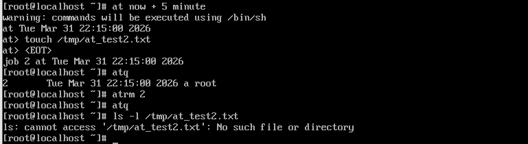
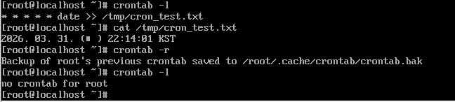

# 작업 스케줄링 (`cron`, `at`)

## `at` : 일회성 작업 예약



### `at` 동작 원리
1. 사용자의 작업 요청
2. `atd` 데몬이 이를 큐(`/var/spool/at/`)에 저장
3. `atd`는 1분마다 시간을 체크 -> 예약 시간이 되면 작업 실행 + 항목 삭제

### 예약 및 관리 명령어
``` bash
$ at [시간]
```
- 작업 예약 시작 (입력 후 `Ctrl + D` 로 저장)

``` bash
$ atq
```
- 현재 예약된 작업 목록 확인 (Job Id로 확인 가능)

``` bash
$ atrm [Job ID]
```
- 예약된 특정 작업 취소


## `cron` : 주기적인 반복 작업



### `cron` 동작 원리
1. 사용자가 crontab을 통해 설정 파일 작성
2. `crond` 데몬이 매 분마다 설정 파일을 로드하여 현재 시간과 일치하는 규칙이 있는지 감시
3. 일치하는 규칙 존재 시 백그라운드에서 명령 실행

### `crontab` 설정 방식
``` bash
* * * * * [명령어]
```
- 분 (`0`~`59`)
- 시 (`0`~`23`)
- 일 (`1`~`31`)
- 월 (`1`~`12`)
- 요일 (`0`~`7` : `0`/`7` = 일요일)

### `crontab` 명령어
``` bash
$ crontab -e
```
- 크론 등록 및 수정

``` bash
$ crontab -l
```
- 크론 작업 조회

``` bash
$ crontab -r
```
- 크론 작업 전체 삭제 