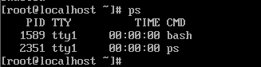
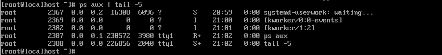
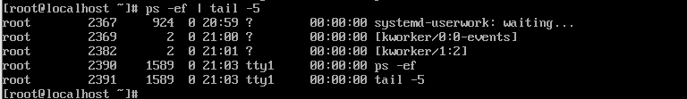
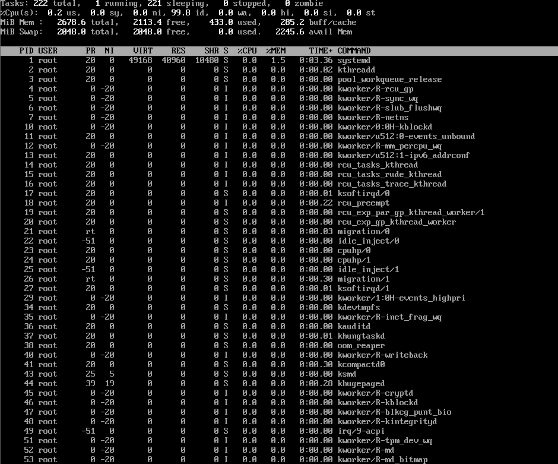
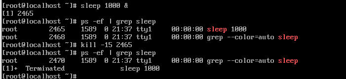
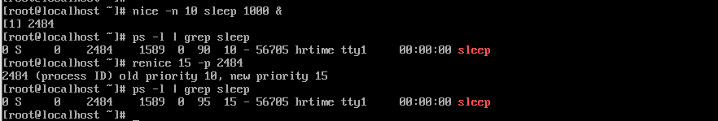

# 프로세스 조회 및 제어 

## `ps` 프로세스 조회

``` bash
$ ps 
```


### `ps` 조회 방식

- `ps aux` (BSD 계열) : CPU와 메모리 점유율을 확인하기 좋음  
  - `a` : 모든 사용자
  - `u` : 사용자 중심 상세 정보
  - `x` : 터미널 없는 프로세스 포함


- `ps -ef` (System V 계열) : 프로세스의 부모-자식 관계를 파악하기 좋음  
  - `-e` : 모든 프로세스
  - `-f` : Full 포맷
  - `--forest` : 트리 구조로 계층 확인 

## `top` : 실시간 프로세스 모니터링 
``` bash
$ top
```


### `top` 상단 요약 정보
- `Tasks` : 실행중인 프로세스의 상태 정보
- `%Cpu(s)` : CPU가 어떻게 사용되고 있는지 제시  
-` Mem/Swap` : 전체 물리 메모리와 가상 메모리의 사용량, 여유 공간, 캐시/버퍼의 상태 제시 

### 프로세스 영역
- `PR`/`NI` : 우선순위  
  - `NI` : 사용자가 조절이 가능한 Nice 값 
- `VIRT`/`RES`/`SHR` : 메모리 점유량  
  - `RES` : 실제로 물리 메모리를 점유하고 있는 실사용량
- `COMMAND` : 실행 중인 프로그램의 명칭이나 실행 경로 

### 실행 중 주요 단축 키
- `P` (Shift + p): CPU 사용률이 높은 순서로 정렬
- `M` (Shift + m): 메모리 사용률이 높은 순서로 정렬
- `T` (Shift + t): 프로세스가 실행된 시간이 긴 순서로 정렬
- `k`: 프로세스 종료 (PID를 입력하여 바로 kill 가능)
- `q`: top 화면 빠져나오기

## `kill` : 프로세스 종료

### 주요 시그널 종류
- `kill -15` (SIGTERM) : 정상 종료
- `kill -9` (SIGKILL) : 강제 종료
- `kill -1` (SIGHUP) : 재시작 

### 프로세스 지정 방식
``` bash
$ kill [PID]
```
- 특정 PID를 가진 프로세스 하나 종료

``` bash
$ pkill [프로세스명]
```
- 이름이 일치하는 모든 프로세스 한번에 종료

## `nice` : 우선순위 제어


### `NI` (Nice Value)
- 범위 : `-20` ~ `19`
- 특징 : 숫자가 낮을수록 자원을 더 많이 선점 

### 우선순위 변경 명령어
``` bash
$ nice -n [값] [명령어]
```
- 새로운 프로그램을 실행할 때 처음부터 우선순위를 지정하여 시작

``` bash
$ renice [값] -p [PID]
```
- 이미 실행중인 프로세스의 우선순위를 실시간으로 변경