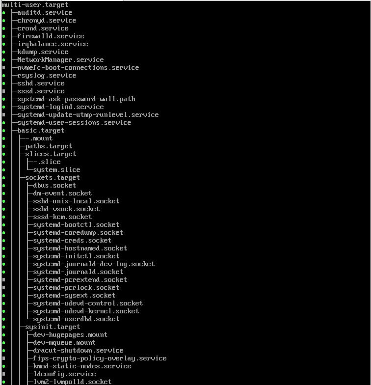
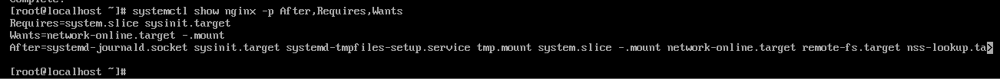
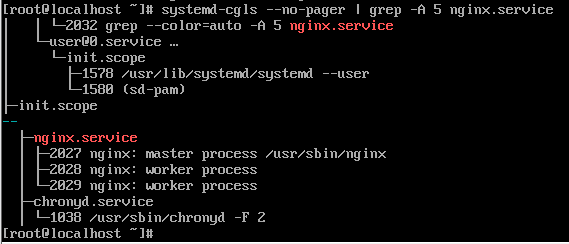
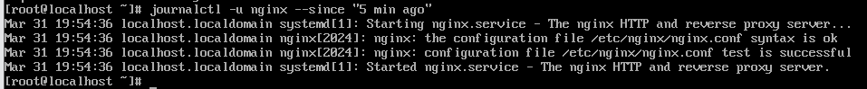
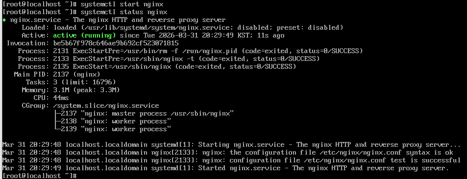
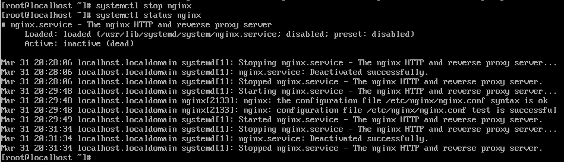
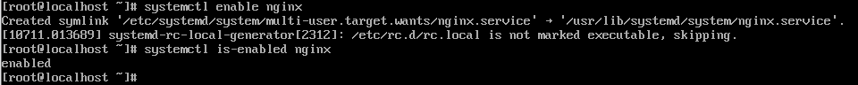

# systemd 구조와 서비스 관리 개념

## systemd의 탄생 배경

### 기존 `init` 방식의 한계점
- 직렬성 : `/etc/rc.d/`에 있는 스크립트들을 번호 순서대로 실행 -> 부팅 시간 증가
- 복잡한 종속성 관리 : 서비스 간 의존 관계 수동 관리 -> 시스템이 복잡해질수록 관리가 꼬임
- 동적 하드웨어 대응 불가 : 부팅 시점 결정된 상태로 진행 -> 실행 중 발생하는 동적 이벤트 관리 불가능 
- 프로세스 추적 한계 : 하위 프로세스 제어 불가능 -> 일부 자식 프로세스가 좀비가 됨

### `systemd`의 메커니즘
- **소켓 기반 활성화를 통한 병렬화** : 부팅 시 서비스가 사용할 소켓 선 생성 -> 데이터를 전송하려 할 때 로딩 중인 경우 데이터를 소켓 버퍼에 저장 가능
- **선언적 유닛 파이릉 통한 의존성 해결** : .service 유닛 파일 도입 -> 지시어를 통한 의존성 선언
- **이벤트 기반 실행** : udev 관리자를 통한 이벤트 생성 -> 트리거 기반으로 동적 대응 가능
- **`cgroup`을 활용한 프로세스 격리** : 서비스와 파생된 프로세스를 하나의 그룹으로 묶어 관리 -> 시스템 자원 누수 차단 


## systemd의 구조

```
+-------------------------------------------------------+
  |                   User Interface                      |
  |      (systemctl, journalctl, loginctl, hostnamectl)   |
  +-------------------------------------------------------+
               |                       |
  +------------v-----------------------v-------------------+
  |                  systemd Manager                       |
  |   (Unit 관리, 의존성 그래프 계산, 트랜잭션 처리)          |
  +----------------------------+---------------------------+
               |               |               |
  +------------v-------+  +----v----------+  +-v-----------+
  |   Core Daemons     |  |   Libraries   |  |   Targets   |
  | (journald, logind, |  | (libsystemd,  |  | (multi-user,|
  |  networkd, resolved)| |  libudev)     |  |  graphical) |
  +--------------------+  +---------------+  +-------------+
               |               |               |
  +------------v---------------v---------------v-----------+
  |                   Linux Kernel                         |
  |      (Cgroups, Autofs, Epoll, SignalFD, Kdbus)         |
  +-------------------------------------------------------+
```

### systemd Manager (PID 1)
- 시스템의 모든 프로세스의 조상
- 커널이 부팅을 마치고 가장 먼저 실행하는 프로세스 
- 유닛간의 의존성 그래프 생성 + 병렬 실행 스케줄링


### Unit (관리 단위)
```
$ systemctl list-dependencies multi-user.target
```


- `.service` : 실제 데몬 프로세스 관리
- `.socket` : IPC나 소켓 관리 
- `.target` : 유닛들의 그룹
- `.mount` : 파일 시스템 마운트 관리

### core deamons
- `journald` : 시스템 로그를 바이너리 형태로 수집
- `logind` : 사용자 로그인 세션 관리
- `networkd` / `resolved` : 네트워크 설정 및 DNS 관리 


## systemd의 작동 메커니즘 

```
[ User ]       [ systemctl ]      [ systemd Manager ]      [ Linux Kernel ]
    |                |                    |                       |
    |-- start nginx ->|                    |                       |
    |                |---- (D-Bus) ------>|                       |
    |                |                    |-- (Unit 파일 로드)      |
    |                |                    |-- (의존성 그래프 계산)   |
    |                |                    |                       |
    |                |                    |---- (Cgroup 생성) --->|
    |                |                    |---- (Process 실행) --->|
    |                |                    |                       |
    |                |<--- (성공 응답) ----|                       |
 [ 결과 확인 ] <-------|                    |                       |
                                          |                       |
                                          |---- (Log 전달) ----> [ journald ]
```
### step 1. 요청 전달 (User Interface)
- `systemctl` 도구로 명령 작성 -> D-Bus 통로를 통해 systemd Manager에게 전달

### step 2. 의존성 계산 및 트랜잭션 (systemd Manager)
- 요청 수신 시 해당 Unit 파일(`nginx.service`) 로드  
    - 1. 의존성 확인   
    - 2. 작업 예약 : 필요한 작업들을 순서에 맞게 배치하여 실행 큐에 삽입
  
``` bash
# nginx 서비스 유닛에 대한 모든 내부 변수와 설정값 중 속성 필터링 조회 
$ systemctl show nginx -p After,Requires,Wants
```
 
- `Requires` : 필수 조건
- `Wants` : 희망 조건
- `After` : 실행 순서 


### step 3. 실행 (kernel)
- 실제 프로세스 생성을 위한 커널 기능 호출  
  - 1. `cgroups` 생성 
  - 2. `Fork/Exec` : 커널이 실제 서비스 바이너리 실행 

``` bash
# 커널이 관리하는 프로세스의 관계를 서비스 단위로 필터링 
$ systemd-cgls --no-pager | grep -A 5 nginx.service
```


- `nginx.service` : 생성된 `cgroup`

### step 4. 로그 및 세션 기록 (core daemons)
- 서비스가 실행되면서 생성하는 모든 출력이 `journald`로 진입 
- 로그인 세션과 관련된 동작이라면 `logind`가 기록 

``` bash
# journald 데몬에게 5분 내의 nginx 유닛 관련 로그 요청
$ journalctl -u nginx --since "5 min ago"
```



## systemctl

### systemd와의 관계
``` 
[ 사용자 ] -------- (명령어 입력) --------> [ systemctl ]
                                              |
                                     (D-Bus 메시지 전송)
                                              |
                                              v
[ 커널 ] <------- (프로세스 생성) -------- [ systemd (PID 1) ]
```
- D-Bus를 통해 명령어 전달  
  - D-Bus : 텍스트를 명령어로 변환
- 사용자가 실행할 때만 잠시 켜져 명령 전달 후 종료 


### 서비스 시작
``` bash
$ systemctl start [서비스명]
```



### 서비스 중지
``` bash
$ systemctl stop [서비스명]
```



### 서비스 재시작
``` bash
$ systemctl restart [서비스명]
```

### 서비스 자동 실행 설정
``` bash
$ systemctl enable [서비스명]
```

