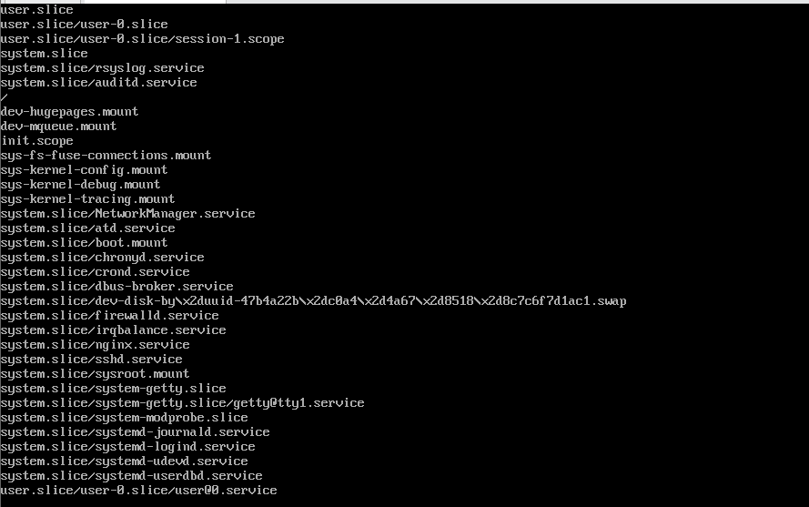
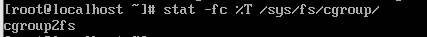

# cgroup 기반 자원 제어 기초

## cgroup의 계층적구조
```
[ Root cgroup ] (시스템 전체 자원)
              |
      +-------+-------+
      |               |
 [system.slice]   [user.slice] (사용자 영역)
      |               |
      |        +------+------+
      |        |             |
 [ssh.service] [user-1000.slice] [user-1001.slice]
 (SSH 자원 제한)  (사용자A 자원)     (사용자B 자원)
```

### `slice`와 `process`의 관계
```
[ Root cgroup ]
      |
      V
+-----------+ (Slice) ----------------------------+
|  User.slice  |  <-- "사용자 전체에게 20% 할당"       |
+-----------+                                     |
      |                                           |
      +---- [ user-1000.slice ] (개별 사용자용 슬라이스)  |
                   |                              |
                   +---- [ session-1.scope ] (로그인 세션)
                               |                  |
                               +-- (PID 123: bash) <-- "실제 프로세스"
                               +-- (PID 456: top)
```

- `slice` : `systemd`가 제공하는 논리적인 관리 단위 (`cgroup`의 한 노드)
- `service/scope` : 실제 프로그램이 속해 있는 관리 단위
- `process` : 실제 CPU를 쓰고 메모리를 점유하는 최하위 실행체

### cgroup 실시간 자원 소모 확인
``` bash
$ systemd-cgtop
```


- 어떤 서비스(Slice)가 CPU와 메모리를 

## 하위 시스템과 동작 흐름
```
[ 프로세스 ] ----> [ 자원 요청 (CPU/Mem) ]
                        |
                        v
           +--------------------------+
           |    cgroup Controller     |
           | (CPUQuota? MemoryLimit?) |
           +------------+-------------+
                        |
            +-----------+-----------+
            |                       |
     [ 허용량 이내 ]         [ 허용량 초과 ]
            |                       |
     (정상 프로세싱)         (스로틀링/Kill)
```

### 컨트롤러의 조절
- CPU 요청 : `cpu.max` 설정값을 확인하여 프로세스가 정해진 주기 내에 할당된 시간을 모두 소모했는지 확인
- 메모리 요청 : `memory.max` 값을 확인하여 현재 그룹의 총 사용량이 한계에 도달했는지 확인 

### 허용량 초과 시 대응 방식
- **Throttling** ([CPU](https://www.kernel.org/doc/html/latest/scheduler/sched-bwc.html)) : 강제로 죽이지 않고 대기하도록 설정 (프로세스가 느려짐)
- **OOM(Out of Memory) Kill** ([Momory](https://www.kernel.org/doc/html/latest/admin-guide/cgroup-v2.html#memory)) : 해당 그룹 내에서 가장 메모리를 많이 쓰는 프로세스 즉시 종료 

## cgroup v2 : 통합 계층 구조
### 현재 cgroup 버전 확인
``` bash
$ stat -fc %T /sys/fs/cgroup/
```
- `cgroup2fs`: 현재 cgroup v2를 사용 중표준  
- `tmpfs`: 현재 cgroup v1을 사용 중
  


### cgroup v1의 한계 : 따로 노는 자원 관리 (2014~)
- 계층 구조의 불일치 : CPU 제한 그룹과 메모리 제한 그룹이 별도로 존재 
- 자원 간 협업 불가 : CPU와 I/O의 관계는 밀접한데 구조 자체가 분리되어 제어가 여러움

### [cgroup v2로의 변화](https://lwn.net/Articles/679786/)
- 단일 트리 구조 : 프로세스가 하나의 그룹에 속해 그룹 내에서 CPU, 메모리, I/O 규칙을 한꺼번에 적용
- No Internal Process : 자식 그룹이 있는 부모 그룹은 직접 프로세스를 가질 수 없음 -> 자원은 리프 노드의 프로세스에만 분배 