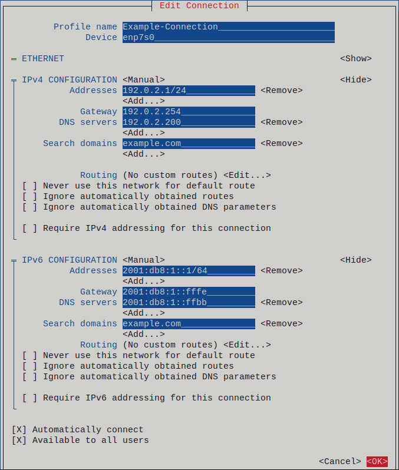

# 네트워크 설정과 진단

## 사전 지식

**OSI 7계층 모델:** 네트워크 통신을 이해하기 위한 표준 참조 모델이다. 실제 인터넷은 TCP/IP 4계층으로 동작하지만, 문제를 설명하거나 진단할 때 "L2 문제다", "L7 문제다" 같은 식으로 OSI 계층 번호를 기준으로 이야기하는 경우가 많다.

| OSI 계층 | 이름                 | 역할                      | 대표 프로토콜/장비           | TCP/IP 대응 |
| ------ | ------------------ | ----------------------- | -------------------- | --------- |
| 7      | 응용 (Application)   | 사용자 애플리케이션과 직접 상호작용     | HTTP, SSH, DNS, FTP  | 애플리케이션    |
| 6      | 표현 (Presentation)  | 데이터 형식 변환, 암호화, 압축      | SSL/TLS, JPEG, ASCII | 애플리케이션    |
| 5      | 세션 (Session)       | 연결 수립·유지·종료 관리          | NetBIOS, RPC         | 애플리케이션    |
| 4      | 전송 (Transport)     | 포트 기반 프로세스 간 통신, 신뢰성 보장 | TCP, UDP             | 전송        |
| 3      | 네트워크 (Network)     | IP 주소 기반 라우팅, 경로 결정     | IP, ICMP             | 인터넷       |
| 2      | 데이터 링크 (Data Link) | MAC 주소 기반 프레임 전달, 에러 검출 | Ethernet, ARP, 스위치   | 네트워크 접근   |
| 1      | 물리 (Physical)      | 전기 신호, 광 신호, 케이블        | UTP, 광케이블, 허브        | 네트워크 접근   |

실무에서는 5·6·7을 하나로 묶어 "애플리케이션 계층"으로 취급하는 TCP/IP 4계층이 더 실용적이다. 다만 "L2 스위치", "L3 라우팅", "L4 로드밸런서", "L7 방화벽" 같은 용어는 OSI 번호를 따르므로, 양쪽 매핑을 알아야 한다.

```
OSI 7계층과 TCP/IP 4계층 매핑:

OSI                    TCP/IP
┌─────────────────┐    ┌─────────────────┐
│ 7. 응용          │    │                 │
│ 6. 표현          │ ──▶│ 애플리케이션      │
│ 5. 세션          │    │                 │
├─────────────────┤    ├─────────────────┤
│ 4. 전송          │ ──▶│ 전송             │
├─────────────────┤    ├─────────────────┤
│ 3. 네트워크      │ ──▶│ 인터넷            │
├─────────────────┤    ├─────────────────┤
│ 2. 데이터 링크    │ ──▶│                 │
│ 1. 물리          │    │ 네트워크 접근      │
└─────────────────┘    └─────────────────┘
```

---

**TCP/IP 계층 구조:** 실제 인터넷 통신은 이 4개 계층으로 동작한다. 네트워크 인터페이스 설정(IP 주소, 게이트웨이)은 인터넷 계층(OSI L3)에서 동작한다.

| 계층         | 역할              | 대표 프로토콜         |
| ---------- | --------------- | --------------- |
| 애플리케이션 계층  | 사용자 데이터 처리      | HTTP, SSH, DNS  |
| 전송 계층      | 포트 기반 프로세스 간 통신 | TCP, UDP        |
| 인터넷 계층     | IP 주소 기반 라우팅    | IP, ICMP        |
| 네트워크 접근 계층 | 물리적 전송          | Ethernet, Wi-Fi |

---

**IP 주소와 CIDR (Classless Inter-Domain Routing):** IP 주소는 네트워크 상의 장치 식별자다. `192.168.1.10/24`에서 `/24`는 서브넷 마스크(`255.255.255.0`)를 압축한 표기로, 앞 24비트가 네트워크 주소임을 의미한다.

```
192.168.1.10/24 를 분해하면:

IP 주소 (2진수):  11000000.10101000.00000001.00001010
서브넷 마스크:     11111111.11111111.11111111.00000000  (/24 = 앞 24비트가 1)
─────────────────────────────────────────────────────
네트워크 부분:     192.168.1         (앞 24비트)
호스트 부분:                   .10   (뒤 8비트)

네트워크 주소:     192.168.1.0       (호스트 부분 전부 0 — 네트워크 자체를 식별)
브로드캐스트 주소:  192.168.1.255     (호스트 부분 전부 1 — 네트워크 내 전체에 전송)
사용 가능한 IP:    192.168.1.1 ~ 192.168.1.254  (총 254개)
```

자주 보는 CIDR 접두사:

| CIDR  | 서브넷 마스크           | 사용 가능 호스트 | 용도                       |
| ----- | ----------------- | --------- | ------------------------ |
| `/8`  | `255.0.0.0`       | 약 1600만   | 대규모 내부 네트워크 (10.0.0.0/8) |
| `/16` | `255.255.0.0`     | 65,534    | 중규모 네트워크 (172.16.0.0/16) |
| `/24` | `255.255.255.0`   | 254       | 가장 일반적인 서브넷              |
| `/32` | `255.255.255.255` | 1         | 단일 호스트 지정                |

---

**게이트웨이:** 패킷이 현재 네트워크 바깥으로 나갈 때 거쳐야 하는 라우터의 IP 주소다. 예를 들어 내 서버(`192.168.1.10`)에서 외부 인터넷(`8.8.8.8`)으로 패킷을 보낼 때, 커널은 라우팅 테이블을 보고 게이트웨이(`192.168.1.1`)로 먼저 전달한다.

```
내 서버(192.168.1.10) → 목적지: 8.8.8.8

1. 커널이 라우팅 테이블 조회
2. 8.8.8.8은 192.168.1.0/24 서브넷에 없음
3. default route(기본 게이트웨이 192.168.1.1)로 전달
4. 게이트웨이(라우터)가 외부 네트워크로 패킷 중계
```

---

**DNS (Domain Name System):** 도메인 이름(`google.com`)을 IP 주소로 변환하는 서비스다.

```
사용자가 ping google.com 실행

1. /etc/nsswitch.conf 참조 → 이름 해석 순서 결정 (보통 files → dns)
2. /etc/hosts 파일에 매핑이 있는지 확인
3. 없으면 /etc/resolv.conf에 등록된 DNS 서버로 질의
4. DNS 서버가 재귀(recursive) 질의를 수행하여 IP 반환
5. 커널이 반환된 IP로 패킷 전송
```

---

**NIC (Network Interface Card):** 네트워크에 물리적으로 연결되는 하드웨어 장치다. 서버에는 하나 이상의 NIC가 존재하며, 각 NIC는 고유한 MAC 주소를 가진다. 리눅스에서는 NIC마다 인터페이스 이름이 붙는데, 이름 규칙은 하드웨어 위치 기반이다.

| 접두사          | 의미           | 예시                        |
| ------------ | ------------ | ------------------------- |
| `en`         | Ethernet     | —                         |
| `wl`         | Wireless LAN | —                         |
| `p<버스>s<슬롯>` | PCI 버스/슬롯 번호 | `enp1s0` = PCI 버스 1, 슬롯 0 |
| `o<N>`       | 온보드 장치 번호    | `eno1` = 메인보드 내장 NIC 1번   |
| `s<N>`       | 핫플러그 슬롯 번호   | `ens3` = 슬롯 3             |

VM 환경에서는 `ens3`, `enp1s0` 등이 흔하고, 물리 서버에서는 `eno1` 또는 `enp3s0f0` 같은 이름이 붙는다. 과거 `eth0`, `eth1` 같은 순번 방식은 하드웨어 변경 시 이름이 뒤바뀌는 문제가 있어서 이 체계로 바뀌었다.

---

### 네트워크 인터페이스 (Network Interface)

**네트워크 인터페이스란?** 커널이 네트워크 장치를 소프트웨어적으로 표현한 것이다. 물리적인 NIC 하드웨어와 1:1로 대응할 수도 있고, 하드웨어 없이 커널이 소프트웨어로만 만든 가상 인터페이스일 수도 있다. 프로세스가 네트워크 통신을 하면, 커널은 라우팅 테이블을 보고 어느 인터페이스로 패킷을 내보낼지 결정한다.

```
NIC (하드웨어)와 네트워크 인터페이스 (소프트웨어)의 관계:

[ 물리 NIC 카드 ]  <--->  [ 커널 네트워크 인터페이스: wlp0s20f3 ]
(Wi-Fi 칩셋)               (IP 주소, MAC 주소, 상태, 통계 등)

[ 하드웨어 없음 ]  <--->  [ 커널 가상 인터페이스: lo, br0, virbr0 ]
                          (커널이 소프트웨어로 생성)
```

핵심은 **사용자/프로세스는 항상 인터페이스를 통해서만 네트워크에 접근**한다는 것이다. IP 주소도, 라우팅도, 방화벽도 전부 인터페이스 단위로 동작한다.

---

**인터페이스 종류:**

| 종류 | 인터페이스 예시 | 설명 |
| --- | --- | --- |
| **물리 Ethernet** | `enp1s0`, `eno1` | 유선 NIC에 대응하는 인터페이스. 가장 흔한 서버 인터페이스 |
| **물리 Wi-Fi** | `wlp0s20f3` | 무선 NIC에 대응하는 인터페이스 |
| **Loopback** | `lo` | 자기 자신에게 패킷을 보내는 가상 인터페이스 (127.0.0.1) |
| **Bridge** | `br0`, `virbr0` | 여러 인터페이스를 L2 스위치처럼 묶는 가상 인터페이스. VM/컨테이너 네트워킹에서 사용 |
| **Bond** | `bond0` | 여러 물리 NIC를 하나로 묶어 대역폭 증가 또는 장애 대비(failover)하는 인터페이스 |
| **VLAN** | `enp1s0.100` | 하나의 물리 NIC 위에 논리적으로 분리된 네트워크를 만드는 인터페이스 (802.1Q) |
| **Tunnel** | `tun0`, `tap0` | VPN 등에서 사용하는 터널 인터페이스. tun=L3, tap=L2 |
| **가상 Ethernet** | `veth` | 컨테이너(Docker, Podman)가 호스트와 통신할 때 사용하는 가상 인터페이스 쌍 |

서버 관리에서 가장 자주 다루는 것은 **물리 Ethernet/Wi-Fi**와 **Loopback**이다. Bridge, Bond, VLAN은 가상화나 고가용성 환경에서 쓰인다.

---

**인터페이스 상태:**

`ip link show`나 `ip -br link show`로 인터페이스의 상태를 확인할 수 있다. 출력에서 보이는 상태 플래그의 의미:

```
wlp0s20f3: <BROADCAST,MULTICAST,UP,LOWER_UP>  state UP
                                ~~  ~~~~~~~~
                                |      |
                관리자가 활성화(ip link set up)   물리적 연결 정상
```

| 상태 | 의미 |
| --- | --- |
| **UP** | 관리자(또는 NetworkManager)가 인터페이스를 활성화한 상태. `ip link set dev <이름> up`으로 설정 |
| **LOWER_UP** | 물리적 연결이 정상인 상태. 유선이면 케이블이 꽂혀 있고, 무선이면 AP에 연결된 것 |
| **DOWN** | 인터페이스가 비활성화된 상태. UP이 아니면 패킷을 보내거나 받을 수 없음 |
| **NO-CARRIER** | UP이지만 물리적 연결이 없는 상태. 케이블이 빠졌거나 AP 연결이 끊긴 것 |

> **UP + LOWER_UP** 이어야 정상 통신이 가능하다. UP만 있고 LOWER_UP이 없으면 소프트웨어적으로는 켜져 있지만 물리적으로 연결이 안 된 것이다 (케이블 확인 필요).

---

**인터페이스가 가지는 정보:**

하나의 네트워크 인터페이스에는 다음 정보가 연결된다:

| 정보 | 확인 명령어 | 예시 |
| --- | --- | --- |
| MAC 주소 | `ip link show` | `fc:44:82:bb:7f:f6` |
| IP 주소 / 서브넷 | `ip addr show` | `172.30.1.100/24` |
| MTU (Maximum Transmission Unit) | `ip link show` | `1500` (Ethernet 기본값) |
| 상태 (UP/DOWN) | `ip link show` | `state UP` |
| 연결된 라우팅 경로 | `ip route show` | `172.30.1.0/24 dev wlp0s20f3` |
| 트래픽 통계 (RX/TX) | `ip -s link show` | 수신/송신 바이트, 패킷, 에러, 드롭 수 |
| 속도 / Duplex | `ethtool <이름>` | `1000Mb/s`, `Full` |

---

**MTU (Maximum Transmission Unit)**는 인터페이스가 한 번에 전송할 수 있는 최대 패킷 크기다. Ethernet의 기본 MTU는 1500바이트이며, IP 패킷이 이보다 크면 **분할(fragmentation)**이 발생한다. Jumbo Frame을 지원하는 환경에서는 9000으로 설정하기도 한다.

---

**루프백(Loopback):** 자기 자신에게 네트워크 패킷을 보내는 가상 인터페이스다. 물리적인 NIC가 아니라 커널이 소프트웨어로 제공하며, 패킷이 네트워크 케이블 밖으로 나가지 않고 커널 내부에서 바로 돌아온다.

- **인터페이스 이름:** `lo`
- **IP 주소:** `127.0.0.1` (IPv6은 `::1`)
- 모든 리눅스 시스템에 기본 존재하며, 삭제할 수 없다

```
실제 NIC 통신:        프로세스 → 커널 → NIC → 케이블 → 외부
루프백 통신:          프로세스 → 커널 → (바로 되돌림) → 프로세스
```

루프백은 두 가지 용도로 쓰인다.

1. **네트워크 스택 자체가 정상인지 확인** — `ping 127.0.0.1`이 실패하면 NIC나 라우팅이 아니라 커널 네트워크 스택 자체에 문제가 있다는 뜻이다.
2. **같은 서버 안에서 프로세스끼리 통신** — 예를 들어 웹 앱이 같은 서버의 DB에 접속할 때 `127.0.0.1:3306`으로 연결한다. `ss` 출력에서 `127.0.0.1:631` 같은 주소는 "외부에서 접근 불가, 로컬에서만 접속 가능"을 의미한다.

루프백 트래픽은 **방화벽(netfilter INPUT 체인)을 거치지 않는다.** 그래서 방화벽에서 http를 차단해도 `curl http://localhost/`는 정상 동작한다. 이것이 "로컬에서는 되는데 외부에서 안 된다"의 핵심 이유다.

---

**ARP (Address Resolution Protocol):** 같은 L2 네트워크(같은 서브넷) 안에서 IP 주소로부터 MAC 주소를 알아내는 프로토콜이다. 이더넷 프레임을 전송하려면 상대방의 MAC 주소가 필요한데, 우리가 아는 것은 IP 주소뿐이므로 ARP가 그 중간을 채운다. 예를 들어 `192.168.1.10`이 게이트웨이 `192.168.1.1`로 패킷을 보내려면, 먼저 ARP 요청("192.168.1.1의 MAC 주소가 뭐야?")을 브로드캐스트하고, 게이트웨이가 자신의 MAC 주소로 응답한다. 이 결과는 ARP 테이블(캐시)에 저장되어 재사용된다.

```
ARP 동작 흐름:

1. 호스트 A가 "192.168.1.1의 MAC은?" ARP Request를 브로드캐스트
2. 게이트웨이(192.168.1.1)가 "내 MAC은 52:54:00:ab:cd:ef" ARP Reply 응답
3. 호스트 A가 ARP 테이블에 192.168.1.1 → 52:54:00:ab:cd:ef 캐싱
4. 이후 이더넷 프레임에 이 MAC 주소를 넣어 전송
```

`ip neigh show`로 현재 ARP 테이블을 확인할 수 있으며, 게이트웨이의 MAC이 잡혀 있지 않다면(`FAILED`) L2 연결 자체에 문제가 있다는 뜻이다.

---

**ICMP (Internet Control Message Protocol):** IP 네트워크에서 진단 메시지를 전달하기 위한 프로토콜이다. 데이터를 전송하는 게 목적이 아니라 "도달 가능한가?", "경로에 문제가 있는가?" 같은 제어 정보를 전달한다.

ICMP에는 여러 메시지 타입이 있는데, 그 중 **Echo Request(Type 8)**와 **Echo Reply(Type 0)**가 `ping`의 핵심이다. Echo Request는 "너 살아있니?"라는 질문 패킷이고, 상대 호스트가 정상이면 Echo Reply로 "응, 살아있어"라고 응답한다. 이 한 쌍의 왕복이 성공하면 IP 레이어까지 통신이 가능하다는 뜻이다.

```
ping 8.8.8.8 실행 시 내부 동작:

1. 커널이 ICMP Echo Request 패킷 생성 (Type=8, Code=0)
   ┌──────────┬──────────┬──────────────────────┐
   │ IP Header │ ICMP Hdr │ Payload (타임스탬프 등) │
   │ dst=8.8.8.8│ Type=8   │                      │
   └──────────┴──────────┴──────────────────────┘
2. 상대 호스트(8.8.8.8)가 수신 → Echo Reply 반환 (Type=0, Code=0)
3. 돌아온 Reply의 왕복 시간(RTT)을 측정하여 출력
```

주요 ICMP 메시지 타입 정리:

| Type | 이름                      | 의미                            |
| ---- | ----------------------- | ----------------------------- |
| 0    | Echo Reply              | ping 응답                       |
| 3    | Destination Unreachable | 목적지 도달 불가 (네트워크/호스트/포트)       |
| 8    | Echo Request            | ping 요청                       |
| 11   | Time Exceeded           | TTL 만료 (traceroute가 이용하는 메시지) |

---

**소켓(Socket)과 포트:** 프로세스가 네트워크 통신을 하려면 커널에 소켓을 요청한다. 소켓은 `IP 주소 + 포트 번호 + 프로토콜`의 조합으로 식별된다. 서버 프로세스는 특정 포트에서 소켓을 열고 클라이언트 연결을 기다리는데(LISTEN 상태), 이것이 "포트를 열다"의 실제 의미다.

---

**TCP 3-way Handshake:** TCP는 연결 지향 프로토콜로, 데이터 전송 전에 클라이언트와 서버가 연결을 맺는 과정을 거친다.

```
클라이언트                          서버
    │                                │
    │──── SYN (seq=100) ────────────▶│   1. "연결하고 싶어요"
    │                                │
    │◀─── SYN-ACK (seq=300,ack=101)──│   2. "알겠어요, 나도 준비됐어요"
    │                                │
    │──── ACK (seq=101,ack=301) ────▶│   3. "확인, 연결 시작합시다"
    │                                │
    │         ESTABLISHED            │
```

이 과정이 끝나면 양쪽 모두 `ESTABLISHED` 상태가 된다.

---

**TCP 연결 상태:**

| 상태            | 의미                       | 언제 나타나는가                                    |
| ------------- | ------------------------ | ------------------------------------------- |
| `LISTEN`      | 서버가 연결 요청을 기다리는 중        | 서비스 데몬이 포트를 열고 대기                           |
| `SYN_SENT`    | 클라이언트가 SYN을 보내고 응답 대기    | 연결 시도 중 (아주 짧은 순간)                          |
| `ESTABLISHED` | 양방향 연결이 성립된 상태           | 정상 통신 중                                     |
| `TIME_WAIT`   | 연결 종료 후 잔여 패킷을 기다리는 대기   | 연결을 먼저 끊은 쪽에서 발생 (보통 60초)                   |
| `CLOSE_WAIT`  | 상대가 연결을 끊었고 내가 아직 종료 안 함 | 애플리케이션이 close()를 호출하지 않은 상태 → 대량 발생 시 버그 의심 |
| `FIN_WAIT2`   | 내가 FIN을 보냈고 상대의 FIN을 대기  | 상대가 아직 종료하지 않은 상태                           |

`TIME_WAIT`이 대량으로 쌓이는 것은 정상이다(커널이 자동 정리). 반면 `CLOSE_WAIT`가 계속 쌓인다면 애플리케이션 쪽에서 소켓을 제대로 닫지 않는 버그가 있을 가능성이 높다.

---

**포트 번호 범위:**

| 범위            | 이름                      | 용도                                                 |
| ------------- | ----------------------- | -------------------------------------------------- |
| 0 ~ 1023      | Well-known Ports        | 시스템 서비스 전용 (SSH 22, HTTP 80 등). root만 바인드 가능       |
| 1024 ~ 49151  | Registered Ports        | 벤더/앱이 IANA에 등록한 포트 (MySQL 3306, PostgreSQL 5432 등) |
| 49152 ~ 65535 | Dynamic/Ephemeral Ports | 클라이언트가 서버에 연결할 때 커널이 자동 할당하는 임시 포트                 |

서버 쪽은 고정 포트(예: 22), 클라이언트 쪽은 Ephemeral 포트(예: 52384)를 사용한다.

---

**UDP:** TCP와 달리 연결 상태 개념이 없다. 패킷을 단방향으로 던지기만 하므로 상태 추적이 불가능하다. DNS 질의, NTP, DHCP 등이 UDP를 사용한다.

---

**DHCP (Dynamic Host Configuration Protocol):** 네트워크에 연결된 장치가 IP 주소, 서브넷 마스크, 게이트웨이, DNS 서버 정보를 자동으로 받아오는 프로토콜이다. 장치가 네트워크에 연결되면 DHCP 서버에 요청을 보내고, 서버가 사용 가능한 설정을 할당해준다.

```
DHCP 동작 흐름 (DORA):

1. Discover — 클라이언트가 "DHCP 서버 있어?" 브로드캐스트
2. Offer    — DHCP 서버가 "이 IP 쓸래?" 응답
3. Request  — 클라이언트가 "그 IP 쓸게" 확인
4. Ack      — DHCP 서버가 "확인, 할당 완료" 응답
```

DHCP로 받은 설정에는 **임대 시간(lease time)**이 있어 주기적으로 갱신해야 한다. 서버 환경에서는 재부팅이나 DHCP 서버 장애 시 IP가 바뀔 수 있기 때문에, 안정적인 서비스 운영을 위해 정적(static) IP를 사용한다.

---

## NetworkManager 아키텍처

RHEL에서 네트워크 설정을 담당하는 데몬은 `NetworkManager`다. 부팅 시 systemd에 의해 시작되며, 네트워크 인터페이스의 상태를 감시하고 connection profile에 정의된 설정을 적용한다.

NetworkManager를 이해할 때 핵심은 **device**와 **connection**을 구분하는 것이다.

### device vs connection

- **device:** 물리적(또는 가상) NIC 자체를 가리킨다. 커널이 인식하는 `enp1s0`, `eth0` 같은 인터페이스 이름이 곧 device다. 하드웨어가 있는 한 항상 존재한다.
- **connection (connection profile):** device에 적용할 네트워크 설정의 묶음이다. IP 주소, 게이트웨이, DNS, 자동 연결 여부 등이 담겨 있다. 하나의 device에 여러 connection profile을 만들어둘 수 있고, 활성화(activate)된 profile 하나만 현재 device에 적용된다.

```
[ device: enp1s0 ]
       ↑ 활성화
[ connection: Internal-LAN ]  ← 지금 적용 중
[ connection: Home-WiFi    ]  ← 대기 중
```

이 구조 덕분에 서버가 여러 네트워크 환경을 오갈 때마다 profile만 전환하면 된다.

---

### connection profile 파일 구조

RHEL 10에서 NetworkManager는 connection profile을 **keyfile 형식**으로 저장한다.

> **RHEL 10 변경사항:** 이전 버전(RHEL 8/9)에서 사용하던 `ifcfg` 형식(`/etc/sysconfig/network-scripts/ifcfg-`*)은 RHEL 10에서 완전히 지원이 중단되었다. NetworkManager가 해당 파일을 무시하며, ifcfg → keyfile 자동 변환도 제공하지 않는다. 기존 RHEL 8/9에서 업그레이드 시 수동으로 마이그레이션해야 한다.

- **저장 위치:** `/etc/NetworkManager/system-connections/`
- **파일 확장자:** `.nmconnection`
- **파일 권한:** 소유자 root, 권한 `600` (보안 이유: 프로파일에 암호나 개인 키가 포함될 수 있음)

```ini
# /etc/NetworkManager/system-connections/Internal-LAN.nmconnection 예시
[connection]
id=Internal-LAN
uuid=a5eb6490-cc20-3668-81f8-0314a27f3f75
type=ethernet
interface-name=enp1s0
autoconnect=true

[ethernet]

[ipv4]
method=manual
addresses=192.0.2.1/24
gateway=192.0.2.254
dns=192.0.2.200;

[ipv6]
method=auto
```

> **RHEL 10 보안:** NetworkManager는 root 소유이며 퍼미션 600인 설정 파일만 읽는다. 프로파일에 개인 키나 패스프레이즈가 포함될 수 있기 때문이다. 파일을 직접 수정하는 것은 권장되지 않으며, `nmcli`나 `nmtui`를 사용해야 NetworkManager가 즉시 변경 사항을 인지한다. 직접 수정했다면 반드시 `nmcli connection reload`를 실행해야 한다.

---

### 인터페이스 구성의 4요소

"네트워크 인터페이스를 구성한다"는 것은 NIC에 **통신에 필요한 설정을 부여하는 것**이다. 완전한 구성에는 4가지 요소가 필요하다.

| 요소              | 설정 예시              | 역할                                            |
| --------------- | ------------------ | --------------------------------------------- |
| **IP 주소 + 서브넷** | `192.168.1.10/24`  | 이 장치의 네트워크 상 고유 주소. 서브넷 마스크로 "같은 네트워크 범위"를 결정 |
| **게이트웨이**       | `192.168.1.1`      | 내 서브넷 밖으로 나가는 패킷의 출구 (라우터 주소)                 |
| **DNS 서버**      | `8.8.8.8`          | 도메인 이름을 IP로 변환해주는 서버 주소                       |
| **설정 방식**       | `manual` 또는 `auto` | 위 3가지를 수동으로 지정할지(static), DHCP로 자동 수령할지       |

이 4가지 중 하나라도 빠지면 통신 범위가 제한된다.

```
구성 누락 시 증상:

IP 주소 없음      → 통신 자체 불가. 패킷을 보낼 수도 받을 수도 없음
게이트웨이 없음    → 같은 서브넷(192.168.1.0/24) 내부 통신만 가능, 외부(인터넷) 불가
DNS 없음          → IP 직접 지정(ping 8.8.8.8)은 되지만 도메인(ping google.com)은 해석 불가
method 불일치     → manual인데 IP를 안 넣거나, auto인데 DHCP 서버가 없으면 연결 실패
```

NetworkManager에서 이 4요소는 connection profile의 `[ipv4]` 섹션에 저장되며, `nmcli`로 설정한다.

```
nmcli 속성          ─→  시스템 반영 위치         ─→  검증 명령어
────────────────────────────────────────────────────────────────
ipv4.method         ─→  DHCP/static 모드 결정   ─→  nmcli connection show "<name>"
ipv4.addresses      ─→  커널에 IP 할당           ─→  ip addr show <dev>
ipv4.gateway        ─→  라우팅 테이블 default 경로 ─→  ip route show default
ipv4.dns            ─→  /etc/resolv.conf 갱신    ─→  cat /etc/resolv.conf
```

이 관계를 이해하면 "설정했는데 안 된다"는 상황에서 **어디를 봐야 하는지** 바로 판단할 수 있다. 예를 들어 `ping 8.8.8.8`은 되는데 `ping google.com`이 안 되면, `ipv4.dns`를 설정했는지 → `/etc/resolv.conf`에 반영됐는지 순서로 확인하면 된다.

---

## nmcli로 IP · 게이트웨이 · DNS 설정

`nmcli`는 NetworkManager를 제어하는 CLI 도구다. 서브커맨드 체계는 다음과 같다.

```
nmcli [옵션] <오브젝트> <명령>

오브젝트:
  general     - NetworkManager 전체 상태
  device      - NIC 장치 관리
  connection  - connection profile 관리
```

### 현재 상태 파악

```bash
# NetworkManager 동작 상태 확인
nmcli general status

# 등록된 모든 connection profile 목록
nmcli connection show

# 현재 활성화된 connection만 보기
nmcli connection show --active

# device(NIC) 목록과 상태
nmcli device status

# 특정 device의 상세 정보
nmcli device show enp1s0
```

`nmcli connection show` 결과에서 `DEVICE` 컬럼이 비어 있으면 해당 profile은 비활성 상태(저장만 된 것)다.

---

### 정적 IP 설정 (기존 profile 수정)

RHEL 10에서는 NIC가 감지되면 자동으로 DHCP profile이 생성된다. 이걸 정적 IP로 바꾸는 흐름이다.

> **RHEL 10 주의:** 디스크의 설정과 device의 실제 상태가 다른 경우, NetworkManager를 시작하거나 재시작하면 device 상태를 반영하는 in-memory connection이 별도로 생성될 수 있다. profile이 중복되어 보이면 이 상황을 의심한다.

```bash
# 1. 현재 profile 확인
nmcli connection show "Wired connection 1"

# 2. 의미있는 이름으로 변경 (선택)
nmcli connection modify "Wired connection 1" connection.id "Internal-LAN"

# 3. 정적 IP, 게이트웨이, DNS 한 번에 설정
nmcli connection modify "Internal-LAN" \
    ipv4.method manual \
    ipv4.addresses 192.0.2.1/24 \
    ipv4.gateway 192.0.2.254 \
    ipv4.dns 192.0.2.200

# 4. 변경 사항 적용 (profile 재활성화)
nmcli connection up "Internal-LAN"
```

`ipv4.method manual`은 DHCP를 끄고 수동 설정 모드로 전환하겠다는 선언이다. 이 설정 없이 `ipv4.addresses`만 넣으면 DHCP와 정적 IP가 충돌한다.

`**nmcli connection up` 실행 시 시스템에서 일어나는 일:**

`connection up`은 단순히 "적용"이 아니라, NetworkManager가 profile을 읽어 커널과 시스템 파일에 실제 반영하는 과정이다.

```
nmcli connection up "Internal-LAN" 실행 시:

1. ipv4.addresses 192.0.2.1/24
   → 커널이 enp1s0 인터페이스에 IP 할당
   → 확인: ip addr show enp1s0  →  inet 192.0.2.1/24 출력

2. ipv4.gateway 192.0.2.254
   → 커널 라우팅 테이블에 default route 추가
   → 확인: ip route show default  →  default via 192.0.2.254 dev enp1s0 출력

3. ipv4.dns 192.0.2.200
   → NetworkManager가 /etc/resolv.conf 파일을 갱신
   → 확인: cat /etc/resolv.conf  →  nameserver 192.0.2.200 출력

4. connection profile 파일 저장
   → /etc/NetworkManager/system-connections/Internal-LAN.nmconnection 에 기록
   → 확인: cat /etc/NetworkManager/system-connections/Internal-LAN.nmconnection
```

설정 후 "제대로 됐나?" 확인할 때 이 4곳을 순서대로 보면 된다. 어느 단계에서 기대값과 다르면 그 지점이 문제다.

---

### 새 profile 추가 (device에 추가 profile 생성)

```bash
# 새 profile 생성
nmcli connection add \
    con-name "Lab-Network" \
    ifname enp1s0 \
    type ethernet \
    ipv4.method manual \
    ipv4.addresses 10.0.0.5/24 \
    ipv4.gateway 10.0.0.1 \
    ipv4.dns "10.0.0.53 8.8.8.8"
```

DNS를 두 개 이상 지정할 때는 공백으로 구분하여 따옴표로 묶는다.

---

### DHCP로 되돌리기

```bash
nmcli connection modify "Internal-LAN" \
    ipv4.method auto \
    ipv4.addresses "" \
    ipv4.gateway "" \
    ipv4.dns ""

nmcli connection up "Internal-LAN"
```

---

### connection 활성화 / 비활성화

```bash
# 활성화
nmcli connection up "Internal-LAN"

# 비활성화 (device는 유지, connection만 내림)
nmcli connection down "Internal-LAN"

# device 자체를 끊기
nmcli device disconnect enp1s0
```

`connection down`은 profile을 비활성화하지만 device는 살아있다. `device disconnect`는 NIC 자체의 링크를 끊는다.

---

### connection 삭제

```bash
# profile 삭제 (설정 파일도 함께 제거됨)
nmcli connection delete "Lab-Network"
```

삭제하면 `/etc/NetworkManager/system-connections/` 아래의 `.nmconnection` 파일도 함께 지워진다.

---

### autoconnect 설정

```bash
# 부팅 시 자동 연결 활성화 (기본값 yes)
nmcli connection modify "Internal-LAN" connection.autoconnect yes

# 자동 연결 비활성화
nmcli connection modify "Internal-LAN" connection.autoconnect no
```

---

## nmtui — 터미널 TUI 인터페이스

`nmtui`는 `nmcli`와 동일한 NetworkManager를 제어하지만, 터미널에서 메뉴 방식의 UI를 제공한다. GUI 없는 서버 환경에서 처음 네트워크를 잡을 때 유용하다.

```bash
nmtui
```

실행하면 3가지 메뉴가 나타난다.

- **Edit a connection** — profile 생성·수정 (nmcli modify에 해당)
- **Activate a connection** — profile 활성화·비활성화 (nmcli up/down에 해당)
- **Set system hostname** — 호스트명 변경



조작법:

- 방향키로 이동, `Enter`로 선택, `Tab`으로 항목 간 이동
- `<Back>` 또는 `Esc`로 이전 화면

### nmcli 유용한 추가 옵션

```bash
# 특정 connection의 모든 속성 상세 확인
nmcli connection show "Internal-LAN"

# 간결 모드 (스크립트에서 유용)
nmcli -t -f NAME,UUID,DEVICE connection show

# 네트워크 연결 상태를 실시간 감시
nmcli monitor
```

`nmcli -t`는 terse 모드로, `:` 구분자로 값만 출력해 파싱에 적합하다.

> **RHEL 10 참고:** `nmcli connection show "<name>"`으로 출력되는 속성 목록은 NetworkManager 버전에 따라 달라질 수 있다. RHEL 10은 keyfile 형식을 기반으로 하므로, `connection.type`, `ipv4.method`, `ipv4.addresses`, `ipv4.gateway`, `ipv4.dns` 등을 중심으로 확인한다.

---

### nmcli vs nmtui 비교

| 항목       | nmcli         | nmtui         |
| -------- | ------------- | ------------- |
| 인터페이스    | 순수 CLI        | 터미널 TUI       |
| 자동화/스크립트 | 가능            | 불가            |
| 학습 난이도   | 높음 (옵션 암기 필요) | 낮음 (메뉴 안내)    |
| 세밀한 설정   | 모든 속성 제어 가능   | 주요 속성만 지원     |
| 적합한 상황   | 반복 작업, 자동화    | 일회성 설정, 초기 세팅 |

---

## ip — 인터페이스 · 라우팅 조회

`ip` 명령어는 리눅스 네트워크 스택을 직접 조회·제어하는 도구다. `iproute2` 패키지에 포함되어 있으며, 과거 `net-tools` 패키지(`ifconfig`, `route`, `arp`, `netstat`)를 대체한다.

> **RHEL 10 참고:** `net-tools` 패키지(`ifconfig`, `route`, `netstat`)는 RHEL 10에서 기본 설치되지 않으며 deprecated 상태다. `ip` 명령어(`iproute2`)를 표준 도구로 사용한다.

`dnf install net-tools`로 설치하면 `ifconfig`, `route`, `netstat` 등을 여전히 사용할 수 있다. 커널 인터페이스 자체가 사라진 것이 아니므로 명령어를 실행하면 정상적으로 동작한다. 다만 Red Hat은 더 이상 `net-tools`를 유지보수하지 않겠다는 방침이고, 새로운 커널 기능(네임스페이스, 고급 라우팅 등)은 `ip`/`ss`에서만 지원된다. 기존 스크립트에 `ifconfig`나 `netstat`가 남아있다면 작동은 하지만, 새로 작성하는 것이라면 `ip`와 `ss`를 써야 한다.

| net-tools (레거시) | iproute2 (현재 표준)     |
| --------------- | -------------------- |
| `ifconfig`      | `ip addr`, `ip link` |
| `route`         | `ip route`           |
| `arp`           | `ip neigh`           |
| `netstat`       | `ss`                 |

```
ip <오브젝트> <명령>

오브젝트:
  addr   (address)  - IP 주소
  link              - 네트워크 인터페이스 (레이어 2)
  route             - 라우팅 테이블
  neigh  (neighbour)- ARP 테이블
  -s     (statistics)- 통계 정보 (패킷 수, 에러 수 등)
  -br    (brief)     - 한 줄 요약 출력
```

### ip addr — IP 주소 확인

```bash
# 모든 인터페이스의 IP 주소 목록
ip addr show

# 특정 인터페이스만
ip addr show enp1s0
```

출력 예시:

```
2: enp1s0: <BROADCAST,MULTICAST,UP,LOWER_UP> mtu 1500 qdisc fq_codel state UP group default qlen 1000
    link/ether 52:54:00:17:b8:b6 brd ff:ff:ff:ff:ff:ff
    inet 192.0.2.1/24 brd 192.0.2.255 scope global noprefixroute enp1s0
       valid_lft forever preferred_lft forever
    inet6 fe80::5054:ff:fe17:b8b6/64 scope link noprefixroute
       valid_lft forever preferred_lft forever
```

출력 해석:

- `UP` — 인터페이스가 활성화 상태
- `LOWER_UP` — 물리 케이블이 연결된 상태 (링크 감지)
- `inet 192.0.2.1/24` — IPv4 주소와 서브넷
- `inet6 fe80::...` — IPv6 링크 로컬 주소 (같은 네트워크 내 통신용)
- `scope global` — 외부 라우팅 가능한 주소
- `scope link` — 같은 링크(같은 네트워크 세그먼트) 내에서만 유효

---

### ip link — 인터페이스 상태 확인

```bash
# 모든 인터페이스 레이어 2 상태
ip link show

# 간결하게 보기
ip -br link show
```

`ip -br`은 brief 모드로 한 줄로 요약해서 보여준다.

```
lo               UNKNOWN        00:00:00:00:00:00 <LOOPBACK,UP,LOWER_UP>
enp1s0           UP             52:54:00:17:b8:b6 <BROADCAST,MULTICAST,UP,LOWER_UP>
```

인터페이스 상태가 `DOWN`이라면 `nmcli connection up <profile>` 또는 `ip link set enp1s0 up`으로 올릴 수 있다.

---

### ip route — 라우팅 테이블 확인

커널은 패킷을 보낼 때 라우팅 테이블을 참조해서 "이 목적지 IP로 가는 패킷은 어느 인터페이스로, 어느 다음 홉(next hop)으로 보낼까"를 결정한다.

```bash
# 전체 라우팅 테이블
ip route show

# 기본 게이트웨이만
ip route show default
```

출력 예시:

```
default via 192.0.2.254 dev enp1s0 proto static metric 102
192.0.2.0/24 dev enp1s0 proto kernel scope link src 192.0.2.1 metric 102
```

해석:

- `default via 192.0.2.254` — 매칭되는 경로가 없는 모든 패킷은 `192.0.2.254`(게이트웨이)로 전달
- `proto static` — nmcli가 설정한 정적 경로
- `192.0.2.0/24 dev enp1s0 proto kernel` — 이 서브넷 내 패킷은 `enp1s0`으로 직접 전달 (커널이 자동 생성)
- `metric 102` — 경로 우선순위 (낮을수록 우선)

---

### ip neigh — ARP 테이블 확인

같은 네트워크(L2)에 있는 장치의 MAC 주소를 IP와 매핑한 것이 ARP 테이블이다. 게이트웨이의 MAC 주소가 제대로 잡혀 있는지 확인할 때 쓴다.

```bash
ip neigh show
```

출력 예시:

```
192.0.2.254 dev enp1s0 lladdr 52:54:00:ab:cd:ef REACHABLE
192.0.2.100 dev enp1s0 lladdr 52:54:00:11:22:33 STALE
```

- `REACHABLE` — 최근 통신이 확인된 상태
- `STALE` — 한동안 통신이 없어 갱신이 필요한 상태
- `FAILED` — ARP 요청에 응답이 없는 상태 (상대방이 꺼져 있거나 네트워크 분리)

---

### ip -s link — 인터페이스 통계

패킷 에러, 드롭 수를 확인할 때 쓴다.

```bash
ip -s link show enp1s0
```

출력 중 `RX errors`, `TX dropped` 같은 항목이 지속적으로 증가하면 케이블 불량, NIC 장애, MTU 불일치 등을 의심할 수 있다.

> **RHEL 10 네트워크 트러블슈팅 순서:** Red Hat 공식 문서에서 권장하는 진단 순서는 ① `ip link` — L2 인터페이스 상태 ② `ip addr` — IP 할당 확인 ③ `ip route` — 라우팅 테이블 ④ `ping` — 연결성 ⑤ `ss` — 포트/소켓 상태다. 이 순서대로 아래에서 위로 (물리→네트워크→전송) 올라가며 확인하면 문제 구간을 효율적으로 좁힐 수 있다.

---

## ping — 연결성 확인

`ping`은 대상 호스트로 ICMP Echo Request를 보내고 Echo Reply를 기다린다. 응답이 오면 IP 레이어까지 통신이 가능하다는 것을 의미한다.

```bash
# 기본 사용 (Ctrl+C로 중단)
ping 192.0.2.254

# 횟수 지정
ping -c 4 192.0.2.254

# 특정 인터페이스로 패킷 전송
ping -I enp1s0 192.0.2.254

# 패킷 크기 지정 (기본 56 bytes)
ping -s 1400 192.0.2.254
```

출력 예시:

```
PING 192.0.2.254 (192.0.2.254) 56(84) bytes of data.
64 bytes from 192.0.2.254: icmp_seq=1 ttl=64 time=0.412 ms
64 bytes from 192.0.2.254: icmp_seq=2 ttl=64 time=0.389 ms

--- 192.0.2.254 ping statistics ---
2 packets transmitted, 2 received, 0% packet loss, time 1001ms
rtt min/avg/max/mdev = 0.389/0.400/0.412/0.011 ms
```

- `ttl=64` — Time To Live: 패킷이 거칠 수 있는 라우터 홉 수. 0이 되면 폐기된다.
- `time=0.4 ms` — 왕복 지연 시간(RTT)
- `0% packet loss` — 손실 없음

### ping 응답이 없는 경우 해석

`ping`이 응답하지 않는다고 반드시 서버가 죽은 것은 아니다. 방화벽이 ICMP를 차단했을 수도 있다. 단계적으로 좁혀가야 한다.

```bash
# 1. loopback 확인 (커널 네트워크 스택 동작 여부)
ping -c 1 127.0.0.1

# 2. 게이트웨이 확인 (로컬 네트워크 통신 여부)
ping -c 1 <gateway IP>

# 3. 외부 IP 확인 (라우팅 여부)
ping -c 1 8.8.8.8

# 4. 도메인 확인 (DNS 해석 여부)
ping -c 1 google.com
```

이 순서로 어디서 막히는지 확인하면 문제를 빠르게 좁힐 수 있다.

---

### traceroute / tracepath — 경로 추적

`ping`은 목적지 도달 여부만 알려주지만, 어느 구간에서 지연/차단이 발생하는지는 알 수 없다. `tracepath`는 목적지까지 거치는 각 라우터(홉)를 순서대로 보여준다.

```bash
# tracepath (RHEL 기본 설치, root 불필요)
tracepath 8.8.8.8

# traceroute (설치 필요: dnf install traceroute)
traceroute 8.8.8.8
```

출력 예시:

```
 1:  gateway (192.168.1.1)                  0.423ms
 2:  10.0.0.1                               2.145ms
 3:  8.8.8.8                                5.678ms reached
```

특정 홉에서 `* * *`(응답 없음)이 나타나면 해당 라우터가 ICMP를 차단하고 있거나 경로 문제가 있는 것이다.

---

## ss — 소켓 · 포트 상태 확인

`ss`(socket statistics)는 `netstat`의 현대적 대체 도구다. `iproute2` 패키지에 포함되어 있으며, 커널 내부의 netlink 인터페이스로 소켓 정보를 직접 읽어 더 빠르고 정확하다.

> **RHEL 10 참고:** `netstat` 명령어는 `net-tools` 패키지에 포함되어 있어 별도 설치가 필요하다. RHEL 10에서는 `ss`가 표준이며, 공식 문서에서도 `ss`를 사용한 소켓 진단을 안내한다.

```
ss [옵션]

주요 옵션:
  -t   TCP 소켓
  -u   UDP 소켓
  -l   LISTEN 상태 소켓만
  -n   주소·포트를 숫자로 표시 (이름 변환 생략, 빠름)
  -p   소켓을 사용하는 프로세스 이름/PID 표시
  -a   모든 상태 소켓 (LISTEN + ESTABLISHED 등)
```

### 자주 쓰는 조합

```bash
# 열려있는 TCP/UDP 포트 전체 확인
ss -tuln

# 포트를 점유한 프로세스까지 확인 (root 권한 필요)
ss -tulnp

# 현재 맺어진 TCP 연결만
ss -tn

# 특정 포트 필터
ss -tn sport = :22
ss -tn dport = :80
```

---

### 출력 해석

```bash
$ ss -tulnp
Netid  State   Recv-Q  Send-Q  Local Address:Port   Peer Address:Port  Process
tcp    LISTEN  0       128     0.0.0.0:22            0.0.0.0:*          users:(("sshd",pid=1024,fd=3))
tcp    LISTEN  0       511     0.0.0.0:80            0.0.0.0:*          users:(("httpd",pid=2048,fd=4))
udp    UNCONN  0       0       127.0.0.1:323         0.0.0.0:*          users:(("chronyd",pid=987,fd=5))
```

- `LISTEN` — 연결 대기 중
- `0.0.0.0:22` — 모든 인터페이스의 22번 포트에서 대기 (외부에서 접근 가능)
- `127.0.0.1:323` — 로컬 루프백에서만 대기 (외부 접근 불가)
- `users:(("sshd",pid=1024,fd=3))` — sshd 프로세스(PID 1024)가 점유

`0.0.0.0`은 "모든 인터페이스"를 의미한다. 서버에 IP가 여러 개 있어도 모두에서 수신한다는 뜻이다. 반면 `127.0.0.1`은 루프백 전용이므로 외부에서는 절대 접근할 수 없다.

---

### Recv-Q / Send-Q 해석

`ss` 출력의 `Recv-Q`와 `Send-Q` 컬럼은 소켓 상태에 따라 의미가 달라진다.

**LISTEN 상태 소켓에서:**

| 컬럼       | 의미                                      |
| -------- | --------------------------------------- |
| `Recv-Q` | 현재 accept()을 기다리는 연결 수 (accept 큐에 쌓인 양) |
| `Send-Q` | backlog 크기 (동시에 대기할 수 있는 연결의 최댓값)       |

`Recv-Q`가 `Send-Q`에 근접하면 서버가 연결을 받아들이는 속도보다 요청이 빠른 것이므로, 애플리케이션 처리 성능 병목을 의심한다.

**ESTABLISHED 상태 소켓에서:**

| 컬럼       | 의미                           |
| -------- | ---------------------------- |
| `Recv-Q` | 수신했지만 아직 애플리케이션이 읽지 않은 바이트 수 |
| `Send-Q` | 보냈지만 아직 상대가 ACK하지 않은 바이트 수   |

`Send-Q`가 지속적으로 높으면 네트워크 혼잡이나 상대 서버 지연을 의심한다.

---

### ss vs netstat

| 항목            | ss            | netstat                |
| ------------- | ------------- | ---------------------- |
| 데이터 소스        | 커널 netlink 소켓 | `/proc/net/tcp` 파일     |
| 속도            | 빠름            | 느림 (파일 파싱)             |
| RHEL 10 기본 탑재 | O             | 별도 설치 필요 (`net-tools`) |

---

## 명령어 요약

### nmcli / nmtui

| 명령어                                               | 용도                       |
| ------------------------------------------------- | ------------------------ |
| `nmcli general status`                            | NetworkManager 전체 상태 확인  |
| `nmcli device status`                             | NIC 장치 목록·상태 확인          |
| `nmcli device show <dev>`                         | 특정 NIC 상세 정보             |
| `nmcli connection show`                           | 모든 connection profile 목록 |
| `nmcli connection show --active`                  | 활성 profile만 보기           |
| `nmcli connection show "<name>"`                  | 특정 profile 속성 전체 확인      |
| `nmcli connection add con-name ... type ethernet` | 새 profile 생성             |
| `nmcli connection modify "<name>" <속성> <값>`       | profile 속성 변경            |
| `nmcli connection up "<name>"`                    | profile 활성화 (설정 적용)      |
| `nmcli connection down "<name>"`                  | profile 비활성화             |
| `nmcli connection delete "<name>"`                | profile 삭제               |
| `nmcli connection reload`                         | 파일 직접 수정 후 재로드           |
| `nmcli device disconnect <dev>`                   | NIC 자체 링크 끊기             |
| `nmcli monitor`                                   | 네트워크 이벤트 실시간 감시          |
| `nmtui`                                           | 터미널 TUI로 네트워크 설정         |

---

### ip

| 명령어                     | 용도                     |
| ----------------------- | ---------------------- |
| `ip addr show`          | 모든 인터페이스의 IP 주소 확인     |
| `ip addr show <dev>`    | 특정 인터페이스 IP 확인         |
| `ip -br addr show`      | IP 주소 한 줄 요약           |
| `ip link show`          | 인터페이스 L2 상태 확인         |
| `ip -br link show`      | L2 상태 한 줄 요약           |
| `ip route show`         | 라우팅 테이블 전체             |
| `ip route show default` | 기본 게이트웨이 확인            |
| `ip neigh show`         | ARP 테이블 (IP ↔ MAC 매핑)  |
| `ip -s link show <dev>` | 인터페이스 패킷 통계 (에러, 드롭 수) |

---

### ping / tracepath

| 명령어                     | 용도                      |
| ----------------------- | ----------------------- |
| `ping -c <N> <host>`    | N번 ICMP Echo 전송         |
| `ping -I <dev> <host>`  | 특정 인터페이스로 ping          |
| `ping -s <size> <host>` | 패킷 크기 지정 (MTU 테스트)      |
| `tracepath <host>`      | 경로 추적 (기본 설치, root 불필요) |
| `traceroute <host>`     | 경로 추적 (별도 설치 필요)        |

---

### ss

| 명령어                        | 용도                       |
| -------------------------- | ------------------------ |
| `ss -tuln`                 | 열린 TCP/UDP 포트 목록 (숫자 표시) |
| `ss -tulnp`                | 위 + 점유 프로세스 (root 필요)    |
| `ss -tn`                   | 현재 맺어진 TCP 연결            |
| `ss -tn sport = :22`       | 특정 소스 포트 필터링             |
| `ss -tn dport = :80`       | 특정 목적지 포트 필터링            |
| `ss -tn state established` | ESTABLISHED 상태만          |

---

## 실습 시나리오 — 정적 IP 설정 → 전체 스택 검증

> **안내:** 이 섹션은 **본인이 직접 실습하며 채워 넣는 공간**이다. 아래 시나리오는 흐름 가이드이며, 사용 중인 환경(인터페이스 이름, IP 대역 등)에 맞게 **실행한 명령, 출력·결과, 이슈 메모**를 기록하면 된다.

### 목표

기본 DHCP profile을 정적 IP로 변경하고, 진단 도구로 L2 → L3 → 연결성 → 포트까지 전체 스택을 검증한다.

### Step 1 — 현재 상태 확인

```bash
nmcli device status
nmcli connection show
```

(출력 기록)

### Step 2 — 정적 IP 설정

```bash
nmcli connection modify "Wired connection 1" \
    connection.id "practice-static" \
    ipv4.method manual \
    ipv4.addresses 192.168.100.10/24 \
    ipv4.gateway 192.168.100.1 \
    ipv4.dns "8.8.8.8 8.8.4.4"

nmcli connection up "practice-static"
```

(출력 기록)

### Step 3 — L2 인터페이스 확인

```bash
ip -br link show
ip -s link show enp1s0
```

(출력 기록 — `UP` 상태인지, 에러/드롭 수 확인)

### Step 4 — L3 IP·라우팅·ARP 확인

```bash
ip addr show enp1s0
ip route show
ip route show default
ip neigh show
cat /etc/resolv.conf
```

(출력 기록 — `inet 192.168.100.10/24`, `default via 192.168.100.1` 확인. `ip neigh`에서 게이트웨이 192.168.100.1의 MAC이 `REACHABLE`인지 확인. DNS 항목 확인)

### Step 5 — 연결성 확인 (단계별 ping)

```bash
ping -c 2 127.0.0.1
ping -c 2 192.168.100.1
ping -c 2 8.8.8.8
ping -c 2 google.com
```

(출력 기록 — 어느 단계에서 막히는지가 핵심. 게이트웨이까지만 되면 외부 라우팅 문제, 8.8.8.8만 되고 도메인 안되면 DNS 문제)

### Step 6 — 경로 추적

```bash
tracepath 8.8.8.8
```

(출력 기록 — 각 홉의 응답 시간 확인. 특정 홉에서 `* * *`이 나오면 해당 구간에서 ICMP 차단 또는 경로 문제)

### Step 7 — 포트·소켓 상태 확인

```bash
ss -tuln
ss -tulnp
```

(출력 기록 — sshd가 22번에서 LISTEN 중인지, 불필요한 포트가 열려 있진 않은지 확인)

### Step 8 — profile 파일 확인

```bash
cat /etc/NetworkManager/system-connections/practice-static.nmconnection
```

(출력 기록 — `method=manual`, `addresses`, `gateway`, `dns` 확인)

### Step 9 — DHCP로 원복

```bash
nmcli connection modify "practice-static" \
    ipv4.method auto ipv4.addresses "" ipv4.gateway "" ipv4.dns ""
nmcli connection up "practice-static"
```

(출력 기록)

---

## 참고 (RHEL 공식 문서)

- [RHEL 10 - Configuring an Ethernet connection](https://docs.redhat.com/en/documentation/red_hat_enterprise_linux/10/html/configuring_and_managing_networking/configuring-an-ethernet-connection)
- [RHEL 10 - NetworkManager connection profiles in keyfile format](https://docs.redhat.com/en/documentation/red_hat_enterprise_linux/10/html/configuring_and_managing_networking/networkmanager-connection-profiles-in-keyfile-format)
- [RHEL 10 - Configuring and managing networking](https://docs.redhat.com/ko/documentation/red_hat_enterprise_linux/10/html/configuring_and_managing_networking/index)
- [RHEL 10 - Network troubleshooting and performance tuning](https://docs.redhat.com/en/documentation/red_hat_enterprise_linux/10/html/network_troubleshooting_and_performance_tuning/index)

